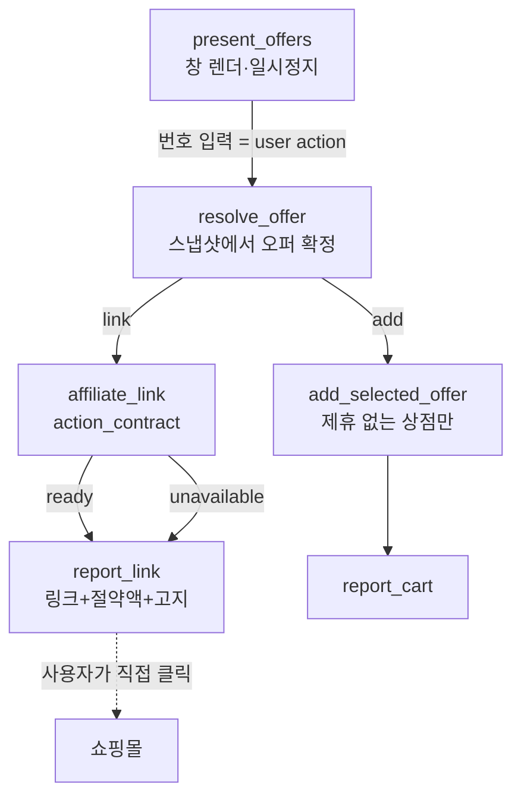

# M1 어필리에이트 — 검토와 설계

M1 사양을 이 저장소의 실제 구조에 맞춰 검토하고 설계한 문서. 대상은 `_common/flows.yaml`의
`shopping_multi_store_total_cost` 플로우와 `_common/rpc/*` 런타임 모듈.

법률·정책 해석은 이 문서의 권한 밖이다. 아래 **[확인필요]** 표시는 전부 M1.2 5항의 서면 문의 또는
자문으로 확정해야 하는 항목이다.

---

## 1. 사양 검토

### 1.1 구조적으로 이미 맞는 것

| 사양 요구 | 현재 구현 | 판정 |
|---|---|---|
| "사용자 행동(user action) 후에만 링크 적용" | `present_offers`가 창을 렌더하고 **일시정지**한 뒤 사용자의 번호 입력을 읽는다. 그 입력이 `select` 분기 | **그대로 충족.** 명시적·기록 가능한 user action이 이미 있다 |
| "그 순간 직접적 사용자 이익과 결부" | 비교표가 배송비 포함 총액을 계산하고 스냅샷에 모든 후보의 `total_base`를 들고 있다 | **절약액을 계산할 재료가 이미 있다** |
| "검색 API 시간당 10회 → 실시간 서빙 불가, 발견은 어댑터" | 상품 발견은 10개 사이트 어댑터가 수행, 딥링크는 변환만 | **사양과 현재 구조가 일치** |
| "서버에만 키 저장" | 프로덕션 툴은 이미 `net:` 블록으로 호스트를 지정해 외부를 호출한다(`api.frankfurter.dev` 선례) | 우리 서버 호스트 하나를 추가하면 된다 |
| "flowTool 1개 추가(action_contract)" | `resolve_offer`가 이미 `selected_offer`·`site`·`product_id`·`expected_unit_price`·`approved_total_base`·`comparison_id`을 발행한다 | **새 툴이 필요한 입력을 상류가 이미 만든다** |

### 1.2 사양이 놓친 구조적 충돌 — 가장 중요한 검토 결과

현재 선택 이후 경로:

```
present_offers --select--> resolve_offer --add--> add_selected_offer --> report_cart
                                                  (DOM 자동화로 장바구니 담기)
```

**어필리에이트 귀속은 사용자가 우리 링크를 클릭해야 성립한다.** 그런데 현재 구현은 선택 즉시
에이전트가 **대신 장바구니에 담는다**. 그러면 사용자는 우리 링크를 클릭하지 않고, 쿠키가 심기지 않고,
커미션이 발생하지 않는다.

> **번호를 고르는 턴이 곧 승인 턴이고, 그 턴이 지금은 장바구니 담기로 간다.** 같은 순간에
> "대신 담아준다"와 "링크를 줄 테니 직접 사라"는 **동시에 성립할 수 없다.**

M1.6 시뮬레이션은 이 충돌을 전제하지 않았다. 클릭률 60%는 *링크를 제시하는 제품*의 수치이고, 현재
제품은 링크를 제시하지 않는다. 이 결정을 먼저 내려야 나머지 설계가 의미를 가진다.

### 1.3 선택지

| 안 | 동작 | 장점 | 비용 |
|---|---|---|---|
| **A. 링크 우선** | 제휴 프로그램이 있는 상점은 선택 시 **링크+절약액**을 제시하고 장바구니는 담지 않는다. 담기는 사용자가 따로 요청 | 귀속 성립, CWS 요건과 정확히 일치, DOM 변경 없음(가장 안전) | 기존 "대신 담아준다" 경험이 그 상점에서 사라짐 |
| **B. 담기 우선** | 현행 유지, 링크는 부가 표시 | 경험 유지 | **커미션 거의 발생하지 않음.** M1.0의 세 목적(IR 증거·퍼널 데이터·현금) 전부 미달 |
| **C. 사용자 선택** | 선택 턴에 "링크로 받기 / 담아주기" 두 갈래 제시 | 둘 다 보존 | 승인 게이트에 분기가 하나 더 생김. 게이트가 늘수록 취소가 새는 경로도 는다(이번 구간에 실제로 겪음) |

**권고: A.** 이유는 셋이다.

1. M1.0이 이 사업의 목적을 "실사용 증거와 퍼널 데이터"로 명시했다. B는 그 데이터를 만들지 못한다.
2. 링크 경로는 **DOM 변경(mutation)이 없다.** 현재 담기 경로는 실제 계정의 장바구니를 바꾸고, 이번
   구간에만 의도치 않은 추가가 세 번 났다. 링크는 그 위험이 구조적으로 0이다.
3. C의 추가 분기는 승인 게이트를 복잡하게 만든다. 필요해지면 나중에 붙일 수 있고, 반대는 어렵다.

담기 기능은 사라지지 않는다 — 제휴 프로그램이 **없는** 상점에서는 그대로 동작하고, 제휴 상점에서도
사용자가 명시적으로 요청하면 동작한다.

---

## 2. 설계

### 2.1 전체 흐름



`resolve_offer`가 분기를 고른다. 판단 근거는 **사이트 설정**이지 모델이 아니다.

### 2.2 새 flowTool `AX_affiliate_link`

`kind: runtime`, `action_contract`. 모델이 부르지 않는다 — 스냅샷과 선택 결과를 읽어야 하고,
모델이 부르는 툴은 플로우 상태를 받을 수 없다.

```yaml
  affiliate_link:
    description: Convert the offer the user selected into its affiliate deep link, with the saving it represents.
    execute:
      kind: runtime
      implementation: lua
      modules: ["_common.00_base", "_common.74_rpc_affiliate"]
      net:
        allow: [<우리 서버 호스트>]      # 쿠팡 API가 아니라 OUR 서버. 키는 서버에만 있다
        maxCalls: 1
        timeoutMs: 6000
      rpc:
        allow: [dom.get_location_href]   # 페이지를 만지지 않는다. 컴파일러가 빈 allow를 거부해서 하나 선언
        deadlineMs: 20000
      entry: run
      lua: |
        function run(args)
          return AX_RPC_AFFILIATE.link(args)
        end
    output:
      next: result.next
      affiliate_url: result.affiliate_url
      affiliate_program: result.affiliate_program
      affiliate_disclosure: result.disclosure
      affiliate_saving: result.saving_text
      affiliate_error: result.error
    parameters:
      type: object
      additionalProperties: false
      required: []
      properties:
        comparison_state: { type: [string, "null"] }
        selected_offer: { type: [object, "null"], additionalProperties: true }
        site: { type: [string, "null"] }
        comparison_id: { type: [string, "null"] }
```

`inputSelector`는 이 네 개와 정확히 일치해야 한다 — 선언되지 않은 상태는 조용히 버려진다.

### 2.3 서버 계약

확장은 쿠팡 API를 **직접 호출하지 않는다.** HMAC 서명과 Access/Secret Key는 서버에만 있다.

```
POST https://<host>/v1/affiliate/deeplink
  { "program": "coupang", "urls": ["https://www.coupang.com/vp/products/123"],
    "comparison_id": "cmp-…", "product_id": "123" }

200 { "links": [{ "url": "https://www.coupang.com/vp/products/123",
                  "affiliate_url": "https://link.coupang.com/a/XXXX",
                  "program": "coupang", "cached": true }] }
4xx/5xx → 확장은 링크 없이 진행 (2.5 참조)
```

서버 책임:

- HMAC-SHA256 서명 (`CEA algorithm=HmacSHA256, access-key=…, signed-date=…, signature=…`)
- **URL → shortenUrl 캐시 테이블** (중복 변환 방지, 사양 M1.3 요구)
- `affiliate_link_created` 이벤트 기록 → M4 파이프라인
- 프로그램별 허용 여부 판정 (아래 2.4)

### 2.4 컴플라이언스를 코드로 강제

정책은 문서가 아니라 게이트로 지킨다. 이 저장소의 방식이 이미 그렇다.

| 규칙 | 강제 방법 |
|---|---|
| **Amazon 링크가 확장에 절대 없을 것** (Operating Agreement: client-side software 금지) | 사이트 설정의 `affiliate.program`을 화이트리스트로 두고 amazon에는 **부여하지 않는다.** `check:flows` 게이트: 어떤 사이트 설정도 `program = "amazon"`을 가질 수 없다 |
| **키가 번들에 없을 것** | 게이트: 커밋된 Lua/flows 전체에서 access key 패턴 및 `coupang.com/.../openapi` 직접 호출 금지. 확장이 아는 호스트는 우리 서버뿐 |
| **자동 이동 금지** | `74_rpc_affiliate.lua`는 `nav.*`를 **grant받지 않는다.** 링크를 만들 뿐 이동시킬 수 없다. 게이트로 고정 |
| **user action 이후에만** | 이 툴은 `resolve_offer` 하류에만 존재한다. 게이트: `affiliate_link` 노드로 가는 모든 경로는 `present_offers`의 `select` 분기를 지난다 |
| **고지 문구 상시 노출** | 문구는 Lua가 **항상** 반환하고(비어 있을 수 없음) 터미널이 렌더한다. 게이트: 반환값에 고지가 없으면 실패 |
| **자기구매 금지(테스트 포함)** | 라이브 시나리오 러너가 제휴 URL로 이동하지 못하게 게이트. 이번 구간의 `ax reset` 규율과 같은 부류 |

### 2.5 실패는 링크 없이 진행한다

서버가 죽었거나 변환이 실패했을 때 **비교 결과 자체는 사용자의 것**이다. 원본 URL과 절약액을 그대로
제시하고 고지만 생략한다(제휴 링크가 없으므로 고지할 경제적 이해관계도 없다).

이번 구간에 반복해서 배운 규칙이 그대로 적용된다: **거부는 원문 이유를 나르고, 이전 결과는 유지된다.**

### 2.6 절약액 정의

스냅샷이 이미 모든 후보의 총액을 들고 있다. 절약액은 **비교표 안에서** 정의한다.

```
saving = (비교 대상 중 총액이 알려진 것들의 최댓값) − (선택한 오퍼의 총액)
```

- 총액 미확인 행은 계산에서 제외한다. 11번가처럼 배송비를 말하지 않는 상점이 있고, **비교에서 잘못된
  숫자는 빠진 행보다 나쁘다.**
- 절약액이 0 이하이거나 비교 대상이 1개면 절약 문구를 **표시하지 않는다.** 그 경우 "직접적 이익"은
  비교 자체이고, 없는 절약을 만들어내면 그것이 곧 기만이다.
- 통화는 목록의 통화를 따른다(`display_currency`). 이번 구간에 고친 규칙.

### 2.7 표시 표면

`W.TEMPLATES`에 **`link_button`이 이미 있다.** 위젯 봉투는 SDK가 zod로 재검증하므로 안전하다.

```
[상품명] · 총 KRW 15,400 · 최대 3,610원 절약
[ 쿠팡에서 보기 ]        ← link_button, 사용자가 직접 클릭
쿠팡 파트너스 활동의 일환으로 일정액의 수수료를 제공받습니다.
```

고지는 **터미널의 `respond`에도** 넣는다. 창 렌더링은 `trim`이 마크업을 걷어내므로, 한 표면에만 두면
사라질 수 있다.

### 2.8 이벤트

| 이벤트 | 발생 지점 | 신뢰도 |
|---|---|---|
| `affiliate_link_created` | 서버(변환 시점) | 확실 |
| `affiliate_link_clicked` | 위젯 클릭 | **해결됨.** 위젯 클릭은 EventBus에 `message.chat { type: "axsdk.widget.action", data: { template, action, data } }`를 발행한다(`../axsdk-sdk-js/docs/widgets.md`). 호스트가 관측해 기록하면 된다 |
| 구매·커미션 | 파트너스 리포트 | 일별, 수동/배치 대조 |

> **자체 리다이렉터(`/r/<id>`)를 만들지 않기로 한다.** 클릭 관측에는 유리하지만 쿠팡이 금지하는
> **링크 클로킹**에 해당할 소지가 있다. M1.2 5항 서면 문의에 이 항목을 포함하고, 답변 전에는 쿠팡이
> 발급한 `shortenUrl`을 그대로 노출한다.

---

## 3. 사양에 대한 추가 지적

1. **M1.6 시뮬레이션의 전제를 수정해야 한다.** 클릭률 60%는 A안(링크 제시)에서만 성립한다. B안을
   택하면 커미션은 사실상 0이고, 표의 세 줄이 전부 무의미해진다.
2. **쿠팡은 현재 단일 페이지 어댑터다.** `AGENTS.md` §13: 딥링크된 `?page=2`가 빈 그리드를 렌더하고
   온페이지 컨트롤은 해시 클래스라 §10이 금지한다. 즉 쿠팡 후보는 1페이지분만 비교에 들어간다 —
   수익원이 될 상점의 노출이 구조적으로 제한되어 있다. 별도 과제로 다룰 가치가 있다.
3. **네이버쇼핑은 봇월로 `access_denied`가 정상 응답이다.** 제휴 대상에서 제외해야 한다.
4. **M1.4의 웹 리포트 표면은 이 저장소 밖이다.** `axsdk.com/report/<id>`는 서버·프론트 과제이고,
   이 저장소는 비교 스냅샷을 발행 가능한 형태로 넘기는 계약만 지면 된다. 스냅샷은 이미 **하나의 JSON
   스칼라**로 플로우 상태를 건너다니므로 그대로 쓸 수 있다.
5. **M1.7 순서 중 4번(flows 통합)은 3번(서버)에 의존한다.** 다만 서버 없이도 진행 가능한 부분이 있다:
   툴·분기·게이트·고지·절약액 계산은 서버 계약을 스텁으로 두고 전부 오프라인 테스트할 수 있다.
   서버가 준비되면 `net.allow` 호스트만 바꾸면 된다.

---

## 4. 구현 순서 (이 저장소 몫)

| # | 작업 | 선행 |
|---|---|---|
| 1 | 사이트 설정에 `affiliate: { program }` 추가 (쿠팡만), amazon 금지 게이트 | 없음 |
| 2 | `_common/rpc/74_rpc_affiliate.lua` + 오프라인 테스트(스텁 서버) | 1 |
| 3 | 절약액 계산을 스냅샷에서 유도 + 통화 규칙 | 2 |
| 4 | `resolve_offer`에 `link` 분기, `report_link` 터미널, 고지 문구 | 2 |
| 5 | 컴플라이언스 게이트 5종(2.4) | 4 |
| 6 | `link_button` 위젯 렌더 | 4 |
| 7 | 서버 호스트 연결 + 라이브 검증(구매하지 않음) | 서버 |

1–6은 서버 없이 끝낼 수 있고 전부 오프라인으로 검증된다.

---

## 5. 결정이 필요한 항목

1. **A/B/C 중 어느 안인가.** 나머지 설계가 여기에 달려 있다. 권고는 A.
2. 서버 호스트와 엔드포인트 경로.
3. **[확인필요]** 확장에서의 딥링크 사용 형태 — 쿠팡 서면 문의 (사양 M1.2 5항).
4. **[확인필요]** 자체 리다이렉터의 클로킹 해당 여부 — 같은 문의에 포함.
5. ~~SDK `link_button`의 클릭 이벤트 노출 여부~~ — 해결됨(§2.8).


---

## 6. PoC 구현 현황 (A안)

| 단계 | 상태 |
|---|---|
| 1. 사이트 설정 `affiliate: { program, disclosure }` — 쿠팡만 | 완료 · amazon/naver 금지 게이트 |
| 2. `_common/rpc/74_rpc_affiliate.lua` + 오프라인 테스트 6건 | 완료 |
| 3. 절약액을 스냅샷에서 유도 | 완료 |
| 4. `resolve_offer → affiliate_link → report_link` 배선 | 완료 |
| 5. 컴플라이언스 게이트 4종 | 완료 |
| 6. `link_button` 위젯 렌더 | 완료 |
| 7. 서버 연결 + 라이브 검증 | **대기 — 서버 없음** |

`A.ENDPOINT = "https://api.axsdk.ai/v1/affiliate/deeplink"` 는 아직 존재하지 않는다. 그때까지 툴은
`unavailable`을 답하고 비교 결과는 그대로 사용자에게 간다(§2.5) — 라이브에서 이 상태가 정상이다.
서버가 준비되면 바꿀 것은 호스트 문자열 하나와 `net.allow` 한 줄이다.

### 절약액에서 실제로 밟은 지뢰

첫 구현이 "최대 18,999원 절약"을 냈다. 호출자가 넘긴 오퍼에는 환산값 `total_base`(10.79)만 있고
스냅샷 행에는 렌더된 `price_total`(15,400)이 있어서, 서로 다른 단위를 뺀 결과였다. 실제 절약은
3,610원이다. 지금은 **사용자가 읽은 그 목록의 행을 찾아 같은 필드끼리만** 뺀다 — 이 저장소가 반복해서
배운 규칙(§AGENTS.md: 비교에서 잘못된 숫자는 빠진 행보다 나쁘다)이 그대로 적용된 사례다.
