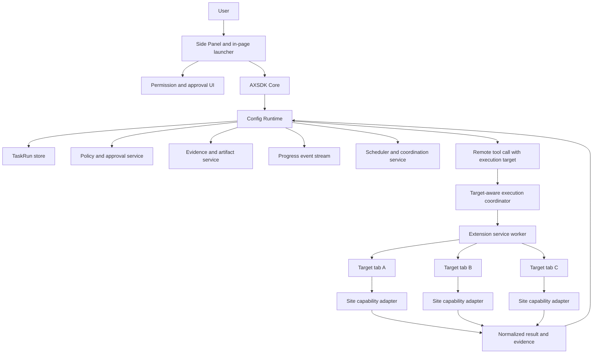

# AXSDK Agentic Tasks Implementation Design

## 1. Purpose

This document defines the architecture and staged implementation plan for the agentic tasks cataloged in
`AXSDK_CHROME_EXTENSION_AGENTIC_TASKS.md`. It covers the work required across the config runtime, AXSDK
core, the Chrome extension, React UI, site-specific adapters, flow authoring, persistence, permissions,
approvals, evidence, asynchronous execution, and operational controls.

The design assumes the execution semantics in `FLOWS.md` and the site runtime model documented in
`AGENTS.md`, `NAVIGATION.md`, and `SCHEMA.md`.

This is a target design. Syntax and interfaces explicitly marked **Proposed** do not exist in the current
runtime unless stated otherwise.

---

## 2. Executive decisions

### 2.1 Do not implement 75 monolithic flows

The task catalog should be implemented as:

1. one shared agentic-task platform;
2. a small set of reusable flow patterns;
3. domain capability packs;
4. site-specific capability adapters; and
5. declarative task definitions.

The intended decomposition is:

```text
shared task runtime
+ 8 reusable flow patterns
+ 15 domain packs
+ site capability adapters
+ 75 task definitions
```

A task definition selects a pattern and declares its required capabilities, input/result contracts, risk,
origin policy, and human-only boundaries. It should not duplicate browser control, approval, error,
evidence, and verification subgraphs.

### 2.2 Build prerequisites before expanding task flows

Implementation order:

```text
contract and source-of-truth alignment
→ runtime and SDK foundations
→ site capability contracts
→ flow authoring toolchain
→ reusable flow patterns
→ read-only canary tasks
→ controlled mutation tasks
→ multi-site product tasks
→ asynchronous and multi-user tasks
→ restricted high-risk domains
```

Writing task flows before these prerequisites would produce duplicated YAML, inconsistent tool outputs,
weak approval checks, and browser calls that cannot be directed to the correct tab.

### 2.3 Preserve deterministic orchestration

Use LLM nodes only for language understanding, ambiguous constraint extraction, qualitative comparison,
and user-facing wording. Use deterministic runtime nodes and tools for:

- iteration;
- accumulation;
- deduplication;
- schema validation;
- arithmetic and optimization inputs;
- permission checks;
- approval verification;
- idempotency;
- mutation execution; and
- post-action verification.

### 2.4 Site adapters remain the production execution boundary

Generic browser tools are useful for page understanding, prototyping, low-risk reads, and fallback
recovery. Production mutations must use site-specific structured adapters with stable selectors,
page detection, re-entrant navigation, explicit inputs, structured outputs, and post-action verification.

### 2.5 Partial success is a first-class outcome

Cross-site operations are not transactions. The platform must represent and display:

- completed items;
- failed items;
- items needing input;
- items needing login or protected user action;
- committed external effects; and
- available or unavailable compensation.

It must never report aggregate success when only a subset succeeded.

---

## 3. Current baseline and structural gaps

### 3.1 Existing flow-runtime strengths

`FLOWS.md` already defines the core orchestration primitives required for bounded interactive tasks:

- deterministic compilation and execution;
- `action_unit`, `action_contract`, `decision`, and `terminal` nodes;
- flow-local and global state;
- pause/resume through an action self-loop;
- deterministic branches;
- structured exception unwinding;
- subflows;
- bounded sequential `flow.map`;
- task-map keys, schemas, budgets, and `needs_input` outcomes;
- mutation metadata;
- templates and `extends`;
- per-node and per-map budgets;
- lifecycle hooks; and
- debug traces.

The implementation should extend these primitives rather than introduce a second workflow engine.

### 3.2 Generic browser tools exist but are current-page tools

AXSDK Core already exposes browser-use-style tools on AX handler, Lua, and JS surfaces. They include page
state, click, type, scroll, navigation, HTML, Markdown extraction, and screenshots.

Current limitations relevant to the task catalog:

- `browser_get_state.tabs` contains only the current tab;
- `new_tab` uses `window.open` and does not return a stable tab handle;
- there is no extension-backed API to list, target, focus, close, or inspect arbitrary open tabs;
- browser history, downloads, files, notifications, OCR, mail, and calendar are not provided by these
  current-page tools; and
- refs identify current DOM elements, not tabs or long-lived external objects.

The open-tabs and history-recovery tasks therefore require Chrome platform adapters, not only flow changes.

### 3.3 Multi-tab deduplication exists, but calls are not target-aware

The SDK has root-tab grouping, persisted execution claims, and atomic compare-and-swap coordination. These
prevent duplicate execution across tabs in the same logical session.

The current call descriptor does not carry a `tabRef`, target origin, or target capability. Every eligible
session tab can observe the same call, and the first successful claim owns execution. This proves
single-execution, but not execution in the correct tab.

Multi-site and multi-tab tasks need an opaque execution-target contract shared by the runtime, SDK Core,
service worker, and content scripts.

### 3.4 The extension has a platform-handler seam but no platform handlers

The content shell forwards unknown AX commands to the extension service worker through
`AX_HANDLER_MESSAGE`. The worker currently returns `unsupported` for this message type. This is the correct
seam for extension-only tools such as permissions, tabs, history, downloads, and notifications.

No parallel extension RPC architecture should be introduced.

### 3.5 The permission model is too broad for task-scoped execution

The current extension declares broad HTTP/HTTPS host access. The target model is:

- `activeTab` for the page on which the user invokes AXSDK;
- task-scoped optional host permissions for additional origins;
- optional Chrome permissions for tabs, history, downloads, and notifications; and
- runtime and extension enforcement of the same resolved origin set.

Permission requests must be tied to a visible user gesture. A flow cannot silently request or expand host
permissions.

### 3.6 Flow examples and implementation descriptions have drifted

The agentic-task research document references a browser-extension flow path that is not present in the
current `axsdk-agents` checkout. The closest SDK reference application is under
`packages/axsdk-react/apps/browser-extension/` in the SDK repository.

That reference shopping flow uses LLM nodes for site iteration and result accumulation, does not use the
current task-map pattern, and does not carry the latest mutation metadata on its cart and checkout tools.

Before new task development, the production flow, SDK reference flow, task research document, and runtime
specification must be brought under one conformance baseline.

### 3.7 Flow authoring does not yet scale to the catalog

The current sites repository provides Lua build/check commands and the live `ax` harness, but no dedicated
commands for:

- flow compilation;
- graph validation;
- flow fragment assembly;
- task/capability coverage;
- remote result contracts;
- mutation safety linting;
- origin-policy linting;
- simulation with mock tools; or
- scenario replay.

`_common/flows.yaml` is already large. Adding the catalog directly to that file would produce a fragile
monolith.

---

## 4. Target architecture



The architecture has four planes.

### 4.1 Control plane

Owned by the config runtime:

- intent and task routing;
- flow/node execution;
- pause/resume;
- fan-out/fan-in;
- budgets;
- retries;
- failure handling;
- TaskRun status; and
- approval gating.

### 4.2 Execution plane

Owned by SDK Core, the extension, and site adapters:

- correct-tab execution;
- browser and Chrome platform tools;
- site Lua;
- durable navigation;
- page readiness;
- execution claims;
- host-permission enforcement; and
- post-action page reads.

### 4.3 Data and evidence plane

Owned by runtime storage and adapter contracts:

- normalized entities;
- source URLs and sites;
- capture time;
- stable external IDs;
- missing or unverified fields;
- raw artifact references;
- adapter versions;
- pre-mutation revalidation; and
- mutation receipts.

### 4.4 Policy plane

Owned jointly by the runtime and extension:

- allowed origins;
- Chrome permissions;
- available capabilities;
- tool allowlists;
- explicit approvals;
- sensitivity and retention;
- idempotency;
- protected user actions; and
- audit records.

A mutation is permitted only when all relevant policy layers pass.

---

## 5. Shared contracts

### 5.1 Task definition

**Proposed:**

```ts
type TaskDefinition = {
  id: string;
  domain: string;
  pattern: string;
  mode: 'read' | 'prepare' | 'mutate' | 'monitor' | 'coordinate';

  requiredCapabilities: string[];
  optionalCapabilities?: string[];

  inputSchema: JSONSchema;
  resultSchema: JSONSchema;

  risk: {
    level: 'low' | 'medium' | 'high' | 'restricted';
    dataCategories: string[];
    requiresApproval: boolean;
    humanOnlySteps?: string[];
  };

  originPolicy: {
    resolution: 'current' | 'selected_sites' | 'connector';
    maxOrigins?: number;
  };

  budgets: {
    maxItems: number;
    maxModelCalls: number;
    maxRemoteCalls: number;
  };
};
```

Example:

```yaml
id: commerce.multi_store_total_cost
domain: commerce
pattern: discover_compare_mutate
mode: mutate
requiredCapabilities:
  - commerce.product.identify
  - commerce.search
  - commerce.product.read
  - commerce.cart.add
optionalCapabilities:
  - commerce.shipping.quote
  - commerce.return_policy.read
  - commerce.coupon.read
risk:
  level: medium
  dataCategories: [shopping_preferences]
  requiresApproval: true
  humanOnlySteps: [final_order]
```

### 5.2 Site capability manifest

**Proposed:**

```ts
type SiteCapabilityManifest = {
  site: string;
  version: string;
  origins: string[];

  capabilities: Record<string, {
    tool: string;
    inputSchemaRef: string;
    resultSchemaRef: string;
    effect: 'read' | 'navigation' | 'mutation';
    auth: 'none' | 'session' | 'user_takeover';
    target: 'current_tab' | 'tab_ref';
  }>;
};
```

Existing commands can initially be mapped to semantic capabilities. They do not need to be renamed in the
first cut.

Example:

```yaml
site: amazon
origins:
  - https://www.amazon.com
capabilities:
  commerce.search:
    tool: AX_search_product
    effect: read
  commerce.product.read:
    tool: AX_view_product
    effect: read
  commerce.cart.read:
    tool: AX_view_cart
    effect: read
  commerce.cart.add:
    tool: AX_add_to_cart
    effect: mutation
  commerce.checkout.prepare:
    tool: AX_checkout
    effect: navigation
```

### 5.3 TaskRun

Flow-local state and a long-lived agentic task are different abstractions. TaskRun is the durable outer
record.

**Proposed:**

```ts
type TaskRun = {
  id: string;
  taskDefinitionId: string;
  sessionId: string;
  flowBundleDigest: string;

  status:
    | 'collecting'
    | 'running'
    | 'needs_input'
    | 'needs_permission'
    | 'needs_approval'
    | 'needs_user_action'
    | 'partial'
    | 'completed'
    | 'failed'
    | 'cancelled';

  activeFlow?: string;
  activeNode?: string;
  inputs: Record<string, unknown>;
  normalizedState: Record<string, unknown>;

  itemRuns: Array<{
    key: string;
    status: string;
    targetRef?: string;
    resultRef?: string;
    error?: unknown;
  }>;

  approvals: string[];
  evidenceRefs: string[];
  progressSeq: number;
  createdAt: string;
  updatedAt: string;
};
```

Rules:

- do not inject the complete TaskRun into prompts;
- pass only selected normalized fields;
- store large raw content as artifact references;
- do not store passwords, MFA values, recovery codes, or access tokens;
- separate long-lived monitors from ordinary conversation state; and
- pin long-running tasks to a flow-bundle digest.

### 5.4 Evidence record

**Proposed:**

```ts
type EvidenceRecord = {
  sourceUrl: string;
  sourceSite: string;
  capturedAt: string;
  objectId: string;

  inputConstraints: Record<string, unknown>;
  normalized: Record<string, unknown>;
  missing: string[];
  warnings: string[];

  rawArtifactRef?: string;
  adapterVersion: string;

  revalidation?: {
    capturedAt: string;
    changed: boolean;
    changedFields: string[];
  };
};
```

### 5.5 Approval receipt

A boolean such as `approved: true` does not prove what the user approved.

**Proposed:**

```ts
type ApprovalReceipt = {
  id: string;
  taskRunId: string;
  actorId: string;

  action: string;
  target: {
    site: string;
    objectId?: string;
    recipient?: string;
  };

  inputDigest: string;
  previewDigest: string;
  issuedAt: string;
  expiresAt: string;
  oneTime: boolean;
};
```

If the target, price, options, recipient, transmitted data, or mutation input changes, the digest changes
and the runtime must require a new approval.

### 5.6 Effect record

**Proposed:**

```ts
type EffectRecord = {
  idempotencyKey: string;
  taskRunId: string;
  tool: string;
  target: string;
  inputDigest: string;
  status: 'started' | 'committed' | 'failed' | 'unknown';
  externalReference?: string;
};
```

Rules:

- same key and same digest returns the existing effect/result;
- same key and different digest is rejected;
- an unknown commit state is verified before retry;
- a backend idempotency key is forwarded when the target supports it; and
- cross-site effects remain independently committed.

---

## 6. Component responsibilities

### 6.1 SDK Core

Primary areas:

- call and durable-call descriptors;
- execution state and coordinator;
- AX handler dispatch;
- browser tools;
- task progress subscription; and
- task/approval client APIs.

Required changes:

#### Target-aware tool calls

**Proposed:**

```ts
type ExecutionTarget =
  | { kind: 'active' }
  | { kind: 'tab'; tabRef: string }
  | { kind: 'origin'; origin: string }
  | { kind: 'root'; rootTabRef: string };
```

The target is execution metadata, not a site command argument. Site adapters should not depend on Chrome
`tabId` values.

Before claiming a call, a runner must prove eligibility for its target. The SDK must return explicit errors
for unavailable targets, origin mismatches, and closed tabs.

#### Platform handler registry

Replace scattered metadata with one contract registry containing:

- input schema;
- result schema;
- effect;
- required permission;
- execution-target policy;
- sensitivity; and
- idempotency policy.

#### Browser tool clarification

- document that the existing `tabs` field is current-tab-only;
- expose real tab enumeration under a separate extension platform tool;
- return a stable `tabRef` when opening a managed tab; and
- keep generic browser mutation tools out of broad planner allowlists.

#### Public task events

**Proposed:**

```ts
type TaskProgressEvent =
  | { type: 'task_started'; taskRunId: string }
  | { type: 'step_started'; flow: string; node: string }
  | { type: 'target_started'; key: string; site: string }
  | { type: 'target_completed'; key: string; status: string }
  | { type: 'permission_required'; origins: string[] }
  | { type: 'approval_required'; approvalRequest: unknown }
  | { type: 'user_action_required'; reason: string }
  | { type: 'task_completed'; evidenceRefs: string[] };
```

Runtime debug records are not a stable user-facing progress protocol. The UI needs a bounded public event
contract.

### 6.2 Chrome extension

Primary areas:

- service worker;
- extension message contracts;
- manifest permissions;
- storage context;
- content-script bridge;
- tab registry; and
- side-panel bootstrap.

#### Service-worker tool registry

Initial tools:

```text
AX_platform_permissions_check
AX_platform_permissions_request
AX_platform_tabs_list
AX_platform_tab_open
AX_platform_tab_focus
AX_platform_tab_close
AX_platform_tab_state
AX_platform_history_search
AX_platform_download_start
AX_platform_notification_create
```

Names are proposed. The platform namespace must remain separate from site capability tools.

#### Tab registry

**Proposed:**

```ts
type TabRegistryEntry = {
  tabRef: string;
  chromeTabId: number;
  rootTabRef: string;
  origin: string;
  url: string;
  title?: string;
  status: 'loading' | 'ready' | 'closed';
  capabilityDigest?: string;
};
```

Persist only the minimum coordination metadata in `chrome.storage.session`.

#### Permission broker

```text
flow resolves required origins
→ side panel displays sites and purpose
→ user gesture requests optional permissions
→ worker returns a permission receipt
→ runtime stores the approved origin set
→ every navigation and tool call rechecks that set
```

The permission set may not expand because untrusted page content requested another origin.

#### Manifest direction

Target capabilities should be based on:

- `storage`;
- `activeTab`;
- `scripting`;
- `sidePanel`;
- optional `tabs`;
- optional `history`;
- optional `downloads`;
- optional `notifications`; and
- optional host permissions.

The exact permission combination must be validated against Chrome behavior and user-gesture requirements
before changing the manifest.

#### Side Panel

Use the Side Panel as the primary task UI. Keep the current in-page UI as a launcher and current-page
context affordance.

The Side Panel must render:

- task status;
- site/item progress;
- comparisons;
- evidence;
- missing-information prompts;
- permission requests;
- approval previews;
- protected user-action handoffs;
- partial failures; and
- completion receipts.

### 6.3 React UI

Add reusable components:

```text
AXTaskProgress
AXTargetProgressList
AXPermissionRequest
AXApprovalPreview
AXHumanTakeover
AXEvidenceTable
AXPartialResultSummary
AXTaskHistory
```

Approval views must show:

- site and target object;
- exact external action;
- recipient, when applicable;
- data being transmitted;
- amount and currency;
- selected options;
- relevant cancellation/return terms;
- approval expiry; and
- whether the action is reversible.

### 6.4 Config runtime

Required runtime responsibilities:

- bind flow execution to TaskRun;
- persist progress and item states;
- validate result and state schemas;
- preserve execution target metadata;
- verify approval receipts;
- maintain the effect ledger;
- enforce capability and origin policies;
- store artifact references;
- pin long-running tasks to a flow bundle;
- support asynchronous event re-entry; and
- expose stable task progress events.

### 6.5 Site adapters

Site adapters must continue to use:

- stable selectors;
- page detection;
- selector fallback chains;
- re-entrant navigation;
- structured reads;
- explicit mutation commands; and
- post-action verification.

Standard read envelope:

```json
{
  "status": "done",
  "entity": {},
  "evidence": {
    "sourceUrl": "...",
    "sourceSite": "...",
    "capturedAt": "...",
    "objectId": "...",
    "adapterVersion": "..."
  },
  "missing": [],
  "warnings": []
}
```

Standard mutation envelope:

```json
{
  "status": "completed",
  "effect": "cart_item_added",
  "objectId": "...",
  "externalReference": "...",
  "verified": true,
  "verification": {},
  "evidence": {}
}
```

Approval belongs to the runtime/UI policy layer. A site adapter may retain a local `confirm` backstop, but
that flag is not a replacement for an approval receipt.

---

## 7. Reusable flow patterns

### 7.1 Discover, normalize, compare

Applicable tasks include multi-store research, travel comparison, job search, housing comparison,
accessibility research, troubleshooting, and sourced research.

```text
collect_constraints
→ resolve_targets
→ permission_preflight
→ flow.map(read_target)
→ normalize
→ evidence_check
→ rank
→ render_comparison
→ terminal
```

### 7.2 Multi-item planner

Applicable tasks include conditional shopping lists, recipe carts, weekly meal plans, syllabus plans, and
curated lists.

```text
decompose_items
→ validate_global_constraints
→ flow.map(resolve_item)
→ fan_in
→ optimize_global_plan
→ ask_for_adjustment
→ final_plan
```

Global constraints are evaluated after fan-in. Item-level failures are retained.

### 7.3 Prepare, approve, mutate, verify

Applicable tasks include cart changes, applications, account changes, returns, bookings, support tickets,
and content publication.

```text
read_current
→ prepare_change
→ revalidate
→ render_preview
→ approval
→ mutate
→ verify
→ evidence_terminal
```

### 7.4 Document intake, audit, compose

Applicable tasks include itinerary extraction, resumes, expense reports, education documents,
administrative applications, health documents, tax packages, and content repurposing.

```text
collect_documents
→ classify
→ extract
→ validate_required_fields
→ identify_missing
→ ask_user
→ compose
→ preview
→ optional_submit
```

### 7.5 Monitor, detect, notify, respond

Applicable tasks include application tracking, shipping monitoring, deadline tracking, renewals, and
application-status monitoring.

```text
create_monitor
→ persist_job
→ scheduled_check
→ detect_change
→ notify
→ user_reenters_task
→ prepare_response
→ optional_approval
→ optional_mutation
```

The scheduler and event source live outside the ordinary turn-driven flow interpreter.

### 7.6 Multi-user coordination

Applicable tasks include group travel and group local reservations.

```text
generate_candidates
→ create_coordination_session
→ collect_votes_externally
→ read_consensus
→ resolve_conflict_with_organizer
→ approval
→ reservation
```

### 7.7 Browser workspace

Applicable tasks include open-tab comparison and history-based work recovery.

```text
list_or_open_tabs
→ assign_tab_refs
→ targeted_extraction
→ normalize
→ compare
→ focus_selected_tab
→ save_task_checkpoint
```

### 7.8 Specialist handoff

```text
classify_domain
→ resolve_task_definition
→ check_capabilities
→ project_handoff_state
→ execute_subflow
→ collect_result_and_evidence
```

---

## 8. Flow specification enhancements

### 8.1 Required before catalog expansion

#### Generic flow-tool result schema

Current result validation is not uniform across every remote/runtime flow tool.

**Proposed:**

```yaml
flowTools:
  read_product:
    execute: { kind: remote, tool: AX_commerce_product_read }
    parameters: { ... }
    output: { ... }
    resultSchema:
      type: object
      required: [entity, evidence, missing]
```

Validation order:

```text
remote result
→ output projection
→ result-schema validation
→ state merge
```

#### Flow state schema

**Proposed:**

```yaml
flows:
  shopping:
    stateSchema:
      type: object
      properties:
        constraints: { type: object }
        targets: { type: array }
        candidates: { type: array }
        selected: { type: [object, "null"] }
        approvalReceipt: { type: [object, "null"] }
```

The compiler should validate selectors, output maps, branch paths, mutation requirements, map result
paths, approval scopes, and state patches where statically possible.

Introduce this as opt-in strict mode, then require it for new task packs.

#### Remote execution target

**Proposed conceptual syntax:**

```yaml
execute:
  kind: remote
  tool: AX_commerce_search
  target:
    tabRef: state.currentTarget.tabRef
```

Target metadata must not be mixed into site command inputs.

#### First-class approval node

**Proposed:**

```yaml
approve_cart:
  kind: approval
  summaryFrom: mutationPreview
  scope:
    action: commerce.cart.update
    targetFrom: selectedCart
    inputFrom: proposedChanges
  expiresInMs: 300000
  next:
    approved: apply_changes
    declined: cancelled
    changed: revalidate
```

The existing `consent: required` metadata remains backward compatible, but new production tasks use scoped
receipts.

#### Capability requirements

**Proposed:**

```yaml
flows:
  multi_store_shopping:
    requiresCapabilities:
      all:
        - commerce.search
        - commerce.product.read
      any:
        - commerce.cart.add
        - commerce.checkout.prepare
```

#### Origin policy

**Proposed:**

```yaml
flows:
  multi_store_shopping:
    originPolicy:
      from: selectedTargets
      maxOrigins: 5
      navigation: exact_declared
```

#### Protected state

**Proposed:**

```yaml
stateSchema:
  properties:
    contactEmail:
      type: string
      sensitivity: personal
      debug: redact
    oauthTokenRef:
      type: string
      sensitivity: secret_ref
      prompt: never
```

#### Trust label

**Proposed:**

```yaml
flowTools:
  read_reviews:
    trust: untrusted_web
```

The runtime must keep untrusted data in the data plane and apply a fixed instruction/data separation
policy.

### 8.2 Required for the complete catalog

#### Resumable map

**Proposed:**

```yaml
task:
  keyFrom: sku
  checkpoint:
    store: task_run
    resume: skip_completed
  batch:
    maxItemsPerTurn: 8
```

Add a `more` outcome carrying a continuation cursor. This addresses large inboxes, semester workloads,
transaction sets, product lists, and moderation queues without removing existing map bounds.

#### Await event

**Proposed:**

```yaml
wait_for_application_update:
  kind: await_event
  event: application.status_changed
  correlationFrom: applicationMonitorId
  timeout: P30D
  next:
    received: inspect_update
    timeout: report_no_update
    cancelled: cancelled
```

Event names must be app-owned or allowlisted. Client flows may not subscribe to arbitrary infrastructure
events.

#### Read-only map concurrency

Permit `concurrency > 1` only after target-aware execution is complete.

Compile-time requirements:

- every reachable operation is read-only or navigation-only;
- child state is isolated;
- results remain input-ordered;
- permission exists for every target;
- aggregate and child budgets apply;
- abort behavior is defined; and
- no mutation adapter is reachable.

Parallelism is an optimization, not an initial delivery dependency.

### 8.3 Authoring convenience outside the runtime spec

Do not add runtime imports first. Implement deterministic build-time composition:

```text
flows-src/
  core/
  patterns/
  domains/
  tasks/
  sites/
→ deterministic build
→ _common/flows.yaml
```

Only consider runtime multi-document loading after bundle manifests and compatibility rules are stable.

### 8.4 Features explicitly not recommended

Do not add:

- filesystem or network access to sandboxed Lua;
- arbitrary client-side HTTP or shell execution;
- unbounded loops;
- unbounded flow-map concurrency;
- automatic cross-site rollback claims;
- broad planner access to mutation tools;
- approval-free generic form submission; or
- LLM-generated production mutation selectors.

---

## 9. Flow authoring platform

### 9.1 Source layout

```text
flows-src/
  core/
    router.yaml
    errors.yaml
    approval.yaml
    evidence.yaml
  patterns/
    discover_compare.yaml
    multi_item_plan.yaml
    prepare_mutate_verify.yaml
    document_intake.yaml
    monitor.yaml
    coordinate.yaml
    browser_workspace.yaml
    handoff.yaml
  domains/
    commerce/
    travel/
    jobs/
    housing/
    productivity/
    shipping/
    local/
    food/
    education/
    support/
    public/
    health/
    finance/
    content/
    research/
  tasks/
  sites/
generated/
  manifests/
```

The generated runtime-compatible Flow remains at the existing loader path until the loader contract changes.

### 9.2 CLI

**Proposed:**

```text
ax flow build
ax flow check
ax flow graph <task>
ax flow simulate <task> --fixture <name>
ax flow test <scenario>
ax flow explain <task>
ax contracts check
ax capabilities list
ax capabilities matrix
```

### 9.3 Static validation

Check:

- unreachable nodes;
- missing flows/tools/templates;
- invalid state paths;
- missing result schemas;
- mutation without approval;
- mutation without a verification route;
- undeclared capabilities;
- undeclared origins;
- invalid map keys and result paths;
- excessive prompt context;
- unnecessary LLM nodes;
- flow-bundle cycles; and
- capability/tool-schema mismatches.

### 9.4 Hierarchical routing

Do not place all 75 task descriptions in the top planner.

```text
top planner selects one of 15 domains
→ domain resolver selects one of the domain tasks
→ capability check
→ reusable pattern flow
```

The top planner handles orchestration only. Domain-specific extraction belongs to the selected domain flow.

---

## 10. Site capability framework

### 10.1 Capability namespace

Initial namespace:

```text
page.read
page.search

commerce.product.identify
commerce.search
commerce.product.read
commerce.cart.read
commerce.cart.update
commerce.checkout.prepare
commerce.order.list
commerce.order.track
commerce.return.prepare
commerce.return.submit

local.service.search
local.provider.read
local.quote.prepare
local.quote.submit
local.booking.prepare

jobs.search
jobs.posting.read
jobs.application.read
jobs.application.prepare
jobs.application.submit

travel.flight.search
travel.hotel.search
travel.booking.read
travel.change.prepare

support.ticket.prepare
support.ticket.submit
```

Extend the namespace by domain only after a real task and adapter require it.

### 10.2 Adapter implementation order

1. Amazon commerce;
2. Thumbtack local services;
3. generic page/research;
4. a second commerce site;
5. a jobs provider;
6. travel providers or APIs;
7. order/shipping providers;
8. mail/calendar connectors;
9. document/OCR connectors; and
10. remaining domain packs.

A multi-store task is not complete with only one commerce adapter.

### 10.3 Adapter verification

Each adapter needs:

- offline parser tests;
- selector fallback tests;
- page-detection tests;
- live read scenarios;
- login-required scenarios;
- no-result scenarios;
- DOM-drift scenarios;
- stale-data scenarios;
- mutation precondition tests;
- mutation verification;
- CAPTCHA/protected-action handoff; and
- navigation failure recovery.

---

## 11. Security and policy

### 11.1 Four execution gates

A mutation requires all applicable gates:

```text
Chrome permission
AND runtime origin policy
AND flow capability/tool allowlist
AND scoped user approval receipt
```

### 11.2 Prompt-injection defense

- treat page, review, email, document, iframe, and user-generated content as data;
- keep untrusted data separate from system instructions;
- resolve sites and origins from task policy, not page instructions;
- do not follow URLs suggested by untrusted content unless they pass the declared origin policy;
- expose mutation tools only in the node that needs them;
- prefer structured adapters over raw page text;
- make unknown or unverified facts explicit; and
- test adversarial page and document content.

Required attack fixtures include:

- instructions embedded in reviews;
- external links in seller content;
- form labels containing instructions;
- emails requesting unrelated account actions;
- documents requesting data exfiltration; and
- pages requesting permission expansion.

### 11.3 Credentials and protected data

Prohibited:

- OAuth access tokens in flow state;
- passwords in memory;
- MFA or recovery codes in debug snapshots;
- refresh tokens in LLM prompts;
- credentials in site Lua; and
- secret values in public repository content.

Use:

- backend vaults;
- opaque connector references;
- short-lived scoped tokens;
- deterministic protected-state projection; and
- explicit retention and deletion policies.

### 11.4 Human-only boundaries

The platform prepares and pauses for:

- CAPTCHA;
- passwords;
- MFA and passkeys;
- recovery codes;
- identity verification;
- electronic signatures;
- final payment or order placement;
- legal attestations;
- clinical decisions; and
- restricted financial actions.

After the user completes a protected step, the platform must read the actual resulting state before
continuing. It must not blindly repeat the preceding mutation.

### 11.5 High-risk domains

Public administration, health, finance, tax, and account-security tasks begin in read/organize/draft mode.
Mutation rollout requires protected state, connector revocation, retention controls, audit trails, incident
response, and domain-specific safety review.

---

## 12. Performance and engineering efficiency

### 12.1 Minimize model calls

Use LLMs for:

- user-language understanding;
- ambiguous constraint extraction;
- qualitative comparison;
- grounded drafting; and
- final wording.

Use deterministic execution for:

- site iteration;
- result accumulation;
- price arithmetic;
- duplicate removal;
- schema checks;
- approval digests;
- idempotency;
- retries;
- mutation verification; and
- progress accounting.

The current reference shopping flow uses LLM nodes for site selection and accumulator updates. The new
shopping pattern should replace these with `flow.map`, `action_contract`, decision nodes, and deterministic
transforms.

### 12.2 Bound prompt state

- pass normalized summaries, not raw documents;
- use artifact references for large inputs;
- include only the current task/item in mapped prompts;
- keep candidate lists bounded;
- preserve existing candidates across follow-up turns;
- revalidate only selected targets before mutation; and
- avoid repeating full Flow state in multiple prompt layers.

### 12.3 Build-time generation

Generate, rather than hand-copy:

- final flow bundles;
- capability matrices;
- LLM-facing tool schemas;
- result schemas;
- task route summaries;
- task coverage reports; and
- flow graphs.

### 12.4 Snapshot replay

Development test layers:

```text
pure normalization
→ adapter fixtures
→ flow simulation with mock tools
→ SDK multi-tab integration
→ live read scenario
→ controlled mutation scenario
```

Maintain fixtures for result pages, item pages, carts, login pages, CAPTCHA pages, no-result states,
selector variants, and stale values.

### 12.5 Atomic site bundles

**Proposed:** deploy Lua, flows, capability manifests, schemas, and widgets under one content-addressed site
package manifest.

```json
{
  "site": "amazon",
  "version": "<release-version>",
  "bundleDigest": "<digest>",
  "luaDigest": "<digest>",
  "flowDigest": "<digest>",
  "capabilityDigest": "<digest>",
  "contractDigest": "<digest>"
}
```

Use content digests in applied script IDs so a same-name source update cannot remain hidden behind a stale
script identifier.

---

## 13. Phased implementation plan

### Phase 0: source of truth and conformance baseline

Goal: remove drift before new task development.

Status: **completed 2026-07-14**. The canonical roles and compatibility matrix are recorded in
`FLOW_CONFORMANCE.md`; `tools/fixtures/flow-conformance-v1.json` is mirrored in the SDK tests. The
production overlays and SDK playground reference passed the same config-runtime `version: 1` session
compiler, and both repositories expose focused conformance commands. The unsafe automatic `test_form`
submission example was removed; the retained SDK LLM-managed shopping loop is explicitly legacy.

Work:

1. identify the canonical production flow and canonical SDK example;
2. align the task-research references with current repository locations;
3. compile every tracked production/reference flow with one compiler version;
4. update example mutations to the current mutation contract;
5. mark obsolete LLM-managed loop examples as legacy or remove them;
6. record runtime/SDK/flow compatibility; and
7. establish conformance fixtures shared by runtime and SDK validation.

Exit criteria:

- all tracked flows compile under the same contract;
- reference and production purposes are explicit;
- no unsafe demo flow is presented as a production template; and
- documentation examples match compiler behavior.

### Phase 1: shared agentic contracts

Goal: define the interfaces every component will share.

Work:

1. TaskDefinition schema;
2. CapabilityManifest schema;
3. normalized entity and evidence envelopes;
4. TaskRun;
5. ApprovalReceipt;
6. EffectRecord;
7. progress event schema;
8. error taxonomy;
9. sensitivity taxonomy;
10. human-takeover taxonomy; and
11. origin policy.

Exit criteria:

- every catalog task maps to a pattern and required capabilities;
- SDK, runtime, flow, and adapters interpret the same result contracts;
- approval/idempotency/verification semantics are unambiguous; and
- protected data is distinct from ordinary flow state.

### Phase 2A: runtime and flow-spec foundation

Can proceed in parallel with Phase 2B after Phase 1.

Order:

1. generic flow-tool result schemas;
2. opt-in flow state schemas;
3. capability validation;
4. origin policies;
5. execution-target metadata;
6. approval-receipt validation;
7. effect/idempotency ledger;
8. TaskRun integration;
9. public progress events;
10. flow-bundle pinning;
11. artifact references;
12. resumable map;
13. await-event support; and
14. read-only map concurrency.

Exit criteria:

- malformed tool results fail before state merge;
- state path errors are caught during compilation where possible;
- a changed or expired approval cannot authorize a mutation;
- duplicate effect calls do not duplicate external state;
- TaskRun survives runtime restart; and
- long-running tasks do not silently change flow revisions.

### Phase 2B: SDK and extension platform

Order:

1. extend call metadata with execution targets;
2. add target eligibility before execution claims;
3. implement the service-worker platform handler registry;
4. implement stable tab references and the tab registry;
5. implement targeted content-script execution;
6. implement the permission broker;
7. introduce optional permission/origin behavior;
8. expose task progress and task-state APIs;
9. bootstrap the Side Panel;
10. add permission, approval, handoff, and evidence UI; and
11. verify restart and tab lifecycle recovery.

Exit criteria:

- a grouped multi-tab session executes a call exactly once in the intended tab;
- wrong-origin tabs cannot claim the call;
- opened tabs return stable references;
- unavailable targets fail explicitly;
- unapproved origins cannot be accessed; and
- the Side Panel recovers task state after a service-worker restart.

### Phase 3: flow authoring platform

Work:

1. introduce modular flow source directories;
2. implement deterministic bundle generation;
3. implement local compile/check/graph/simulate/test commands;
4. generate capability matrices;
5. add mutation/origin/schema lint rules;
6. build the hierarchical router;
7. create the eight reusable flow patterns; and
8. create reusable error, approval, evidence, and partial-result components.

Exit criteria:

- generated output is deterministic;
- every task definition resolves to a pattern and capabilities;
- flow errors are found before live execution;
- new tasks do not require copying complete approval or error subgraphs; and
- the generated bundle compiles under the production runtime.

### Phase 4: site capability framework

Order:

1. Amazon commerce capability mapping and result normalization;
2. Thumbtack local-service capability mapping and result normalization;
3. generic page/research capabilities;
4. a second commerce adapter;
5. job adapters;
6. travel adapters;
7. order and shipping adapters;
8. mail/calendar connectors;
9. document/OCR connectors; and
10. remaining domain adapters.

Exit criteria:

- capability manifests match executable tools;
- results validate against shared schemas;
- reads contain provenance and missing-field metadata;
- mutations verify actual external state; and
- selector drift is visible rather than silently converted to empty success.

### Phase 5: read-only canary tasks

Recommended order:

1. current-page fact check;
2. sourced multi-source research;
3. review-risk analysis;
4. job shortlist;
5. grounded job-fit analysis;
6. listing discrepancy audit; and
7. official troubleshooting.

Validate:

- capability routing;
- multi-target map;
- target-tab execution;
- origin permissions;
- provenance;
- prompt-injection defenses;
- partial failures;
- progress UI; and
- follow-up state reuse.

### Phase 6: controlled mutation canaries

Recommended order:

1. Amazon cart optimization;
2. Thumbtack quote preparation;
3. Amazon multi-item conditional cart;
4. specialist handoff; and
5. checkout review.

Required before release:

- scoped approval;
- revalidation;
- idempotency;
- effect ledger;
- post-action verification;
- cancellation;
- stale-data handling;
- login/CAPTCHA handoff; and
- partial-commit reporting.

### Phase 7: multi-site showcase tasks

Implement the catalog's primary demonstrations:

1. multi-store total-cost shopping;
2. recipe-to-cart;
3. job-application copilot;
4. flexible-date trip optimization; and
5. post-purchase tracking and return preparation.

A multi-store task requires at least two real site adapters. A flow that queries one site and mocks the rest
is not complete.

### Phase 8: asynchronous, multi-user, and parallel execution

Implement:

- scheduler and webhook events;
- notifications;
- await-event behavior;
- resumable task batches;
- coordination sessions;
- participant separation;
- proactive monitors; and
- bounded read-only concurrency.

Target tasks include group travel, group local planning, application tracking, proactive shipping tracking,
deadline monitoring, renewals, and application-status monitoring.

### Phase 9: restricted high-risk domains

Domains:

- public administration;
- health;
- finance and tax;
- account and security incidents; and
- workflows containing legal attestations.

Required controls:

- protected state;
- encrypted artifacts;
- retention and deletion;
- debug redaction;
- explicit recipient/data preview;
- connector revocation;
- audit records;
- incident response; and
- domain-specific safety review.

Initial release mode is read, organize, explain source terms, identify missing data, prepare drafts, and hand
off to the user. Do not initially automate final payment, transfers, signatures, tax filing, clinical
decisions, or identity verification.

---

## 14. Domain rollout matrix

| Domain | Initial | Next | Later |
|---|---|---|---|
| Commerce | Amazon read/cart | multi-store compare, recipe cart | coupons, orders, returns |
| Travel | read-only search | itinerary and booking preparation | delay monitor and rebooking |
| Jobs | search and fit analysis | document generation | submission and tracking |
| Housing | compare and discrepancy | commute and visit plans | messaging and booking |
| Productivity | read and draft | calendar/task mutation | proactive inbox automation |
| Shipping | on-demand tracking | return preparation | continuous monitoring |
| Local | Thumbtack quote | maps, routes, reservations | group consensus |
| Food | recipe normalization | multi-store cart | restaurant and delivery order |
| Education | syllabus/document audit | calendar creation | multi-LMS monitoring |
| Support | official troubleshooting | repair/ticket preparation | account-incident workflow |
| Public | checklist and draft | portal preparation | renewal/status monitoring |
| Health | provider search | document organization | restricted portal automation |
| Finance | read-only audit | document packages | restricted dispute flows |
| Content | research and drafts | playlist/post preview | moderation batches |
| Research/browser | page fact check | tab workspace | history/task recovery |

---

## 15. Acceptance gates

### Gate A: contracts

- TaskDefinition and CapabilityManifest are validated;
- every catalog task maps to a pattern and capability set;
- normalized results and evidence are specified;
- mutation approval/idempotency/verification contracts are specified; and
- protected data is classified.

### Gate B: runtime compiler

- every production and reference flow compiles;
- result-schema validation works;
- state-path validation works in strict flows;
- approval scope is enforced;
- target metadata survives tool dispatch;
- flow-bundle pinning works; and
- TaskRun survives restart.

### Gate C: SDK and extension

- target-tab exactly-once execution works;
- wrong-origin execution is impossible;
- stable tab references work through normal navigation;
- closed targets fail explicitly;
- task-scoped permissions are enforced;
- Side Panel progress and approval UI work; and
- service-worker restart recovery works.

### Gate D: site adapters

- manifests and commands agree;
- input/result schemas pass;
- every read has provenance;
- missing fields stay explicit;
- mutations re-read actual state;
- login and CAPTCHA are detected; and
- drift is observable.

### Gate E: read-only canaries

- one target failure does not erase successful results;
- every claim is source-grounded;
- untrusted content cannot redirect execution;
- follow-up questions reuse existing state;
- model/tool budgets remain bounded; and
- no mutation call occurs.

### Gate F: mutations

- no external mutation occurs before approval;
- changed mutation scope forces reapproval;
- retries do not duplicate effects;
- stale data is revalidated;
- completion is based on actual external state;
- partial commits are reported; and
- protected actions hand off to the user.

### Gate G: asynchronous and parallel execution

- scheduled/webhook events are idempotent;
- completed batch items are skipped on restart;
- concurrent reads remain target-correct and input-ordered;
- mutation reachability disables concurrency;
- aggregate budgets remain enforced; and
- multi-user data remains participant-scoped.

### Gate H: high-risk release

- protected-state and artifact controls are active;
- retention/deletion and connector revocation work;
- recipients and transmitted data are visible before approval;
- audit events are complete;
- human-only steps are enforced; and
- incident-response procedures exist.

---

## 16. Operational metrics

Track:

- task completion, partial completion, and failure;
- `needs_input`, permission denial, approval decline, and human takeover;
- stale revalidation and verification failure;
- duplicate effects prevented;
- model calls, remote calls, and map item counts;
- per-site adapter failures;
- selector fallback usage;
- task and step latency;
- prompt/context size;
- evidence and artifact size; and
- resumed or migrated TaskRuns.

Separate:

- developer debug traces;
- effect/approval audit records;
- user-visible task history; and
- raw artifacts with retention policies.

Never place secrets or unrestricted personal data in metrics or debug logs.

---

## 17. Ordered implementation backlog

1. establish the canonical flow/spec/reference sources;
2. correct stale browser-extension references and unsafe demo patterns;
3. define the 75 TaskDefinitions;
4. define CapabilityManifest and normalized result/evidence contracts;
5. add generic flow-tool result validation;
6. add opt-in strict flow-state schemas;
7. implement scoped approval receipts and the effect ledger;
8. add execution targets to call contracts;
9. implement the extension service-worker platform registry;
10. implement stable tab references and target-aware execution;
11. implement the permission broker and optional-origin model;
12. implement TaskRun and public progress events;
13. implement Side Panel task, permission, approval, and evidence UI;
14. implement modular flow build/check/simulation tooling;
15. replace reference shopping's LLM-managed iteration with deterministic map/contract nodes;
16. normalize Amazon under the commerce capability contract;
17. normalize Thumbtack under the local-service capability contract;
18. ship a current-page fact-check canary;
19. ship a multi-source research canary;
20. ship an Amazon cart-mutation canary;
21. ship a Thumbtack quote-mutation canary;
22. add a second commerce adapter;
23. implement multi-store shopping;
24. implement recipe-to-cart;
25. implement jobs, travel, and shipping capability packs;
26. add file/OCR/mail/calendar connectors;
27. add scheduler and coordination services; and
28. begin restricted public/health/finance rollout only after the high-risk gate passes.

---

## 18. Minimum and full delivery boundaries

### 18.1 Production-capable initial platform

Required:

- capability/result/evidence contracts;
- flow result validation;
- scoped approval and idempotency;
- origin permissions;
- correct-tab execution or an explicit single-tab sequential restriction;
- task progress UI;
- modular flow authoring;
- normalized Amazon and Thumbtack adapters;
- read-only canaries; and
- controlled mutation canaries.

Not required for the first bounded release:

- parallel map;
- scheduler;
- multi-user coordination;
- history recovery;
- unrestricted OCR;
- health/finance mutations; or
- broad site coverage.

### 18.2 Complete catalog platform

Additional requirements:

- target-aware multi-tab workspace;
- history, downloads, files, and OCR;
- mail, calendar, task, LMS, and portal connectors;
- durable TaskRuns;
- scheduler and webhook integration;
- multi-user coordination;
- protected state and connector vaults;
- resumable batches;
- flow-bundle pinning;
- restricted-domain policy and audit; and
- reusable human-takeover UX.

---

## 19. Completion definition

The platform is not complete because task flows compile. It is complete when:

- the task behaves end to end on supported real sites;
- capability availability is honest;
- progress and partial failures are visible;
- permissions are task-scoped;
- every mutation is previewed, approved, idempotent, and verified;
- evidence is attributable and fresh enough for the action;
- protected steps hand off safely;
- retries and restarts do not duplicate external effects;
- flow and adapter versions are reproducible; and
- the user receives a grounded completion or failure receipt.
