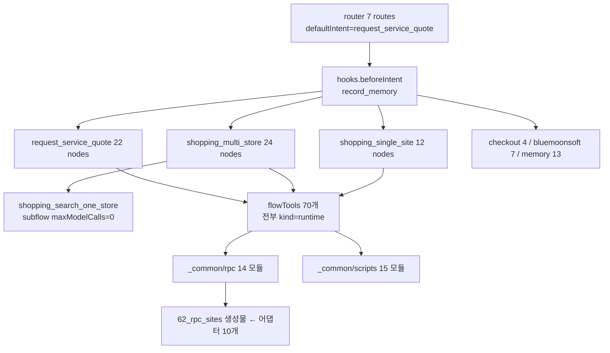

# 코드 리뷰 — flows 문서 + Lua 스크립트

**대상** `_common/flows.yaml`(5,277줄) · `_common/rpc/*.lua`(14파일 5,069줄) · `_common/scripts/*.lua`(15파일 4,164줄) ·
사이트 어댑터 10개(684줄). 합 약 **15,000줄**.
**기준** git HEAD `05d7b41`, 트리 clean, 2026-08-16.
**방법** 8개 슬라이스 병렬 정적 리뷰 + 상위 심각도 주장에 대한 작성자 직접 재검증. 코드 변경 없음.

각 항목은 `path:line` 근거를 갖는다. **[실측]** 은 리뷰 작성자가 코드를 실행하거나 해당 줄을 직접 읽어
확인한 것이고, 표시가 없으면 슬라이스의 정적 분석 결과다. 이 구분은 유지한다 — 근거의 등급이 다르다.

이 문서는 `AGENTS.md` §13과 같은 규칙으로 관리한다: **측정에 의해 은퇴시키고, 쌓지 않는다.**

---

## 0. 판정

구조는 건강하다. 그래프 무결성은 파싱으로 깨끗하고(끊긴 `next` 0건, 도달 불가 노드 0건, §9 치명 패턴 0건),
14개 모델 노드 전부 4-필드 가드를 갖추고, 뮤테이션 6개 전부 `effect`/`consent`/`require`를 선언하며 Lua가
같은 토큰을 다시 검사한다. **결함은 아키텍처가 아니라 경계에 있다** — 값이 한 계층을 건널 때 조용히 사라지거나,
설정이 코드가 닫은 구멍을 다시 열거나, 게이트가 한 방향만 본다.

| 등급 | 건수 | 상태 | 성격 |
|---|---|---|---|
**P0** | **2** | ✅ **해결** `36db09d` | 사용자 돈에 닿았다. 하나는 총액 비교에 **틀린 숫자**를, 하나는 **일어나지 않은 추가**를 보고했다 |
**P1** | **12** | ✅ **12건 전부 해결** `36db09d`·`9e48f11`·`793f913` | 결과가 틀리거나 조용히 사라진다 |
**P2** | 14 | ✅ **6건 해결** `fff5bfc`, 1건 검토 후 유지, 7건 미해결 | 지금은 잠재적이지만 P1로 자라는 부류 |
**P3** | 16 | 미해결 | 죽은 코드·죽은 키·오탈자급 |

> **1단계(§8) 완료 — `36db09d`.** P0 둘 + P1-10(수량) + P1-11(라벨 확인 클릭)을 TDD로 고쳤다: 각 항목 실패
> 테스트 먼저(메시지 기록), 수정, 초록, 그리고 **라이브 스모크**. `test:lua` 530 · `check:flows` 138(새 게이트
> 1건) · 라이브 `shopping` 3/3 실제 추가 · 전 사이트 읽기 전용 스윕 41/41.
>
> **라이브가 잡은 회귀 하나**: P0-2를 고치면서 amazon `cart_url_markers`에 `/cart/smart-wagon`을 넣었다.
> 실제 추가가 그 URL에 착지하는 것은 맞지만 그것은 `/gp/cart/view.html`로 **리다이렉트되는 착지 페이지**이고,
> 첫 마커가 이미 그 URL을 덮으며 18개 행과 `data-asin`이 거기 있다. 착지 페이지를 마커로 지목하자 `review`가
> 이미 카트에 있다고 믿어 네비게이션을 건너뛰고, 카트 셀렉터를 하나도 찾지 못해 **67개가 담긴 카트를 "비어
> 있다"고 사용자에게 답했다.** 되돌렸고 측정 근거를 설정 주석에 남겼다. 오프라인 게이트로는 절대 못 잡는다.
>
> **2단계 완료 — `9e48f11`.** P1-3·P1-4·P1-5·P1-6·P1-9 해결. **게이트를 먼저 썼다** — 개별 수정이 요점이
> 아니었다. 새 게이트(양방향·전 도구)가 **10건**을 잡았고, 그중 4건은 리뷰가 못 본 것이었다.
>
> 게이트 범위는 **측정된 거짓 양성 3건**이 정했고 각 완화의 이유를 코드에 남겼다: entry Lua가 답을 조립할 수
> 있다(`confirmed`·`recalled_contact`) · 통과 반환은 감싼 모듈의 키를 답한다(`return shown`이 `question`을
> "없다"고 보고했다) · 공유 디스패처는 합집합을 답한다(`AX_RPC_PURE.run`). 그리고 **이름 변경**은 식별자
> 스캔으로 못 잡아서 정밀 규칙을 하나 더 붙였다 — `page_stop_reason: result.stop_reason`은 entry가 이미 적용한
> 이름 변경의 **오른쪽**을 읽고 있었다.
>
> **리뷰가 따로 적었던 두 건이 같은 버그였다**: 스토어 실패 라인이 첫 페이지 이동에서 사라진 것과 정렬이
> 되돌아간 것 — 둘 다 `O.rank`/`O.refine`이 선언된 필드를 반환하지 않았기 때문이다. 라이브 창이 증거다:
> `월마트(walmart): 보안 확인(캡차) 필요`가 살아남고, 11st 행의 총액이 정확히 맞는다(13,770+3,000=16,770).
>
> **아무도 안 읽는 키는 계약이 아니다**: `complete_count`·`base_currency`·`service_options`는 어떤 flow state도
> 선언하지 않아 아무 데도 쓰이지 않았다 — 전달이 아니라 선언을 지웠다.
>
> **3단계 완료 — `793f913`. P0·P1 전부 해결.** 또 게이트가 리뷰보다 많이 찾았다.
>
> **취소 게이트를 노드 단위로 바꾸자 두 가지가 드러났다.** ① 뮤테이션을 **노드 이름으로 추측**하고 있었다
> (`/add_.*cart|submit_quote|…/`) — 멀티스토어는 `shopping_add_selected_store_offer`로 변경하므로 어느 단어와도
> 맞지 않아 **결함이 있는 그 플로우를 아예 안 보고 있었다.** `effect: mutation`은 선언돼 있고 컴파일러가 강제한다.
> ② **한 홉은 인정해야 한다** — 렌더러는 자기 `ask`로 멈추고 **같은 턴에** 분류기로 답을 넘긴다
> (`present_results → browse_candidates`). 요구를 렌더러 자신에게 걸면 잘못된 고발이 된다.
>
> **카테고리 삭제는 chooser에 도달할 수 없었다** — `result.keys.0`으로 분기하는데 스크립트는
> `memory_result.matches`를 답한다. 낡은 `keys` 형태는 `MEMORY_DESIGN.md` §19.5(remote 시절)에 아직 남아 있다.
> 게이트를 `{var: result.X}`까지 확장하자 `resolve_zip`도 잡혔다.
>
> **한국 전화번호는 저장된 적이 없었다** — 패턴이 `3-3-4`(미국 시험 데이터 형태)였고 한국은 `3-4-4`다. 그리고
> 옆의 ZIP 탐침이 `30000원`을 우편번호로 저장하고 있었다(그 값은 견적 폼으로 들어간다).
>
> **테스트가 아니라 라이브 창을 읽어서 찾은 것 하나**: 창이 사용자에게 `월마트(walmart): rpc_unavailable`을
> 그대로 출력했다. 미지의 코드는 스토어 이름과 함께 남기는 게 의도지만, **우리가 발행하는 코드는 문장을 가져야
> 한다.**
>
> 라이브: 멀티스토어 확장 **8/8**(실제 배송비 + 스토어 결과 라인), discovery **9/14** — §13이 이미 옳다고 기록한
> 상태다(시나리오가 모델 없는 1번을 고르고 시스템이 비교를 거부한다). 전 사이트 스윕은 4회 연속 실행에서
> 41/41 → 39/41 → 36/40 → 32/38로 흔들렸고 `rpc_unavailable`/`unsearched`가 스토어를 옮겨 다녔다. **이 변경과
> 무관하다고 주장하지 않는다** — 격리한 3-사이트 배치는 이 수정들과 함께 정상 검색했고, 실패 형태는 전부
> 세션·채널 종류였으며 틀린 답은 하나도 없었다는 것만 말할 수 있다.
>
> **P2 6건 해결 — `fff5bfc`.** 사용자 영향도 순으로 잡았다. 두 건은 **게이트를 먼저 써야** 했다 — 어긋난
> 진술 자체가 버그였기 때문이다.
>
> **정제가 합성되지 않았다**: 스냅샷이 행은 나르고 **조건은 나르지 않아** "무료배송만" 다음 "10달러 이하"가
> 배제했던 유료배송 행을 다시 세웠다 — 번호를 고르려던 그 창에서. 조건이 누적되니 `필터 해제`를 창에 노출했다
> (그 전에는 필터를 다시 말하면 대체되어 안내가 필요 없었다).
>
> **브랜드 앵커가 단어 안쪽에 매치됐다**: `ge`가 Range·Storage·Vintage·Package 안에 있어 **GE 검색에 Samsung
> 냉장고가 들어왔다.** 고치자 경계 규칙 자체의 비대칭이 드러났다 — **이웃 바이트만** 보면 `로지텍m185`의
> `로지텍` 뒤에 경계가 없어 한국어 목록이 전부 거부된다. 경계를 "ASCII 영숫자 둘이 아닐 때"로 바꿔
> **스크립트 전환도 경계**가 되게 했고 두 케이스가 함께 통과한다.
>
> **측정값이 모델로 읽혔다**: 블랙리스트가 5개뿐이어서 `500ml`·`60Hz`·`1.5L`·`2P`가 모델이 됐다. 그 값이
> 그룹핑 키이고 identity로 잠기므로 **같은 생수 두 목록이 다른 상품으로 검증된다.** 규칙을 구조적으로 바꿨다.
>
> **로드 순서 가드가 틀린 모듈을 지목했다** — §13이 "드리프트할 수 없는 유일한 문장"이라 부른 그 문장이다.
> 53·54·55·56이 모두 50을 지목하며 51·52에서 심볼을 가져갔고, 54/55/56은 `AX_OFFER_VIEW`/`AX_PAGINATION`을
> 가드 없이 불렀다. 이제 헤더가 실제로 읽는 것에서 계산해 게이트하고, 가드가 **심볼을 테스트**한다.
>
> **단일 사이트 카트의 어댑터는 결정된 게 아니라 보장된 것이었다**: `args.site = args.site or "amazon"`이
> `site`를 선언하지 않는 스키마 뒤에 있어 좌변이 **항상 nil**이었다. 이제 **열린 페이지**에서 도출하고 미지원
> 호스트는 거부한다.
>
> **검토 후 유지 1건**: `identity_approval`의 두 작성자(잠금 단계·resolve 단계)는 §13의 1작성자 규칙에
> 걸리지만 **같은 리터럴을 쓰므로 어긋날 수 없고** 카트가 독립적으로 재검사한다. 겉모습 규칙으로 돈 경로를
> 흔드는 것이 더 나쁜 거래다.
>
> ⚠️ **이 배치의 문자열 변경 2건(`필터 해제` 힌트, `rpc_unavailable` 문장)은 오프라인 검증만 됐다.**
> `dist/_common.lua`와 `dist/workspace-bundle.json`을 모두 다시 빌드했고 둘 다 새 문구를 담고 있는데도 라이브
> 창은 이전 문구를 출력한다. `tools/harness/cdp.mjs`는 스토어 키 4개만 알고 그중에 `axsdk:lua-modules`가 없다
> (RPC 도구의 `modules:`가 오는 곳). **그래서 더 값나가는 발견은 이것이다: 라이브 시나리오가 모듈의 낡은
> 사본을 돌면서도 8/8을 통과할 수 있다** — 바뀐 문구를 단정하는 검사가 없기 때문이다. 어느 계층을 읽는지는
> 이 세션에서 확정하지 못했고, 확정하지 못한 것을 확정한 것처럼 적지 않는다.

---

## 1. P0 — 사용자 돈에 닿는 결함

### P0-1. 조건부 무료배송이 무조건 0으로 읽힌다 **[실측: 실행]**

**근거** `_common/rpc/61_rpc_storefront.lua:332-334` — `FREE_PHRASES`를 **수수료 추출 전에** 전체 텍스트에서
훑고 즉시 `0`을 반환한다.

실제 실행 결과(리포지터리 자신의 fengari 하네스, `AX_RPC_STOREFRONT.search`):

| 입력 `shipping_text` | 반환 | 정답 |
|---|---|---|
`배송비 3,000원 · 30,000원 이상 무료배송` | **0** | 3000 |
`Shipping: $5.99 · Free shipping over $35` | **0** | 5.99 |
`무료배송` | 0 | 0 ✓ |
`배송비 3,000원` | 3000 | 3000 ✓ |
언급 없음 | nil | nil ✓ |

**왜 중요한가** `N원 이상 무료배송`은 한국 스토어의 **정상 렌더링**이다. 예외가 아니다. 그리고 같은 파일
320–322행이 이 동작을 이름으로 금지한다:

> *nil과 0은 다른 답이고 비교는 그 차이로 순위를 정한다. … 두 번째를 첫 번째로 읽으면 그 스토어가
> 공짜로 페이지에서 가장 싸진다.*

코드는 그 문장의 변형을 하고 있다 — 조건부 제안을 무조건 0으로 읽어, 그 스토어를 **공짜로 최저가**로 만든다.
`AGENTS.md` §13의 최악 기준("가격 비교에서 틀린 숫자는 없는 행보다 나쁘다")에 정면으로 걸린다.

**고치는 방법** 수수료 추출을 먼저 하고, 금액이 있으면 그것을 쓴다. 무료 문구는 **금액이 없을 때만**
0으로 해석한다. 임계 표현(`이상`, `over`, `초과`)이 문구와 같은 조각에 있으면 조건부이므로 금액을 신뢰한다.

### P0-2. 설정 3곳이 카트 확인 구멍을 다시 열어 둔다 **[실측: 설정 확인]**

`c16a11e`에서 `cart_contains`의 id 탐침을 카트 페이지로 제한했다. 그런데 **off-cart 분기에 남아 있는
`confirmation_selector`** 는 여전히 per-add 패널이라고 가정하고, 세 사이트가 거기에 **카트 구조**를 넣어 두었다.

| 사이트 | `confirmation_selector` | 문제 |
|---|---|---|
walmart | `[data-testid="add-to-cart-success"], [data-testid="cart-drawer"] [data-testid="cart-item"]` | 두 번째가 카트 구조 |
etsy | `[data-cart-listing-id], [data-add-to-cart-success]` | 첫 번째가 카트 구조 |
coupang | `.cart-message, [data-cart-item-id]` | 두 번째가 카트 구조 |

**왜 중요한가** 지속적인 미니카트/드로어가 **이전 항목**을 담고 있으면 상품 페이지에서 `cart_contains`가
참이 된다 → `add_to_cart`가 추가 블록 전체를 건너뛴다(`67_rpc_cart.lua:262`) → 마지막 읽기도 참 →
**클릭 없이 `added: true`, `next: "done"`, 확인 문구까지 사용자에게 간다.** 이번 주에 고친 P0와 **같은 결함,
다른 문**이다. 코드로 닫고 설정으로 열어 두었다.

etsy는 `confirmation_text_selectors`에 `[aria-live="polite"]`를 넣어 두어 카트 페이지 폴백도 오염된다 —
범용 라이브 리전은 어느 페이지에나 있다.

**고치는 방법** off-cart 셀렉터는 **per-add 증거만** 남긴다(`add-to-cart-success`,
`data-add-to-cart-success`, `.cart-message`). 카트 구조 셀렉터는 제거한다. amazon은 라이브에서 상품
페이지 대비 **0 매치**로 확인됐으므로 손대지 않는다. eBay는 의도적으로 비어 있다.

> **일반 규칙으로 승격할 것**: per-add 증거와 per-cart 구조는 서로 다른 사실이며, 어댑터 설정에서
> 섞이면 코드의 어떤 수정도 이를 막을 수 없다. `check:flows`가 off-cart 셀렉터에 카트 구조 패턴
> (`cart-item`, `cart-listing`, `cart-drawer`, `aria-live`)이 들어오면 실패시켜야 한다.

---

## 2. P1 — 결과가 틀리거나 조용히 사라진다

### P1-1. 페이지네이션이 전진하지 않는다 **[실측: 코드 확인]**

`61_rpc_storefront.lua:655-657`:

```lua
local target = S.search_url(config, query, tonumber(args.page))  -- 2페이지 URL을 만든다
if not already_showing(config, from, query) then                  -- 그런데 page를 안 본다
```

`already_showing(config, href, query)`(128–139행)는 **page 인자가 없다.** 경로 마커 + `param=query`만 본다.
그래서 2페이지 요청은 1페이지에서 참이 되어 **네비게이션을 건너뛰고**, 1페이지를 다시 읽어 2페이지로
라벨링하고, `merge_pages`가 중복 제거해 0건 추가 → `no_new_results`로 멈춘다.

**§13과 충돌한다.** §13은 *"라이브 검증: eBay `_pgn`에서 1페이지 22행과 2페이지의 완전히 다른 22행"* 을
기록한다. 현재 코드 경로로는 재현되지 않는다. 그 검증이 이 형태 이전이었거나 다른 경로였다.

부수 사실: 페이징을 선언한 5개 사이트 중 `next_selector`를 가진 것은 **amazon과 eBay뿐**이라, 나머지
셋(ssg/walmart/aliexpress)의 페이징 블록은 애초에 도달 불가다.

**고치는 방법** `already_showing`에 `page`를 넘기고, 현재 URL의 페이지 파라미터가 요청 페이지와 같을
때만 참으로 한다.

### P1-2. 거부된 op가 "스토어에 상품 없음"으로 강등된다

**근거** `61_rpc_storefront.lua:714` — `dom.query_all` 결과에 `or {}`; `outcome()`(626–629행)은 읽기 단계
이후 `__refused`를 **참조하지 않는다**(네비 분기 675행만 본다).
**왜** 채널이 op를 한 번 떨어뜨리면 스토어가 "결과 없음"을 답한다. §13의 *"빈 페이지는 실패한 스토어가
아니다"* 와 반대 방향의 오류다 — 실패한 채널을 빈 페이지로 만든다. `access_error` 탐침이 거부되면 봇월도
`no_results`로 내려간다.
**고치는 방법** 읽기 단계 이후에도 거부 카운트를 참조하고, 거부가 있으면 `no_results` 대신 채널 상태를 답한다.

### P1-3. rpc 거부 분기가 정의되지 않은 전역을 인덱싱한다 **[실측: 코드 확인]**

**근거** `61_rpc_storefront.lua:866` — `return { next = "error", error = "rpc_unavailable", site = config.site }`.
`S.run_open_site_search`(863행)에 `config` 지역 변수가 **없다**. 두 슬라이스가 독립적으로 지적했다.
**왜** 라우팅된 `error` 분기가 아니라 Lua 런타임 오류가 난다. 모듈 헤더 15–20행이 바로 이 실패를 경고한다.
**고치는 방법** 그 줄에서 `site` 필드를 제거한다(한 줄).

### P1-4. 비교 창 refine이 선언한 필드 3개를 반환하지 않는다 **[실측: 계약 확인]**

`shopping_refine_store_offers`의 `output`은 `store_status` · `view_sort` · `refine_error`를 **선언한다.**
`AX_RPC_OFFERS.refine`(`73_rpc_offers.lua:222-231`)은 **셋 다 반환하지 않는다.**
같은 계열: `shopping_rank_store_offers`가 `failures`를 선언하고 `O.rank`(113–127행)는 반환하지 않는다.

**왜** 사용자가 "평점 높은 순"을 고른 뒤 가격 필터를 걸면 `AX_refine_store_offers`가 `args.view_sort`를
읽는데 플로우가 그것을 받은 적이 없어 **정렬이 기본값으로 되돌아간다.** `refine_error`가 없으면 적용되지
않은 조건의 이유가 사라진다.

**§13이 게이트로 막았다고 기록한 결함의 반대 방향이다.** 게이트는 `present_store_offers` **하나만** 검사하고,
방향도 **Lua→output 한쪽만** 본다:

```js
// tools/flow-conformance.test.mjs:1329-1334
const published = new Set(Object.keys(common.flowTools.present_store_offers.output ?? {}));
const computed = returnedKeys('_common/rpc/73_rpc_offers.lua', 'O.present').filter(k => k !== 'ok');
const lost = computed.filter((key) => !published.has(key));
```

`rank`/`refine`/`resolve`는 검사 대상이 아니고, **선언했지만 반환하지 않는 방향**은 아무도 보지 않는다.
데이터를 잃는 쪽이 바로 그 방향이다.

**고치는 방법** 세 필드를 `O.refine`에서 전달하고 `failures`를 `O.rank`에서 전달한다. 게이트를 **양방향**,
**전 도구**로 확장한다(이게 더 중요하다).

### P1-5. 스토어 실패 라인이 첫 페이지 이동에서 사라진다 **[실측: 코드 확인]**

**근거** `_common/scripts/55_offers.lua:148-151` — `notes_for`가 `C.comparison_notes(args.failures, …)`로
notes를 **재계산**한다. `55_offers.lua` 전체에 `snapshot.notes` 참조가 **없다**. 그런데 `args.failures`를
공급해야 할 `O.rank`가 `failures`를 반환하지 않는다(P1-4).
**왜** §13은 *"창이 스토어 결과를 나르므로 스냅샷이 notes를 나른다"* 를 **해결됨**으로 기록하지만,
`encode()`가 나르는 notes는 `present`의 재렌더만 보호한다. refine/페이지 이동은 재계산하므로 **네이버쇼핑
봇월 라인이 첫 "다음"에서 사라진다** — §13이 기록한 실패 모드가 현재 코드로 재현된다.
**고치는 방법** refine에서 `snapshot.notes`를 재사용한다.

### P1-6. 필터로 숨은 행을 "배송비 미확인"으로 보고한다 **[실측: 코드 확인]**

**근거** `55_offers.lua:149` — `local hidden = #all_offers - #list`. 무엇이 숨겼든 **보이지 않는 모든 행**을
세고, 미확인 행이 목록 어딘가에 하나만 있으면 그 수를 "배송비/총액 미확인 N건은 접었습니다"로 보고한다.
**왜** "쿠팡만" 필터로 6행이 숨은 뒤, 무관한 한 행의 배송비가 미확인이면 사용자는 **6건이 배송비 미확인으로
접혔다**고 듣는다. 돈 비교 창에서 가격에 대한 거짓 진술이다.
**고치는 방법** `cost_complete ~= true`로 실제 제외된 행만 센다(빌드 경로는 이미 올바르게 계산한다).

### P1-7. 멀티스토어 수집 게이트에 취소 경로가 없다

**근거** `_common/flows.yaml:2287` — `enum: [ ask, done ]`; `:1404-1407` — `next: { ask, done, error }`;
노드 프롬프트(1356–1408)에 취소 지시 없음. 형제 플로우는 갖고 있다(`collect_shopping` enum에 `cancel`).
**왜** 플래너 프롬프트는 *"게이트에서의 거부는 항상 continue_current — 플로우가 자기 취소 경로를 소유한다"*
고 약속하는데 이 게이트는 소유하지 않는다. 사용자의 "취소"는 재질문(`ask`)이나 비교 시작(`done`)밖에 될 수 없다.
**게이트가 왜 안 잡았나** `tools/flow-conformance.test.mjs:1756-1758`이 **플로우 안에 한 노드라도** cancel
분기가 있으면 통과시킨다. §13의 *"한 노드를 지목한 게이트는 한 노드만 보호한다"* 의 재발이다.
**고치는 방법** enum·분기·프롬프트 세 곳을 추가하고, 게이트를 **일시정지하는 모든 노드** 기준으로 바꾼다.

### P1-8. 카테고리 기억 삭제가 영구히 "찾지 못했습니다"를 답한다 **[실측: 계약 확인]**

**근거** `flows.yaml` `find_delete_candidates.next` = `{if: [result.ok, {if: [result.keys.0, "choose",
"not_found"]}, "error"]}`. `Y.search`(`70_rpc_memory.lua`)는 `{next, ok, memory_result}`만 반환하고
**최상위 `keys`가 없다.** 게다가 `memory_result: result`로 스크립트 결과 전체를 발행하므로 프롬프트의
`memory_result.keys` 경로는 실제로 `memory_result.memory_result.*` 한 단계 아래다.
**왜** "주소 관련 기억 다 지워줘"는 일치 항목이 있어도 chooser에 도달할 수 없다.
**출처** `MEMORY_DESIGN.md:770-772`가 아직 `kind: remote` 시절 형태(최상위 `keys`)를 서술한다 — 그 낡은
문서가 이 분기의 기원으로 보인다.

### P1-9. `page_stop_reason`이 항상 null이다 **[실측: 계약 확인]**

**근거** `flows.yaml:2873` — `page_stop_reason: result.stop_reason`. 그런데 엔트리
`63_pure_entries.lua:88`이 **이미 이름을 바꿔서** `page_stop_reason = result.stop_reason`으로 반환한다.
스크립트 결과에는 `stop_reason`이 없다.
**왜** 선언된 상태 키가 매 턴 null이다. 값은 `store_result` 안에 중첩되어 살아남지만 발행된 계약은 죽어 있다.
**고치는 방법** 매핑을 `result.page_stop_reason`으로(한 줄).

### P1-10. 수량 설정 실패가 무시된다

**근거** `_common/rpc/67_rpc_cart.lua:314` — `set_value`의 불리언 반환을 버린다.
**왜** 3개를 승인했는데 설정이 실패하면 **1개가 담긴다.** 같은 파일 300행 주석이 이 실패를 이름으로 금지한다
(*"세 개를 승인했는데 한 개를 담는 것은 조용히 틀린 주문이다"*) — 셀렉터가 없을 때는 거부하는데, 있는데
실패할 때는 통과한다.
**고치는 방법** 반환값을 확인하고 실패 시 `quantity_unavailable`로 거부한다.

### P1-11. 견적 위저드가 위치 기반으로 버튼을 누른다 **[실측: 코드 확인]**

**근거** `_common/rpc/65_rpc_quote.lua:546` — `local selector = Q.ACTIVE .. ' button:not([aria-label])'`.
결정(`decision`)이 들고 있는 `label`을 selector가 **쓰지 않는다.** 그리고
`_common/scripts/10_form_wizard.lua:257-258`은 advance 라벨을 찾으면 `submit_like`를 **버리고**
`reached_submit_step = false`로 반환한다.
**왜** 제출형 버튼과 "다음"이 **같은 스텝에 함께** 렌더되고 제출형이 문서 순서상 먼저면서 `aria-label`이
없으면, 그것을 누른다. `dom.submit_form`(`requestSubmit()`) 폴백까지 있어 `AGENTS.md` §11의 최우선 제약
**"견적을 자동 제출하지 않는다"** 에 닿는다.
**정직한 한계** 그런 혼합 스텝을 라이브에서 관측한 적은 없다. 구조적으로 가능하지만 미관측이다.
**고치는 방법** 클릭 전에 라벨을 확인한다 — 리포지터리에 이미 `click_verified` 교리와
`dom.query_all(sel, {text=true})` 관용구가 있다. 제약의 등급을 감안하면 관측을 기다릴 이유가 없다.

### P1-12. 한국 전화번호는 절대 저장되지 않는다 **[실측: 코드 확인]**

**근거** `_common/rpc/70_rpc_memory.lua:144` —
`text:match("%d%d%d[%-%.%s]%d%d%d[%-%.%s]%d%d%d%d")` — **3-3-4** 패턴.
한국 휴대폰은 `010-1234-5678` = **3-4-4**. 매치되지 않는다.
**왜** "제 번호 010-1234-5678 기억해줘" → 아무것도 저장되지 않고 **아무 말도 하지 않는다**(훅은
fire-and-continue). 사용자는 저장됐다고 믿는다. 명시적 지시가 조용히 사라지는 것은 이 기능 전체의 목적에
반한다.
**고치는 방법** 3-4-4 대안을 추가한다. 같은 함수의 ZIP 오인(`30000원` 같은 **쉼표 없는** 5자리가
`zip_code`로 저장됨, 148행)도 함께 좁힌다 — 다만 한국 가격 표기는 보통 `30,000원`이라 하위 에이전트가
보고한 것보다 범위가 좁다.

---

## 3. 구조 지도 — 실제로 어떻게 생겼는가



**계약 표면은 4개이고 각각 독립적으로 강제된다.** 이것이 이 코드베이스를 이해하는 핵심이다.

| # | 표면 | 규칙 | 위반하면 |
|---|---|---|---|
1 | `parameters.properties` | 하드 투영. `additionalProperties: false`로 **선언 안 된 상태는 스크립트가 보기 전에 버려진다** | 스크립트가 nil을 읽는다 (P2: `args.site`) |
2 | `rpc.allow` | **wire op만** 부여. 대기 헬퍼는 합성 폴, 네트워크는 별도 `execute.net` | op 하나씩 거부되며 런 중 실패 |
3 | `output` | 반대 방향 투영. **매핑된 `result.*` 키만** 상태에 도달 | 조용히 사라진다 (P1-4·9) |
4 | `effect`/`consent`/`require` | 뮤테이션 게이트. `require`는 **동등 비교** | 게이트가 꺼지거나 문서가 컴파일 실패 |

**중요한 사실 하나**: 이 문서에 `kind: remote` 도구는 **0개**다. 전부 런타임이다. 라우터 엔트리 3개가
한 줄 Lua 스텁인 것은 §9의 치명 패턴(엔트리가 원격 호출)을 피하려는 **의도된 설계**다 — 리팩터가 이 스텁을
없애면 안 된다.

### 계층은 하나로 줄었다

`AGENTS.md` §4·§13이 서술하는 **"두 개의 storefront 스택"** 은 더 이상 없다. `_common/scripts/60_storefront.lua`가
**삭제됐고**, 사이트 어댑터는 이제 **설정 전용**(`AX_SITE_CONFIGS[CONFIG.site] = CONFIG`)이다.
`AX_search_product`·`AX_add_to_cart`·`AX_checkout`·`AX_view_cart`·`AX_update_cart`·`AX_view_product`·
`AX_open_site`는 **46개 Lua 파일 어디에도 정의되어 있지 않고 flows에도 없다.** **[실측]**

이것은 좋은 방향의 변화다. 다만 문서가 따라오지 않았다(§5).

---

## 4. 게이트 분석 — 무엇이 지켜지고 무엇이 안 지켜지는가

강제되는 것(전부 `file:line`으로 확인): `deadlineMs ≤ 120000` · 모듈 전역 정의 · `require`가 비불리언에
`true`를 요구하지 않음 · 카트/체크아웃 분리와 `dom.submit_form`/`page.eval` 미부여 · 견적 예산 ≤ deadline−15s ·
브랜치 리터럴이 노드의 `next` 키에 속함 · `store_result: result` 금지 · 고아 스위트 없음(51개 전부 4개 glob에 포함).

**강제되지 않는데 load-bearing인 것 — 이 목록이 이 리뷰에서 가장 값이 나가는 부분이다:**

| 규칙 | 상태 | 이번에 대가를 치른 항목 |
|---|---|---|
`output` 선언 ↔ Lua 반환 **양방향** 일치 | `present_store_offers` **한 도구, 한 방향**만 | P1-4, P1-9 |
일시정지하는 **모든** 노드에 취소 경로 | **플로우당 한 노드**만 확인 | P1-7 |
off-cart 확인 셀렉터에 카트 구조 금지 | 없음 | **P0-2** |
`rpc.allow` 감사가 프로덕션 문서 대상 | **playground만** (프로덕션은 59건 이슈, 대부분 합집합 노이즈) | 잠재 |
§10 셀렉터 규율(해시 클래스 금지) | 없음(사람이 리뷰) | 지금은 깨끗 |
CSS 리스트 **문서 순서** 안전성 | amazon 제목만 | eBay 제목 리스트 잠재 |
죽은 설정 키 위생 | 없음 | `search_input_selector` **8사이트 선언 · 0곳 사용** |
줄바꿈(`.gitattributes` 부재) | 없음 | 이번 세션에 게이트 2개 오탐 |

`rpc.allow` 감사에는 별개 결함도 있다: `tools/rpc-allow.mjs:57`의 `CALL` 정규식이 이름 뒤 `(`를 요구하므로
`pcall(sitemap.search_site, …)`(`72_rpc_sitemap.lua:37`)와 `pcall(net.fetch, …)`(`71_rpc_zip.lua:51`)를
보지 못한다. 그래서 **실제로 쓰이는 부여를 삭제하라고 가르친다.** 감사가 거짓말하기 가장 나쁜 방향이다.
그리고 `flows.yaml:2773-2774`는 이 감사가 프로덕션을 막아준다고 **주장한다** — 사실이 아니다.

---

## 5. 문서 어긋남 — `AGENTS.md`가 더 이상 사실이 아닌 곳

§4(명령 인벤토리)에서 32개 `AX_*` 주장 중 **7개가 유령**이다. **[실측]**

| 항목 | 문서 | 실제 |
|---|---|---|
`_common/scripts/60_storefront.lua` | §4 표에 등재 | **파일 없음** |
`amazon/scripts/{00_common,search,add_to_cart,update_product,checkout}.lua` | §4에 5개 등재 | **전부 없음** (남은 것은 `01_storefront_config.lua` 하나) |
`ebay/scripts/00_common.lua` | §4에 등재 | **없음** |
`AX_STOREFRONT` | §4에 등재 | 정의된 곳 없음 |
"어댑터가 `AX_COMMERCE`에 등록하고 `AX_search_product`를 노출" | §4 | 어댑터는 **설정 전용** |
"storefront 스택이 **둘**이니 양쪽을 확인하라" | §13 | **하나**다 |
"shipping 파서가 **둘**이라 동일 응답으로 고정" | §13 | 한쪽이 삭제됨. 고정은 단일 파서 케이스 표로 해소 |
"라이브 검증: eBay 2페이지에 다른 22행" | §13 | 현재 경로로 재현 불가 (P1-1) |
"스냅샷이 notes를 나른다 — 해결됨" | §13 | refine이 읽지 않는다 (P1-5) |
"관련성은 토큰 경계를 안다" | §13 | **모델 코드만.** 브랜드는 경계 없는 부분 문자열 |
"`sitemap_search`는 remote로 남긴다" | §13 | 지금 `kind: runtime` |
"취소 규칙을 `check:flows`가 예외 없이 고정" | §13 | **플로우 단위**다 (P1-7) |
"빈 목록 수정이 세 곳에 들어갔다" | §13 | 세 곳은 여전히 `{}`. 실제 방어는 `63_pure_entries` 출구 |

추가로: `tools/dead-lua.mjs:4` 헤더가 *"들어오는 길은 정확히 둘"* 이라고 적었는데 **자기 구현은 넷**을
센다(§13은 넷이라고 옳게 적었다). 진입 경로 수를 아는 것이 유일한 임무인 파일의 주석이 틀렸다.

그리고 어떤 npm 스크립트에서도 닿지 않는 **`.mjs` 러너 12개 · 2,617줄** 이 남아 있다. **[실측]**
`_common/scripts/test_open_site.mjs`는 삭제된 `AX_open_site`를, `amazon/scripts/test_shopping_chain.mjs`는
삭제된 `AX_search_product`를 구동한다. 고아 스위트 게이트는 `tools/` 아래만 본다.

---

## 6. 지켜야 할 것 — 리팩터가 깨뜨리면 안 되는 설계

측정된 실패로부터 태어난 장치들이다. 각각 주석에 그 실패가 적혀 있다. **"정리"의 대상이 아니다.**

1. **`61_rpc_storefront.lua:26-70`의 관용 프록시** — 호출 시점 해석(모듈이 런타임 전역보다 먼저 로드된다),
   1회 재시도, 거부 카운트. `nav.navigate`는 **의도적으로 재시도에서 제외**(이미 발화한 네비게이션을
   재시도하면 페이지가 두 번 움직인다). 로드 시점으로 올리거나 재시도를 일반화하면 측정된 결함 2건이 돌아온다.
2. **빈 목록은 부재로 건넨다** — `53`의 `listed()`, `54`/`56`의 nil-when-empty, `63_pure_entries`의 출구
   가드 2개. §13이 네 번의 경계를 기록한다. `{}`를 되살리면 스키마 검증이 다시 깨진다.
3. **스냅샷을 JSON 문자열 하나로 나르는 설계**(`73` + `54`/`55`) — 랭킹·접기·윈도잉은 단일 구현으로 남고,
   staleness 규칙(목록 구성이 바뀌면 `comparison_id` 재발급 → 이전 번호는 해석 실패)이 빌드·refine·resolve
   **세 곳에서 독립적으로** 강제된다.
4. **통화는 추측하지 않고 거부한다** — 임계값이 통화를 들고 다니고, 근거 없는 임계값은 `price_currency_unknown`을
   한국어 설명과 함께 답한다("0건"이라고 말하지 않는다). 혼합 비교는 base를 유지한다. FX 실패는 접힌 행을
   낳고 **조작된 총액을 낳지 않는다.**
5. **뮤테이션 게이트가 이중이다** — 6개 도구 전부 `effect`/`consent`/`require`를 선언하고, `67_rpc_cart.lua:247-255`가
   Lua 안에서 **같은 토큰을 다시** 검사한다. 플로우만 믿지 않는다.
6. **`V.render`의 열화 사다리** — 번호/사이트/총액을 마지막까지 지키고 notes를 가장 마지막에 버린다.
   프롬프트 크기가 결과 수와 무관해진다.
7. **`judge_relevance`는 열린 쪽으로 실패한다** — `done`/`error` 모두 `apply_screening`으로 간다.
   잃은 판정은 정밀도를 잃되 턴을 잃지 않는다.
8. **서브플로우가 모델을 못 쓴다** — `maxModelCalls: 0` / `maxNodes: 20`, 그리고 검색 노드의
   `invalidNext: done`이 분류된 스토어 결과를 결정적 수집 단계로 접는다.

---

## 7. P2 — 지금은 잠재적이지만 P1로 자라는 것

- **로드 순서 가드가 실제 의존성을 가리키지 않는다.** `53`/`54`/`55`/`56`이 모두 `50_commerce_core`를
  이름으로 확인하는데, 실제 import는 `52_identity`(`worker_value`, `identity_text`), `51_relevance`(`split_list`,
  `matches_query`), `45_offer_view`, `44_pagination`에서 온다. `AGENTS.md:1449`는 이 가드를 *"드리프트할 수
  없는 유일한 문장"* 이라 부르지만 **드리프트했다.** 현재 14개 모듈 리스트가 전부 완전해서 잠재 상태다.
- **스냅샷이 `filters`/`sort`를 버린다** → 정제가 합성되지 않는다. "무료배송만" 다음 "3만원 이하"가
  무료배송 조건을 조용히 해제한다.
- **`infer_model`의 단위 블랙리스트가 5개**(`ghz mah gb tb dpi`)뿐 → `500ml`, `60Hz`, `2P`가 모델이 된다.
  잠긴 identity가 용량이 될 수 있다.
- **브랜드 앵커가 경계 없는 부분 문자열** → `lg`가 `algorithm`에 매치된다. 모델 앵커는 경계를 아는데
  브랜드는 아니다.
- **`shopping_add_to_cart`가 `args.site`를 선언 없이 읽는다** → 항상 nil → 항상 amazon 어댑터. 오늘은
  엔트리 노드가 `open_amazon`이라 안전하지만, **투영이 결정을 대신하고 있다.**
- **승인 마커의 작성자가 둘** — `locked_product_identity`(`52_identity.lua:210` + `55_offers.lua:284`),
  `current_comparison`(`flows.yaml:3184` + `55_offers.lua:285`). §13이 "승인 하나에 작성자 하나"를 이미
  대가를 치르고 배웠다.
- **어필리에이트가 `쿠팡에서 보기` 라벨을 하드코딩**(`74:183`)하고 사이트가 아니라 상품명 존재로 게이트한다.
- **`69_rpc_widget:52`가 `args.data` 부재를 `{}`로 채워 보낸다** — 모듈 자신이 문서화한 실패 형태.
- **eBay 제목 셀렉터 리스트가 `a[href*='/itm/']`로 끝난다** — 이미지 앵커가 문서 순서상 먼저다.
  amazon `"h2, h2 a"`가 브랜드를 집었던 것과 **같은 형태**(image_alt 폴백이 완화한다).
- **11st `result_delivery_selector`가 자기 파일이 "존재하지 않는다"고 적은 클래스를 가리킨다.**

---

## 8. 우선순위 실행 순서

**1단계 — 돈에 닿는 것(즉시).**
① P0-1 무료배송 파서 순서 · ② P0-2 세 사이트 off-cart 셀렉터 + 게이트 추가 · ③ P1-10 수량 반환값 ·
④ P1-11 라벨 확인 클릭(자동 제출 금지 제약).

**2단계 — 조용히 사라지는 것.**
⑤ P1-4 refine/rank 필드 전달 **+ 게이트를 양방향·전 도구로** · ⑥ P1-5 snapshot notes 재사용 ·
⑦ P1-6 hidden 산술 · ⑧ P1-9 매핑 한 줄 · ⑨ P1-3 `config.site` 한 줄.

**3단계 — 사용자가 못 하는 것.**
⑩ P1-7 멀티스토어 취소(4부 규칙) + 게이트를 노드 단위로 · ⑪ P1-8 카테고리 삭제 · ⑫ P1-12 한국 전화번호 ·
⑬ P1-1 페이징(고치거나, 못 고치면 §13 기록을 은퇴시킨다).

**4단계 — 문서와 위생.** §5 전체(§4 인벤토리 재작성, §13 낡은 항목 은퇴) · 고아 `.mjs` 12개 처리 ·
죽은 설정 키 · `.gitattributes`.

> **순서의 근거**: 1단계는 사용자가 손해를 보는 항목, 2단계는 사용자가 **틀린 정보를 받는** 항목,
> 3단계는 사용자가 **하려는 일을 못 하는** 항목, 4단계는 **다음 사람이 잘못 배우는** 항목이다.

---

## 9. 검증되지 않은 질문 — 여기서는 답할 수 없다

- `output` 매핑이 miss일 때(`failures: result.failures`가 undefined) 엔진이 상태를 **지우는지 건너뛰는지**.
  P1-5의 범위가 이 답에 달렸다. 엔진은 `../axsdk-sdk-js`다.
- 클라이언트 `memory.search`의 실제 응답 형태(`keys`를 나르는가) — P1-8이 전부 깨졌는지 선언 경로만
  깨졌는지가 여기서 갈린다. 스텁은 `{ok, markdown}`을 답해 양쪽 다 만족시키지 않는다.
- `flow.map`의 `done`/`partial`/`empty`/`error` 분기 도출은 엔진 쪽이다.
- 프롬프트가 실제로 쓰지 않는 `inputSelector` 필드가 죽은 무게인지 — 라이브 `debug` 프롬프트 덤프가 필요하다.
  부분 문자열 부재는 증거가 아니다(엔진이 선택된 상태를 통째로 주입한다).
