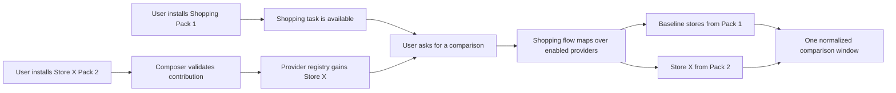

# Community Agent Pack and Provider Extension Design

**Status:** Proposed · parity re-reviewed 2026-08-24  
**Scope:** Downloadable agentic tasks composed from user-installed `chrome.userScripts` releases

## 1. Goal

A user installs one shopping-comparison release, **Shopping Comparison Agent Pack** (Pack 1). That
single installation supplies the shopping intent, flow graph, tool contracts, and all deterministic
logic the task needs. A later installation of **Store X Provider Pack** (Pack 2) contributes Store X
to Pack 1's declared `storefronts` extension point. Pack 1 is not edited or reinstalled. On the next
shopping-comparison task, Store X is discovered from the installed provider registry and is searched
automatically according to the user's provider settings.



The design must preserve the current product boundaries:

- the user, never the model, installs, enables, updates, or expands a pack's hosts or capabilities;
- dynamic JavaScript executes only through `chrome.userScripts` in a `USER_SCRIPT` world;
- downloaded flow fragments grant no DOM, navigation, network, memory, tab, debugger, or Lua
  capability;
- flow fragments can call only fixed packaged community primitives and commands declared by the
  pack composition;
- no downloaded Lua is interpreted at runtime;
- purchase, order placement, and payment remain impossible.

## 2. Important interpretation of “flow and Lua in UserScript 1”

One user-visible installation is a **multi-asset Agent Pack release**, not one JavaScript file with a
YAML interpreter hidden inside it.

Pack 1 contains:

1. a signed, content-addressed restricted flow fragment;
2. one exact JavaScript `USER_SCRIPT` artifact for deterministic task commands;
3. zero or more separate exact JavaScript artifacts for embedded providers;
4. signed route, extension-point, command, schema, host, and disclosure metadata.

Lua may remain the authoring source only when the build deterministically produces the exact
JavaScript artifacts **before review and signing**, as required by
[`community/release-policy.json`](community/release-policy.json). The CWS runtime never downloads or
interprets Lua. A literal downloaded Lua interpreter/source path is developer-build-only and is not
part of this design.

The flow fragment is not executed in an extension worker. The extension verifies and composes it as a
capability-free client-flow layer and sends the composed document to the existing flow engine. The
JavaScript artifacts are the only dynamic executables and run through `chrome.userScripts`.

This distinction is load-bearing:

| Asset | Executed where | Authority |
|---|---|---|
| restricted flow fragment | existing flow engine | orchestration only; no grants |
| Pack 1 task JavaScript | task-executor `USER_SCRIPT` world | Pack 1 declared task commands |
| Pack 1 embedded-provider JavaScript | provider-page `USER_SCRIPT` world | baseline provider commands |
| Pack 2 JavaScript | its own provider-page `USER_SCRIPT` world | Store X declared commands |
| packaged community bridge | extension/service worker | validation, navigation coordination, consent, dispatch |

## 2.1 Parity re-review: can every current local flow and Lua source be removed?

### Verdict

**No—not with the design as originally written.** It is a valid design for extending the read-only
multi-store comparison subset, but it is not yet a replacement contract for the whole current local
workspace.

There are two separate “no” answers:

1. **The implementation today cannot do it.** The current community registry carries one JavaScript
   artifact, the catalog explicitly says the model cannot call a community command directly, and the
   codebase has no `community.task`, `community.provider`, `packFlows`, extension-point composer, or
   `packSetDigest` implementation. Deleting the local sources now removes the only shipped client flow
   and module graph.
2. **Implementing only the original proposal still would not preserve parity.** It migrates the
   read-only part of `shopping_multi_store_total_cost`; it explicitly excludes cart, checkout, memory,
   quote, sitemap navigation, global hooks, and the remaining routes.

Full removal is possible only after the architecture is extended by the requirements below and every
current route is migrated and live-proven.

### Measured current production surface

The current workspace contains:

| Surface | Current source |
|---|---:|
| common client-flow document | 261,319 bytes |
| flows | 11 |
| routed user intents | 8 |
| flow tools | 82 |
| flow-declared modules | 26 |
| production Lua sources | 39 files / 477,839 bytes / 10,798 lines |
| common command/library scripts | 15 |
| runtime RPC modules | 14 |
| storefront generator/config sources | 10 |

The 11 flows are:

| Current flow | Covered by the original Pack 1 design? | Missing parity |
|---|---|---|
| `shopping_multi_store_total_cost` | partial | guarded cart selection and FX declaration |
| `shopping_search_one_store` | partial | exact child-flow/provider dispatch contract |
| `shopping_single_site` | no | search, selection, guarded cart, cancel, checkout gate |
| `checkout` | no | order-free checkout review |
| `request_service_quote` | no | service search, shortlist, ZIP, memory recall, safe form wizard |
| `memory` | no | get/list/search/set/update/delete and consent |
| `record_memory` | no | global `beforeIntent` capture hook |
| `bluemoonsoft` | no | signed sitemap search and restricted navigation |
| `community_script` | no | catalog answer, proposal, widget confirmation |
| `unsupported_request` | no | product fallback |
| `end_conversation` | no | product terminal |

The shopping surface alone is four flows, 51 nodes, 36 tools, 18 modules, two consent-gated cart
mutations, and one FX network dependency. The original proposal's read-only Pack 1 therefore cannot
be called “shopping parity”.

Three other local-source classes also need an owner:

- `20_echo.lua`, `30_resolve_zip.lua`, and `40_read_page.lua` are development/harness commands even
  though no production flow reaches them;
- the ten site Lua files are generator inputs for the current storefront configuration;
- the BlueMoonSoft and Thumbtack site flow layers must either become pack assets or be proven
  unnecessary after composition.

### Shopping-only gaps that must be closed

1. **Include all current shopping flows.** Pack 1 must own multi-store comparison, its one-store child,
   single-site shopping, and checkout review—not only the multi-store read path.
2. **Add separate typed mutation contracts.** `commerce.storefront.v1` remains search-only. Baseline
   providers that currently support cart must additionally contribute `commerce.cart.v1`; checkout
   review uses `commerce.checkout-review.v1`. Providers without those contributions remain
   comparison-only.
3. **Preserve the existing guards.** Cart invocation must still require the current identity,
   comparison, and cart-approval markers, re-read model and price, confirm the exact item, and ask for
   consent per invocation. Checkout review never exposes an order-placement command.
4. **Declare FX egress.** Total-cost normalization currently reaches `api.frankfurter.dev`. Pack 1
   needs an approved, signed network profile or a fixed packaged FX service. “Pack 1 owns FX” without
   either path is not executable.
5. **Preserve planner-resume semantics.** The current global planner has memory, service-collection,
   service-shortlist, single-site, and comparison follow-up rules. Route name/examples alone cannot
   reproduce resumed-turn behaviour or cancellation.
6. **Run task code before a provider page exists.** The original graph calls a Pack 1 command before
   provider activation, while the original execution design made Pack 1 live only on provider hosts.
   That ordering cannot work.

### Required stable task executor

Task logic must not be injected into every provider page. Instead, each session needs one dedicated
**task-executor document** on an exact, user-approved AXSDK HTTPS origin:

```text
AXSDK task-executor tab/document
  ├─ Pack 1 USER_SCRIPT world (pure task commands)
  ├─ Memory Agent Pack USER_SCRIPT world
  └─ other enabled Agent Pack task worlds

provider tab/document
  └─ the matching Provider Pack USER_SCRIPT world (site DOM only)
```

This fixes four problems:

- task commands are available before the first provider navigation;
- task logic does not gain Store X DOM access when Store X is installed;
- adding Store X does not expand Pack 1's host permissions;
- non-page tasks such as memory have a legitimate `USER_SCRIPT` execution target.

The executor must be a normal web document because Chrome documents `chrome.userScripts` as code
injected into a web page and requires host permissions for the sites on which it runs. It must not be
an extension/offscreen page used as an undocumented code-execution shortcut. Registration,
document-scoped broker addressing, session-group lifetime, navigation independence, and teardown need
a real-Chrome proof before this is treated as available.

Reference: <https://developer.chrome.com/docs/extensions/reference/api/userScripts>

### Required product shell

Removing `_common/flows.yaml` does not mean removing all fixed orchestration. A minimal packaged
product shell—owned by the platform, not by a downloaded pack—must provide:

- `app`, `defaults`, standard contexts, the global router, and the default fallback;
- deterministic composition of signed route contributions;
- typed resume-rule contributions for paused flows;
- typed global hook slots, including the memory `beforeIntent` capture hook;
- consent/widget dispatch and pack-management UI;
- fixed task/provider/service action implementations;
- composition digest pinning and compile-only activation.

The shell must contain no site/task-specific selectors or business logic. Downloaded fragments still
cannot replace its planner, router, defaults, contexts, or arbitrary hooks. Instead, manifests supply
closed data such as:

```yaml
routeContributions:
  - intent: shopping_compare
    entry: shopping_compare.entry

resumeRules:
  - when: { flow: shopping_compare, node: present_offers }
    mode: continue_current
    copyLatestUserTextTo: requestText

hookContributions:
  - slot: beforeIntent
    flow: record_memory
    requiresPack: layorix.memory
```

The composer generates the global prompt/router/hook structures. Packs never merge arbitrary prompt
or hook text into another pack.

### Required parity pack set

The first complete migration needs more than Pack 1:

| Pack or fixed component | Current behaviour it replaces |
|---|---|
| Shopping Agent Pack | multi-store, one-store child, single-site, cart gates, checkout review |
| Commerce Provider Packs | storefront search; optional cart and checkout-review contributions |
| Service Quote Agent Pack | request collection, shortlist, confirmation, cancellation |
| Thumbtack Provider Pack | service search and safe pre-submit form wizard |
| Memory Agent Pack | explicit memory CRUD, presentation, and capture parser |
| fixed memory service | existing cross-turn `memory.get/search/set_bulk` storage semantics |
| Site Navigation Agent Pack | sitemap resolution and same/cross-document navigation |
| BlueMoonSoft Provider Pack | signed sitemap data and approved page targets |
| fixed community control surface | catalog answer, proposal, confirmation, install-management boundary |
| fixed product shell | contexts, routing, resume rules, hooks, fallbacks, consent |
| dev-only diagnostics or harness replacements | echo, ZIP probe, and page reader commands |

Shared utilities become build-time TypeScript/JavaScript libraries statically linked into exact
reviewed artifacts. They do not become a remotely loaded runtime library or a second implementation.

### Additional fixed service contracts

Capability-free flow fragments may reference only closed, packaged service contracts declared by
their Agent Pack:

- `platform.memory.v1`;
- `platform.sitemap.v1` over signed data assets;
- `platform.fx.v1` or a signed task-pack network profile;
- `platform.geocode-us-zip.v1` or an approved task-pack network profile;
- `platform.widget-confirm.v1`;
- `platform.provider-navigation.v1`.

This is not a return to `rpc.allow`. The fragment names a versioned service contract; the packaged
implementation owns the op vocabulary, and install UI discloses each dependency.

### User-visible migration consequence

The current local tasks are always present. Community packs require explicit install and enable
approval. Therefore identical out-of-box behaviour cannot survive removal without a migration step.
The honest parity statement is:

> After the user explicitly installs/enables the complete first-party parity pack set, the same
> behaviours are available without local flow/Lua sources.

Automatic installation would violate the locked community policy.

### Full deletion gate

No current local flow or Lua source may be removed until all of the following are true:

1. The composed pack routes cover all eight current routed intents, the default fallback, every
   paused-flow resume rule, and the memory hook.
2. The pack/service closure replaces all 26 flow-declared modules.
3. The three development commands are removed from their callers or replaced by explicit dev tools.
4. Storefront config generation is replaced by signed provider data/artifacts.
5. Exact-artifact scenarios prove:
   - all representative commerce stores and broad discovery;
   - single-site and multi-store guarded cart adds;
   - checkout review with no order;
   - Thumbtack search/shortlist/wizard with no submit;
   - memory save/update/read/search/delete/recall and hook capture;
   - BlueMoonSoft sitemap navigation;
   - community-script proposal/confirmation and cancellation paths.
6. A fresh profile uses only signed pack flow assets and `USER_SCRIPT` artifacts; script/module
   ownership reports no packaged/stored Lua or runtime Lua modules.
7. The workspace/package builder has no `_common/flows.yaml`, `_common/scripts`, `_common/rpc`, or
   site-script dependency, and its empty-local-source regression passes.
8. Removing or revoking one provider degrades only its contribution and leaves the owning Agent Pack
   and other providers functional.

Until this gate is green, the clean-cutover claim applies only to a migrated subset, never to the
whole local workspace.

## 3. Product terminology

### 3.1 Agent Pack

An installable task. It owns:

- one or more namespaced intents;
- a restricted flow fragment;
- task command implementations;
- route descriptions and examples;
- state and output schemas;
- named extension points that other packs may contribute to.

Pack 1 is an Agent Pack.

### 3.2 Provider Pack

An installable adapter that contributes to an Agent Pack extension point. It owns:

- exact approved site matches;
- an entry URL;
- provider display metadata and aliases;
- one or more contract-bound commands;
- search-result schemas and disclosures.

Pack 2 is a Provider Pack.

### 3.3 Pack composition

The immutable, validated view of all enabled Agent Packs and compatible Provider Pack contributions.
It has a `packSetDigest`. A session pins one digest; changing installed packs affects the next fresh
task/session and never mutates a flow already running.

## 4. Release format

The current one-artifact community release becomes a signed multi-asset release. Every reference is
content-addressed and covered by the release signature.

### 4.1 Shopping Agent Pack manifest

```yaml
schemaVersion: 2
pack:
  id: layorix.shopping-comparison
  type: agent
  name: Shopping Comparison
  version: 1.0.0
  publisherId: layorix
  minimumRuntimeVersion: 2

assets:
  flow:
    ref: sha256:<flow-digest>
    mediaType: application/vnd.axsdk.flow-fragment+yaml
    bytes: 84000
  taskScript:
    ref: sha256:<task-javascript-digest>
    mediaType: application/javascript
    bytes: 190000
  baselineProviders:
    ref: sha256:<provider-javascript-digest>
    mediaType: application/javascript
    bytes: 150000

execution:
  role: task
  target: axsdk_task_executor

routes:
  - intent: shopping_compare
    entry: shopping_compare.entry
    description: Compare one product across enabled storefront providers.
    examples:
      - Logitech M185 가격 비교해줘
      - compare AirPods including shipping

extensionPoints:
  - id: storefronts
    contract: commerce.storefront.v1
    cardinality: many
    maxEnabled: 10
    selectionPolicy: enabled_by_default

commands:
  - name: prepare_identity
    contract: commerce.task.prepare-identity.v1
    effect: read
  - name: build_product_options
    contract: commerce.task.build-options.v1
    effect: read
  - name: normalize_candidates
    contract: commerce.task.normalize.v1
    effect: read
  - name: screen_results
    contract: commerce.task.screen.v1
    effect: read
  - name: rank_offers
    contract: commerce.task.rank.v1
    effect: read
  - name: render_comparison
    contract: commerce.task.render.v1
    effect: read

embeddedProviders:
  - providerId: amazon
    contribution: storefronts
    scriptAsset: baselineProviders
    executionProfile: amazon
    command: search_amazon
    # The remaining current representative stores use signed profiles and the same contract.

review:
  status: approved
  reviewerId: <reviewer-id>
  reviewedAt: <timestamp>
```

Pack 1 may embed the current representative storefront search providers so one installation preserves
the current read-only search coverage. Task and provider code remain separate artifacts/worlds and use
the same provider contract as external Pack 2; there is no privileged second adapter stack.

### 4.2 Store X Provider Pack manifest

```yaml
schemaVersion: 2
pack:
  id: example.store-x
  type: provider
  name: Store X Provider
  version: 1.0.0
  publisherId: example
  minimumRuntimeVersion: 2

assets:
  script:
    ref: sha256:<javascript-digest>
    mediaType: application/javascript
    bytes: 32000

execution:
  matches:
    - https://www.store-x.example/*
  entryUrl: https://www.store-x.example/
  runAt: document_idle
  world: USER_SCRIPT

contributes:
  - targetPack: layorix.shopping-comparison
    extensionPoint: storefronts
    contract: commerce.storefront.v1
    providerId: store-x
    label: Store X
    aliases: [Store X, 스토어 엑스]
    command: search_products
    defaultEnabled: true
    productMatches:
      - https://www.store-x.example/product/*

commands:
  - name: search_products
    contract: commerce.storefront.search.v1
    effect: read
    requiresUserConfirmation: false
    inputSchema: <canonical search input schema>
    outputSchema: <canonical search output schema>

review:
  status: approved
  reviewerId: <reviewer-id>
  reviewedAt: <timestamp>
```

The compiler cross-validates the contribution against the target extension point. A Provider Pack
cannot contribute an arbitrary command or its own interpretation of the result schema.

## 5. Restricted flow fragment

### 5.1 What it may define

An Agent Pack flow fragment may define only:

- flows under its pack namespace;
- namespaced state and nodes;
- model nodes and deterministic action contracts;
- terminal response instructions;
- tools that bind to fixed `community.task`, `community.provider`, or declared versioned platform
  service implementations;
- references to extension points and service dependencies declared by the same pack manifest.

### 5.2 What it may not define

It may not define or override:

- `app`, global `planner`, `router`, `defaults`, `contexts`, or `hooks`;
- `rpc.allow`, `net:`, `memory.*`, `tabs.*`, DOM, navigation, debugger, or page evaluation grants;
- inline Lua, module names, arbitrary implementation names, URLs, selectors, or executable strings;
- another pack's flow, tool, route, state, command, or extension point;
- purchase, order-placement, or payment branches.

These are compile errors, not fields that are ignored.

### 5.3 Proposed restricted tool syntax

Task command:

```yaml
flowTools:
  prepare_identity:
    parameters: <schema>
    output: <mapping>
    execute:
      kind: community.task
      target: self
      command: prepare_identity
```

Provider command:

```yaml
flowTools:
  search_provider:
    parameters: <schema>
    output: <mapping>
    execute:
      kind: community.provider
      extensionPoint: storefronts
      command: search
```

There is no `lua`, `modules`, `rpc`, or `net` field. The flow compiler resolves `self` to the signed
Pack 1 release and resolves a provider only from the composition's provider registry.

## 6. Deterministic composition

The existing `lodash.mergeWith` client-flow merge is not a plugin system: later objects overwrite
earlier objects and arrays replace arrays. Agent Packs therefore use a separate composer. A Provider
Pack never deep-merges YAML into Pack 1.

### 6.1 Composition algorithm

1. Read enabled, verified pack releases and exact assets from IndexedDB.
2. Resolve Agent Pack dependencies as an acyclic graph.
3. Reject missing, revoked, incompatible, or duplicate pack identities.
4. Parse each restricted flow fragment with the closed fragment schema.
5. Namespace every flow, node, tool, state field, and route entry with the pack id.
6. Validate route intent uniqueness.
7. Validate every extension-point contribution against the target contract and version.
8. Build the provider registry for each Agent Pack.
9. Generate global router/planner route entries from signed route metadata; fragments never edit the
   global planner directly.
10. Generate fixed community tool bindings for task commands and provider extension points.
11. Compose one client-flow document in deterministic dependency/pack-id order.
12. Validate every reference, branch, schema, effect, and capability restriction.
13. Call a compile-only platform endpoint; no session or model turn is created.
14. Hash the canonical composition into `packSetDigest`.
15. Atomically activate it. On any error, keep the previous active composition byte-for-byte.

### 6.2 Namespacing example

Authored:

```text
shopping_compare.entry
prepare_identity
```

Composed:

```text
pack.layorix.shopping-comparison.shopping_compare.entry
pack.layorix.shopping-comparison.prepare_identity
```

A collision is impossible by construction; a pack cannot intentionally choose another pack's
namespace.

### 6.3 Storage and delivery

Pack assets live in the existing content-addressed IndexedDB artifact store, extended to multiple
media types. They do not use the development `flowsStore`, `luaStore`, or `luaModulesStore` and do not
inherit their 256 KiB persisted-value boundary.

The extension supplies the single validated composition as a dedicated `packFlows` client layer:

```text
packaged product shell
  → validated Agent Pack composition
  → packaged site layer, if any remains during migration
```

The CWS build contains no raw-flow editor or arbitrary stored-flow switch. Only the signed pack
composer can populate `packFlows`.

## 7. Provider registry and automatic Store X discovery

The composer derives a registry entry from every enabled contribution:

```json
{
  "taskPackId": "layorix.shopping-comparison",
  "extensionPoint": "storefronts",
  "contract": "commerce.storefront.v1",
  "providerId": "store-x",
  "packId": "example.store-x",
  "version": "1.0.0",
  "label": "Store X",
  "aliases": ["Store X", "스토어 엑스"],
  "entryUrl": "https://www.store-x.example/",
  "matches": ["https://www.store-x.example/*"],
  "productMatches": ["https://www.store-x.example/product/*"],
  "command": "search_products",
  "defaultEnabled": true
}
```

Pack 1 reads this registry through a fixed `community.providers` action. The model never creates or
edits these records.

### 7.1 Inclusion policy

Installing Pack 2 does not silently grant anything. Its installation screen states:

> Store X Provider adds Store X to Shopping Comparison. The Store X adapter will run on
> `store-x.example`; Pack 1 task logic remains on the AXSDK task executor. New comparisons will include
> Store X by default.

The user separately approves install, host access, enablement, and any later expansion. Once enabled:

- a generic comparison uses all task-enabled default providers, within Pack 1's bound;
- “all enabled stores” includes Store X;
- an explicit store list is authoritative and searches only the named providers;
- disabling Store X for Pack 1 removes it without uninstalling Pack 1;
- more than `maxEnabled` providers produces a visible selection question, never silent truncation.

This is how X is “automatically added”: no flow edit or model decision is involved, but the install
and enable decisions remain the user's.

## 8. Runtime command paths

### 8.1 Task command

```text
Pack 1 flow action
  → fixed community.task implementation
  → service-worker broker
  → Pack 1 USER_SCRIPT connection on the dedicated task-executor document
  → exact declared task command
  → input/output schema validation
  → result mapped into Pack 1 flow state
```

### 8.2 Provider command

```text
Pack 1 flow.map item(providerId)
  → fixed community.provider implementation
  → composition lookup(providerId)
  → controlled provider activation/navigation
  → Pack 2 USER_SCRIPT connection
  → exact declared search command
  → commerce.storefront.v1 validation
  → common Pack 1 normalization/ranking
```

Neither flow path accepts a script URL, code, module name, selector, host, permission decision, or
capability name from the model.

## 9. Where Pack 1 task logic runs

Task code is dynamic, so it runs in a `USER_SCRIPT` world on the session's dedicated AXSDK
task-executor web document. Provider Pack code runs in a separate `USER_SCRIPT` world on its approved
storefront document. They communicate only through the broker.

Adding Pack 2 changes the provider registry and Pack 2's host grants. It does not register Pack 1 on
Store X and does not give Pack 1 access to Store X's DOM. The fixed provider bridge moves only the
validated canonical result from Pack 2 to Pack 1.

The executor makes Pack 1 commands available before the first provider is activated and keeps them
available while provider tabs navigate. Its registration and document-scoped broker connection are
pinned to the session and `packSetDigest`.

A Task Pack command must be stateless across calls. Every value it needs is an input and every value a
later node needs is an output. Comparison truth stays in flow state. Provider-local storage is
reserved for provider cursor/session mechanics.

## 10. Controlled provider navigation

Automatic X search from another site requires navigation, but Pack 1 must not receive a generic
`nav.navigate` grant. The fixed packaged provider coordinator owns navigation.

Provider invocation takes only:

```json
{
  "taskPackId": "layorix.shopping-comparison",
  "extensionPoint": "storefronts",
  "providerId": "store-x",
  "command": "search",
  "arguments": {
    "query": "Logitech M185",
    "page": 1,
    "limit": 6
  }
}
```

The coordinator resolves `entryUrl`, hosts, version, script id, and command from the installed
composition. None comes from flow state or the model.

### 10.1 Re-entrant search protocol

A provider command returns one of:

```json
{ "status": "done", "candidates": [], "has_more": true }
```

```json
{ "status": "navigate", "url": "https://www.store-x.example/search?q=..." }
```

```json
{ "status": "blocked", "reason": "captcha_required" }
```

Coordinator rules:

1. If no matching main-frame port is live, navigate once to the signed `entryUrl`.
2. Wait for the authenticated provider port on that exact provider tab/document; the Pack 1 task port
   remains independently pinned to the task-executor document.
3. Invoke the provider command.
4. A `navigate` URL must match the provider's approved `matches`; otherwise refuse the whole result.
5. Navigate once, wait for the new authenticated document, and re-invoke with the same arguments.
6. Cap navigation steps, pages, calls, output bytes, and wall time.
7. Never replay a cart or external-send mutation. V1 provider extension points expose search only.
8. CAPTCHA, login, access denial, timeout, changed document, and malformed output are distinct outcomes.

This is not a generic navigation broker: the caller names only a provider id, and every URL is resolved
or validated against signed, user-approved provider metadata.

## 11. Storefront extension-point contract

### 11.1 Input

```json
{
  "query": "Logitech M185",
  "page": 1,
  "limit": 6,
  "quantity": 1,
  "query_variants": ["로지텍 M185", "M185"]
}
```

The provider searches exactly one wording and one page per call. Pack 1 owns retry wording,
pagination planning, relevance, identity, FX, ranking, and the final window.

### 11.2 Output

```json
{
  "schema_version": 1,
  "status": "candidates",
  "query": "Logitech M185",
  "page": 1,
  "cards_seen": 24,
  "has_more": true,
  "candidates": [
    {
      "product_id": "abc123",
      "name": "Logitech M185 Wireless Mouse",
      "url": "https://www.store-x.example/product/abc123",
      "price": 14.99,
      "currency": "USD",
      "shipping_cost": 3.99,
      "shipping_currency": "USD",
      "brand": "Logitech",
      "manufacturer_model": "M185",
      "rating": 4.6,
      "review_count": 120,
      "condition": "new"
    }
  ]
}
```

The fixed validator enforces:

- maximum six candidates;
- finite positive item prices;
- non-negative or absent shipping cost; absent is never rewritten to zero;
- uppercase three-letter currency;
- product URLs inside signed `productMatches`;
- required product id, name, URL, price, and currency;
- absent candidate list for `no_results`/blocked outcomes;
- no provider-supplied rank, normalized total, task identity, comparison id, source label, or cart
  authority.

The composer/broker stamps provider id, label, pack version, release digest, and comparison-only cart
capability from installed metadata.

## 12. Pack 1 shopping flow structure

The migrated graph below preserves the **read-only multi-store comparison stages** while replacing Lua
runtime tools with fixed task/provider bindings. It is not the full current shopping task; §2.1 names
the single-site, cart, checkout, FX, planner-resume, and execution-host work required for parity.

```text
entry
  → collect_request                    model + passthrough
  → list_enabled_providers             fixed composition read
  → choose provider scope              deterministic Pack 1 command
  → activate/search discovery frontier fixed provider map
  → build_product_options              Pack 1 task command
  → present_product_options            Pack 1 task command, pauses
  → lock identity                      Pack 1 task command
  → search selected providers          fixed provider map
  → normalize candidates               Pack 1 task command
  → relevance judgement                existing bounded model node
  → apply screening                    Pack 1 task command
  → verify identity                    Pack 1 task command
  → rank and snapshot                  Pack 1 task command
  → present/refine comparison          Pack 1 task command, pauses
  → comparison-only provider result    no cart in V1
```

Pack 2 contributes only one provider record and command. It adds no nodes and cannot change any edge in
this graph.

## 13. Flow-state and version invariants

Every task state carries:

```text
pack_set_digest
agent_pack_id
agent_pack_version
provider_set_digest
provider ids + exact provider release versions
identity id/version
comparison id/version
```

A comparison id includes the task version and provider-set digest. A number from a listing built before
Pack 2 was enabled cannot resolve against a listing built after it.

Lifecycle changes do not hot-edit a running graph:

- an active session/task remains pinned to its starting composition;
- a newly enabled adapter appears on the next fresh shopping task;
- uninstalling/revoking a provider marks a pinned invocation unavailable but does not substitute a
  different provider;
- Pack 1 update creates a new composition and requires approval before activation.

## 14. Capability model

### 14.1 Agent Pack flow authority

The flow can:

- call Pack 1 commands declared in its manifest;
- enumerate contributions to Pack 1's own extension points;
- call provider commands through the fixed extension-point bridge;
- call versioned packaged service contracts declared by Pack 1;
- use model and deterministic flow nodes inside its namespace.

It cannot:

- call arbitrary installed scripts;
- grant or call raw DOM/nav/net/memory/tab/debugger ops;
- name a URL or script version for dispatch;
- install, enable, update, or approve a pack;
- call commands not reachable through its composition;
- mutate a cart unless a future separately approved extension-point contract adds it.

### 14.2 Provider Pack authority

A provider executes on its approved matches and may use only its declared broker capabilities. It
cannot edit Pack 1, add a route, add a model tool, call Pack 1 commands, or contribute to an undeclared
extension point.

### 14.3 Future cart capability

Search and cart are separate extension-point versions. `commerce.storefront.v1` is comparison-only.
A future cart contract requires:

- a new explicit task-pack extension point;
- Provider Pack capability expansion approval;
- per-invocation cart confirmation;
- identity and price revalidation;
- no checkout/order/payment capability.

Installing a search provider can never imply cart authority.

## 15. Installation and lifecycle

### 15.1 Agent Pack install

1. Fetch signed index/manifest/assets.
2. Verify signatures, digests, bytes, schemas, fragment restrictions, and JS registration.
3. Show routes, commands, embedded providers, hosts, effects, disclosures, and extension points.
4. User approves installation.
5. Store exact assets disabled.
6. User enables.
7. Request exact origins.
8. Compose and compile transactionally.
9. Register `USER_SCRIPT` worlds.
10. Activate the new composition.

### 15.2 Provider Pack install

1. Verify release and target dependency.
2. Show “adds Store X to Shopping Comparison”, Store X's exact hosts, command/effect, and expected
   extra latency. Pack 1 remains registered only on the task executor.
3. User approves install and Store X host/capability access.
4. Store disabled, then enable by explicit user action.
5. Recompose the provider registry.
6. Compile the unchanged Pack 1 flow against the new provider registry.
7. Activate for new tasks only.

A Provider Pack installed before Pack 1 remains `missing_dependency` and disabled. The model cannot
install Pack 1 to satisfy it.

### 15.3 Update

Every update is explicit. UI highlights:

- code-only changes;
- flow changes;
- route/prompt/tool changes;
- host expansion;
- new commands/effects;
- extension-point contract changes.

A failed fetch, verification, composition, compile, permission request, or registration leaves the
previous active release and composition untouched.

### 15.4 Revocation and removal

- revoked Provider Pack: unregister, remove from provider registry, recompose Pack 1;
- revoked Agent Pack: unregister task code, remove routes, mark dependent providers inactive;
- removed Pack 2: Pack 1 remains available with its other providers;
- removed Pack 1: Pack 2 remains installed but inactive/missing dependency unless the user removes it.

## 16. Migration of the current read-only multi-store subset

### 16.1 Flow extraction

Extract `shopping_multi_store_total_cost` and its child search flow from `_common/flows.yaml` for the
first subset proof. This does not migrate the whole shopping task. Global planner/router ownership
moves to the typed product-shell contributions described in §2.1.

### 16.2 Logic migration

Classify existing Lua by role:

| Current area | Agent Pack destination |
|---|---|
| pagination, offer view, identity, relevance, verify, comparison, offers, pure entries | Pack 1 stateless JavaScript task commands |
| generic storefront reader and generated site configs | embedded `commerce.storefront.v1` provider commands |
| site-specific selector/config declarations | embedded provider metadata or later Provider Packs |
| cart and checkout modules | excluded from V1 search extension point |
| flow-state snapshot bridge | Pack 1 task command using scalar JSON flow state |

Superseded 2026-09-03 by `LUA_PACK_DESIGN.md`: pack logic ships as Lua source embedded in the signed
JavaScript wrapper and runs on the packaged Fengari prelude in the `USER_SCRIPT` world. The former
rule ("port to JS or compile Lua to JS before review") is retired; review reads the Lua source and a
gate proves the wrapper is byte-exactly the fixed template around it.
Passing this subset's live proof does **not** authorize deleting the current shopping flow/Lua path;
deletion requires the full §2.1 gate.

### 16.3 Baseline providers

For the first subset release, Pack 1 embeds the current representative storefront search providers so
its installation reproduces search coverage only. It does not reproduce cart, checkout, single-site,
quote, memory, or navigation behaviour. Store X Pack 2 proves external search extension without
changing Pack 1 bytes.

## 17. Repository ownership

### `axsdk-sites`

- multi-asset Agent/Provider Pack source and registry compiler;
- restricted flow-fragment validator and namespacing fixtures;
- Pack 1 shopping flow fragment;
- Pack 1 task command source/build output;
- baseline provider implementations;
- Store X fixture/provider pack;
- parity and mutation tests against current commerce contracts.

Proposed layout:

```text
community/
  layorix.shopping-comparison/
    manifest.yaml
    flow/flows.yaml
    src/task.ts
    src/providers/*.ts
    test/
  example.store-x/
    manifest.yaml
    src/index.ts
    test/
tools/community/
  build-agent-pack.mjs
  compose-fixture.mjs
  validate-flow-fragment.mjs
  validate-extension-points.mjs
```

### `axsdk-sdk-js/packages/axsdk-extension-cdp`

- multi-asset verified store;
- install/update/enable UI;
- pack dependency resolver and atomic composer;
- flow compile-only preflight client;
- desired Task/Provider `USER_SCRIPT` registrations;
- document-scoped broker;
- provider registry and fixed task/provider dispatch;
- controlled provider navigation and re-entry;
- pack/session digest pinning.

### `axsdk-sdk-js/packages/axsdk-core`

- dedicated `packFlows` client layer;
- pack composition context/digest carriage;
- no raw pack storage or lifecycle authority;
- fixed community task/provider result contracts if they belong in the shared client protocol.

### Platform/backend

- compile-only restricted-flow validation endpoint;
- fixed `community.task`, `community.providers`, and `community.provider` action implementations;
- client op vocabulary for catalog/invoke/provider activation;
- task/provider action provenance in traces;
- no pack installation or permission management.

## 18. Ordered TDD plan

### Phase A — Release and fragment contracts

RED first:

- multi-asset release rejected by current registry;
- fragment containing `rpc`, `net`, Lua, module, hook, planner, router, foreign namespace, or URL is
  refused;
- unsigned flow asset or mismatched digest fails;
- command bindings absent from the JS artifact fail;
- incompatible extension-point contribution fails.

Acceptance: exact Pack 1 and Pack 2 release graphs build deterministically and all assets are covered by
one signed release identity.

### Phase B — Atomic composer

RED first:

- current deep merge allows an overwrite;
- duplicate intent/tool/namespace fails;
- enabling Pack 2 changes only the provider registry and `packSetDigest`;
- malformed Pack 2 leaves previous composition active;
- composition order is deterministic;
- no fragment can create a capability grant.

Acceptance: Pack 1 composition compiles; adding Pack 2 preserves every Pack 1 graph node/edge byte for
byte except generated provider metadata/digest.

### Phase C — Broker and registrations

RED first:

- the same pack on two sessions/tabs is scoped to the wrong executor;
- Store X installation expands Pack 1 beyond the task-executor origin;
- the Store X Provider Pack is not registered on its approved Store X host;
- the task executor disconnects when a provider tab navigates;
- provider invocation can name an arbitrary URL or command;
- navigation/disconnect can replay a mutation.

Acceptance: the task world remains connected on the exact executor document, each provider world
connects only on its approved target document, and cross-pack invocation outside the composition is
refused.

### Phase D — Fixed flow action implementations

RED first:

- restricted flow cannot call Pack 1 command;
- provider map cannot resolve Pack 2;
- model-supplied provider/script/version is accepted;
- malformed provider output crosses into flow state.

Acceptance: one action result travels from flow → Pack 1/Pack 2 UserScript → flow state with exact
pack/provider provenance.

### Phase E — Read-only shopping logic parity

Run current offline contracts against Pack 1 JS commands:

- query variants and brand aliases;
- model-code anchors and boundary matching;
- product identity/versioned options;
- shipping honesty and FX conversion;
- relevance screening;
- incomplete-total folding;
- comparison paging/refinement/snapshot invalidation;
- classified store outcomes.

Mutation-check the result, not only source text.

### Phase F — External Store X extension

Live acceptance:

1. Install/enable Pack 1.
2. Run a comparison across its baseline providers.
3. Install/enable Pack 2 with its explicit “adds Store X” approval.
4. Start a fresh comparison without editing/reinstalling Pack 1.
5. Trace shows Store X in the generated provider set and one provider invocation.
6. Pack 1 normalizes, screens, verifies, and ranks Store X with baseline results.
7. Disable Pack 2; the next comparison omits X and Pack 1 still works.
8. Revoke Pack 2; no stale port, registration, provider, or cached result remains.
9. No cart, checkout, order, or payment operation runs.

### Phase G — Read-only subset acceptance

After exact-artifact live proof:

- record the read-only subset as proven;
- keep the current packaged shopping flow and Lua/runtime modules active;
- implement the remaining Agent Packs, provider contracts, fixed services, resume rules, hooks, and
  task executor required by §2.1;
- run the full deletion gate before changing source ownership;
- retain rollback through signed pack releases only after the clean cutover is actually complete.

## 19. Acceptance criteria for the requested scenario

The design is complete only when this exact sequence is proven:

```text
Install Shopping Comparison Agent Pack 1
  → shopping intent becomes routable
  → baseline comparison works

Install Store X Provider Pack 2
  → user sees and approves “adds Store X to Pack 1”
  → Pack 1 bytes and graph remain unchanged
  → provider-set digest changes

Run Pack 1 again
  → Store X appears in enabled providers automatically
  → Store X is searched through Pack 2
  → Pack 1 applies its own common identity/relevance/cost/ranking logic
  → one comparison window contains baseline + X results
```

A result in which Pack 2 modifies Pack 1 YAML, injects Lua, grants an op, replaces a route, or requires
Pack 1 to be reinstalled does not satisfy the design.

## 20. Non-goals

- no arbitrary local/URL pack import in the CWS build;
- no unsigned packs;
- no automatic install, update, host, or capability approval;
- no downloaded Lua runtime;
- no generic flow deep merge;
- no adapter-defined model prompts or global routes;
- no provider calling another provider;
- no hidden provider truncation when the configured bound is exceeded;
- no automatic cart mutation;
- no purchase, order placement, or payment.

## 21. Recommended implementation order

1. Freeze the Agent Pack/Provider Pack v2 manifest and `commerce.storefront.v1` contract.
2. Build the restricted flow-fragment validator and deterministic composer.
3. Add multi-asset verification/storage and compile-only activation.
4. Add document-scoped task/provider broker dispatch and registration composition.
5. Build a local Pack 1 fixture plus Pack 2 Store X fixture; prove automatic contribution.
6. Port the read-only multi-store flow and pure commerce logic into Pack 1 with offline parity.
7. Move the current representative search adapters behind the same provider contract.
8. Live-prove Pack 1 alone, then Pack 1 + external Pack 2.
9. Implement the remaining §2.1 parity pack set and fixed service contracts.
10. Run the full deletion gate; only then remove the old local flow/Lua implementation.

The decisive architectural rule is:

> **Agent Pack owns the task graph; Provider Packs contribute typed providers, never graph edits.**

That rule lets a newly installed Store X release extend shopping automatically while keeping Pack 1
unchanged, reviewable, versioned, and safe.
