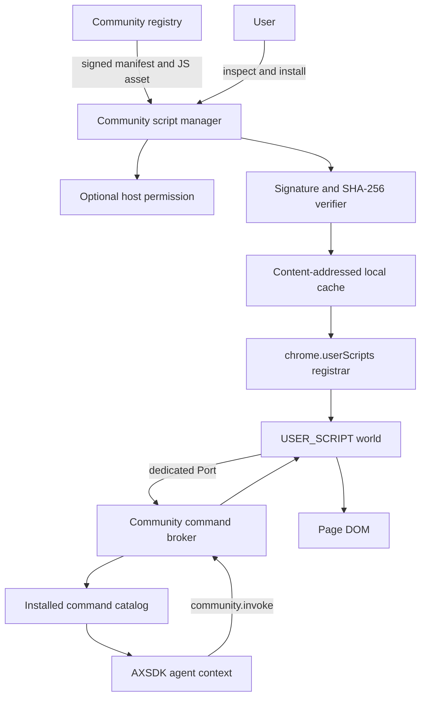
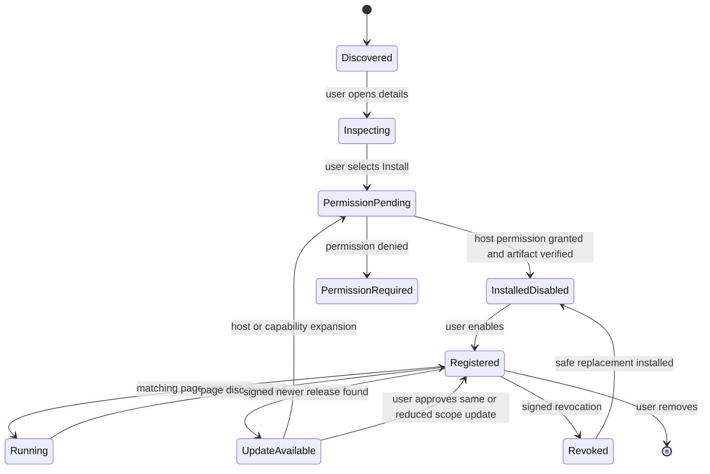

# AXSDK Community Script Architecture

**Status:** Proposed target architecture  
**Date:** 2026-08-18  
**Decision owner:** AXSDK product and extension teams  
**Policy basis:** Chrome Manifest V3 Remote Hosted Code rules and `chrome.userScripts`
**Companion policy review:** [`CWS_COMMUNITY_SCRIPT_EXECUTION_REVIEW.md`](CWS_COMMUNITY_SCRIPT_EXECUTION_REVIEW.md)

## 1. Product charter

This sentence is the product boundary and MUST remain verbatim in product, engineering, privacy, and Chrome Web Store material:

> **AXSDK installs, manages, and runs user-selected community web-automation scripts on websites explicitly authorized by the user.**

Korean working translation:

> **AXSDK는 사용자가 직접 선택한 커뮤니티 웹 자동화 스크립트를, 사용자가 명시적으로 허용한 웹사이트에서 설치·관리·실행한다.**

Every shipped feature must support that purpose. Shopping, quote assistance, page reading, and form assistance are scripts installed under this platform purpose; they are not unrelated first-party extension purposes. The extension core owns script discovery, installation, permission, integrity, execution isolation, command routing, consent, updates, and removal.

## 2. Decisions

The machine-checked launch contract is [`community/release-policy.json`](community/release-policy.json). `npm run check:community-policy` validates it, and every `build:cws` invocation runs that check first.

### 2.1 Dynamic execution channel

Dynamic community code executes only through `chrome.userScripts` in the `USER_SCRIPT` world.

The CWS build MUST NOT execute downloaded Lua, JavaScript, WebAssembly, flow programs, or generic command programs in:

- the extension service worker;
- the offscreen session worker;
- Fengari or another extension-side interpreter;
- `eval`, `Function`, or an equivalent evaluator;
- `chrome.scripting.executeScript` as an arbitrary-code substitute;
- `chrome.debugger Runtime.evaluate` as a user-script substitute; or
- a sandbox with a general privileged command bridge.

### 2.2 Distribution language

The registry distributes JavaScript artifacts. `chrome.userScripts` is the browser execution boundary.

Lua may remain an authoring language only when a deterministic pre-publication pipeline converts it to the exact JavaScript artifact before review. The converted artifact is reviewed, signed, distributed, and executed as JavaScript; no Lua source or runtime interpreter is part of the community release.

### 2.3 User selection

A script becomes executable only after a user decision tied to an exact release manifest, artifact digest, host set, and capability set.

The model may recommend an already published script. It MUST NOT install, update, enable, expand permissions, or confirm installation for the user.

### 2.4 Trust tier

The initial CWS release runs only registry-reviewed, registry-signed community scripts. Arbitrary URL import, local source editing, and unsigned scripts belong to a separate developer build and are absent from the CWS artifact.

Community-authored does not mean unreviewed. `USER_SCRIPT` code can directly read and change the DOM, so the extension cannot technically confine every page effect behind its broker. Registry review, transparent source, host scoping, script signatures, and explicit installation are therefore part of the security boundary.

### 2.5 Existing C3 package

The content-addressed C3 package remains the source for extension-core and built-in migration logic. It is not the dynamic community channel. Community artifacts use a separate signed registry and are executed only through `chrome.userScripts`.

## 3. Non-goals

The first production iteration does not provide:

- arbitrary script URLs;
- a general Lua interpreter for downloaded source;
- automatic model-driven script installation;
- automatic capability expansion;
- cross-origin network access for community scripts;
- background autorun with mutation effects;
- order placement or payment execution;
- a generic debugger/CDP bridge;
- a generic RPC/automation instruction language; or
- compatibility with every existing AXSDK Lua module.

## 4. System context



### 4.1 Repository ownership

| Area | Repository/package | Responsibility |
|---|---|---|
| Registry source and script build | `axsdk-sites` initially | Script manifests, reviewed sources, artifact build, index, test fixtures |
| User Scripts runtime and UI | `axsdk-sdk-js/packages/axsdk-extension-cdp` | Install state, verification, permission, registration, ports, management UI |
| Agent catalog/context contract | `axsdk-sdk-js/packages/axsdk-core` | Installed command catalog as data and one fixed invoke contract |
| Server session/tool support | AXSDK backend package | Fixed `community.invoke` tool and context ingestion, not script installation |
| CWS artifact/release | CDP extension + sites release tooling | CWS profile, exact-artifact evidence, removal of dev execution paths |

## 5. Script release contract

### 5.1 Canonical manifest

A release is immutable. The registry signs canonical JSON bytes using RFC 8785 JSON Canonicalization Scheme. The initial signature algorithm is Ed25519. The packaged extension contains the registry root public key and supported key IDs.

```ts
interface CommunityScriptReleaseV1 {
  schemaVersion: 1;
  script: {
    id: string;                 // stable lowercase slug
    name: string;
    summary: string;
    version: string;            // semantic version
    publisherId: string;
    sourceUrl: string;          // human-review source, not execution URL
    license: string;
  };
  artifact: {
    ref: `sha256:${string}`;
    bytes: number;
    mediaType: "application/javascript";
  };
  execution: {
    matches: string[];          // Chrome match patterns
    runAt: "document_idle";
    world: "USER_SCRIPT";
    autorun: false;
    minimumChromeVersion: 138;
    minimumRuntimeVersion: 1;
  };
  commands: CommunityCommandV1[];
  disclosures: {
    pageData: string[];
    localStorage: string[];
    backendData: string[];
    modelData: string[];
  };
  release: {
    publishedAt: string;
    changelog: string;
    previousVersion?: string;
  };
  signatures: {
    keyId: string;
    algorithm: "Ed25519";
    value: string;              // base64url signature over manifest without signatures
  }[];
}
```

### 5.2 Command contract

```ts
type CommunityEffect =
  | "read"
  | "page_write"
  | "external_send"
  | "cart_mutation";

interface CommunityCommandV1 {
  name: string;                 // unique inside the script
  description: string;
  inputSchema: JsonSchemaSubset;
  outputSchema?: JsonSchemaSubset;
  effect: CommunityEffect;
  requiresUserConfirmation: boolean;
}
```

The registry rejects commands that declare payment, order placement, credential extraction, CAPTCHA bypass, security-control bypass, or an unbounded generic operation.

`inputSchema` is a bounded JSON Schema subset: objects, arrays, strings, numbers, booleans, enums, length/range limits, and required fields. It excludes remote references, executable formats, regexes with unbounded cost, and custom evaluators.

### 5.3 Artifact contract

The artifact is UTF-8 JavaScript addressed by SHA-256. It is not a module import and contains no remote import. It uses the runtime object exposed by the packaged bootstrap:

```js
AXSDK.register({
  commands: {
    read_product: async (args, context) => {
      const title = document.querySelector("h1")?.textContent?.trim() ?? null;
      return { title };
    }
  }
});
```

The artifact MUST NOT contain:

- `eval` or `Function`;
- dynamic `import()`;
- `<script src>` insertion;
- WebAssembly compilation;
- browser extension API access outside the exposed user-script messaging API;
- hidden/undeclared command names;
- source-map URLs outside the immutable registry; or
- code generated after registry review.

## 6. Registry protocol

The registry is data and immutable artifact delivery; it does not select scripts for the user.

```text
GET /v1/community/index.json
GET /v1/community/scripts/{scriptId}/{version}/manifest.json
GET /v1/community/assets/{sha256}.js
GET /v1/community/revocations.json
```

### 6.1 Index

The index carries discovery metadata and signed manifest URLs. Search, category, featured status, and compatibility are data. The index does not contain executable source or executable flow definitions.

### 6.2 Release verification

Installation verifies, in order:

1. schema version and exact allowed keys;
2. script and version identifiers;
3. canonical manifest signature against a packaged trust root;
4. artifact URL derived from the digest, never supplied arbitrarily;
5. artifact byte count;
6. artifact SHA-256;
7. no unreferenced secondary code;
8. runtime/Chrome compatibility;
9. host patterns and command schemas;
10. revocation state; and
11. user approval for the exact digest, hosts, commands, effects, and disclosures.

Any failure preserves the previously installed release and registers nothing new.

### 6.3 Signing

The first release uses a registry countersignature as the CWS trust root. The registry records publisher identity and source provenance. Publisher signatures may be added without changing the extension trust model, but the extension never trusts an unknown publisher key merely because a remote index names it.

Root-key rotation requires an extension package update carrying both old and new keys during an overlap period.

## 7. Local persistence

Metadata and artifact bytes have different storage lifecycles.

### 7.1 Metadata store

`chrome.storage.local["axsdk:community-scripts"]`:

```ts
interface InstalledCommunityStateV1 {
  version: 1;
  scripts: Record<string, {
    version: string;
    manifestRef: `sha256:${string}`;
    artifactRef: `sha256:${string}`;
    enabled: boolean;
    approvedMatches: string[];
    approvedCommandsDigest: `sha256:${string}`;
    approvedEffects: CommunityEffect[];
    installedAt: string;
    updatedAt: string;
    registrationId: string;
    worldId: string;
    tokenId: string;
    status: "ready" | "permission_required" | "user_scripts_disabled" | "revoked" | "error";
    lastError?: string;
  }>;
}
```

Only metadata is stored in this value. It is bounded and versioned.

### 7.2 Artifact cache

Verified JavaScript bytes and canonical manifests are stored in IndexedDB under their content digest. The cache supports offline startup and extension-update re-registration. The cache never mutates a digest entry; replacement creates a new entry.

### 7.3 Capability token

Each installed release receives a random 256-bit capability token. The raw token is extension-owned state, is never logged or included in registry data, and rotates on update, reinstall, revocation, or permission expansion.

The packaged bootstrap holds the token in a closure and opens a dedicated port. The token identifies the installed release to the broker. It does not make malicious code safe; it prevents one isolated script world from trivially claiming another script’s approved broker capabilities.

## 8. Installation and lifecycle state machine



### 8.1 User Scripts availability

The manager checks `chrome.userScripts.getScripts()` during onboarding and before install/enable. Failure yields `user_scripts_disabled`; it never reports installation success.

The CWS build targets Chrome 138+ so onboarding can instruct the user to enable the extension-specific **Allow User Scripts** toggle rather than global Developer Mode.

### 8.2 Optional host permission

The CWS manifest moves web origins to `optional_host_permissions`. Installation requests only the union of the selected script’s `matches`. The approval UI shows each origin before `chrome.permissions.request()`.

Removing or disabling the last script using an origin offers to revoke that origin. Revocation immediately unregisters affected scripts before permission removal.

### 8.3 Registration reconciliation

`chrome.userScripts` registrations survive ordinary worker restarts but are cleared on extension update. On every service-worker start and `runtime.onInstalled` update event, the registrar reconciles:

```text
approved enabled state
  vs cached verified artifacts
  vs granted host permissions
  vs chrome.userScripts.getScripts()
```

It creates missing registrations, updates changed registrations, removes orphaned registrations, and refuses entries whose cached bytes no longer hash correctly.

## 9. User-script runtime

### 9.1 One isolated world per script release

Each enabled release gets a stable, non-reserved `worldId` derived from script ID and artifact digest. The registrar configures the world with messaging enabled and a restrictive CSP.

The registration uses ordered sources:

1. packaged `community-script-bootstrap.js`;
2. extension-generated release initialization containing registration ID and capability token;
3. verified community JavaScript artifact.

All execute in `USER_SCRIPT`, never `MAIN`.

### 9.2 Bootstrap API

The bootstrap exposes one frozen object:

```ts
interface AXSDKCommunityRuntime {
  register(definition: {
    commands: Record<string, (args: unknown, context: CommandContext) => Promise<unknown>>;
  }): void;
  storage: {
    get(key: string): Promise<unknown>;
    set(key: string, value: unknown): Promise<void>;
    delete(key: string): Promise<void>;
  };
  consent: {
    request(effect: CommunityEffect, summary: string): Promise<boolean>;
  };
}
```

V1 does not expose cross-origin network or generic navigation through the broker. Ordinary DOM access and same-page navigation remain native user-script behavior and are disclosed as page access.

### 9.3 Port handshake

The bootstrap opens `chrome.runtime.connect({name: "axsdk-community-v1"})`. The service worker receives it through `runtime.onUserScriptConnect`.

Handshake:

```json
{
  "type": "hello",
  "protocol": 1,
  "registrationId": "community:script:version:digest",
  "token": "<opaque capability token>",
  "commandsDigest": "sha256:..."
}
```

The broker validates token, enabled state, current artifact, tab/frame URL, host permission, and command digest. The port is then bound to `{scriptId, version, tabId, frameId, documentId}`. No message-supplied script identity is trusted after binding.

## 10. Command and broker protocol

### 10.1 Agent-visible catalog

The agent receives data describing only installed, enabled, currently connected commands:

```json
{
  "script_id": "amazon-price-helper",
  "version": "1.4.2",
  "command": "read_product",
  "description": "Read the title and current price from the open product page.",
  "input_schema": {"type": "object", "properties": {}, "additionalProperties": false},
  "effect": "read"
}
```

This catalog is context data, not an executable flow. The model cannot see catalog entries for uninstalled, disabled, disconnected, or host-mismatched scripts.

### 10.2 One fixed invoke tool

The platform exposes one packaged tool contract:

```ts
community.invoke({
  script_id: string,
  version: string,
  command: string,
  arguments: unknown
})
```

The model cannot call install, update, enable, permission, or approval operations. `community.invoke` validates the selected catalog entry and forwards a command only to a matching bound port.

### 10.3 Invocation protocol

Extension to user script:

```json
{
  "type": "command.invoke",
  "requestId": "...",
  "command": "read_product",
  "arguments": {}
}
```

User script to extension:

```json
{
  "type": "command.result",
  "requestId": "...",
  "ok": true,
  "value": {"title": "...", "price": "..."}
}
```

Every request has a deadline, output byte limit, JSON-depth limit, and one terminal result. Port closure yields a classified `page_unavailable` result; it never retries a mutation automatically.

### 10.4 Effects and consent

The fixed invoker consults the signed command manifest before invocation:

- `read`: no additional confirmation after script installation;
- `page_write`: visible activity indicator;
- `external_send`: per-invocation confirmation;
- `cart_mutation`: per-invocation confirmation and site confirmation afterward.

Purchase/order placement is not a valid community effect in V1.

This consent gate protects agent-driven command invocation. It does not technically prevent arbitrary code in a user script from directly mutating the DOM. The initial CWS registry therefore requires source review and rejects scripts that act outside registered commands or perform hidden autorun effects. The product MUST describe registry review as a trust control, not claim browser-enforced confinement that does not exist.

## 11. Script management UI

The default options page becomes a consumer script manager rather than a developer console.

### 11.1 Primary surfaces

1. **Onboarding**
   - explain registry access mode; sign in only if the chosen registry contract requires it;
   - check Allow User Scripts;
   - explain site permissions;
   - show readiness.
2. **Discover**
   - registry search and categories;
   - publisher and review status;
   - compatibility and host summary.
3. **Script details**
   - source, version, hash, changelog;
   - hosts, commands, effects, and data disclosures;
   - Install/Update/Remove.
4. **Installed scripts**
   - enabled state and current status;
   - granted hosts;
   - update/revocation/error state;
   - permission revocation.
5. **Activity**
   - which script ran which command on which host;
   - effect and confirmation outcome;
   - bounded error without script source or secrets.

### 11.2 Developer surfaces

Raw Lua, flows, recording, remote-source switches, arbitrary script import, and debug stores move to a separately compiled developer build. They are absent—not merely hidden with CSS—from the CWS artifact.

## 12. Update, rollback, and revocation

### 12.1 Updates

Every code update requires explicit user approval, including updates that keep the same hosts and capabilities. Automatic code updates are excluded.

The update UI displays:

- old/new version and digest;
- source/changelog link;
- host additions/removals;
- command additions/removals;
- effect changes;
- data disclosure changes; and
- publisher/registry signature state.

Any expansion requires a new host permission and explicit approval. Installation is atomic: cache and verify the new release, register it, confirm the registration, then retire the old one. Failure retains the prior release.

### 12.2 Revocation

A signed revocation list may identify a script, release, publisher key, or registry key. A revoked registration is disabled and unregistered before UI notification. Previously granted host permissions are not silently retained when no enabled script needs them.

Offline startup uses the last verified revocation state and labels it with its checked-at time. The registry cannot revoke offline code instantly; documentation must state this operational limit.

## 13. CWS build profiles

Two build profiles are explicit, not runtime toggles.

### 13.1 `cws`

Contains:

- `chrome.userScripts` manager and reviewed registry trust roots;
- consumer onboarding and script management UI;
- package-local core logic;
- exact-artifact release evidence.

Does not contain:

- remote Lua/flow loaders;
- raw Lua execution;
- Lua recorder/editor;
- arbitrary URL imports;
- generic debugger execution for community code;
- unsigned registry trust; or
- developer storage editors.

### 13.2 `developer`

May contain local Lua, recording, raw stores, test registry, and diagnostic tools. Its manifest name, profile, and build artifact are distinct. A developer artifact is never accepted by the CWS release command.

## 14. Observability

Structured events are metadata-only:

```ts
type CommunityEvent =
  | { type: "install"; scriptId: string; version: string; result: string }
  | { type: "permission"; scriptId: string; origins: string[]; result: string }
  | { type: "register"; registrationId: string; result: string }
  | { type: "invoke"; scriptId: string; command: string; effect: CommunityEffect; result: string; elapsedMs: number }
  | { type: "update" | "revoke" | "remove"; scriptId: string; version: string; result: string };
```

Events exclude artifact source, command arguments/results by default, capability tokens, credentials, page text, form data, and chat content. Debug export requires explicit user action and redaction.

## 15. Failure contracts

| Failure | Required behavior |
|---|---|
| User Scripts disabled | Refuse enable/run; show exact Allow User Scripts instructions |
| Host permission denied | Keep installed but disabled; register nothing |
| Signature/hash mismatch | Refuse release; preserve current version |
| Registry offline | Installed cached scripts continue; discovery/update reports offline |
| Artifact absent after extension update | Disable affected script; never fetch-and-run without verification |
| Registration missing | Reconcile from verified cache |
| Port absent on matching page | Return `page_unavailable`; do not navigate or retry mutation |
| Command/schema mismatch | Return `command_unavailable` or `invalid_arguments` |
| Consent denied | Return `cancelled`; send no invocation |
| Script exception | Return bounded `script_error`; keep worker alive |
| Output too large/deep | Return `invalid_result`; discard payload |
| Revoked release | Unregister, disable, notify, and offer safe replacement |

## 16. Security invariants

1. No remote artifact executes before an explicit user installation decision.
2. Only `chrome.userScripts` executes community artifact bytes.
3. Artifact URLs are derived from verified SHA-256 references.
4. The registry index cannot expand trust roots.
5. Script installation and model command invocation are separate authorities.
6. The model cannot install, update, enable, or grant permissions.
7. The broker accepts only installed-release capability tokens and fixed message schemas.
8. Community code never receives a generic extension/debugger/Lua executor.
9. Host permission is no broader than installed enabled scripts require.
10. Capability/host expansion always requires a new user decision.
11. Previous versions survive failed updates.
12. CWS and developer execution paths are separate build products.
13. Purchase/order placement is absent from V1.
14. Privacy disclosures describe direct DOM authority honestly.

## 17. Open policy and product decisions

The dynamic execution and approval contract is locked in `community/release-policy.json`: converted Lua output is a JavaScript artifact, and install, enable, update, host expansion, and capability expansion each require explicit user approval.

The remaining gates are:

1. Final registry review policy and reviewer ownership.
2. Consumer identity/account contract.
3. Whether the agent conversation experience remains in V1 or scripts are first launched from the manager UI.
4. Final set of V1 broker operations; cross-origin network is currently excluded.
5. Migration order for existing Lua storefront and quote scripts.

None of these decisions permits downloaded Lua execution in an extension worker or automatic lifecycle approval.

## 18. Definition of done

The architecture is delivered when:

- the product and listing use the charter sentence verbatim;
- the CWS manifest uses `userScripts` and optional per-script hosts;
- a fresh consumer can enable User Scripts, install a reviewed script, grant one host, run one command, disable it, and remove it;
- every installed artifact is signature/size/hash verified;
- model invocation reaches only installed commands through the fixed `community.invoke` contract;
- denied consent performs no command invocation;
- extension update re-registers scripts from verified local cache;
- update, rollback, and revocation paths are proven;
- the CWS artifact contains no dynamic Lua/flow loader or developer execution surface;
- exact-archive tests prove package identity and dynamic execution occurs only through `chrome.userScripts`; and
- Chrome Web Store policy, privacy, permission, and single-purpose material match the implementation.

## 19. Policy references

- [Chrome Web Store Manifest V3 requirements](https://developer.chrome.com/docs/webstore/program-policies/mv3-requirements)
- [Deal with remote hosted code violations](https://developer.chrome.com/docs/extensions/develop/migrate/remote-hosted-code)
- [`chrome.userScripts` API](https://developer.chrome.com/docs/extensions/reference/api/userScripts)
- [Chrome Web Store API use policy](https://developer.chrome.com/docs/webstore/program-policies/api-use)
