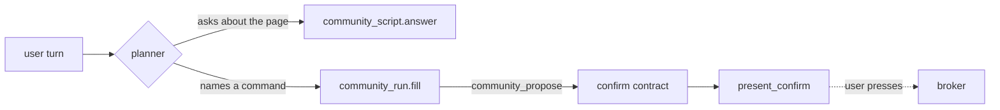

# Reaching a Community Command From a Turn — Design

How a user's sentence becomes one community-script invocation, given what the platform actually
projects into a flow. Written after the measurement in
[`COMMUNITY_SCRIPT_IMPLEMENTATION_PLAN.md`](COMMUNITY_SCRIPT_IMPLEMENTATION_PLAN.md) §Phase 7 closed
off the shape that was being built.

> **WITHDRAWN 2026-08-23 — kept for the reasoning, not the recommendation.** The constraint below is
> real as measured, and the cause was not what it looked like: `contextAccess` on a `flowTools:` entry
> was being dropped by the adapter (runtime `5e4022e`), and a context needs BOTH the node's
> `inputSelector` and the tool's `contextAccess` — we had written one. With both, a deterministic node
> reads the catalog directly, which is option **A**, and it works today. So option D — a second router
> intent to keep the planner from having to choose between answering and proposing — was never built:
> the classifier makes that decision without a model at all.
>
> What is worth keeping from this document: §1's measurement method, and the reason option C was
> refused (a field that means two things means nothing). See
> [`COMMUNITY_SCRIPT_IMPLEMENTATION_PLAN.md`](COMMUNITY_SCRIPT_IMPLEMENTATION_PLAN.md) §Phase 7 for
> what shipped.

---

## 1. The constraint, measured

A `kind: runtime` tool receives **only** the flow-state fields its `parameters.properties` declare.
A **context is not one of them**. Measured with a one-run diagnostic inside the classifier:

```text
catalog=0 text=51 keys=requestText
```

`requestText` crossed. `contexts.community` was **absent from the argument object entirely** — not
empty. The contract node selected it, `check:flows` confirmed the tool declared the same name, and the
runtime still did not project it.

Two consequences:

- **Contexts reach prompts, not tool arguments.** The `answer` terminal reads `contexts.community`
  live and answers from it; a contract node cannot.
- **The projection is not ours to change.** `inputSelector` appears nowhere in `axsdk-core`,
  `axsdk-extension-cdp`, or any local package — only in flow YAML and the authoring docs. The flow
  engine applies it server-side. A "fix it in core" option does not exist.

## 2. What the flow can read at entry

| Source | Contract node | Model node / terminal |
|---|---|---|
| `requestText` | ✅ measured | ✅ |
| `userMessages` | ✅ (declared as a property) | ✅ |
| `contexts.*` | ❌ **measured absent** | ✅ |
| State a previous node published | ✅ | ✅ |

At flow entry the last row is empty, so a deterministic first node has `requestText` and nothing else.
The catalog — the only place the installed command names exist — cannot reach it.

## 3. Options

### A. Platform request: project declared contexts into runtime tool arguments

Smallest change conceptually, and it would let every future deterministic node read a context. It is a
**platform request**, not work this repository can do, and the feature waits on it.

### B. Platform request: publish `community.catalog` / `community.invoke` ops

Channel D from the live-loop design. Removes the proposal dance entirely — the model calls the command
and the broker gates it. Also a platform request, and a larger one.

### C. Put the catalog in the user's message text

The session worker holds both the text and the catalog at `sendMessage` time, so it could prepend the
block. Rejected: it corrupts `requestText`, which the planner, the memory hook and every other flow
read as *what the user said*. A field that means two things means neither.

### D. **Let the planner decide the intent, and give the proposal its own one** ← recommended

The planner already classifies intent every turn; that is its job. Split what is currently one intent
in two:

| Intent | Entry | For |
|---|---|---|
| `community_script` | `answer` terminal | "what does this page say", "which scripts are here" |
| `community_run` | `fill` model node | "run *X* with …" |

`community_run`'s entry node has **no `answer` branch**, so the prose escape stays closed by the graph
— which was the whole point of the deterministic pre-pass. The model node reads `contexts.community`
as a **prompt** selector, which works, and its only job is filling argument values from the sentence.

**Why this is not a return to the failed shape.** Four formulations failed while one node had to choose
*between* answering and proposing. Here the choice is the planner's — a different model call, doing
the thing it is built for and already doing well for fourteen other intents — and the node it routes
to cannot answer at all.

## 4. Recommended design



- `community_script` keeps its terminal and its examples, unchanged and already live.
- `community_run` is a new intent whose examples are imperative and name a command.
- `fill` selects `contexts.community` (prompt) and `requestText`; `allowedTools: [community_propose]`;
  `next: { confirm, error }`; fallbacks name **branch keys**, never nodes.
- `confirm` and `present_confirm` are unchanged — built, tested, mutation-checked.
- `AX_RPC_COMMUNITY.classify` **stays**, unused by the flow for now, because it is the deterministic
  half of option A and is already tested. It is dead code the moment option A is refused; the plan
  says so, and `dead:lua` will say so too if the tool is removed.

### What stops a wrong proposal

The button is a request, not an approval, so a mis-proposal costs a rendered button nobody presses.
Behind it, unchanged: the broker re-derives installed, enabled, not revoked, version, declared command,
schema-valid arguments, approved effect and consent. A proposal the model invents for a command that
does not exist is refused there, and the user sees a classified reason.

## 5. Test plan

**RED first, in this order.**

1. `check:flows` — `community_run` exists, its entry names a real node, and that node has **no
   `answer` branch**; its fallbacks name branch keys of its own `next` map.
2. `check:flows` — the two community intents have disjoint examples, so the planner is not asked to
   split a tie between them.
3. `check:flows` — `community_run.fill` selects `contexts.community` (prompt) and offers only
   `community_propose`; the renderer stays unoffered (the existing gate already covers this).
4. Live — *"run ping_api from the community script on this page"* reaches `community_run.fill` and
   renders a confirm widget. Verified from the **tool trace**, not the prose, because prose is the
   model's.
5. Live — *"이 페이지 뭐라고 쓰여 있어?"* still reaches `community_script.answer`. Regression, run every
   time.
6. Live — the widget's button is pressed in a real browser and the broker records the invocation.
7. Mutation — restoring an `answer` branch on `fill` must turn a test red.

**Probe discipline.** Never probe with a command whose name collides with another intent. `remember`
routed to the memory flow and cost two live runs before the trace showed it. `ping_api` is safe.

## 6. Risks

| Risk | Mitigation |
|---|---|
| The planner picks `community_script` for an imperative sentence | Disjoint examples, and the trace is the check — not the reply |
| A second community intent crowds the planner's prompt | Two intents, both narrow; the router carries eight today |
| The model fills a wrong argument value | The button shows the values; the user reads them before pressing |
| `classify` becomes dead code | Recorded as conditional on option A; `dead:lua` enforces the outcome either way |

## 7. What this does not solve

- **Argument-taking commands still need a model** to read values out of the sentence. That is the part
  a model is good at, and the button makes a wrong value visible before it costs anything.
- **Option A remains the better end state**: a context readable by a deterministic node would remove
  the planner from the decision entirely. This design does not block it — `classify` is already
  written and tested for the day it lands.
