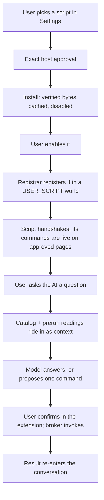

# Community Script Live Loop — Design and TDD Plan

The user designates a community user script, the extension loads it together with the flow that can
reach it, and the user then asks the AI a question that the script answers on the real page.

This document is the design and the ordered plan for that loop. It builds on
[`COMMUNITY_SCRIPT_ARCHITECTURE.md`](COMMUNITY_SCRIPT_ARCHITECTURE.md) and continues
[`COMMUNITY_SCRIPT_IMPLEMENTATION_PLAN.md`](COMMUNITY_SCRIPT_IMPLEMENTATION_PLAN.md) at Phase 4. The
locked launch contract is [`community/release-policy.json`](community/release-policy.json).

---

## 1. The journey being built



Four things must be true at the end, and each is a separate acceptance:

1. The user designated the script; nothing installed itself.
2. The script is running in its own `USER_SCRIPT` world on approved hosts only.
3. The flow that can reach it is the **packaged, reviewed** one; the script contributed data, not logic.
4. One real `send` turn produced an answer that came from the script reading the real page.

---

## 2. Fixed constraints

These follow from the locked policy and the CWS review; the design exists to satisfy them.

- Community code executes **only** through `chrome.userScripts` in a `USER_SCRIPT` world.
- **A flow from a non-packaged source grants nothing.** A release may ship a flow fragment, but only
  a packaged flow may grant `rpc.allow` ops, `net:` egress, `memory.*`, or a tool surface beyond
  `community.invoke` over its own declared commands. The boundary is capability, not provenance — see
  §9.1, which revises an earlier and wrong prohibition.
- **No remote code in the extension's own realm.** No script-supplied AX handler or worker module.
- The model may propose a command; it may not install, enable, grant a host, or approve a consent.
- `read` never mutates. `page_write`, `external_send`, and `cart_mutation` need a per-invocation
  confirmation the extension owns.
- A mutation with an uncertain outcome is reported once and never replayed.
- No purchase, order-placement, or payment capability exists in the vocabulary.

---

## 3. Measured facts this design rests on

Everything below was read in this working tree, not recalled. Each is load-bearing.

| Fact | Where | Consequence |
|---|---|---|
| The client supplies exactly two context values, `sites` and `env`; `env` is `formatEnvPlainText(envStore.env)` | `axsdk-core/src/contextvalues.ts` (`BackendContextKey`, `buildSessionContexts`, `buildMessageContexts`) | The host already has a channel for putting text in front of the model with no platform change |
| A context value is selected by a node as `contexts.<name>`, and its value is "`contexts:` defaults plus client session context overrides" | `FLOWS.md` §6, §11 | The catalog can be a first-class context the flow selects deterministically |
| Widget actions are `link`, `message`, `event`, `lua`, `ax`; `lua`/`ax` are gated by `widgets.commandActions`, `true` allowing only the `AX_widget_*` convention or a `string[]` exact allowlist | `../axsdk-sdk-js/docs/widgets.md` | A confirmed invocation can be a reviewed button, with no new platform op |
| The CDP extension owns an AX handler with an allowlist relayed over CDP to the service worker | `axsdk-extension-cdp/src/content/ax-handler.ts`, `src/ops/ax-tools.ts` (`AX_CDP_COMMANDS`) | `AX_widget_community_invoke` is a small in-repo addition, not a platform request |
| `buildCdpSdkConfig` sets no `widgets` key | `axsdk-extension-cdp/src/shared/sdk-config.ts` | `ax` widget actions are OFF today; enabling them is an explicit, narrow config change |
| `rpc.allow`'s op list is "mirrored from a live `GET /axsdk/v2/lua/ops`" | `tools/rpc-allow.mjs` header, `../axsdk-sdk-js/docs/rpc_lua_implementation.md` §4.1 | A new `community.*` **wire op** is a platform dependency, not something this repo can ship alone |
| Host ops exist (`tabs.list`/`create`/`close`/`activate`) and are forwarded by name, but **no flow grants one** | `axsdk-extension-cdp/src/offscreen/session-worker.ts` (`TAB_OPS`), `src/ops/table.ts` (`forwardedOpNames`), and a repo-wide search of `_common/flows.yaml` + `_common/rpc` finding zero `tabs.*` | Whether a flow may grant a host op is **unmeasured**; the design must not assume it |
| An unregistered op answers `command_unresolved` from the client | `rpc_lua_implementation.md` §4.1 result table | A missing op is diagnosable, and a probe is cheap |
| Registration ids must be stable across artifact changes, or an update orphans the old registration | `src/community/user-scripts.ts` and its test | Already fixed in Phase 1; the registrar depends on it |

**The pivotal one:** the AI cannot call the script directly without a wire op the platform publishes.
So the loop is built on channels the client already owns, and the direct-tool path is designed but
sequenced behind one probe and one platform request.

---

## 4. Architecture: four channels

### 4.1 Channel A — the catalog, as context (no platform change)

The extension renders installed commands for the active tab into one text block and supplies it as a
session/message context value. A deterministic node selects it; the model reads words, never JSON.

```text
Installed community scripts on this page
- fixture.read-page 1.0.0 (axsdk-fixtures, reviewed by axsdk-fixture-reviewer)
  - read_heading — Read the visible H1 text from the open fixture page. [read]
```

Rules the renderer owns:

- only enabled, non-revoked releases whose approved matches cover the tab's URL;
- effect labelled on every command, because the model's proposal must be reviewable;
- a hard character budget with a truncation note, so the prompt cannot grow with installs;
- no capability token, no artifact digest, no source code, no raw schema JSON.

**Preferred shape:** a third `BackendContextKey`, `community`, beside `sites` and `env`. It is one
name, one builder, one test, and it keeps the catalog out of the `env` blob that already carries
location. **Fallback if the backend rejects an unknown context name:** carry it as an `env` entry,
which is already a `Record<string, unknown>` rendered as plain text. §9 names the measurement.

### 4.2 Channel B — prerun readings, so a question can be answered in one turn

A `read` command with no required arguments is the common case and the reason the user installed the
script. Waiting for a button to read a heading is worse than useless.

Before the turn is sent, the extension invokes those commands once and puts their results in the same
context block:

```text
Readings from this page
- fixture.read-page/read_heading → {"heading":"AXSDK community fixture"}
```

Bounds, all enforced by the preflight and not by hope:

| Bound | Value | Reason |
|---|---|---|
| Commands per turn | ≤ 3 | The prompt and the latency are the user's, not the catalog's |
| Effects eligible | `read` only | A prerun the user did not ask for must not change anything |
| Arguments | none required | An argument the model has not supplied cannot be invented |
| Total deadline | 1500 ms | A turn must not wait on a page script; a timeout is reported as `stale`, not retried |
| Cache key | `(documentId, scriptId, version, commandsDigest)` | A reload re-reads; an unchanged document does not |
| Failure | classified line in the block | "the script did not answer" is an answer the model can relay |

A command that is not eligible for prerun is still listed in the catalog, so the model can propose it.

### 4.3 Channel C — confirmed invocation, as a reviewed widget action

For an argument-taking read, and for every non-`read` effect, the model proposes and the **user**
confirms. The flow renders a widget whose button carries
`{ type: 'ax', command: 'AX_widget_community_invoke', args: { script_id, version, command, arguments } }`.

The chain, all existing mechanisms:

1. core dispatches the gated `ax` action to the session worker's AX handler;
2. `AX_CDP_COMMANDS` accepts exactly `AX_widget_community_invoke` and relays it to the service worker;
3. the service worker re-validates everything against installed state — the model's args are input,
   not authority — asks for consent when the effect requires it, and invokes through the broker;
4. the result comes back as a new turn (`AXSDK.sendMessage`) or a rendered result widget.

`widgets.commandActions` is set to the **exact allowlist** `['AX_widget_community_invoke']`. Not `true`:
that would open every `AX_widget_*` name a widget could invent.

What the service worker re-derives rather than trusts: the release is installed, enabled, not revoked,
its version matches, the command is declared, the arguments validate against the installed manifest
schema, the tab's URL is inside the approved matches, and the effect's consent has been given.

### 4.4 Channel D — the direct tool call (target, one platform dependency)

Two wire ops, `community.catalog` (read) and `community.invoke`, implemented in the service-worker
realm and forwarded from the session worker exactly as `TAB_OPS` are today. Then one runtime flow tool
(`_common/rpc/75_rpc_community.lua`, `rpc.allow: [community.catalog, community.invoke]`) makes the
model's proposal and the invocation one turn instead of two.

This is the better product and the smaller flow. It is sequenced last because it cannot ship until the
platform publishes the ops (§9). Channels A–C are not scaffolding for it: the catalog renderer, the
validation, the consent gate, and the broker are the same code either way — only the transport changes.

---

## 5. Components

### 5.1 `axsdk-extension-cdp` — new

| File | Responsibility |
|---|---|
| `src/community/permissions.ts` | Match patterns → origin patterns; `chrome.permissions.request/remove/contains`; refuses anything broader than the release declares |
| `src/community/registrar.ts` | Desired registrations as a pure function of (installed state, granted origins, revocations, compatibility); reconcile against `chrome.userScripts.getScripts()`; create, update, remove orphans |
| `src/community/broker.ts` | `onUserScriptConnect` handshake binding, per-document port registry, invoke with deadline and concurrency caps, consent gate, no mutation retry |
| `src/community/catalog.ts` | The context text block: catalog + prerun readings, budgeted and token-free |
| `src/community/preflight.ts` | Which reads are eligible, the per-document cache, the 1500 ms bound |
| `src/community/artifact-store-idb.ts` | The IndexedDB `CommunityArtifactStore` behind the Phase 3 interface |
| `src/community/trust-roots.ts` | Loads the packaged `community-trust-roots.json` |
| `src/options/community/*` | Discover, details, install, enable/disable, update, remove, activity |

### 5.2 `axsdk-extension-cdp` — changed

| File | Change |
|---|---|
| `src/manifest.json` | `optional_host_permissions` for community hosts; keep `userScripts`; keep the Chrome 138 floor |
| `src/background/service-worker.ts` | Reconcile at module startup, `onInstalled`, `permissions.onAdded/onRemoved`, and on every state change; own the broker and the preflight |
| `src/ops/ax-tools.ts` | `AX_widget_community_invoke` in `AX_CDP_COMMANDS` |
| `src/shared/sdk-config.ts` | `widgets: { commandActions: ['AX_widget_community_invoke'] }` |
| `src/shared/runtime-messages.ts` | Options ↔ worker install/enable/disable/update/remove/list; worker ↔ session-worker preflight and invoke |
| `scripts/copy-static.mjs` | Copy the trust roots beside the bootstrap |

### 5.3 `axsdk-core` — changed

| File | Change |
|---|---|
| `src/contextvalues.ts` | `community` as a third `BackendContextKey`, built from a host-supplied value; `buildSessionContexts` and `buildMessageContexts` carry it |

### 5.4 `axsdk-sites` — changed

| File | Change |
|---|---|
| `_common/flows.yaml` | One `community_script` flow and its planner route; `contexts.community` declared; the confirm widget rendered by a deterministic node |
| `_common/rpc/74_rpc_community.lua` | Pure rendering and reply classification for that flow — no `dom`/`nav` ops |
| `tools/community-registry.mjs` | Optional `examples` on a command (utterances), carried into the catalog |
| `tools/flow-conformance.test.mjs` | Gates in §8 |

---

## 6. Contracts

### 6.1 Handshake binding (broker)

A port is accepted only when every field agrees with one installed, enabled release:

`capabilityToken`, `registrationId`, `commandsDigest`, `tabId`, `frameId`, and the document identity.
The port is dropped on navigation or disconnect. A token is authentication for the broker, not a
sandbox against a reviewed script that already holds it.

### 6.2 Invocation

```json
{ "script_id": "publisher.script", "version": "1.2.3", "command": "read_heading", "arguments": {} }
```

Accepts nothing else. No URL, no code, no module name, no selector, no capability name, no permission
decision, no flow fragment.

### 6.3 Classified outcomes

One vocabulary across preflight, widget action, and (later) the wire op:

`ok` · `script_not_installed` · `script_disabled` · `script_revoked` · `command_undeclared` ·
`arguments_invalid` · `host_not_approved` · `no_connected_document` · `consent_denied` ·
`consent_expired` · `timeout` · `document_changed` · `output_too_large` · `script_error` ·
`user_scripts_disabled`

`timeout` and `document_changed` on a mutating command are terminal: reported, never replayed.

### 6.4 Consent

| Effect | Gate |
|---|---|
| `read` | Install-time approval only |
| `page_write` | Activity indicator, no per-invocation prompt |
| `external_send`, `cart_mutation` | Per-invocation Allow once / Cancel, naming script, publisher, command, site, and the significant fields |

---

## 7. TDD plan

Each phase: RED first, then the minimum complete behaviour, then the focused suite, then the real
browser. Cleanup only after the smoke proves the request works.

### 4A — Permissions and registrar

RED: exact-origin request derived from matches; a refusal leaves the release installed and disabled;
`<all_urls>` and bare-host wildcards rejected; desired registrations are a pure function of state,
origins, revocation, and compatibility; reconciliation creates, updates, and removes orphans;
extension update and worker restart converge; one release keeps one registration id and one world id.

Acceptance: a real browser run where the fixture is installed, granted, enabled, and injecting; then
`chrome.runtime.reload()` and it is still registered; then permission removed and it is gone.

Rollback: reconciliation is idempotent, so a bad state converges on the next run. No fallback executor.

### 4B — Broker and consent

RED: wrong token, version, registration id, commands digest, tab, frame, or document is refused;
undeclared command refused; arguments validated before dispatch; output bounded; concurrency caps per
script and per tab; deadline enforced; a mutation is not replayed after timeout or disconnect;
`read` needs no prompt; `external_send`/`cart_mutation` do; a denial is a classified result.

Acceptance: live invocation of the fixture read; a live consent prompt approved and cancelled on a
mutating fixture command, with the cancel leaving the page unchanged.

### 4C — Catalog and prerun context

RED: only enabled, non-revoked, host-matching commands appear; effects labelled; budget truncates with
a note; no token, digest, or source in the text; prerun runs `read`-with-no-arguments only, at most
three, inside 1500 ms; a timeout renders `stale`; the per-document cache prevents a second read;
`community` is carried by `buildSessionContexts` and `buildMessageContexts`.

Acceptance: the block is visible in one live turn's prompt state and contains the real page reading.

### 4D — The packaged flow

RED (`check:flows`): the flow declares `contexts:`; every branch target exists; every model node has a
stall guard naming a branch key; the gate that holds the user can be told no; the confirm node is a
deterministic `action_contract` selecting only fields its tool declares; the widget action names
exactly `AX_widget_community_invoke`; the tool declares the modules its Lua calls; **no flow tool in
the document grants a `community.*` op** until §9's probe says it may.

Acceptance: `npm run cdp -- send` answers a question from the prerun reading in one turn, and a
proposal turn renders a confirm widget whose button reaches the broker.

### 4E — Consumer management UI

RED: onboarding names and detects **Allow User Scripts**; install summary cannot be bypassed without
host approval; newly installed stays disabled; host and capability growth highlighted on update;
revocation blocks re-enable; developer raw stores, raw Lua, raw flows, recorder, API-key fields, and
remote toggles absent from the CWS build; keyboard, focus, labels, and contrast meet the existing bar.

Acceptance: drive the whole UI in Chromium — install, grant, enable, ask, confirm, deny an update with
new hosts, apply a code-only update, disable, remove — and confirm registrations and permissions match
the UI at every step. Visual confirmation is required.

### 4F — Direct tool call (gated on §9)

RED: the ops are forwarded like `TAB_OPS`; `community.catalog` returns only installable metadata;
`community.invoke` refuses everything §6.3 lists; the runtime tool answers only branches its node
routes; `rpc-allow` audits the new grants; no model node stands between a mutating proposal and its
consent.

Acceptance: one live turn where the model calls the tool and the user gets the script's answer without
a second turn.

---

## 8. New gates

In `axsdk-sites`:

- the flow grants no `community.*` op while the platform has not published it;
- the confirm widget's action command is exactly `AX_widget_community_invoke`;
- `74_rpc_community.lua` calls no `dom`/`nav`/`net` op — it renders and classifies only;
- every command effect in a release manifest is one the policy allows, and a mutating one declares
  confirmation (already enforced by the registry compiler; the flow gate asserts the flow honours it).

In `axsdk-extension-cdp`:

- the exact CWS artifact exposes no community path through `chrome.debugger`, `chrome.scripting`, an
  offscreen worker, or a sandbox page;
- `AX_CDP_COMMANDS` contains no community command other than the one invoke entry;
- `widgets.commandActions` is an exact allowlist, never `true`;
- the catalog serializer emits no token, digest, artifact code, or page dump.

---

## 9. Open measurements and decision gates

Each is a probe, not an opinion. The first two decide §4.1's shape and §4.4's existence.

1. **Does the backend accept a context name it does not declare?** Send a session with
   `contexts.community` and read whether the node receives it. If not, carry the catalog as an `env`
   entry and keep the renderer unchanged.
2. **May a flow grant a host op the server does not publish?** Deploy a throwaway document granting
   `tabs.list` to a tool that never calls it. Accepted → `community.*` needs only a client
   implementation. Rejected → §4.4 waits on a platform request, and Channels A–C are the product.
3. **Is `widgets.commandActions` honoured in the CDP extension's worker realm?** Enable the exact
   allowlist and click a rendered button end to end.
4. **What does a prerun cost on a real site?** Measure the 1500 ms bound against a real page before
   trusting it; §13's latency finding says the model dominates, so a bound that never fires is the
   likely outcome and worth confirming rather than assuming.
5. ~~Does `chrome.userScripts` survive an extension update?~~ **Answered by the API documentation, not
   a probe: "User scripts are cleared when an extension updates."** So 4A does not measure it — it
   implements re-registration in `runtime.onInstalled` for `reason === "update"` and proves the
   restoration in a real browser. A registrar that only reconciles at worker startup is not enough,
   because a worker start after an update finds an empty registration list and must rebuild it from
   trusted state.

Recorded, so the next reader does not re-derive it: the Phase 1 live run needed **Allow User Scripts**
re-enabled after the extension was rebuilt, and the setting could not be clicked through the
accessibility tree — the working path was the `cr-toggle` inside `#allow-user-scripts` in the
`chrome://extensions` shadow DOM. Onboarding has to tell a user to do this by hand, so 4E's copy
matters more than it looks.

---

## 9.1 What a user script can do, and what a script-supplied flow may grant

The `USER_SCRIPT` world is powerful and deliberately narrow. Measured against the API documentation
and this extension's own world configuration:

| Available | Not available |
|---|---|
| **Full DOM** of a page its registration matches: read, write, click, fill, submit, `MutationObserver` | DOM of a page its registration does **not** match — the limit is which document, never what it may do to one |
| Its own isolated JS globals — the page cannot see them, and it cannot see the page's | Any `chrome.*` API except `runtime.sendMessage` / `runtime.connect`, and only with `messaging: true` |
| Timers, `fetch`/`XHR` as the **page's** origin, subject to the page's CORS | Cross-origin egress the page itself could not make |
| Same-origin `localStorage`/`sessionStorage` of the page | `chrome.storage`, and — today — any private per-script store of ours (see the gap below) |
| Exemption from the **page's** CSP | Exemption from the **world's** CSP, which we set to `script-src 'self'; object-src 'none'` |
| Multi-step work inside one command: loop, wait, paginate, retry | Surviving a navigation — a page load destroys the world instance |

Two consequences the design already reflects: a command that needs several pages must be re-entrant
and re-invoked by the broker, and **user scripts are cleared when the extension updates**, so
`runtime.onInstalled` must rebuild them from trusted state.

### May a script carry a flow document and hand it to AXSDK? — revised 2026-08-22

**An earlier revision of this section said no, and its reasoning was wrong.** The objection was
raised as follows and it holds: the `userScripts` API exists to run "scripts provided by the user
that cannot be shipped as part of your extension package"; Tampermonkey runs unreviewed arbitrary
JavaScript through it with `GM_xmlhttpRequest`, `GM_cookie`, and `unsafeWindow`. A YAML document
weaker than the JavaScript carrying it cannot be prohibited *because it is code*. And "ours is
reviewed, theirs is not" is provenance, not a security property.

**The boundary is capability, not provenance.** The comparison that matters has four columns, not
two — an earlier two-column version of this table labelled "saved user data: none" for the user-script
world and was misread, understandably, as "a user script has no storage". It does have storage; what
it has no access to is *our* saved user data. Separating those:

| Capability | Tampermonkey user script | Our community script (today) | A flow with grants |
|---|---|---|---|
| Page DOM: read, write, click, fill, submit | ✅ on its `@match` pages | ✅ on its `matches` pages | ✅ on **`session.primaryTabId()`** — unrelated to any community host approval |
| Script's **own** private storage | ✅ `GM_setValue`/`GM_getValue` — extension-backed, invisible to the page, shared across tabs, needs `@grant` | ❌ **absent — a real gap, not a safety property** | — |
| Page-origin `localStorage`/`sessionStorage` | ✅ | ✅ | ✅ on that tab |
| Cross-origin fetch | ✅ `GM_xmlhttpRequest` + `@connect` | ❌ page CORS only | ✅ `net:` allowlist, egress from the extension |
| Cookie read/write/delete | ✅ `GM_cookie` | ❌ | ❌ |
| Page JS objects (MAIN world) | ✅ `unsafeWindow` | ❌ | ❌ |
| Open/close tabs | ✅ `GM_openInTab` | ❌ | host op `tabs.*`; whether a flow may grant one is unmeasured (§9 probe 2) |
| **The user's** saved contact and address | no such concept | ❌ | ✅ `memory.*`, which `needsNoTab()` answers with no page at all |
| Defines the model's tool surface | no such concept | ❌ | ✅ |

Read down the columns and the real picture appears: **a Tampermonkey user script is more powerful
than our community script on almost every axis.** Ours is the weaker one. A flow exceeds a user
script in exactly three places — the session tab, the user's saved data, and the model's tool
surface — and those three are the whole restriction. Nothing else needs one.

That is also why Tier 2 below is safe rather than generous: a flow that grants none of those three
can only ask the broker to run commands from a manifest that was already reviewed, executed by a
script that is *weaker* than what Tampermonkey hands out unreviewed.

#### Three capability tiers

| Tier | Source | May grant | Effective authority |
|---|---|---|---|
| 1 | Packaged flow in this repository | `rpc.allow` ops, `net:`, `memory.*`, tool-surface definition | Extension-wide; only reviewed, gate-passing documents hold it |
| 2 | Flow fragment shipped inside a registry release | **nothing** — no ops, no `net:`, no `memory.*`; its only tool is `community.invoke` restricted to that release's declared commands | **Exactly the script's own.** Nodes, prompts, and wording are free |
| 3 | Script the user brought themselves | same as Tier 2 | Script's own, with no registry review; loud consent, and its commands are marked untrusted to the model or withheld from it |

Tier 2 is the honest answer to "can a script ship its own flow": yes, because a flow that grants
nothing can only ask the broker to run commands the reviewed manifest already declares. The review
of the JavaScript is therefore a review of the effective capability, and the YAML changes only
orchestration and wording.

#### Does a user script escape the extension's host permissions? No — and that is the mechanism to use

A user script never reaches a host the **extension** lacks permission for. The API documentation says
to declare `host_permissions` "for sites you want to run scripts on", and Tampermonkey's own FAQ Q306
is explicit about the restricted case: with Site Access set to *On specific sites*, "Tampermonkey
(**and your userscripts**) can only access the listed sites." Tampermonkey looks unbounded only
because it holds all-sites; `@match` is a subset filter the author picks *inside* that grant.

Our manifest currently declares `http://*/*` and `https://*/*` as **required** host permissions,
which the plan moves to `optional_host_permissions` so a community release is bounded by what the
user granted for that release — stricter than Tampermonkey by choice, not by accident.

#### "Then scope the flow's grants to the script's approved domains" — implementable, and I was wrong to say otherwise

An earlier revision of this section said it "cannot be implemented in our dispatcher today" because
`AXRpcFrame` carries no issuing-tool identity. That answered a different question than the one asked.
Two predicates, only one of which needs provenance:

| Predicate | Needs | Status |
|---|---|---|
| "Which release issued this op?" | issuing-tool identity on the frame | Not available; still a platform request |
| **"Is the tab this op targets on an approved domain?"** | **the tab, which the dispatcher already has** | **Implementable now** |

The second is the one that bounds the damage, and everything it needs is in hand:

1. **The op names a tab.** `dispatcher.execute` already resolves `tabId` before running anything.
2. **We can read that tab's address through the same channel as the op.** `CdpPageApi.locationHref()`
   exists, goes over `chrome.debugger`, and the measurement above shows that channel works with zero
   host permissions — so the check never depends on a permission the op itself does not need.
3. **Chrome's `matches` enforcement is an attribution oracle.** A community script has a live,
   handshaked port on tab T *only because* Chrome injected it into a document its registration
   matched. So the broker's port table answers "which releases are legitimately present on T"
   without any frame provenance — the browser already did the attribution.

That yields a real gate, in two strengths:

- **Union allowlist:** refuse the op unless the tab's domain is in the union of approved matches of
  installed, enabled releases plus the domains the packaged product itself is configured for.
  Coarse — release A's flow could act on release B's domain — but strictly better than no bound, and
  already stricter than Tampermonkey, where `@match *://*/*` is normal.
- **Live-presence allowlist:** refuse unless a release with a live port on *that document* approves
  that domain. Tighter, because a domain approved by B but with no B script injected on this tab is
  refused too. This is close to per-release scoping without provenance.

**Making it non-racy is mechanical, not hard.** A tab can navigate between the check and the op, so
neither may re-read the address independently. `Page.createIsolatedWorld` returns an
`executionContextId` that dies with its document, and `frames.ts` already evaluates against that
`contextId`. Check and act in the same context: if the document changed, the op fails instead of
landing on an unapproved page. Cache the resolved domain per `(tabId, contextId)` and the gate costs
one read per document, not one per op.

**Two op families are outside it by construction**, because they have no tab to check:
`needsNoTab()` covers `memory.*`, `sitemap.*`, and `tabs.*`, and `net:` egress has its own host
allowlist. Those keep their own rules — mediated disclosure for `memory`, no `tabs` grant, declared
hosts for `net`.

**This is worth building for the packaged flow first, independent of community scripts.** Today an
op can act on any tab in the session's group — including one the user happened to leave there. A
domain gate is a safety improvement to the shipped product, and once it exists, relaxing Tier 2 from
"no ops" to "domain-gated ops" becomes an evidence-backed change rather than a hope.

#### Where Tier 2 is genuinely weaker, and the honest fix for each

Host scoping fixes the DOM axis. It does nothing for the other two, because neither is page-scoped:
`memory.*` answers with no page at all (`needsNoTab()`), and `net:` is a separate host allowlist. So:

| Gap | Tampermonkey's answer | Ours |
|---|---|---|
| Command cannot remember anything between invocations | `GM_setValue` family | Add `storage.*` to the **broker**: per-`scriptId` namespace, quota, serializable values, no cross-script reads |
| Command cannot call an API the page's CORS forbids | `GM_xmlhttpRequest` + `@connect` | Add `net.fetch` to the **broker**, restricted to hosts the release declares and the user approved — the `@connect` analogue |
| Command cannot navigate and survive | not solved there either | The re-entrant command pattern already in this design: the command reports `navigating`, the broker re-invokes |
| Reading or writing the user's saved contact/address | no analogue | Reachable, but as **user-mediated disclosure**, never as a granted read — see below |

All the additions above are broker vocabulary, host- or script-scoped, and need no platform op — the
broker already owns the port. That is the same "widen the vocabulary" path, used for what it is for.

#### `memory` with a consent prompt — accepted, with one change to how it is built

"Just prompt the user on read and write" is right that `memory` is not categorically off-limits; the
earlier "stays refused" was too absolute. The change is *what the prompt is attached to*:

- **Not** a granted `memory.get` plus a dialog. A grant persists and can be re-invoked; a dialog on a
  grant trains the user to click through it.
- **Instead** one mediated disclosure per value: the prompt names the key, shows the value it is about
  to hand over, names the destination, and offers *use this value* / *type a different one* / *cancel*.
  Nothing is granted — the user performs the transfer, once, for one value, to one place.
- A **write** gets its own prompt naming the key and the new value. Silent writes to the user's own
  address book are not a convenience.
- The prompt must state the destination honestly, because the blast radius differs: a value the
  script uses stays on a page it already had access to, while a value read into a flow enters the
  model context and therefore the backend. Same value, different exposure, so different wording.

With that, a script-supplied flow needing the user's phone number is a solved case and needs no
`memory.*` grant at all.

#### "Aren't rpc ops already restricted to the domains the flow allows?" — measured: no, and the schema cannot express it

A reasonable assumption, and it is worth correcting precisely because it would change everything if
it were true. Three findings, all read in this tree:

1. **A tool cannot declare a domain.** The whole `rpc:` block is `allow` (op names), `opTimeoutMs`,
   and `deadlineMs`. There is no host or domain key anywhere in it, so a flow tool has no way to say
   "only on these sites" even if its author wanted to.
2. **The dispatcher checks no URL.** `dispatcher.execute` resolves the tab as
   `session.primaryTabId()` — or `session.tabIdFor(frame.target)` — and runs the op. No path compares
   the tab's address against anything. `needsNoTab()` ops (`memory.*`, `sitemap.*`, `tabs.*`) run with
   no tab at all.
3. **Site overlays are scoped on *delivery*, not execution.** `<domain>/flows.yaml` reaches the
   session through `siteclientflows.ts` keyed `:<domain>`, sent once when that domain becomes current.
   After the merge nothing re-checks, and the tab is free to navigate elsewhere afterwards.
4. **Host permissions do not gate our page reach either — measured, not reasoned.** The natural next
   question is "but a flow can only run where the extension is allowed, so the domain bound exists
   anyway". It does not. Measured on the live profile with this extension's Site Access set to *On
   click*, so `chrome.permissions.getAll()` answered `origins: []`:

   | Channel | With zero host permissions |
   |---|---|
   | `chrome.scripting.executeScript` | refused — host-gated, as documented |
   | `chrome.debugger.attach` + `Runtime.evaluate` | **succeeded and read the page text** |
   | `chrome.userScripts.register` | registered, but **did not inject** — host-gated |

   Our `dom.*`/`nav.*` ops reach the page through `chrome.debugger`, whose only declared requirement
   is the `debugger` permission. So with *no* domain allowed at all, an op still reached the document.
   The asymmetry runs the inconvenient way: **the user script — the less trusted code — is the only
   thing Chrome scopes per domain, and the flow is not scoped at all.**

   Two consequences for the plan. Moving web origins to `optional_host_permissions` (4A) bounds
   **user-script injection**, which is worth doing and is where the per-release boundary comes from;
   it does **not** bound flow ops. And our manifest's `host_permissions` are for backend fetch and the
   DNR rule, not for page control — so they were never the page boundary anyone assumed.

So "the domains the flow allows" is not a thing that exists at execution time. That is also the
strongest argument for Tier 2 as today's default: zero grants is not a preference over domain
scoping, it is the only expressible form of it. Domain-scoped grants need either issuing-tool
provenance on `AXRpcFrame` or a per-tool host declaration in the `rpc:` schema — two platform
features, neither of which exists.

#### The one thing no tier permits: remote code in the extension's realm

A script may not ship an AX handler, a service-worker module, or anything else that executes where
`chrome.*` and every host are reachable. This is also the one place with **no Tampermonkey
precedent**: `GM_*` are fixed functions the extension implements, and Tampermonkey never runs user
code in its own realm. Our equivalent of `GM_*` is the broker's command protocol, so a script that
needs a new capability gets it by **widening the broker's vocabulary** — reviewed, in this
repository — never by shipping a handler.

#### Three arguments withdrawn

Recorded because a wrong reason left standing becomes a rule nobody can re-examine:

1. ~~"Our flow document is code."~~ True and irrelevant: the User Scripts API is the sanctioned
   channel for exactly that.
2. ~~"It bypasses the review that was performed."~~ Fails for Tier 2: when authority is scoped to the
   script's own commands, reviewing the JavaScript *is* reviewing the capability.
3. ~~"It passes none of this repository's flow gates."~~ A **quality** argument, not a boundary.
   `check:flows` protects our flows from our mistakes; a user flow that fails them degrades that
   user's experience, not the platform's safety.

#### What survives, and applies to every tier

The AI is in the execution path. The model chooses which command to call, so page content is model
input and **prompt injection is an execution path**. Independent of who authored the flow: the model
may not install, enable, grant a host, or approve a consent; a mutation needs the user's
per-invocation confirmation; and Tier 3 commands are marked untrusted. That constraint exists because
the *page* is untrusted, not because the script is.

#### Where the releases are hosted

**No local server in production.** A local HTTP server is exactly what the development harness uses —
`test:user-scripts:live` serves the signed vector from `127.0.0.1` — and it stays there. A consumer
extension cannot depend on localhost.

The signatures decide the hosting requirements, and they make them small. Because every release is
signed and content-addressed, **the host is not a trust boundary**: a compromised or hostile CDN
cannot forge a release. It can only withhold bytes (availability) or serve an old document (replay).
That splits the tree by mutability:

| Path | Mutability | Requirement |
|---|---|---|
| `assets/<sha256>.js` | immutable forever | `Cache-Control: public, max-age=31536000, immutable`; any static host |
| `scripts/<id>/<version>/manifest.json` | immutable | same |
| `index.json` | changes on publish | short TTL; a stale copy hides a new release, which is availability, not integrity |
| `revocations.json` | must propagate fast | very short TTL, **and replay protection**, because a stale copy un-revokes a release |

**Recommended:** static content-addressed hosting behind a CDN on its own origin —
`https://scripts.axsdk.ai/v1/community/…` — separate from the API host, so the privacy disclosure,
the DNR rule, and the permission story each name one thing. The compiler already emits this exact
file tree, so publishing is an upload, not a service.

**Sign off the CI path.** The build is deterministic and the signature covers the bytes, so signing
can happen on a trusted machine and CI can upload already-signed files. A CI compromise then cannot
publish a forged release — it can only fail to publish. Do not put the production key in CI.

**Acceptable v0 without new infrastructure:** GitHub Pages. Avoid `raw.githubusercontent.com`
specifically — it is the string CWS P0-1 is about, and its caching stickiness is already documented in
`AGENTS.md` §9 as a source of lost afternoons.

##### Replay protection, added 2026-08-22

The Phase 2 RED list said "revocations are signed and monotonic" and the schema implemented only the
first half — a gap the hosting question exposed, because replay is precisely what a host can do. The
signed revocation payload now carries `sequence` (positive integer) and `issuedAt`, the registry
verifier refuses a feed without a usable pair, and `acceptCommunityRevocations(held, next)` refuses a
lower sequence so a replayed feed cannot un-revoke a release. Equal is accepted, because re-fetching
the same feed is not a rollback. An unreachable feed keeps the last verified list in force and is
reported as stale — never as "nothing is revoked".

#### Consequences for the plan

- Phase 4D ships the Tier 1 packaged flow, unchanged.
- A **Tier 2 validator** is new work: parse a release's flow fragment and refuse any `rpc`, `net:`,
  `memory.*`, or tool that is not `community.invoke` over that release's own commands. It belongs in
  the registry compiler (build time, `axsdk-sites`) *and* in the extension (install time), because a
  fragment that reaches a user must have been checked by whoever installed it.
- Tier 3 is a separate product decision, gated on the untrusted-command marking in the catalog.
- Local iteration is unchanged: the developer profile injects flows exactly as `ax sync` does today.
- **Two broker-vocabulary additions**, from the gap table above: `storage.*` (per-`scriptId`
  namespace, quota, serializable values, no cross-script reads) and `net.fetch` (hosts the release
  declares and the user approved). Both are gaps to close, not boundaries to defend — Tampermonkey
  has had both for years — and both live in the broker, so neither needs a platform op.
- **A domain gate on ops is real plan work, and it lands before Tier 2 is relaxed.** In
  `createCdpDispatcher`: resolve the target tab's domain through `CdpPageApi.locationHref()`, evaluate
  the check and the op against the same `Page.createIsolatedWorld` `executionContextId` so a
  navigation fails the op instead of redirecting it, cache the domain per `(tabId, contextId)`, and
  refuse with a classified error. Allowlist = domains of installed, enabled releases that hold a live
  port on that document, plus the packaged product's own configured sites. `needsNoTab()` ops and
  `net:` egress are outside it and keep their own rules. Worth doing for the packaged flow alone: an
  op can currently act on any tab in the session's group.
- **Still a platform request, for the narrower question only:** issuing-tool provenance on
  `AXRpcFrame` is what would give exact per-release attribution. The domain gate does not need it.

---

## 10. Non-goals

- No flow from any non-packaged source may grant `rpc.allow` ops, `net:` egress, `memory.*`, or a
  tool other than `community.invoke` over its own release's declared commands (§9.1 Tier 2). The
  user's saved data is still reachable — as a mediated disclosure the user performs, not as a grant.
- No remote code in the extension's own realm: no script-supplied AX handler or worker module,
  whatever tier it claims.
- No generic cross-origin fetch or navigation broker.
- No purchase, order, or payment path.
- No background autorun: a command runs because a turn asked or a user clicked.
- No arbitrary URL import in the CWS build; a developer-profile local-file source stays a
  compile-time developer feature.
- No agent authority over installation, enablement, host grants, or consent.

---

## 11. Definition of done

- [ ] The user installs a designated script from the signed index, grants exact hosts, and enables it.
- [ ] The registrar keeps `chrome.userScripts` equal to the trusted state across reload and update.
- [ ] The broker refuses every mismatch in §6.1 and every outcome in §6.3 is classified.
- [ ] `read` prerun answers a natural-language question in one live turn.
- [ ] A proposed argument-taking or mutating command reaches the user's confirmation, and cancelling
      mutates nothing.
- [ ] The model cannot install, enable, grant, or approve — proven by a live attempt.
- [ ] `check:flows`, the extension suites, the typecheck, and the exact-artifact scan are green.
- [ ] Every §9 probe is answered and recorded, or its dependent phase is explicitly not shipped.
