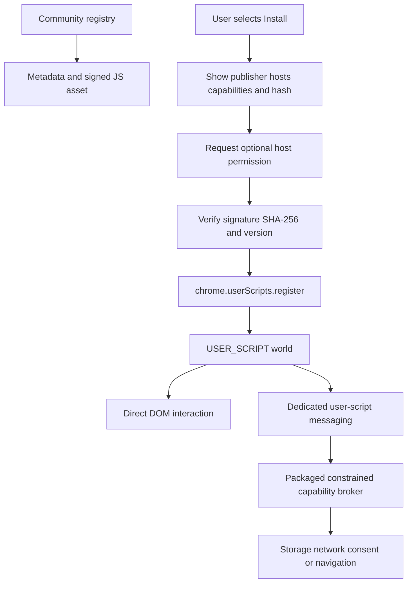

# CWS Community Script Execution Architecture Review

**Date:** 2026-08-18  
**Scope:** Chrome Web Store Manifest V3 policy, community Lua/JavaScript execution, and the AXSDK extension architecture

## 1. Executive conclusion

The policy distinction is **not “Lua is prohibited and JavaScript is allowed.”** The decisive questions are:

1. Is the executable logic included in the submitted extension package?
2. If it is downloaded later, which documented Chrome API executes it?
3. Is the execution consistent with that API’s documented purpose?
4. Can a reviewer determine the extension’s full functionality from the submitted code and disclosed user-script model?

A JavaScript wrapper does not make downloaded Lua compliant. This remains a remote interpreter architecture:

```text
packaged JavaScript
  → downloaded Lua source
  → Fengari in an extension/session worker
  → DOM/navigation/debugger capabilities
```

Chrome’s MV3 policy explicitly lists *“building an interpreter to run complex commands fetched from a remote source”* as a common violation, even when those commands are fetched as data.

The most defensible community-script architecture is:

```text
community author writes Lua or JavaScript
  → build/verification pipeline produces signed JavaScript
  → user explicitly selects and installs a script
  → extension verifies publisher/version/hash/capabilities
  → Chrome executes it through chrome.userScripts
  → a packaged, constrained capability broker handles only fixed privileged operations
```

This also provides a credible single-purpose statement:

> Install, manage, and run user-selected community web-automation scripts on sites the user authorizes.

## 2. Official policy basis

### 2.1 Manifest V3 self-contained logic rule

Chrome requires the extension’s operational logic to be self-contained unless a documented exception applies. External resources may contain data but must not contain logic.

Chrome lists these common violations:

1. Loading a script outside the extension package.
2. Executing a remotely fetched string through `eval()` or an equivalent mechanism.
3. Building an interpreter to run complex commands fetched remotely, even when represented as data.

Official source:

- [Additional Requirements for Manifest V3](https://developer.chrome.com/docs/webstore/program-policies/mv3-requirements)

### 2.2 Remote Hosted Code is language-independent

Chrome describes Remote Hosted Code as anything executed by the browser that was loaded from outside the extension’s own files. The examples name JavaScript and WebAssembly, but the policy’s interpreter clause also covers another language executed by a packaged interpreter.

Changing the wrapper language does not change where the operational logic came from.

Official source:

- [Deal with remote hosted code violations](https://developer.chrome.com/docs/extensions/develop/migrate/remote-hosted-code)

### 2.3 Documented exceptions

MV3 names two APIs that can execute remote logic when used for their documented purpose:

1. `chrome.debugger`
2. `chrome.userScripts`

The exemption applies only to the code actually covered by that API. Moving a small wrapper into an exempt context does not exempt remote logic subsequently executed in an extension worker through a separate interpreter.

### 2.4 User Scripts API

Chrome documents `chrome.userScripts` as the API for arbitrary scripts supplied by users that cannot be packaged with the extension. Its intended products include user-script managers.

Important operational facts:

- Manifest permission: `userScripts`
- Host permission required for target sites
- Manifest V3, Chrome 120+
- `chrome.userScripts.execute()` requires Chrome 135+
- Chrome 138+ uses an extension-specific **Allow User Scripts** toggle
- Older supported versions require Developer Mode
- The default execution context is `USER_SCRIPT`
- User scripts cannot freely use extension APIs
- Messaging must be explicitly enabled with `configureWorld({ messaging: true })`
- Messages arrive through dedicated user-script messaging handlers
- Dynamically registered scripts are cleared on extension update and must be restored

Official source:

- [chrome.userScripts API](https://developer.chrome.com/docs/extensions/reference/api/userScripts)

### 2.5 API Use policy

Chrome requires extensions to use the API designed for a given use case. A community user-script manager should therefore prefer `chrome.userScripts` rather than using `chrome.debugger` or `chrome.scripting` as a substitute.

Official source:

- [Chrome Web Store API Use policy](https://developer.chrome.com/docs/webstore/program-policies/api-use)

## 3. Architecture option assessment

| Architecture | Assessment | Reason |
|---|---|---|
| Packaged JS → packaged Fengari → packaged Lua | Acceptable for RHC | Every executable source is in the submitted ZIP |
| Packaged JS → downloaded Lua → Fengari in worker | Reject/high risk | Explicit remote-interpreter violation shape |
| `chrome.userScripts` JS → message worker → run downloaded Lua | Reject/high risk | Lua still executes outside the User Scripts API exemption |
| Downloaded JS → `eval()`/`Function()` | Prohibited | Direct remote-code execution |
| Downloaded JS → `chrome.scripting.executeScript` workaround | Prohibited/high risk | `userScripts` is the documented arbitrary user-script API |
| User-selected JS → `chrome.userScripts.register/execute` | Recommended | Matches the API’s documented purpose |
| User-selected Lua → true AOT JavaScript → `chrome.userScripts` | Plausible, confirmation recommended | Final remote artifact executes through the intended API, but Lua conversion is not explicitly addressed by policy |
| Downloaded Lua interpreted inside `USER_SCRIPT` world | Ambiguous/high risk | It combines an allowed context with the exact interpreter pattern Chrome warns about |
| Downloaded JS through `chrome.debugger Runtime.evaluate` | Technically exempt but not recommended | User Scripts API exists for this purpose; Debugger is not a substitute |
| Remote declarative configuration → packaged fixed engine | Acceptable if genuinely data-only | Must not encode loops, arbitrary branches, functions, or a general command program |

## 4. Direct answer: JavaScript calling Lua

### 4.1 JavaScript calls downloaded Lua in the current session worker

```js
const source = await fetch(scriptUrl).then((response) => response.text());
await luaRuntime.run(source);
```

**Result:** not a viable CWS architecture.

The actual behavior is controlled by downloaded Lua. JavaScript is only the loader. The extension still contains an interpreter that executes remote complex commands.

### 4.2 JavaScript user script forwards Lua to the extension worker

```js
chrome.runtime.sendMessage({
  op: "runLua",
  source: downloadedLua
});
```

**Result:** not viable.

The JavaScript wrapper is covered by the User Scripts API, but the Lua execution is not. The exemption does not transfer through messaging.

### 4.3 JavaScript calls packaged Lua

```text
packaged JavaScript → packaged interpreter → packaged Lua
```

**Result:** acceptable from an RHC perspective.

This is the current C3 package-local model. Its limitation is that community script changes require an extension package update and CWS review.

### 4.4 JavaScript user script contains a packaged interpreter and remote Lua

Conceptually:

```js
chrome.userScripts.register([{
  world: "USER_SCRIPT",
  js: [
    { file: "fengari.js" },
    { code: `runLua(${JSON.stringify(luaSource)})` }
  ]
}]);
```

**Result:** technically conceivable but not recommended without written CWS approval.

The execution occurs in the User Scripts context, but a reviewer can still identify the prohibited interpreter pattern. The official User Scripts documentation describes JavaScript snippets supplied by users, not an interpreter loophole for a separate remotely fetched language.

## 5. Recommended product definition

The broad shopping/quote/memory/site-assistance feature list creates a single-purpose problem when presented as first-party extension features. Reframing the product as a user-script manager can create one narrow platform purpose:

> AXSDK installs, manages, and runs user-selected community web-automation scripts on websites explicitly authorized by the user.

Under this definition:

- Shopping automation is a community script.
- Quote assistance is a community script.
- Site-specific reading or form assistance is a community script.
- Memory is either a disclosed platform capability or a script capability requiring separate approval.
- The extension core provides script management, permissions, execution isolation, consent, and a constrained capability broker.

This framing is credible only when the implementation matches it:

- The user chooses scripts explicitly.
- The model may recommend a script but may not silently download or enable one.
- Every script has a visible publisher, version, hash, host scope, and capability list.
- The user can disable, update, roll back, or delete each script.
- Script updates that expand hosts or capabilities require renewed consent.
- Default routing does not silently select a new remote script.

## 6. Recommended execution architecture



### 6.1 Community registry record

```json
{
  "id": "amazon-price-helper",
  "version": "1.4.2",
  "publisher": "publisher-id",
  "artifact": "sha256:<digest>",
  "matches": ["https://www.amazon.com/*"],
  "capabilities": [
    "dom.read",
    "dom.write",
    "navigation"
  ],
  "minimumRuntime": 1
}
```

### 6.2 Install transaction

1. User selects **Install**.
2. Extension displays publisher, version, target hosts, requested capabilities, and source/hash information.
3. Extension requests only the optional host permissions required by that script.
4. Extension downloads the immutable artifact.
5. Extension verifies SHA-256, signature, publisher key, version, and revocation state.
6. Extension records the user’s approval against that exact artifact and capability set.
7. Extension registers the JavaScript through `chrome.userScripts`.
8. Extension exposes enable, disable, rollback, update, and delete controls.

### 6.3 Execution boundary

User-script logic should perform ordinary page DOM operations directly in the `USER_SCRIPT` world. The extension bridge should be used only for capabilities unavailable in that context.

The bridge must not provide:

- `eval`
- arbitrary JavaScript execution
- arbitrary Lua execution
- generic debugger command forwarding
- a general command language
- unbounded cross-origin network access

The bridge may expose fixed, schema-validated operations such as:

```text
storage.get(scriptNamespace, key)
storage.set(scriptNamespace, key, value)
navigation.open(approvedUrl)
network.fetch(approvedOrigin, boundedRequest)
consent.request(effectDescription)
```

Each operation should enforce:

- installed script identity
- exact approved artifact/version
- declared capability
- host scope
- request schema
- rate/size limits
- user consent for risky effects
- audit attribution to the script

## 7. Keeping Lua as the community authoring language

### 7.1 Recommended: build-time Lua-to-JavaScript conversion

Community authors may continue writing Lua if the distribution pipeline produces JavaScript before installation:

```text
Lua source
  → registry CI parser/compiler
  → static analysis
  → JavaScript artifact
  → capability manifest
  → signature and SHA-256
  → user installation
  → chrome.userScripts
```

The extension does not download and interpret Lua. It only installs the resulting JavaScript through the documented API.

This is more defensible than embedding Fengari in the User Scripts world because the exact artifact Chrome executes is JavaScript registered through `chrome.userScripts`.

**Policy confidence:** `[INFERENCE]` medium. The official documents permit user-provided JavaScript through User Scripts but do not explicitly discuss Lua-to-JavaScript artifacts. Obtain written confirmation before making this the only release plan.

### 7.2 Alternative: JavaScript community SDK

The lowest-policy-risk implementation is to make JavaScript the distribution language and provide an AXSDK community SDK:

```js
export default defineScript({
  matches: ["https://www.amazon.com/*"],
  capabilities: ["dom.read"],
  async run(ctx) {
    const title = document.querySelector("h1")?.textContent;
    return { title };
  }
});
```

Lua can remain an offline authoring convenience if the registry build converts and verifies it before publication.

### 7.3 Built-in scripts

Built-in scripts can continue using the existing content-addressed C3 package assets because their full source is submitted in the CWS ZIP. They may later migrate to the same JavaScript user-script format, but that is not required to solve Remote Hosted Code.

## 8. Security and trust requirements

A community script marketplace adds a supply-chain and user-data boundary independent of CWS RHC compliance.

Required controls:

- Immutable content-addressed artifacts
- Publisher signing keys
- Registry signature over metadata and artifact digest
- Revocation list
- Per-script namespaces
- Per-script host permissions
- Capability allowlist
- Capability changes require renewed approval
- Source and changelog visibility
- Automated static analysis
- Human review for featured scripts
- Script report/disable mechanism
- Rollback to an approved version
- No silent background enablement
- No model-controlled install confirmation
- Data collection disclosure per script
- Clear distinction between local execution and backend/model transmission

`chrome.userScripts` code should be treated as less trusted than the extension core. The dedicated messaging handlers and `USER_SCRIPT` world are useful boundaries, but they do not replace capability validation.

## 9. Product and onboarding implications

### 9.1 User Scripts toggle

The onboarding flow must detect whether User Scripts are enabled.

For Chrome 138+, the user enables **Allow User Scripts** on the extension’s details page. Older versions use Developer Mode. A consumer release should likely set a minimum Chrome version that supports the extension-specific toggle rather than instructing ordinary users to enable global Developer Mode.

### 9.2 Host permissions

Use optional host permissions whenever possible:

1. Script declares its matching hosts.
2. User sees those hosts before installation.
3. Extension requests only those origins.
4. Disabling/removing the last script for a host can offer to revoke that permission.

This aligns the script-manager purpose with least privilege and reduces the broad `<all_urls>` installation warning.

### 9.3 Privacy

The extension and each script must disclose:

- page data read
- form values accessed
- data stored locally
- data sent to AXSDK backend
- data sent to model providers
- retention and deletion
- risky effects such as form submission, quote contact, or cart mutation

A community-script purpose does not eliminate Limited Use obligations. It makes per-script capability and data disclosure more important.

## 10. Approaches not recommended

### 10.1 `chrome.debugger` as the community code runner

The MV3 policy lists Debugger as a remote-execution exception, but using it for a user-script manager is weak because Chrome already provides `chrome.userScripts` for that purpose. The API Use policy requires the designated API where one exists. The Debugger API also creates a prominent user warning and grants much broader authority.

Keep Debugger for packaged AXSDK browser-control infrastructure, not as a substitute community-script execution environment.

### 10.2 Sandboxed iframe plus broad privileged bridge

Code in a sandboxed iframe receives limited RHC treatment, but it cannot access extension APIs directly. If the iframe can send arbitrary click, navigation, network, or debugger programs to a privileged worker, the extension’s full functionality is no longer discernible from packaged code. A sandbox should not be used to reconstruct a general automation interpreter behind `postMessage`.

### 10.3 Remote “data” containing an automation program

Renaming an executable plan as JSON does not make it data-only. A remote payload with arbitrary loops, branching, variables, functions, selector-driven steps, or an unbounded command sequence is likely the same “complex commands fetched as data” pattern named by the policy.

Remote data is safest when it only selects or parameterizes finite functionality already present in packaged code.

## 11. CWS confirmation questions

Before implementing the Lua compatibility path, submit these exact questions to Chrome Web Store One Stop Support:

1. May an extension whose declared purpose is a user-script manager download JavaScript from a community registry after the user explicitly selects a publisher, version, host scope, and capability list, then execute that exact JavaScript only through `chrome.userScripts`?
2. Is JavaScript produced by a registry-side, deterministic Lua-to-JavaScript compiler treated the same as a user-selected JavaScript user script when the final artifact is shown, hashed, signed, and executed only through `chrome.userScripts`?
3. Would loading a packaged Lua interpreter and a user-selected Lua source in the `USER_SCRIPT` world be considered covered by the User Scripts API exemption, or would it remain the prohibited remote-interpreter pattern?
4. May a user script communicate through `runtime.onUserScriptMessage` with a packaged, fixed, schema-validated capability broker for storage, bounded network access, navigation, and explicit-consent effects?
5. What limitations are required so that such a bridge remains within the User Scripts exemption and does not become alternative remote logic execution in the extension worker?
6. Does automatically updating an installed script to a same-capability signed version remain “code provided by the user,” or must every code update receive a new explicit user action?

Do not rely on a general support answer. Include a minimal architecture diagram and the exact message bridge schema so the response covers the actual implementation.

## 12. Recommended decision

### Adopt

- Community-script manager as the single purpose
- User-selected installation
- `chrome.userScripts` as the only dynamic execution channel
- JavaScript as the distributed artifact
- Lua permitted as an authoring language only through deterministic pre-publication conversion
- Content addressing, publisher signatures, capability manifests, and per-script optional host permissions
- Fixed, constrained, auditable extension bridge

### Retain

- C3 package assets for built-in and core execution logic
- Packaged JS/Lua during migration
- Existing consent and mutation guards
- Exact-artifact release verification

### Remove from the CWS build

- Remote Lua execution in session workers
- Generic remote flow/Lua loaders
- Developer-only raw execution editors
- Any generic message that accepts source code or an arbitrary automation program
- Any model path that installs or enables community scripts without a separate user decision

### Final judgment

The proposed JavaScript wrapper around downloaded Lua does **not** solve the CWS problem. The viable redesign is to move dynamic community execution to `chrome.userScripts`, with a JavaScript distribution artifact and explicit user installation. Lua can remain an authoring language if it is converted before execution, but this conversion path should receive written CWS confirmation before launch.
