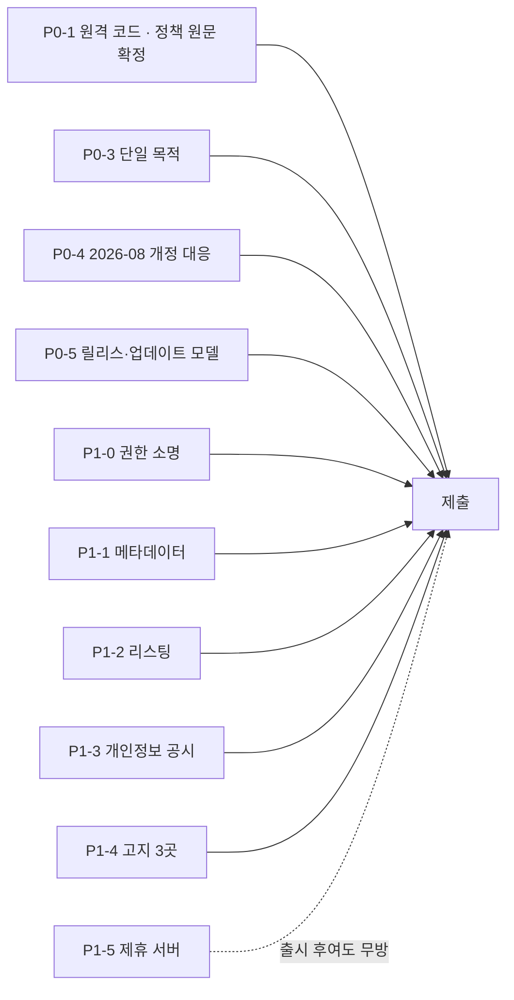

# Chrome Web Store 출시 계획

`AXSDK Assistant`를 CWS에 올리기까지의 작업 목록. 각 항목은 **담당 파트 · 산출물 · 완료 판정**을 갖는다.

담당은 저장소/역할 기준이다. 사람 배정은 이 문서의 권한 밖이다.

| 코드 | 파트 | 저장소 |
|---|---|---|
| **EXT** | 확장·SDK | `axsdk-sdk-js` |
| **SITES** | Lua·flows·사이트 데이터 | `axsdk-sites` (이 저장소) |
| **BE** | 백엔드·앱 패키지·어필리에이트 변환 | `axsdk-backend` |
| **WEB** | 랜딩·개인정보처리방침·리포트 표면 | `axsdk-web` |
| **BIZ** | 정책·제휴 계약·고지 문안 | — |
| **DESIGN** | 스토어 자산 | — |

정책 해석은 이 문서의 권한 밖이다. **[확인필요]**는 심사 제출 전 반드시 확정할 항목.

---

## P0 — 심사 차단 요인 (정책 원문 대조 결과 4건)

### P0-1. 원격 코드 실행 제거 · **EXT + SITES**

**실측된 사실**

- 확장은 런타임에 `raw.githubusercontent.com/${owner}/${repo}/${ref}/${path}`에서 Lua를 가져온다.
- 그 Lua를 **번들된 인터프리터(fengari, `dist/content.js`에 포함)**로 실행한다.
- 플로우도 `clientFlows` / `remoteSites` 경로로 원격 수신된다.

**정책 원문이 이 구조를 이름으로 지목한다.** 추정이 아니다
([Additional Requirements for Manifest V3](https://developer.chrome.com/docs/webstore/program-policies/mv3-requirements),
2024-04-03):

> 1. …The extension may reference and load data and other information sources that are external to the
>    extension, but **these external resources must not contain any logic.** Some common violations include:
>    …
>    3. **Building an interpreter to run complex commands fetched from a remote source, even if those
>       commands are fetched as data**

우리 구조가 정확히 그 문장이다: 번들된 Lua 인터프리터 + 원격에서 받는 Lua.

**면제 조항은 우리에게 적용되지 않는다.** 허용되는 원격 실행은 Debugger API와 User Scripts API 둘뿐이고,
샌드박스 컨텍스트 예외는 "**확장 API로부터 격리된**" 코드에 한한다 — 우리 Lua는 `dom`·`nav` 옵을 통해
확장 API를 부른다.

**같은 문서가 합법 경로도 명시한다**(§3.2):

> Fetching a remote configuration file for A/B testing or determining enabled features, **where all logic
> for the functionality is contained within the extension package**

즉 **로직은 번들, 데이터는 원격**이면 된다. 이것이 설계 방향을 정한다.

**해야 할 일**

1. **SITES** — 로직과 데이터를 가른다.
   - **번들해야 하는 것(로직)**: `_common/rpc/*.lua`, `_common/scripts/*.lua`, 사이트 어댑터, 그리고
     **flows 문서** — flowTool마다 `execute.lua`가 들어 있으므로 flows도 로직이다.
   - **원격으로 남길 수 있는 것(데이터)**: 사이트 인덱스, 사이트맵, 그리고 **선택자 테이블**.
     단 `62_rpc_sites.lua`는 지금 Lua 파일이라 그대로는 원격에 둘 수 없다 — **JSON으로 바꿔야** 데이터가
     된다. 이번 세션에만 선택자를 3개(11번가 배송비·아마존 제목·이베이 카드) 고쳤으니,
     **가장 자주 바뀌는 부분을 심사 없이 갱신할 수 있는지가 여기서 갈린다.** **[확인필요]**
2. **EXT** — 패키지 내 번들이 1순위, 원격 fetch는 제거하거나 개발 빌드로 격리.
3. **BIZ** — 선택자 테이블을 원격 데이터로 두는 것이 §3.2 범위인지 One Stop Support에 사전 문의.

**완료 판정** 확장을 인터넷 없이 설치·실행했을 때 지원 사이트에서 검색·비교가 동작한다.

> **제품 영향**: 사이트 어댑터를 스토어 심사 없이 갱신하던 이점이 사라진다. Lua 변경 = 확장 릴리스.
> 이 트레이드오프를 사업적으로 수용할지 먼저 정해야 한다.

### ~~P0-2. 권한 축소~~ → **P1-0. 권한 소명** · **EXT + BIZ**

> **정정.** 초판은 이것을 심사 차단 요인으로 적었다. 틀렸다. `<all_urls>`는 **금지 대상이 아니고**
> uBlock Origin·Grammarly·비밀번호 관리자 등 널리 쓰인다. CWS가 강제하는 것은 "금지"가 아니라
> **최소 권한** — 선언한 기능에 필요한 것보다 넓으면 안 된다는 규칙이다.

**우리 기능은 실제로 모든 호스트를 필요로 한다.** 근거는 저장소에 있다:

- `_common` 스크립트는 **모든 호스트에 로드되고 off-domain 이동에도 살아남는다** — 사용자가 google.com
  에서 ZIP을 확인하고 업체 사이트로 이동하는 식의 **교차 도메인 진입점**이 그래서 동작한다.
- 어시스턴트 UI 자체가 "어느 사이트에서든" 뜨는 것이 제품 정의다.
- 쇼핑 플로우는 **사용자가 있는 아무 페이지에서 시작해** 상점으로 이동한다(`S.site_for_url` →
  `run_open_site_search`).

즉 애드블록이 모든 사이트를 필요로 하는 것과 같은 종류의 정당성이 있다. 문제는 **거부**가 아니라
**비용 네 가지**다.

| 비용 | 내용 |
|---|---|
| 소명 문안 | 권한별 justification 필드. 부실하면 반려·재문의로 심사가 길어진다 |
| 설치 경고 | "모든 웹사이트의 데이터를 읽고 변경" — 정책 문제가 아니라 **설치 전환율** 문제 |
| 심사 시간 | 정책 문서가 **명시**한다 — *"Reviews may take longer for extensions that request broad host permissions"*. 추정이 아니다 |
| 결합 위험 | **광범위 권한 + 원격으로 받아 해석하는 코드**의 조합이 P0-1이 겨냥하는 바로 그 패턴으로 보인다. 각각은 넘어가도 함께면 눈에 띈다 |

**실제로 날카로운 항목은 host_permissions가 아니라 MAIN world다.** `page-content.js`가 모든 사이트에
`document_start` · MAIN world로 주입된다. 허용되는 방식이지만 가장 높은 권한이고, 전 사이트에 정말
필요한지는 별개 질문이다.

**해야 할 일**

1. **EXT+BIZ** — 권한 소명 문안 작성. 위의 교차 도메인 진입점 근거를 그대로 쓴다.
2. **EXT** — MAIN world 주입이 전 사이트에 필요한지 재검토. 아니라면 지원 도메인 한정 또는
   `chrome.scripting.registerContentScripts` 동적 등록.
3. **BIZ** — 설치 경고 문구를 감수할지, `optional_host_permissions`로 사이트별 동의를 받을지 결정.
   **컴플라이언스가 아니라 전환율 선택이다.**

**완료 판정** 소명 문안이 준비되고, MAIN world 주입 범위에 대한 결정이 내려져 있다.

---

### P0-3. 단일 목적(single purpose) 확정 · **BIZ + EXT**

조사에서 새로 드러난 항목이다. 초판에는 없었다.

[Quality guidelines](https://developer.chrome.com/docs/webstore/program-policies/quality-guidelines) §1:

> An extension must have **a single purpose that is narrow and easy to understand.** Don't create an
> extension that requires users to accept **bundles of unrelated functionality.** …Toolbars that provide a
> broad array of functionality or entry points into services are better delivered as separate extensions

현재 확장이 담고 있는 것: 멀티스토어 비교 · 단일 사이트 쇼핑 · 체크아웃 검토 · **서비스 견적(Thumbtack)**
· **메모리** · **bluemoonsoft 사이트 탐색**.

쇼핑 계열은 하나의 목적으로 묶인다. 견적·메모리·특정 고객사 사이트 탐색은 **묶음으로 보일 소지**가 있다.

그리고 이 결정이 데이터 정책과 맞물린다 — 2026-08-01 시행 [Limited Use](https://developer.chrome.com/docs/webstore/program-policies/limited-use)
개정으로 **수집 데이터는 "공시된 단일 목적에 엄격히 필요한" 것이어야** 한다. 목적을 넓게 쓰면 "엄격히
필요"를 방어하기 어려워지고, 좁게 쓰면 일부 플로우가 목적 밖이 된다. **양쪽을 동시에 만족시킬 수는 없다.**

**해야 할 일**

1. **BIZ** — 단일 목적 문장을 확정한다(예: "지원 쇼핑몰에서 배송비 포함 총액을 비교하고 사용자가 고른
   상품으로 이동시키는 어시스턴트").
2. **EXT+SITES** — 그 목적 밖 플로우를 분리 출시할지, 초기 릴리스에서 뺄지 결정.
3. **BIZ** — 데이터 수집 항목을 그 목적 기준으로 재정리.

**완료 판정** 단일 목적 문장 하나와, 각 플로우가 그 안에 있는지 없는지의 표.

### P0-4. 2026-08-01 개정 정책 대응 · **BIZ + EXT**

**이미 시행 중이다**(공고 2026-07-01, 시행 2026-08-01, 오늘 2026-08-06).
출처: [CWS policy updates](https://developer.chrome.com/blog/cws-policy-updates-2026)

| 개정 | 우리에게 |
|---|---|
| **Limited Use** — 수집 데이터가 공시된 단일 목적에 **엄격히 필요**해야 | P0-3과 함께 결정 |
| **Disclosure** — **모든** 데이터 수집을 명시 공시. 단일 목적과 밀접한지 무관. 설치 후 처리 방침이 바뀌면 **선제 고지** | 페이지 내용을 읽어 백엔드·LLM에 보내는 것을 전부 공시. 모델 공급자 변경도 고지 대상 |
| **Malicious and Prohibited** — **AI 서비스의 안전장치·이용 제한·보호 조치를 우회하도록 설계된 확장 금지** | 우리는 CAPTCHA·봇월을 **우회하지 않고 구조화된 상태로 표면화**한다. 네이버쇼핑이 `access_denied`로 답하는 것이 그 증거다 — 소명 자료로 그대로 쓸 수 있다 |

**해야 할 일**

1. **BIZ** — 데이터 공시 문안을 개정 기준으로 작성(설치 전·리스팅·확장 UI).
2. **EXT** — 실제 전송 데이터와 공시 문안을 대조.
3. **SITES** — 봇월 비우회 정책이 코드에 남아 있는지 확인(현재 그러함). 소명 자료로 정리.

---

### P0-5. 릴리스·업데이트 모델 확정 · **EXT + BIZ + SITES**

**업데이트는 가능하다. 다만 빠른 채널이 아니다** — 이것이 P0-1의 진짜 대가다.
출처: [Update your item](https://developer.chrome.com/docs/webstore/update),
[Review process](https://developer.chrome.com/docs/webstore/review-process)

- 업데이트 = 새 zip + 버전 증가 + **"신규 항목과 본질적으로 동일한 심사"**
- 심사 소요: **"대부분 며칠, 최대 몇 주"**
- 심사를 **길게 만드는 요인 4가지 중 우리는 3개에 해당**한다: 신규 개발자 · 신규 확장 ·
  **위험한 권한 요청**(`<all_urls>`) · **큰 코드 변경**
- 문서가 명시적으로 지목: *"broad host permissions … 또는 **a lot of code or hard-to-review code**를
  포함한 확장은 심사가 더 걸린다"*

> **P0-1의 2차 비용.** 모든 Lua를 번들하면 패키지에 **Lua 인터프리터 + 수천 줄의 Lua**가 들어간다.
> 이는 위 문장이 말하는 "코드가 많고 리뷰하기 어려운" 상태에 정확히 해당하며, **한 번이 아니라 매
> 릴리스마다** 심사를 늘린다. 난독화는 금지, 최소화는 허용되나 권장되지 않는다.

**그래서 데이터/로직 분리가 선택이 아니라 제품의 운영 근간이다.** 이번 세션 하나에서만 선택자를 3개
고쳤다(11번가 배송비 · 아마존 제목 · 이베이 카드). 그것이 전부 릴리스+심사를 타야 한다면 **그 사이 내내
해당 상점의 비교가 깨져 있다.**

**쓸 수 있는 도구**

| 도구 | 쓰임 |
|---|---|
| [Update API](https://developer.chrome.com/docs/webstore/using_webstore_api) | CI에서 업로드 자동화. 대시보드 수작업 제거 |
| **롤백** | 나쁜 릴리스를 이전 버전으로 즉시 되돌린다 — Lua 회귀의 안전망 |
| 부분 롤아웃 | 7일 활성 사용자 1만 이상일 때. 초기에는 해당 없음 |
| 지연 게시 | 심사 통과 후 30일 내 원하는 시점에 게시 |
| Verified CRX Uploads | 서명 키. 개발자 계정이 탈취돼도 악성 업데이트를 막는다 |

**정기 재심사도 있다.** 게시된 확장은 주기적으로, 그리고 정책 변경 시 다시 심사된다. 경미한 위반은
**7~30일 경고 후 내림**, 중대한 위반은 즉시 내림. 즉 **P0-4는 출시 1회성 관문이 아니라 상시 조건**이다.

**해야 할 일**

1. **EXT** — Update API 기반 릴리스 파이프라인 + 롤백 절차 문서화.
2. **SITES** — 선택자 변경의 긴급도를 등급화한다. 데이터로 원격 배포 가능한 것과 릴리스가 필요한 것.
3. **BIZ** — "선택자 하나 고치는 데 며칠~몇 주"를 수용할 수 있는 SLA인지 판단. 아니라면 P0-1의 데이터
   분리 범위를 넓히는 것이 유일한 답이다.

**완료 판정** 선택자 한 줄을 고쳤을 때 사용자에게 도달하기까지의 경로와 소요가 문서로 있다.

---

## P1 — 제출에 필요한 산출물

### P1-1. 매니페스트·메타데이터 정리 · **EXT + DESIGN**

현재 값은 전부 개발용 자리표시자다.

| 항목 | 현재 | 필요 |
|---|---|---|
| `name` | `AXSDK Assistant` | 제품명 확정 |
| `description` | `Show the AXSDK assistant on any website.` | 132자 이내 제품 설명 |
| `version` | `0.1.0` | 릴리스 버전 규칙 |
| 아이콘 | 미확인 | 16/32/48/128 |

### P1-2. 스토어 리스팅 · **DESIGN + BIZ**

- 상세 설명, 스크린샷(1280×800 또는 640×400) 최소 1장, 권장 5장
- 프로모 타일, 카테고리, 언어(ko/en)
- **어필리에이트 고지**를 리스팅 본문에 명시 — CWS Affiliate Ads 정책 요구 3곳 중 하나

### P1-3. 개인정보·데이터 공시 · **BIZ + EXT + WEB**

확장은 **페이지 내용을 읽어 백엔드와 LLM에 보낸다.** 이는 사용자 데이터 취급이다.

1. **WEB** — 개인정보처리방침 URL (`axsdk-web/content/privacy`가 존재하나 확장 실태와 일치하는지 검증 필요)
2. **BIZ** — CWS 데이터 사용 공시 폼: 수집 항목, 목적, 제3자 전송(LLM 공급자 포함)
3. **BIZ** — "제한적 사용(Limited Use)" 준수 서약
4. **EXT** — 공시한 것 이상을 보내지 않는지 실측 대조

### P1-4. 어필리에이트 고지 3곳 · **BIZ + SITES + DESIGN**

[Affiliate Ads](https://developer.chrome.com/docs/webstore/program-policies/affiliate-ads) (2025-03-11)
§1은 **리스팅 · UI · 설치 전** 세 곳을 요구하고, §3은 "**각각의** 제휴 코드·링크·쿠키 삽입 전에 관련
사용자 행동이 필요하다"고 못박는다 — 우리 설계의 "픽 1건당 링크 1건"이 정확히 그 요구다.

| 위치 | 담당 | 현황 |
|---|---|---|
| 스토어 리스팅 | DESIGN/BIZ | 미착수 |
| 확장 UI | SITES | **완료** — 링크와 고지를 함께 생산하고, 터미널이 verbatim 출력하도록 게이트로 고정 |
| 설치 전 고지 | DESIGN/WEB | 미착수 |

### P1-5. 어필리에이트 서버 · **BE**

`AFFILIATE_DESIGN.md` 7단계. `https://api.axsdk.ai/v1/affiliate/deeplink` 미구현.

- HMAC-SHA256 서명, 키는 서버에만
- URL→shortenUrl 캐시
- `affiliate_link_created` 기록
- **BIZ** — 쿠팡 파트너스 가입 + 확장 사용 형태 서면 문의(계정 보호막)

**완료 판정** 확장이 링크를 받아 위젯으로 렌더하고, 클릭이 `axsdk.widget.action`으로 관측된다.

---

## P2 — 품질·안정성

### P2-1. 라이브 게이트 유지 · **SITES**

현재 통과 상태: `check:flows` 121 · `test:lua` 471 · playground 50 · commerce 24/24+17/17 ·
`test:commerce:live:all` 35/35 · `test:commerce:live:discovery` 14/14.

출시 전 재실행하고 결과를 릴리스 노트에 남긴다.

### P2-2. 실계정 부작용 점검 · **SITES + EXT**

- 장바구니 변경은 명시적 선택 턴에서만 발생한다(현재 그러함)
- **주문·결제는 어떤 경로로도 발생하지 않는다** — `check:flows`가 체크아웃 코드에서 place-order 선택자를
  **읽기만** 하고 `click(...)`에 넘기지 않음을 어서션으로 고정하고, 카트 모듈은 체크아웃과 분리되어
  따로 order-free임이 검증된다. 심사 소명에 그대로 쓸 수 있는 근거다
- 심사자가 설치 직후 아무 사이트에서나 열었을 때 무해한지

### P2-3. 오류 표면 · **EXT + SITES**

백엔드·LLM·제휴 서버가 죽었을 때 사용자에게 무엇이 보이는지. 현재 어필리에이트 경로는 링크 없이
비교 결과를 그대로 보여준다(설계 §2.5). 다른 경로도 같은 기준인지 확인.

---

## P3 — 제출과 그 이후

1. **BIZ** — 개발자 계정 등록($5), 판매자 정보
2. **EXT** — 패키지 업로드, 권한 소명 작성
3. 심사 대기 — 공식 문서 기준 **"대부분 며칠, 최대 몇 주"**. 신규 개발자·신규 확장·광범위 권한·
   큰 코드 변경이 전부 지연 요인이고 우리는 그중 셋에 해당한다
4. 반려 시 사유별 담당 재배정
5. 승인 후: 버전 롤아웃 정책, 크래시·오류 모니터링
6. **BIZ** — 첫 커미션 발생 → 누적 15만원 도달 시 쿠팡 최종승인 심사 대비 스크린샷

---

## 의존 순서

**차단 요인은 P0-1·P0-3·P0-4·P0-5 네 건이다.** P0-5는 심사를 막지는 않지만, **답이 "수용 불가"면 P0-1의 데이터 분리 범위를 다시 설계해야 하므로** 앞단에 둔다. P0-1은 정책 원문이 우리 구조를 이름으로 지목하므로
해석의 여지가 없고, 로딩 구조와 릴리스 절차를 바꾸므로 패키징 관련 작업의 선행 조건이다. P0-3(단일 목적)은
어떤 플로우를 출시에 포함할지를 정하므로 리스팅·공시 문안 전체의 선행 조건이다.

권한(P1-0)은 차단 요인이 아니라 **소명과 전환율의 문제**다. 다만 MAIN world 주입 범위를 바꾸기로 하면
콘텐츠 스크립트 주입 방식이 달라지므로 라이브 게이트를 다시 돌려야 한다.

어필리에이트(P1-5)는 **출시 차단 요인이 아니다.** 링크가 없으면 비교 결과만 보여주고 정상 동작한다.

---

## 부록 A — 우리와 같은 범주가 이미 스토어에 있는가

**있다. 그것도 많고, 활발히 갱신된다.** 즉 "AI가 브라우저를 대신 조작한다"는 기능 자체는 승인 가능하다.

| 확장 | 하는 일 | 최근 갱신 |
|---|---|---|
| **Claude in Chrome** (Anthropic) | 보고·클릭·입력·이동 | 2026 |
| **Do Browser** | 자연어 → 이동·클릭·폼 입력·데이터 추출 | 2026-07-22 (v3.1.33) |
| **Agent OS** | 폼 자동입력·스크래핑·워크플로 | 2026-05-07 (477 KiB) |
| **Bardeen** | 리서치·쇼핑·이메일 자동화 | 2026-06-19 (6.77 MiB) |
| **HARPA AI** | 100+ 명령, 가격 모니터링, 자동화 | 활성 |
| **ChromeAiAgent · Page Agent Ext · BrowserAgent** | 자연어 브라우저 제어 | 활성 |

**쇼핑 특화** — 우리와 기능이 가장 가까운 쪽:

| 확장 | 하는 일 |
|---|---|
| **ShopAI Assistant** | AI로 더 나은 가격을 찾고 **다른 상점에 걸쳐 같거나 유사한 상품을 비교** |
| **BuyScout** | 상품 인사이트·가격 추적·비교 |
| **ShopGuru / Dotti** | 리뷰 요약·가격 추적·구매 시점 알림 |

**ShopAI Assistant는 사실상 우리 기능이다.** 다중 상점 비교가 승인 가능한 기능이라는 직접 증거다.

읽어낼 점 셋:

1. Bardeen이 **6.77 MiB**다. 큰 번들은 이 범주에서 정상이다 — P0-1의 번들 방식이 이례적이지 않다.
2. 이들 대부분이 원격 LLM을 부른다. **LLM 백엔드는 문제가 아니다**(부록 B).
3. 다만 **원격에서 스크립트를 받아 해석하는 곳은 공개적으로 확인되지 않는다.** 우리를 남들과 다르게
   만드는 건 AI도, 자동화도, 백엔드도 아니라 **Lua 배달 방식 하나**다.

## 부록 B — LLM 백엔드는 써도 되는가

**된다.** [MV3 요건](https://developer.chrome.com/docs/webstore/program-policies/mv3-requirements) §3이
원격 서버 통신을 명시적으로 허용한다:

> 3. Communicating with remote servers for certain purposes is still allowed. …
>    4. **Performing server-side operations with data**

경계는 "원격 통신이냐"가 아니라 **"받아오는 것이 데이터냐 로직이냐"**다.

| 우리 동작 | 판정 |
|---|---|
| 페이지 내용을 백엔드·LLM에 보낸다 | 데이터 전송 — 허용(단 P0-4 공시 대상) |
| LLM이 **어떤 툴을 어떤 인자로** 부를지 답한다 | **데이터.** 실행은 패키지 안의 코드가 한다 |
| 백엔드가 **Lua 모듈을 보낸다** | **로직.** §1.3 위반 |

세 번째만 문제다. 앞의 둘은 위 표의 경쟁 확장들이 전부 하고 있는 일이다.

> **[INFERENCE]** §1.3의 "원격에서 받아온 복잡한 명령을 실행하는 인터프리터"와, LLM이 정해진 툴을
> 호출하는 것의 차이는 **어휘가 패키지 안에 고정되어 있는가**로 갈린다고 읽는다. 우리 RPC 옵은 23개로
> 고정되어 있고 전부 확장 코드가 구현한다 — 임의의 프로그램을 실행하는 인터프리터가 아니다. 반면
> fengari + 원격 Lua는 정확히 그 인터프리터다. 이 선 긋기는 사전 문의로 확인할 가치가 있다.

## 부록 C — 그래서 Lua를 전부 번들하는 게 맞는가

**로직은 그렇다. 전부는 아니다.**

| 자산 | 성격 | 배달 |
|---|---|---|
| `_common/rpc/*.lua`, `_common/scripts/*.lua`, 사이트 어댑터 | 로직 | **번들 필수** |
| flows 문서 | 로직 — flowTool마다 `execute.lua`가 들어 있다 | **번들 필수** |
| 사이트 인덱스, 사이트맵 | 데이터 | 원격 가능 |
| **선택자 테이블(`RPC_SITES`)** | 데이터 — **단 지금은 Lua 파일이다** | **JSON으로 바꾸면** 원격 가능 **[확인필요]** |

원래 구상(백엔드에서 Lua 수신)은 **그대로는 불가능**하다. 다만 그 구상의 목적 — *상점이 마크업을 바꿔도
심사 없이 대응한다* — 은 **선택자만 데이터로 빼면 상당 부분 살아남는다.** 이번 세션에서 고친 3건이
전부 선택자였다는 사실이 그 근거다.

**남는 것과 잃는 것**

- 살아남음: 선택자 드리프트 대응(가장 잦은 변경)
- 잃음: 새 사이트 어댑터 추가, 리더 로직 수정, 플로우 그래프 변경 → 전부 릴리스 + 심사

---

## 이 저장소(SITES)가 지금 당장 할 수 있는 것

1. Lua·flows 번들을 확장 패키지에 넣을 수 있는 릴리스 산출물로 만들기 (P0-1의 SITES 몫)
2. 12개 지원 도메인 목록을 단일 소스로 노출 — MAIN world 주입 범위를 좁히기로 할 때 필요하다 (P1-0 지원)
3. 라이브 게이트 재실행 및 결과 기록 (P2-1)

나머지는 EXT·BE·BIZ의 선행 결정을 기다린다.
