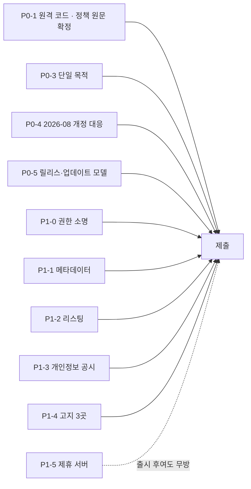

# Chrome Web Store 출시 계획

`AXSDK Assistant`를 CWS에 올리기까지의 작업 목록. 각 항목은 **담당 파트 · 산출물 · 완료 판정**을 갖는다.

담당은 저장소/역할 기준이다. 사람 배정은 이 문서의 권한 밖이다.

| 코드 | 파트 | 저장소 |
|---|---|---|
| **EXT** | 확장·SDK | `axsdk-sdk-js` |
| **SITES** | Lua·flows·사이트 데이터 | `axsdk-sites` (이 저장소) |
| **BE** | 백엔드·앱 패키지·어필리에이트 변환 | `axsdk-backend` |
| **WEB** | 랜딩·개인정보처리방침·리포트 표면 | `axsdk-web` |
| **BIZ** | 정책·제휴 계약·고지 문안 | — |
| **DESIGN** | 스토어 자산 | — |

정책 해석은 이 문서의 권한 밖이다. **[확인필요]**는 심사 제출 전 반드시 확정할 항목.

---

## 최소 통과 경로 (2026-08-06 실측 · dassi 0.51.4 대조 반영)

아래 P0/P1을 전부 하지 않아도 제출은 가능하다. **심사를 실제로 막는 것은 M1 하나**다.
나머지는 심사 시간·전환율·상시 컴플라이언스 항목이다. 각 M은 아래 P 항목의 최소 실행분이다.

dassi에서 확인된 기준선 — **번들 크기(9.86 MiB)도, 데이터가 자기 백엔드를 경유하는지도 승인과
무관하다**(dassi 기본값이 자기 릴레이 경유인데 통과). 승인을 가르는 축은 **코드가 어디서 오는가**
하나다. 근거는 부록 B와 `COMPETITIVE_RESEARCH.md` §3.2.

> **정정.** 초판은 이 자리에 "dassi는 로직 100% 번들이라 통과한다"라고 적었다. **틀렸다.** dassi는
> LLM이 생성한 JS와 공개 CDN의 npm 패키지를 런타임에 실행한다. 다만 **세 경로 전부가 정책이 명시한
> 면제 채널**이다 — 자세한 대조는 부록 D. 정확한 문장은 *"제품의 동작은 패키지 안에 있고, 동적
> 코드는 면제 채널 안에 갇혀 있다"*이며, 이 구분이 M1의 두 선택지를 만든다.
> **재기준화 (2026-08-06).** 제출 대상이 **`@axsdk/extension-cdp`로 확정**되었다. in-page
> `@axsdk/extension`은 legacy다. 아래 M 항목은 CDP 빌드의 manifest·dist를 다시 재서 갱신한 것이며,
> **이전 판의 권한·콘텐츠 스크립트 수치는 legacy 확장의 것이므로 인용하면 안 된다.**
>
> | 항목 | legacy (in-page) | **CDP (제출 대상)** |
> |---|---|---|
> | `permissions` | `storage`, `webNavigation` | `storage`, **`debugger`**, `offscreen`, `tabGroups`, **`declarativeNetRequestWithHostAccess`**, `scripting` |
> | `host_permissions` | `http://*/*`, `https://*/*` (필수) | 동일 (필수) |
> | content scripts | **3개**, 그중 `page-content.js`가 MAIN world · `document_start` | **1개** — `activity-overlay.js` 4 KiB, `document_idle`, ISOLATED. **MAIN world 주입 없음** |
> | 아이콘 | 없음 | 16/32/48/128 있음 |
> | dist | ~2.6 MiB | **7.06 MiB** / 19 파일 |
> | 페이지 조작 | content script | `chrome.debugger` → `Page.createIsolatedWorld` + 번들 `page-bundle.js`(22 KiB) → `Runtime.evaluate` |
>
> **P0-1은 포팅으로 바뀌지 않는다**: `raw.githubusercontent.com`이 service worker·session worker·
> `widget.js` 셋에 있고 fengari가 번들돼 있다. **M2는 포팅으로 해소되었다.** 새로 생긴 것은 권한 두
> 개의 소명이다.


| # | 항목 | 성격 | 규모(실측) | 소속 |
|---|---|---|---|---|
| **M1** | Lua·flows를 패키지에 번들, 원격 fetch는 dev 빌드로 격리 | **유일한 차단 요인** | **576.6 KiB** (그중 데이터 4.8%) | P0-1 |
| ~~**M2**~~ | ~~`page-content.js` 상시 MAIN world 주입 제거~~ | **포팅으로 해소** | CDP 확장에 MAIN world 주입이 없다 | — |
| **M2′** | `debugger` · `declarativeNetRequestWithHostAccess` 소명 | 심사 시간 | 소명 문안 2건 | P1-0 |
| **M3** | `<all_urls>`를 `optional_host_permissions`로 | 심사 시간·전환율 | manifest + 권한 요청 흐름 | P1-0 |
| **M4** | 단일 목적 문장 + 목적 밖 플로우 제외 | 상시(Limited Use) | flows intent 3개 | P0-3 |
| **M5** | 실측 기준 데이터 공시 | 상시 | 계측 + 문안 | P0-4 / P1-3 |
| **M6** | 매니페스트 메타데이터·아이콘 | 기계적 | 자리표시자 교체 | P1-1 |

### M1 — 번들 (유일한 차단 요인)

**번들해야 하는 것은 flows 문서가 실제로 선언한 것뿐이다.** `_common/flows.yaml`이 이름으로 부르는
모듈은 **26개**이고, 그 합이 실측 **361.1 KiB** — flows 문서 자체 **215.5 KiB**를 더해
**576.6 KiB**(원본, 압축 전)다.

| 자산 | 크기 | 번들 |
|---|---|---|
| flows가 선언한 `_common/rpc` 모듈 14개 | 202.8 KiB | **필수** |
| flows가 선언한 `_common/scripts` 모듈 12개 (`00_base`, `10_form_wizard`, `44`–`46`, 커머스 `50`–`56`) | 158.3 KiB | **필수** |
| `_common/flows.yaml` + thumbtack·bluemoonsoft 오버레이 | 215.5 KiB | **필수** — flowTool마다 `execute.lua`가 들어 있다 |
| **소계** | **576.6 KiB** | |
| 사이트 어댑터 `<site>/scripts/*.lua` 18개 | 109.3 KiB | **불필요** — 어느 flow tool의 `modules:`에도 없다. `62_rpc_sites.lua`가 이들의 config를 생성물로 이미 담고 있고, 남은 `AX_search_product`/`AX_add_to_cart`는 `ax run`과 라이브 스윕이 부르는 **개발 시점 스택**이다 **[확인필요 — 배포 전 라이브 스윕으로 검증]** |
| `playground/**` | 73.1 KiB | 불필요 — 별도 워크스페이스 |

CDP 확장 dist는 **7.06 MiB**(19 파일: `widget.js` 2,612 KiB · `session-worker` 2,095 KiB ·
`service-worker.js` 1,877 KiB · `fengari` 223 KiB · `page-bundle.js` 22 KiB). 576.6 KiB를 더해도
**~7.6 MiB — dassi 9.86 MiB보다 작다.** **크기는 논점이 아니다.**

shipped dist(`0.1.0`)에 번들 경로는 **존재하지 않는다**: `bundled` 식별자 0건이고 sites 소스 검증기가
`github.com`/`raw.githubusercontent.com` HTTPS URL만 받는다. EXT 작업은 "원격 끄기"가 아니라
**"번들 소스를 새로 만들기"**다.

#### 데이터로 남는 것은 4.8% 하나 — `62_rpc_sites.lua`

실측: **27.4 KiB / 919줄, `function` 0개, `if`/`for`/`while` 0개.** 순수 선언이다. 헤더가 그 성격을
스스로 말한다 — *"GENERATED by tools/build-rpc-sites.mjs. Every value here is the site adapter's own
registered config, taken whole."* 576.6 KiB 중 **4.8%**.

즉 답은 **번들 95 : 원격 데이터 5**다. JSON으로 바꾸면 §3.2의 "원격 구성 파일"에 정확히 들어맞고,
설계는 `SITE_DATA_SPLIT_DESIGN.md`에 이미 있다. **[확인필요]** 는 그대로 남는다.

**그 5%가 무엇을 사주고 무엇을 못 사주는지**는 이번 세션의 실제 수정 4건이 그대로 답이다:

| 이번 세션의 실제 수정 | 5%로 커버되나 |
|---|---|
| 11번가 배송비 `dd.c-card-item__price-delivery` | **예** — config 키 하나 |
| 아마존 제목 `"a h2 span, a h2"` | **예** — config 키 하나 |
| 이베이 카드 `li.s-card[data-listingid]` | **예** — config 키 하나 |
| 11번가 `product_id`를 `data-log-body`에서 읽기 | **아니오** — `result_id_attr`(config) **와** `S.product_id_from`의 패턴 처리(로직) **양쪽**이 필요했다 |

**"선택자 드리프트 → 데이터, 새 읽기 능력 → 릴리스"**가 정확한 선이다. 3/4는 데이터로 끝나고,
4번째 같은 건 릴리스를 탄다.

#### M1은 두 갈래다 (부록 D 참조)

| | 하는 일 | 원격 Lua | 확실성 | 대가 |
|---|---|---|---|---|
| **M1-A 번들** | 576.6 KiB를 패키지에 | 제거 | **확실** | Lua 변경 = 릴리스 + 심사 |
| **M1-B 샌드박스** | fengari를 `sandbox.html`로 옮기고 `dom`/`nav` 옵을 `postMessage` host-call로 | 유지 가능 | **선례 있음, 확정 아님** | EXT 아키텍처 변경 + 모든 옵에 postMessage 왕복(현 옵 1회 ~460ms에 가산) |

**기본값은 M1-A다.** M1-B는 dassi의 `repl`과 구조적으로 동일하고 우리 부록 B의 `[INFERENCE]`를
뒷받침하지만, **dassi 통과 ≠ 정책 허용**이다 — 같은 확장이 GA4 공시를 틀리게 하고도 Featured다
(`../../researches/dassi-analysis/REVERIFICATION.md` §B). M1-B는 사전 문의로만 확정한다.

### ~~M2~~ → 포팅으로 해소. 남은 것은 **권한 두 개의 소명 (M2′)**

> **이전 판 정정.** 초판은 여기서 *"전 사이트 `document_start` MAIN world 주입(`page-content.js`,
> 181 바이트)이 실제로 가장 날카로운 항목"*이라고 적었다. 그것은 **legacy in-page 확장**의 사실이다.
> CDP 확장의 content script는 **`activity-overlay.js` 하나**(4 KiB, `document_idle`, ISOLATED)이고
> **MAIN world 주입이 없다.** 이 항목은 할 일이 아니라 **이미 해결된 상태**다.

대신 CDP 포팅이 권한 두 개를 새로 들여왔고, 둘 다 소명이 필요하다:

| 권한 | 실제 용도 (실측) | 소명 재료 |
|---|---|---|
| **`debugger`** | 이 확장의 핵심 메커니즘. `chrome.debugger` 9곳 → `Page.createIsolatedWorld` + `Page.addScriptToEvaluateOnNewDocument`으로 번들 `page-bundle.js`를 심고 `Runtime.evaluate`로 호출한다. 평가되는 표현식은 **전부 확장이 작성한 것**이며 원격 Lua 문자열이 아니다 | dassi도 `debugger`를 핵심으로 쓰고 Featured다(부록 D). 붙는 동안 Chrome이 "디버깅 중" 배너를 띄우므로 **사용자에게 가시적**이라는 점을 그대로 쓴다 |
| **`declarativeNetRequestWithHostAccess`** | 동적 규칙 **정확히 1개**(`removeRuleIds:[1]`), `baseUrl` + 확장 오리진에서 파생. 워커가 백엔드에 닿기 위한 것 | 규칙이 하나고 우리 백엔드 오리진에만 적용됨을 명시. 트래픽 차단·리다이렉트 용도가 아니다 |

`offscreen`은 `reasons:[WORKERS]`, justification *"Agent runtime host: one Web Worker per concurrent
agent session."* — dassi와 같은 형태다. `new Function(` 0건이고 `eval(` 히트는 Lua 런타임 자신의
`lua.eval` 메서드와 번들된 정규식 엔진이지 JS `eval`이 아니다 — 소명에 쓸 수 있는 사실이다.

### M3 — dassi가 실제로 쓰는 권한 형태

dassi의 필수 호스트는 **LLM 공급자 + 자기 백엔드뿐**이고 `<all_urls>`는
`optional_host_permissions`다. 런타임에 `chrome.permissions.contains`로 확인하고 도메인 단위로
요청한다(`background/index.js` @309638). 우리는 `http://*/*` · `https://*/*`가 **필수**다.

얻는 것: 설치 경고 제거, "최소 권한" 소명 부담 제거, 심사 지연 요인 하나 제거.
치르는 것: 첫 진입 시 도메인 승인 1회, 교차 도메인 진입점은 승인된 도메인에서만.
**차단 요인은 아니므로 M1 뒤로 미뤄도 된다.**

우리 `permissions`는 `storage` · `webNavigation` **둘뿐**이다(dassi는 13종 + `debugger`).
이건 소명에서 강점으로 쓴다.

### M4·M5 — dassi를 반면교사로

dassi는 프롬프트 300자와 방문 호스트명을 GA4로 보내면서 스토어에는 "수집하지 않음"으로 선언했다
(측정: `../../researches/dassi-analysis/REVERIFICATION.md` §B). Featured 배지도 이를 걸러내지 못했다.
**그러나 정기 재심사는 상시이고, 부정확한 공시는 그때 터진다.** 우리는 반대로 간다 — EXT가 실제
전송분을 계측하고, 그 목록 그대로 공시한다. 목적을 좁게 쓸수록(M4) "엄격히 필요" 방어가 싸진다.

### 하지 말 것

- **`chrome.debugger`로 전환**(dassi 경로) — 아키텍처 재작성이고 "디버깅 중" 배너가 상시 뜬다. M1로 충분하다.
- **샌드박스/`userScripts` 면제 노리기** — 샌드박스 예외는 "확장 API로부터 격리된" 코드 한정이고,
  우리 Lua는 `dom`·`nav` 옵으로 확장 API를 부른다. 면제가 닿지 않는다(P0-1).
- **경쟁사 공시 베끼기** — 위 M5.

---

## P0 — 심사 차단 요인 (정책 원문 대조 결과 4건)

### P0-1. 원격 코드 실행 제거 · **EXT + SITES**

**실측된 사실**

- 확장은 런타임에 `raw.githubusercontent.com/${owner}/${repo}/${ref}/${path}`에서 Lua를 가져온다.
- 그 Lua를 **번들된 인터프리터(fengari, `dist/content.js`에 포함)**로 실행한다.
- 플로우도 `clientFlows` / `remoteSites` 경로로 원격 수신된다.

**정책 원문이 이 구조를 이름으로 지목한다.** 추정이 아니다
([Additional Requirements for Manifest V3](https://developer.chrome.com/docs/webstore/program-policies/mv3-requirements),
2024-04-03):

> 1. …The extension may reference and load data and other information sources that are external to the
>    extension, but **these external resources must not contain any logic.** Some common violations include:
>    …
>    3. **Building an interpreter to run complex commands fetched from a remote source, even if those
>       commands are fetched as data**

우리 구조가 정확히 그 문장이다: 번들된 Lua 인터프리터 + 원격에서 받는 Lua.

**면제 조항은 지금 구조에는 적용되지 않는다.** 허용되는 원격 실행은 Debugger API와 User Scripts API
둘뿐이고, 샌드박스 컨텍스트 예외는 "**확장 API로부터 격리된**" 코드에 한한다 — 우리 Lua는 content
script 컨텍스트에서 돌며 `dom`·`nav` 옵으로 확장 API를 부른다.

> **면제 세 통로를 다 확인했다(부록 E).** dassi는 셋을 전부 써서 LLM 생성 코드와 CDN npm 패키지를
> 실행하고 통과했고(부록 D), Tampermonkey는 커뮤니티 스크립트를 내려받아 실행하며 11M 사용자에
> Featured다. **그래도 우리 Lua는 어느 통로에도 들어가지 않는다** — User Scripts 면제는
> *"scripts provided by the **user**"*가 용도이고, 샌드박스 면제는 원격 로딩 제한만 풀 뿐
> *"it must still be possible to determine the full functionality of your extension"*을 그대로
> 남긴다. 우리 Lua는 **제품의 동작 자체**라 그 요구를 위치와 무관하게 위반한다.
> **M1-B는 반론 하나(인터프리터가 확장 API를 부른다)를 없앨 뿐이고, 기본값은 M1-A다.**

**같은 문서가 합법 경로도 명시한다**(§3.2):

> Fetching a remote configuration file for A/B testing or determining enabled features, **where all logic
> for the functionality is contained within the extension package**

즉 **로직은 번들, 데이터는 원격**이면 된다. 이것이 설계 방향을 정한다.

**해야 할 일**

1. **SITES** — 로직과 데이터를 가른다.
   - **번들해야 하는 것(로직)**: `_common/rpc/*.lua`, `_common/scripts/*.lua`, 사이트 어댑터, 그리고
     **flows 문서** — flowTool마다 `execute.lua`가 들어 있으므로 flows도 로직이다.
   - **원격으로 남길 수 있는 것(데이터)**: 사이트 인덱스, 사이트맵, 그리고 **선택자 테이블**.
     단 `62_rpc_sites.lua`는 지금 Lua 파일이라 그대로는 원격에 둘 수 없다 — **JSON으로 바꿔야** 데이터가
     된다. 이번 세션에만 선택자를 3개(11번가 배송비·아마존 제목·이베이 카드) 고쳤으니,
     **가장 자주 바뀌는 부분을 심사 없이 갱신할 수 있는지가 여기서 갈린다.** **[확인필요]**
2. **EXT** — 패키지 내 번들이 1순위, 원격 fetch는 제거하거나 개발 빌드로 격리.
3. **BIZ** — 선택자 테이블을 원격 데이터로 두는 것이 §3.2 범위인지 One Stop Support에 사전 문의.

**완료 판정** 확장을 인터넷 없이 설치·실행했을 때 지원 사이트에서 검색·비교가 동작한다.

> **제품 영향**: 사이트 어댑터를 스토어 심사 없이 갱신하던 이점이 사라진다. Lua 변경 = 확장 릴리스.
> 이 트레이드오프를 사업적으로 수용할지 먼저 정해야 한다.

### ~~P0-2. 권한 축소~~ → **P1-0. 권한 소명** · **EXT + BIZ**

> **정정.** 초판은 이것을 심사 차단 요인으로 적었다. 틀렸다. `<all_urls>`는 **금지 대상이 아니고**
> uBlock Origin·Grammarly·비밀번호 관리자 등 널리 쓰인다. CWS가 강제하는 것은 "금지"가 아니라
> **최소 권한** — 선언한 기능에 필요한 것보다 넓으면 안 된다는 규칙이다.

**우리 기능은 실제로 모든 호스트를 필요로 한다.** 근거는 저장소에 있다:

- `_common` 스크립트는 **모든 호스트에 로드되고 off-domain 이동에도 살아남는다** — 사용자가 google.com
  에서 ZIP을 확인하고 업체 사이트로 이동하는 식의 **교차 도메인 진입점**이 그래서 동작한다.
- 어시스턴트 UI 자체가 "어느 사이트에서든" 뜨는 것이 제품 정의다.
- 쇼핑 플로우는 **사용자가 있는 아무 페이지에서 시작해** 상점으로 이동한다(`S.site_for_url` →
  `run_open_site_search`).

즉 애드블록이 모든 사이트를 필요로 하는 것과 같은 종류의 정당성이 있다. 문제는 **거부**가 아니라
**비용 네 가지**다.

| 비용 | 내용 |
|---|---|
| 소명 문안 | 권한별 justification 필드. 부실하면 반려·재문의로 심사가 길어진다 |
| 설치 경고 | "모든 웹사이트의 데이터를 읽고 변경" — 정책 문제가 아니라 **설치 전환율** 문제 |
| 심사 시간 | 정책 문서가 **명시**한다 — *"Reviews may take longer for extensions that request broad host permissions"*. 추정이 아니다 |
| 결합 위험 | **광범위 권한 + 원격으로 받아 해석하는 코드**의 조합이 P0-1이 겨냥하는 바로 그 패턴으로 보인다. 각각은 넘어가도 함께면 눈에 띈다 |

> **정정 (CDP 재기준화).** 초판은 *"실제로 날카로운 항목은 host_permissions가 아니라 MAIN world다"*
> 라고 적었다. 그것은 **legacy in-page 확장**의 사실이다. CDP 확장의 content script는
> `activity-overlay.js` 하나(4 KiB, `document_idle`, ISOLATED)이고 **MAIN world 주입이 없다.**

**CDP 확장에서 날카로운 항목은 `debugger`다.** 붙는 동안 Chrome이 "…에서 이 브라우저를 디버깅 중"
배너를 띄운다 — 심사 리스크가 아니라 **UX·전환율** 항목이고, 동시에 **가시성 소명 재료**다. dassi가
같은 메커니즘으로 Featured라는 것이 직접 선례다(부록 D).

**해야 할 일**

1. **EXT+BIZ** — 권한 소명 문안 작성. 호스트는 위의 교차 도메인 진입점 근거를,
   `debugger`·`declarativeNetRequestWithHostAccess`는 M2′의 실측 표를 그대로 쓴다.
2. **BIZ** — 설치 경고(`<all_urls>` + `debugger`)를 감수할지, `optional_host_permissions`로 사이트별
   동의를 받을지 결정. **컴플라이언스가 아니라 전환율 선택이다.**
3. **EXT** — `activity-overlay.js`가 전 사이트 `document_idle`에 필요한지만 확인. 에이전트가 그 탭을
   몰 때 표시하는 오버레이이므로 dassi의 `neon-overlay`와 같은 성격이고, 유지가 정상이다.

**완료 판정** 세 권한(호스트 · `debugger` · DNR)의 소명 문안이 준비되고, 설치 경고 수용 여부가
결정되어 있다.

---

### P0-3. 단일 목적(single purpose) 확정 · **BIZ + EXT**

조사에서 새로 드러난 항목이다. 초판에는 없었다.

[Quality guidelines](https://developer.chrome.com/docs/webstore/program-policies/quality-guidelines) §1:

> An extension must have **a single purpose that is narrow and easy to understand.** Don't create an
> extension that requires users to accept **bundles of unrelated functionality.** …Toolbars that provide a
> broad array of functionality or entry points into services are better delivered as separate extensions

현재 확장이 담고 있는 것: 멀티스토어 비교 · 단일 사이트 쇼핑 · 체크아웃 검토 · **서비스 견적(Thumbtack)**
· **메모리** · **bluemoonsoft 사이트 탐색**.

쇼핑 계열은 하나의 목적으로 묶인다. 견적·메모리·특정 고객사 사이트 탐색은 **묶음으로 보일 소지**가 있다.

그리고 이 결정이 데이터 정책과 맞물린다 — 2026-08-01 시행 [Limited Use](https://developer.chrome.com/docs/webstore/program-policies/limited-use)
개정으로 **수집 데이터는 "공시된 단일 목적에 엄격히 필요한" 것이어야** 한다. 목적을 넓게 쓰면 "엄격히
필요"를 방어하기 어려워지고, 좁게 쓰면 일부 플로우가 목적 밖이 된다. **양쪽을 동시에 만족시킬 수는 없다.**

**해야 할 일**

1. **BIZ** — 단일 목적 문장을 확정한다(예: "지원 쇼핑몰에서 배송비 포함 총액을 비교하고 사용자가 고른
   상품으로 이동시키는 어시스턴트").
2. **EXT+SITES** — 그 목적 밖 플로우를 분리 출시할지, 초기 릴리스에서 뺄지 결정.
3. **BIZ** — 데이터 수집 항목을 그 목적 기준으로 재정리.

**완료 판정** 단일 목적 문장 하나와, 각 플로우가 그 안에 있는지 없는지의 표.

### P0-4. 2026-08-01 개정 정책 대응 · **BIZ + EXT**

**이미 시행 중이다**(공고 2026-07-01, 시행 2026-08-01, 오늘 2026-08-06).
출처: [CWS policy updates](https://developer.chrome.com/blog/cws-policy-updates-2026)

| 개정 | 우리에게 |
|---|---|
| **Limited Use** — 수집 데이터가 공시된 단일 목적에 **엄격히 필요**해야 | P0-3과 함께 결정 |
| **Disclosure** — **모든** 데이터 수집을 명시 공시. 단일 목적과 밀접한지 무관. 설치 후 처리 방침이 바뀌면 **선제 고지** | 페이지 내용을 읽어 백엔드·LLM에 보내는 것을 전부 공시. 모델 공급자 변경도 고지 대상 |
| **Malicious and Prohibited** — **AI 서비스의 안전장치·이용 제한·보호 조치를 우회하도록 설계된 확장 금지** | 우리는 CAPTCHA·봇월을 **우회하지 않고 구조화된 상태로 표면화**한다. 네이버쇼핑이 `access_denied`로 답하는 것이 그 증거다 — 소명 자료로 그대로 쓸 수 있다 |

**해야 할 일**

1. **BIZ** — 데이터 공시 문안을 개정 기준으로 작성(설치 전·리스팅·확장 UI).
2. **EXT** — 실제 전송 데이터와 공시 문안을 대조.
3. **SITES** — 봇월 비우회 정책이 코드에 남아 있는지 확인(현재 그러함). 소명 자료로 정리.

---

### P0-5. 릴리스·업데이트 모델 확정 · **EXT + BIZ + SITES**

**업데이트는 가능하다. 다만 빠른 채널이 아니다** — 이것이 P0-1의 진짜 대가다.
출처: [Update your item](https://developer.chrome.com/docs/webstore/update),
[Review process](https://developer.chrome.com/docs/webstore/review-process)

- 업데이트 = 새 zip + 버전 증가 + **"신규 항목과 본질적으로 동일한 심사"**
- 심사 소요: **"대부분 며칠, 최대 몇 주"**
- 심사를 **길게 만드는 요인 4가지 중 우리는 3개에 해당**한다: 신규 개발자 · 신규 확장 ·
  **위험한 권한 요청**(`<all_urls>`) · **큰 코드 변경**
- 문서가 명시적으로 지목: *"broad host permissions … 또는 **a lot of code or hard-to-review code**를
  포함한 확장은 심사가 더 걸린다"*

> **P0-1의 2차 비용 — 다만 통과 여부는 아니다.** 모든 Lua를 번들하면 패키지에 **Lua 인터프리터 +
> 수천 줄의 Lua**가 들어간다. 실측 비교군(`COMPETITIVE_RESEARCH.md`): dassi **9.86 MiB**가 Featured로
> 통과하고 오늘도 갱신됐다. Bardeen 6.77 MiB. **크기 자체는 이 범주에서 정상이므로 거부 사유가 아니다.**
> 이는 위 문장이 말하는 "코드가 많고 리뷰하기 어려운" 상태에 정확히 해당하며, **한 번이 아니라 매
> 릴리스마다** 심사를 늘린다. 난독화는 금지, 최소화는 허용되나 권장되지 않는다.

**그래서 데이터/로직 분리가 선택이 아니라 제품의 운영 근간이다.** 이번 세션 하나에서만 선택자를 3개
고쳤다(11번가 배송비 · 아마존 제목 · 이베이 카드). 그것이 전부 릴리스+심사를 타야 한다면 **그 사이 내내
해당 상점의 비교가 깨져 있다.**

**쓸 수 있는 도구**

| 도구 | 쓰임 |
|---|---|
| [Update API](https://developer.chrome.com/docs/webstore/using_webstore_api) | CI에서 업로드 자동화. 대시보드 수작업 제거 |
| **롤백** | 나쁜 릴리스를 이전 버전으로 즉시 되돌린다 — Lua 회귀의 안전망 |
| 부분 롤아웃 | 7일 활성 사용자 1만 이상일 때. 초기에는 해당 없음 |
| 지연 게시 | 심사 통과 후 30일 내 원하는 시점에 게시 |
| Verified CRX Uploads | 서명 키. 개발자 계정이 탈취돼도 악성 업데이트를 막는다 |

**정기 재심사도 있다.** 게시된 확장은 주기적으로, 그리고 정책 변경 시 다시 심사된다. 경미한 위반은
**7~30일 경고 후 내림**, 중대한 위반은 즉시 내림. 즉 **P0-4는 출시 1회성 관문이 아니라 상시 조건**이다.

**해야 할 일**

1. **EXT** — Update API 기반 릴리스 파이프라인 + 롤백 절차 문서화.
2. **SITES** — 선택자 변경의 긴급도를 등급화한다. 데이터로 원격 배포 가능한 것과 릴리스가 필요한 것.
3. **BIZ** — "선택자 하나 고치는 데 며칠~몇 주"를 수용할 수 있는 SLA인지 판단. 아니라면 P0-1의 데이터
   분리 범위를 넓히는 것이 유일한 답이다.

**완료 판정** 선택자 한 줄을 고쳤을 때 사용자에게 도달하기까지의 경로와 소요가 문서로 있다.

---

## P1 — 제출에 필요한 산출물

### P1-1. 매니페스트·메타데이터 정리 · **EXT + DESIGN**

CDP 빌드 `dist/manifest.json` 실측 (2026-08-06):

| 항목 | 현재 | 필요 |
|---|---|---|
| `name` | `AXSDK Assistant (CDP)` | 제품명 확정 — `(CDP)`는 내부 구분용이므로 제거 |
| `description` | `Drive any website with the AXSDK agent over the DevTools protocol.` | 132자 이내 제품 설명. 현재 문안은 **구현을 설명하고 사용자 편익을 말하지 않는다** |
| `version` | `0.1.0` | 릴리스 버전 규칙 |
| 아이콘 | **16/32/48/128 있음** | 그대로 사용 가능 (디자인 확정만) |
| `default_locale` / `_locales` | **없음** | ko/en 리스팅을 낼 것이면 필요 |
| `minimum_chrome_version` | **없음** | `debugger`+`declarativeNetRequestWithHostAccess`가 요구하는 하한을 명시하면 심사·지원 문의가 줄어든다 |
| `action.default_title` | `Start an AXSDK agent on this tab` | 그대로 가능 |

### P1-2. 스토어 리스팅 · **DESIGN + BIZ**

- 상세 설명, 스크린샷(1280×800 또는 640×400) 최소 1장, 권장 5장
- 프로모 타일, 카테고리, 언어(ko/en)
- **어필리에이트 고지**를 리스팅 본문에 명시 — CWS Affiliate Ads 정책 요구 3곳 중 하나

### P1-3. 개인정보·데이터 공시 · **BIZ + EXT + WEB**

확장은 **페이지 내용을 읽어 백엔드와 LLM에 보낸다.** 이는 사용자 데이터 취급이다.

1. **WEB** — 개인정보처리방침 URL (`axsdk-web/content/privacy`가 존재하나 확장 실태와 일치하는지 검증 필요)
2. **BIZ** — CWS 데이터 사용 공시 폼: 수집 항목, 목적, 제3자 전송(LLM 공급자 포함)
3. **BIZ** — "제한적 사용(Limited Use)" 준수 서약
4. **EXT** — 공시한 것 이상을 보내지 않는지 실측 대조

### P1-4. 어필리에이트 고지 3곳 · **BIZ + SITES + DESIGN**

[Affiliate Ads](https://developer.chrome.com/docs/webstore/program-policies/affiliate-ads) (2025-03-11)
§1은 **리스팅 · UI · 설치 전** 세 곳을 요구하고, §3은 "**각각의** 제휴 코드·링크·쿠키 삽입 전에 관련
사용자 행동이 필요하다"고 못박는다 — 우리 설계의 "픽 1건당 링크 1건"이 정확히 그 요구다.

| 위치 | 담당 | 현황 |
|---|---|---|
| 스토어 리스팅 | DESIGN/BIZ | 미착수 |
| 확장 UI | SITES | **완료** — 링크와 고지를 함께 생산하고, 터미널이 verbatim 출력하도록 게이트로 고정 |
| 설치 전 고지 | DESIGN/WEB | 미착수 |

### P1-5. 어필리에이트 서버 · **BE**

`AFFILIATE_DESIGN.md` 7단계. `https://api.axsdk.ai/v1/affiliate/deeplink` 미구현.

- HMAC-SHA256 서명, 키는 서버에만
- URL→shortenUrl 캐시
- `affiliate_link_created` 기록
- **BIZ** — 쿠팡 파트너스 가입 + 확장 사용 형태 서면 문의(계정 보호막)

**완료 판정** 확장이 링크를 받아 위젯으로 렌더하고, 클릭이 `axsdk.widget.action`으로 관측된다.

---

## P2 — 품질·안정성

### P2-1. 라이브 게이트 유지 · **SITES**

현재 통과 상태: `check:flows` 121 · `test:lua` 471 · playground 50 · commerce 24/24+17/17 ·
`test:commerce:live:all` 35/35 · `test:commerce:live:discovery` 14/14.

출시 전 재실행하고 결과를 릴리스 노트에 남긴다.

### P2-2. 실계정 부작용 점검 · **SITES + EXT**

- 장바구니 변경은 명시적 선택 턴에서만 발생한다(현재 그러함)
- **주문·결제는 어떤 경로로도 발생하지 않는다** — `check:flows`가 체크아웃 코드에서 place-order 선택자를
  **읽기만** 하고 `click(...)`에 넘기지 않음을 어서션으로 고정하고, 카트 모듈은 체크아웃과 분리되어
  따로 order-free임이 검증된다. 심사 소명에 그대로 쓸 수 있는 근거다
- 심사자가 설치 직후 아무 사이트에서나 열었을 때 무해한지

### P2-3. 오류 표면 · **EXT + SITES**

백엔드·LLM·제휴 서버가 죽었을 때 사용자에게 무엇이 보이는지. 현재 어필리에이트 경로는 링크 없이
비교 결과를 그대로 보여준다(설계 §2.5). 다른 경로도 같은 기준인지 확인.

---

## P3 — 제출과 그 이후

1. **BIZ** — 개발자 계정 등록($5), 판매자 정보
2. **EXT** — 패키지 업로드, 권한 소명 작성
3. 심사 대기 — 공식 문서 기준 **"대부분 며칠, 최대 몇 주"**. 신규 개발자·신규 확장·광범위 권한·
   큰 코드 변경이 전부 지연 요인이고 우리는 그중 셋에 해당한다
4. 반려 시 사유별 담당 재배정
5. 승인 후: 버전 롤아웃 정책, 크래시·오류 모니터링
6. **BIZ** — 첫 커미션 발생 → 누적 15만원 도달 시 쿠팡 최종승인 심사 대비 스크린샷

---

## 의존 순서



**차단 요인은 P0-1·P0-3·P0-4·P0-5 네 건이다.** P0-5는 심사를 막지는 않지만, **답이 "수용 불가"면 P0-1의 데이터 분리 범위를 다시 설계해야 하므로** 앞단에 둔다. P0-1은 정책 원문이 우리 구조를 이름으로 지목하므로
해석의 여지가 없고, 로딩 구조와 릴리스 절차를 바꾸므로 패키징 관련 작업의 선행 조건이다. P0-3(단일 목적)은
어떤 플로우를 출시에 포함할지를 정하므로 리스팅·공시 문안 전체의 선행 조건이다.

권한(P1-0)은 차단 요인이 아니라 **소명과 전환율의 문제**다. 다만 MAIN world 주입 범위를 바꾸기로 하면
콘텐츠 스크립트 주입 방식이 달라지므로 라이브 게이트를 다시 돌려야 한다.

어필리에이트(P1-5)는 **출시 차단 요인이 아니다.** 링크가 없으면 비교 결과만 보여주고 정상 동작한다.

---

## 부록 A — 우리와 같은 범주가 이미 스토어에 있는가

**있다. 그것도 많고, 활발히 갱신된다.** 즉 "AI가 브라우저를 대신 조작한다"는 기능 자체는 승인 가능하다.

| 확장 | 하는 일 | 최근 갱신 |
|---|---|---|
| **Claude in Chrome** (Anthropic) | 보고·클릭·입력·이동 | 2026 |
| **Do Browser** | 자연어 → 이동·클릭·폼 입력·데이터 추출 | 2026-07-22 (v3.1.33) |
| **Agent OS** | 폼 자동입력·스크래핑·워크플로 | 2026-05-07 (477 KiB) |
| **Bardeen** | 리서치·쇼핑·이메일 자동화 | 2026-06-19 (6.77 MiB) |
| **HARPA AI** | 100+ 명령, 가격 모니터링, 자동화 | 활성 |
| **ChromeAiAgent · Page Agent Ext · BrowserAgent** | 자연어 브라우저 제어 | 활성 |

**쇼핑 특화** — 우리와 기능이 가장 가까운 쪽:

| 확장 | 하는 일 |
|---|---|
| **ShopAI Assistant** | AI로 더 나은 가격을 찾고 **다른 상점에 걸쳐 같거나 유사한 상품을 비교** |
| **BuyScout** | 상품 인사이트·가격 추적·비교 |
| **ShopGuru / Dotti** | 리뷰 요약·가격 추적·구매 시점 알림 |

**ShopAI Assistant는 사실상 우리 기능이다.** 다중 상점 비교가 승인 가능한 기능이라는 직접 증거다.

읽어낼 점 셋:

1. Bardeen이 **6.77 MiB**다. 큰 번들은 이 범주에서 정상이다 — P0-1의 번들 방식이 이례적이지 않다.
2. 이들 대부분이 원격 LLM을 부른다. **LLM 백엔드는 문제가 아니다**(부록 B).
3. **정정 (2026-08-06 dassi 0.51.4 실측).** 초판은 *"원격에서 스크립트를 받아 해석하는 곳은
   공개적으로 확인되지 않는다"*고 적었다. **틀렸다.** dassi는 LLM이 생성한 JS를 실행하고 공개
   CDN 6곳에서 npm 패키지를 런타임 `import()`한다. 다만 **전부 면제 채널 안**이다 — 부록 D.
   우리를 다르게 만드는 건 *원격 코드의 존재*가 아니라 **그 코드가 도는 위치와, 그것이 제품의
   동작 자체라는 사실**이다.

## 부록 B — LLM 백엔드는 써도 되는가

**된다.** [MV3 요건](https://developer.chrome.com/docs/webstore/program-policies/mv3-requirements) §3이
원격 서버 통신을 명시적으로 허용한다:

> 3. Communicating with remote servers for certain purposes is still allowed. …
>    4. **Performing server-side operations with data**

경계는 "원격 통신이냐"가 아니라 **"받아오는 것이 데이터냐 로직이냐"**다.

| 우리 동작 | 판정 |
|---|---|
| 페이지 내용을 백엔드·LLM에 보낸다 | 데이터 전송 — 허용(단 P0-4 공시 대상) |
| LLM이 **어떤 툴을 어떤 인자로** 부를지 답한다 | **데이터.** 실행은 패키지 안의 코드가 한다 |
| 백엔드가 **Lua 모듈을 보낸다** | **로직.** §1.3 위반 |

세 번째만 문제다. 앞의 둘은 위 표의 경쟁 확장들이 전부 하고 있는 일이다.

> **[INFERENCE]** §1.3의 "원격에서 받아온 복잡한 명령을 실행하는 인터프리터"와, LLM이 정해진 툴을
> 호출하는 것의 차이는 **어휘가 패키지 안에 고정되어 있는가**로 갈린다고 읽는다. 우리 RPC 옵은 23개로
> 고정되어 있고 전부 확장 코드가 구현한다 — 임의의 프로그램을 실행하는 인터프리터가 아니다. 반면
> fengari + 원격 Lua는 정확히 그 인터프리터다. 이 선 긋기는 사전 문의로 확인할 가치가 있다.

## 부록 C — 그래서 Lua를 전부 번들하는 게 맞는가

**로직은 그렇다. 전부는 아니다.**

| 자산 | 성격 | 배달 |
|---|---|---|
| flows가 선언한 `_common/rpc` 14개 + `_common/scripts` 12개 (361.1 KiB) | 로직 | **번들 필수** |
| flows 문서 (215.5 KiB) | 로직 — flowTool마다 `execute.lua`가 들어 있다 | **번들 필수** |
| 사이트 어댑터 `<site>/scripts/*.lua` (109.3 KiB) | 개발 시점 스택 — 어느 `modules:`에도 없다 | 패키지에서 제외 **[확인필요]** |
| 사이트 인덱스, 사이트맵 | 데이터 | 원격 가능 |
| **선택자 테이블 `62_rpc_sites.lua`** (27.4 KiB · 919줄 · `function` 0 · 분기 0) | **순수 데이터** | **JSON으로 바꾸면** 원격 가능 **[확인필요]** |

원래 구상(백엔드에서 Lua 수신)은 **그대로는 불가능**하다(단, 부록 D의 M1-B는 예외 가능성). 다만 그
구상의 목적 — *상점이 마크업을 바꿔도 심사 없이 대응한다* — 은 **선택자만 데이터로 빼면 대부분
살아남는다.** 비율은 **번들 95 : 원격 데이터 5**(576.6 KiB 중 27.4 KiB = 4.8%).

**남는 것과 잃는 것** — 이번 세션의 실제 수정 4건이 그대로 근거다:

- 살아남음(3/4): 11번가 배송비 · 아마존 제목 · 이베이 카드 — 전부 config 키 하나
- 잃음(1/4): 11번가 `product_id`를 `data-log-body`에서 읽기 — `result_id_attr`(데이터)와
  `S.product_id_from`의 패턴 처리(로직)가 **함께** 필요했다
- 그 밖에 잃음: 새 사이트 어댑터 추가, 리더 로직 수정, 플로우 그래프 변경 → 전부 릴리스 + 심사

정확한 선은 **"선택자 드리프트 → 데이터, 새 읽기 능력 → 릴리스"**다.

---

## 부록 D — dassi는 원격 코드를 실행한다. 왜 통과했나 (2026-08-06 실측)

dassi 0.51.4는 동적 코드를 **세 곳**에서 실행하고, 셋 다 정책이 명시한 면제 채널이다.

| 실행되는 코드 | 어디서 | 실행 primitive | 면제 조항 |
|---|---|---|---|
| LLM이 쓴 JS + 공개 CDN 6곳의 npm 패키지 (`repl`) | `sandbox.html` (manifest `sandbox.pages`) | `new AsyncFunction` | **샌드박스 컨텍스트** |
| LLM이 쓴 JS (`javascript_exec`) | 대상 페이지 | `chrome.debugger` → `Runtime.evaluate` (`Net` @260617) | **Debugger API** |
| LLM이 쓴 JS (`user_script_create`·`webmcp_install_tool`) | 임의 사이트 MAIN world, **영구** | `chrome.userScripts.register` (선택 권한) | **User Scripts API** |

**샌드박스도 완전 격리는 아니다.** `sandbox/bootstrap.js`가 호스트 호출 통로를 연다:

```js
parent.postMessage({type:"host-call", runId:r, callId:t,
                    method:"tool", payload:{name:n, params:e}}, "*")
```

샌드박스 안의 LLM 생성 코드가 **38개 툴 레지스트리 전체**를 이름으로 부를 수 있다 —
`javascript_exec` 포함. 즉 매개된 채널로 확장 능력에 닿는데도 통과했다.

**이것이 부록 B의 `[INFERENCE]`("어휘가 패키지 안에 고정되어 있는가로 갈린다")에 대한 직접 증거다.**
우리 RPC 옵 23개도 전부 확장 코드가 구현하고 고정돼 있다 — 구조가 같다. 그래서 M1-B가 존재한다.

**그래도 우리 쪽이 불리한 지점 둘**

1. **누가 쓴 코드인가.** dassi가 실행하는 동적 코드는 모델이 그 자리에서 쓴 **일회성** 코드다.
   38개 툴·에이전트 루프·리더 — 제품의 동작은 전부 패키지 안에 있고 **서버는 코드를 배달하지
   않는다.** 우리 Lua는 반대로 **제품의 동작 그 자체**이고 그걸 우리 서버가 배달한다. §1이 겨냥하는
   *"확장의 기능이 서버에 산다"*가 정확히 이것이다.
2. **어디서 도는가.** 우리 fengari는 **content script 컨텍스트**에서 돌고 Lua가 `dom`·`nav`로 확장
   API를 직접 부른다. 샌드박스 면제가 요구하는 "확장 API로부터 격리"에 지금은 해당하지 않는다.
   M1-B는 이 두 번째를 없애지만 첫 번째는 남긴다.

**그리고 dassi 통과는 정책 허용의 증거가 아니다.** 같은 확장이 프롬프트 300자를 GA4로 보내면서
스토어에는 "수집하지 않음"으로 선언했고, Featured + "recommended practices" 배지를 달고 있다
(`../../researches/dassi-analysis/REVERIFICATION.md` §B). **심사는 검증하지 않는다.**

> **사전 문의 문안 (One Stop Support, 선택자 테이블 질문과 한 통으로)**
> *"샌드박스 페이지(`manifest.sandbox.pages`)에서 도는 인터프리터가, 확장 패키지가 정의한 고정
> op 어휘로만 `postMessage`를 통해 호스트를 호출할 때, 원격에서 받은 스크립트를 그 인터프리터로
> 실행하는 것이 MV3 §1의 면제에 해당하는가?"*
> 경쟁사를 실명으로 인용하지 말고 **구조만** 기술한다.

---

## 부록 E — 사용자·커뮤니티 스크립트를 내려받아 실행하는 건 금지인가 (2026-08-06 원문 확인)

**금지가 아니다. 그러나 소명이나 공시로 열리는 문도 아니다.** §1에는 "설명하면 봐준다"가 없고,
§2의 **API 기반 면제**가 유일한 통로다. §4가 못을 박는다 — *"If we are unable to determine the full
functionality of your extension during the review process, we may reject your submission or remove it
from the store."*

### User Scripts API의 문서화된 용도가 정확히 이 질문의 답이다

[chrome.userScripts](https://developer.chrome.com/docs/extensions/reference/api/userScripts) 원문:

> Unlike other extension features, such as Content Scripts and the `chrome.scripting` API, the User
> Scripts API lets you run **arbitrary code**. This API is required for extensions that run **scripts
> provided by the user that cannot be shipped as part of your extension package.**

**실측 선례**: Tampermonkey — **11,000,000 사용자 · 4.7(73K) · Featured · "follows recommended
practices" 배지 · v5.5.0, 2026-05-09 갱신 · 1.64 MiB.** 제품 자체가 *"Find a wide array of userscripts
at userscript.zone"* + **자동 스크립트 업데이트**다. Violentmonkey도 스토어에 있다. 즉 **커뮤니티
스크립트를 내려받아 실행하는 것은 이 범주에서 정상 승인 대상**이다.

### 대가는 소명이 아니라 사용자 토글이다

- `userScripts` 권한 선언 + **사용자가 확장별 토글을 직접 켜야 한다** — Chrome 138+는 상세 페이지의
  **Allow User Scripts**, 그 이전은 개발자 모드. dassi가 `minimum_chrome_version: 138` +
  `optional_permissions: ["userScripts"]`인 이유가 정확히 이것이다.
- 즉 **설치만으로는 동작하지 않는다.** 온보딩이 사용자를 토글까지 데려가야 한다 — 컴플라이언스가
  아니라 전환율 비용이다.
- [API Use policy](https://developer.chrome.com/docs/webstore/program-policies/api-use)가 "그 API의
  문서화된 용도에 부합할 것"을 요구한다.

### 우리에게 무엇이 열리고 무엇이 안 열리나 — 코드의 **출처**로 갈린다

| 코드의 출처 | 허용 | 근거 |
|---|---|---|
| 사용자가 직접 쓴 스크립트 | **열린다** | *"scripts provided by the user"* — API의 명시 용도 |
| 커뮤니티가 쓴 스크립트를 사용자가 골라 설치 | **열린다** | Tampermonkey 11M·Featured 선례 |
| **우리(개발자)가 쓴 Lua를 우리 서버가 배달** | **안 열린다** | user-provided가 아니라 **확장의 기능 그 자체**. §1이 겨냥하는 대상 |

**그리고 ①②를 추가해도 ③은 구제되지 않는다.** §2 마지막 문장이 명시한다:

> Note that exemptions apply **solely to the specific section of code covered by these APIs**.
> Extensions may still be in violation of this policy if they employ alternative methods to execute
> logic from remote sources **elsewhere in their code**.

### 샌드박스 면제의 정확한 사거리 (M1-B 재확인)

§2 원문:

> code run in contexts that are isolated from extension APIs (such as iframes and sandboxed pages) are
> exempt from the restriction on loading code from remote sources; **however … it must still be
> possible to determine the full functionality of your extension** and the interaction must still
> comply with our user data policies …

즉 M1-B는 **"원격 코드 로딩"** 반론을 없애지만 **"전체 기능 판단 가능성"** 요구는 그대로 남긴다.
우리 Lua는 제품의 동작 자체이므로, 샌드박스로 옮겨도 그 요구를 만족시키지 못한다.
**M1-A(번들)가 기본값인 이유가 여기서 확정된다.**

### dassi는 확장점을 어떻게 갈랐나 — **내려받는 것은 프롬프트, 코드는 번들** (실측)

dassi의 툴 레지스트리 38종은 **전부 번들이고 다운로드로 늘릴 수 없다.** 확장점은 셋인데, 성격이
정확히 갈려 있다:

| 확장점 | 출처 | 성격 | 정책 |
|---|---|---|---|
| **Skills** (`fetchSkill`) | **임의 HTTPS URL에서 다운로드** | **프롬프트 텍스트** — YAML frontmatter(`name`,`description` 필수) + 마크다운. `Skill` 툴이 `<skill name="…">…</skill>`로 감싸 **모델 컨텍스트에 주입**할 뿐 실행하지 않는다 | §3 데이터 — **면제 불필요** |
| **WebMCP 팩** (whatsapp/gmail) | `vendor/wa-js-4.3.0.js`, **sha256 고정** | 번들 코드 | 원격 아님 |
| `user_script_create` · `webmcp_install_tool` | **모델이 세션 중 생성** | JS 코드 | User Scripts API 면제 |

`fetchSkill`의 방어(참고할 만하다): HTTPS 전용, **localhost·127.0.0.1·`10.`·`192.168.`·`172.16–31.`·
`.local` 차단(SSRF)**, 1 MB 상한, 15초 타임아웃, frontmatter 스키마 검증.

> **읽어낼 규칙 하나: 다운로드되는 것은 코드가 아니라 프롬프트다.** 코드는 번들이거나 세션 중
> 생성이고, 원격에서 오는 것은 실행되지 않는 텍스트다. 우리가 그대로 가져다 쓸 수 있는 선이다.

### "Lua는 번들로 두고, JS로 userScripts를 돌리면 되지 않나"

의도를 둘로 갈라야 한다.

**(a) 우리 어댑터를 "유저 스크립트"로 포장해 심사를 우회한다 — 안 된다.** §2는 사용이 *"inline with
the documented purpose of the API"*일 것을 요구하고, 그 용도는 *"scripts provided by the **user**"*다.
우리가 쓰고 우리가 배포하면 user-provided가 아니다. §2 마지막 문장이 그 구멍도 막는다. 정기 재심사가
상시라는 점까지 감안하면 **가장 나쁜 종류의 부채**다.

**(b) 진짜 사용자·커뮤니티 확장점으로 연다 — 정책상 가능하지만 값이 비싸다.**

- 런타임이 둘이 된다: Lua 어댑터 + JS 유저스크립트. op 어휘·테스트·보안 모델이 각각 두 벌.
- JS 유저스크립트는 **페이지 쪽에서 돌아 우리 RPC 옵 23개를 부를 수 없다.** `runtime.onUserScriptMessage`
  로 별도 브리지를 놓아야 하고, 그건 Lua 어댑터와 완전히 다른 통합 형태다.
- 사용자가 **Allow User Scripts 토글**을 켜야 동작한다.
- **P0-3 단일 목적과 충돌한다**(위 3번).

**그리고 (b)는 대체로 불필요하다.** 우리가 실제로 자주 바꾸는 것은 선택자이고 선택자는 **데이터**다 —
`62_rpc_sites.lua`는 919줄에 `function` 0개, 분기 0개다. 커뮤니티가 상점 하나를 기여한다는 것은
**JSON 한 덩이를 기여한다**는 뜻이지 코드 실행이 아니다. 그러면 면제도, 토글도, 단일 목적 충돌도
없다. dassi가 내린 결론과 같다 — **내려받는 확장점은 데이터로 만든다.**

### 결론 — 우리 로드맵에 미치는 영향

1. **M1(번들)은 그대로 필요하다.** 우리 어댑터·flows는 세 면제 중 어느 것으로도 덮이지 않는다.
2. **커뮤니티 확장은 코드가 아니라 데이터로 연다** — dassi의 skills 모델 그대로:
   - **상점 지원 기여 = 선택자 JSON 기여.** `62_rpc_sites.lua`가 이미 순수 선언(919줄, `function` 0)
     이라 스키마가 그대로 나온다. 면제 불필요, 토글 불필요, 단일 목적 충돌 없음.
   - **프롬프트 확장 = 텍스트.** 내려받은 것을 실행하지 않고 모델 컨텍스트에 주입만 한다.
   - 원격 fetch를 붙이면 dassi의 방어를 그대로 복제한다: HTTPS 전용 · 사설망/localhost 차단(SSRF) ·
     크기 상한 · 타임아웃 · 스키마 검증.
3. **JS userScripts 경로는 v1에서 제외한다.** 정책상 가능하지만 런타임이 둘로 갈리고, 페이지 쪽
   JS는 우리 RPC 옵을 부를 수 없어 별도 브리지가 필요하며, 사용자 토글이 전제이고, **P0-3 단일 목적과
   충돌한다.** Tampermonkey가 괜찮은 것은 **단일 목적이 스크립트 매니저 그 자체**이기 때문이다.
   진짜로 임의 사용자 코드를 받고 싶다면 그것은 **별도 제품 라인**이다.
4. **하지 말 것: 우리 어댑터를 "유저 스크립트"로 포장하기.** 면제 용도에 부합하지 않고, 정기 재심사가
   상시라 언젠가 걸린다.

---

## 이 저장소(SITES)가 지금 당장 할 수 있는 것

1. Lua·flows 번들을 확장 패키지에 넣을 수 있는 릴리스 산출물로 만들기 (P0-1의 SITES 몫)
2. 12개 지원 도메인 목록을 단일 소스로 노출 — MAIN world 주입 범위를 좁히기로 할 때 필요하다 (P1-0 지원)
3. 라이브 게이트 재실행 및 결과 기록 (P2-1)

나머지는 EXT·BE·BIZ의 선행 결정을 기다린다.
