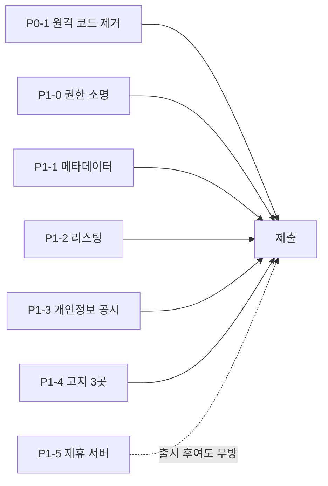

# Chrome Web Store 출시 계획

`AXSDK Assistant`를 CWS에 올리기까지의 작업 목록. 각 항목은 **담당 파트 · 산출물 · 완료 판정**을 갖는다.

담당은 저장소/역할 기준이다. 사람 배정은 이 문서의 권한 밖이다.

| 코드 | 파트 | 저장소 |
|---|---|---|
| **EXT** | 확장·SDK | `axsdk-sdk-js` |
| **SITES** | Lua·flows·사이트 데이터 | `axsdk-sites` (이 저장소) |
| **BE** | 백엔드·앱 패키지·어필리에이트 변환 | `axsdk-backend` |
| **WEB** | 랜딩·개인정보처리방침·리포트 표면 | `axsdk-web` |
| **BIZ** | 정책·제휴 계약·고지 문안 | — |
| **DESIGN** | 스토어 자산 | — |

정책 해석은 이 문서의 권한 밖이다. **[확인필요]**는 심사 제출 전 반드시 확정할 항목.

---

## P0 — 심사 차단 요인 (하나뿐이다)

### P0-1. 원격 코드 실행 제거 · **EXT + SITES**

**실측된 사실**

- 확장은 런타임에 `raw.githubusercontent.com/${owner}/${repo}/${ref}/${path}`에서 Lua를 가져온다.
- 그 Lua를 **번들된 인터프리터(fengari, `dist/content.js`에 포함)**로 실행한다.
- 플로우도 `clientFlows` / `remoteSites` 경로로 원격 수신된다.

**[확인필요·INFERENCE]** MV3는 원격 호스팅 코드를 금지한다. 데이터·설정은 허용되지만, 제어 흐름을
가진 스크립트를 내려받아 해석·실행하는 것은 **코드**로 읽힐 가능성이 높다. 우리 Lua는 반복문·DOM
조작·분기를 가진 로직이다. 이 항목이 심사에서 어떻게 판정되는지가 출시 일정 전체를 좌우한다.

**해야 할 일**

1. **SITES** — `npm run build:lua`가 이미 `dist/_common.lua` + 사이트별 번들을 만든다. 이것을 확장
   패키지에 포함할 수 있는 형태(버전·체크섬 포함)로 산출하는 릴리스 스크립트.
2. **EXT** — 패키지 내 번들을 1순위 소스로 읽고, 원격 fetch는 **기본 OFF**. 개발 프로필에서만 켜지는
   경로로 격리(현재 `ax sync`가 쓰는 stored 경로가 이미 그 모양).
3. **EXT** — 원격에서 계속 받아도 되는 것과 아닌 것을 분리: 사이트 **인덱스·사이트맵·설정 값**은 데이터,
   Lua·flows는 코드로 취급.
4. **BIZ** — 위 해석을 CWS 정책에 대조해 확정. 필요하면 심사 제출 전 사전 문의.

**완료 판정** 확장을 인터넷 없이 설치·실행했을 때 지원 사이트에서 검색·비교가 동작한다.

> **제품 영향**: 사이트 어댑터를 스토어 심사 없이 갱신하던 이점이 사라진다. Lua 변경 = 확장 릴리스.
> 이 트레이드오프를 사업적으로 수용할지 먼저 정해야 한다.

### ~~P0-2. 권한 축소~~ → **P1-0. 권한 소명** · **EXT + BIZ**

> **정정.** 초판은 이것을 심사 차단 요인으로 적었다. 틀렸다. `<all_urls>`는 **금지 대상이 아니고**
> uBlock Origin·Grammarly·비밀번호 관리자 등 널리 쓰인다. CWS가 강제하는 것은 "금지"가 아니라
> **최소 권한** — 선언한 기능에 필요한 것보다 넓으면 안 된다는 규칙이다.

**우리 기능은 실제로 모든 호스트를 필요로 한다.** 근거는 저장소에 있다:

- `_common` 스크립트는 **모든 호스트에 로드되고 off-domain 이동에도 살아남는다** — 사용자가 google.com
  에서 ZIP을 확인하고 업체 사이트로 이동하는 식의 **교차 도메인 진입점**이 그래서 동작한다.
- 어시스턴트 UI 자체가 "어느 사이트에서든" 뜨는 것이 제품 정의다.
- 쇼핑 플로우는 **사용자가 있는 아무 페이지에서 시작해** 상점으로 이동한다(`S.site_for_url` →
  `run_open_site_search`).

즉 애드블록이 모든 사이트를 필요로 하는 것과 같은 종류의 정당성이 있다. 문제는 **거부**가 아니라
**비용 네 가지**다.

| 비용 | 내용 |
|---|---|
| 소명 문안 | 권한별 justification 필드. 부실하면 반려·재문의로 심사가 길어진다 |
| 설치 경고 | "모든 웹사이트의 데이터를 읽고 변경" — 정책 문제가 아니라 **설치 전환율** 문제 |
| 심사 시간 | 광범위 권한은 수동 심사 확률을 높인다 **[INFERENCE]** |
| 결합 위험 | **광범위 권한 + 원격으로 받아 해석하는 코드**의 조합이 P0-1이 겨냥하는 바로 그 패턴으로 보인다. 각각은 넘어가도 함께면 눈에 띈다 |

**실제로 날카로운 항목은 host_permissions가 아니라 MAIN world다.** `page-content.js`가 모든 사이트에
`document_start` · MAIN world로 주입된다. 허용되는 방식이지만 가장 높은 권한이고, 전 사이트에 정말
필요한지는 별개 질문이다.

**해야 할 일**

1. **EXT+BIZ** — 권한 소명 문안 작성. 위의 교차 도메인 진입점 근거를 그대로 쓴다.
2. **EXT** — MAIN world 주입이 전 사이트에 필요한지 재검토. 아니라면 지원 도메인 한정 또는
   `chrome.scripting.registerContentScripts` 동적 등록.
3. **BIZ** — 설치 경고 문구를 감수할지, `optional_host_permissions`로 사이트별 동의를 받을지 결정.
   **컴플라이언스가 아니라 전환율 선택이다.**

**완료 판정** 소명 문안이 준비되고, MAIN world 주입 범위에 대한 결정이 내려져 있다.

---

## P1 — 제출에 필요한 산출물

### P1-1. 매니페스트·메타데이터 정리 · **EXT + DESIGN**

현재 값은 전부 개발용 자리표시자다.

| 항목 | 현재 | 필요 |
|---|---|---|
| `name` | `AXSDK Assistant` | 제품명 확정 |
| `description` | `Show the AXSDK assistant on any website.` | 132자 이내 제품 설명 |
| `version` | `0.1.0` | 릴리스 버전 규칙 |
| 아이콘 | 미확인 | 16/32/48/128 |

### P1-2. 스토어 리스팅 · **DESIGN + BIZ**

- 상세 설명, 스크린샷(1280×800 또는 640×400) 최소 1장, 권장 5장
- 프로모 타일, 카테고리, 언어(ko/en)
- **어필리에이트 고지**를 리스팅 본문에 명시 — CWS Affiliate Ads 정책 요구 3곳 중 하나

### P1-3. 개인정보·데이터 공시 · **BIZ + EXT + WEB**

확장은 **페이지 내용을 읽어 백엔드와 LLM에 보낸다.** 이는 사용자 데이터 취급이다.

1. **WEB** — 개인정보처리방침 URL (`axsdk-web/content/privacy`가 존재하나 확장 실태와 일치하는지 검증 필요)
2. **BIZ** — CWS 데이터 사용 공시 폼: 수집 항목, 목적, 제3자 전송(LLM 공급자 포함)
3. **BIZ** — "제한적 사용(Limited Use)" 준수 서약
4. **EXT** — 공시한 것 이상을 보내지 않는지 실측 대조

### P1-4. 어필리에이트 고지 3곳 · **BIZ + SITES + DESIGN**

CWS Affiliate Ads 정책은 **리스팅 · UI · 설치 전 고지** 세 곳을 요구한다.

| 위치 | 담당 | 현황 |
|---|---|---|
| 스토어 리스팅 | DESIGN/BIZ | 미착수 |
| 확장 UI | SITES | **완료** — 링크와 고지를 함께 생산하고, 터미널이 verbatim 출력하도록 게이트로 고정 |
| 설치 전 고지 | DESIGN/WEB | 미착수 |

### P1-5. 어필리에이트 서버 · **BE**

`AFFILIATE_DESIGN.md` 7단계. `https://api.axsdk.ai/v1/affiliate/deeplink` 미구현.

- HMAC-SHA256 서명, 키는 서버에만
- URL→shortenUrl 캐시
- `affiliate_link_created` 기록
- **BIZ** — 쿠팡 파트너스 가입 + 확장 사용 형태 서면 문의(계정 보호막)

**완료 판정** 확장이 링크를 받아 위젯으로 렌더하고, 클릭이 `axsdk.widget.action`으로 관측된다.

---

## P2 — 품질·안정성

### P2-1. 라이브 게이트 유지 · **SITES**

현재 통과 상태: `check:flows` 121 · `test:lua` 471 · playground 50 · commerce 24/24+17/17 ·
`test:commerce:live:all` 35/35 · `test:commerce:live:discovery` 14/14.

출시 전 재실행하고 결과를 릴리스 노트에 남긴다.

### P2-2. 실계정 부작용 점검 · **SITES + EXT**

- 장바구니 변경은 명시적 선택 턴에서만 발생한다(현재 그러함)
- **주문·결제는 어떤 경로로도 발생하지 않는다** — `check:flows`가 체크아웃 코드에서 place-order 선택자를
  **읽기만** 하고 `click(...)`에 넘기지 않음을 어서션으로 고정하고, 카트 모듈은 체크아웃과 분리되어
  따로 order-free임이 검증된다. 심사 소명에 그대로 쓸 수 있는 근거다
- 심사자가 설치 직후 아무 사이트에서나 열었을 때 무해한지

### P2-3. 오류 표면 · **EXT + SITES**

백엔드·LLM·제휴 서버가 죽었을 때 사용자에게 무엇이 보이는지. 현재 어필리에이트 경로는 링크 없이
비교 결과를 그대로 보여준다(설계 §2.5). 다른 경로도 같은 기준인지 확인.

---

## P3 — 제출과 그 이후

1. **BIZ** — 개발자 계정 등록($5), 판매자 정보
2. **EXT** — 패키지 업로드, 권한 소명 작성
3. 심사 대기. 광범위 권한·데이터 취급 항목이 있으면 수 일~수 주 **[INFERENCE]**
4. 반려 시 사유별 담당 재배정
5. 승인 후: 버전 롤아웃 정책, 크래시·오류 모니터링
6. **BIZ** — 첫 커미션 발생 → 누적 15만원 도달 시 쿠팡 최종승인 심사 대비 스크린샷

---

## 의존 순서

**차단 요인은 P0-1 하나다.** 원격 코드 판정에 따라 확장의 로딩 구조와 릴리스 절차가 달라지므로,
이것이 정해지기 전 패키징 관련 작업은 재작업 대상이다.

권한(P1-0)은 차단 요인이 아니라 **소명과 전환율의 문제**다. 다만 MAIN world 주입 범위를 바꾸기로 하면
콘텐츠 스크립트 주입 방식이 달라지므로 라이브 게이트를 다시 돌려야 한다.

어필리에이트(P1-5)는 **출시 차단 요인이 아니다.** 링크가 없으면 비교 결과만 보여주고 정상 동작한다.

---

## 이 저장소(SITES)가 지금 당장 할 수 있는 것

1. Lua·flows 번들을 확장 패키지에 넣을 수 있는 릴리스 산출물로 만들기 (P0-1의 SITES 몫)
2. 12개 지원 도메인 목록을 단일 소스로 노출 — MAIN world 주입 범위를 좁히기로 할 때 필요하다 (P1-0 지원)
3. 라이브 게이트 재실행 및 결과 기록 (P2-1)

나머지는 EXT·BE·BIZ의 선행 결정을 기다린다.
