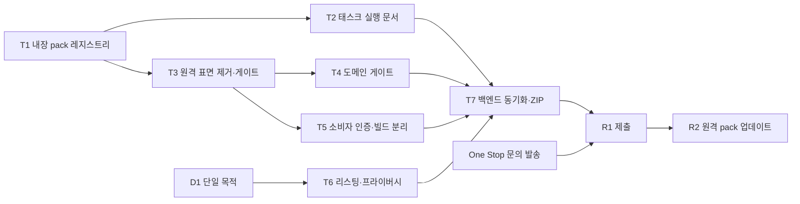

# CWS 배포 기획 · 설계 — R1 임베드 출시, R2 원격 pack 업데이트

확정된 전략(사용자 지시, 2026-08-26):

- **R1 (첫 CWS 릴리스): 모든 pack을 확장 패키지에 임베드해서 배포한다. 원격 pack 취득 경로는 출시 대상이 아니다.**
- **R2 (다음 업데이트): 원격 community pack을 활성화한다.**

이 문서는 그 두 릴리스의 실행 설계다. 역할 분담:

| 문서 | 역할 |
|---|---|
| `CWS_LAUNCH_PLAN.md` | 정책 원문 대조와 차단 요인 등록부 (P0-1…P0-5, P1-*) |
| `CWS_PRODUCT_READINESS_REVIEW.md` | 사용자 여정 기준 준비도 판정 (2026-08-18 NO-GO + 08-22 부록) |
| `COMMUNITY_SCRIPT_IMPLEMENTATION_PLAN.md` | 커뮤니티/유저스크립트 채널의 Phase 등록부 |
| **이 문서** | R1·R2 실행 설계: 트랙, 변경 지점, 먼저 실패시킬 게이트, 완료 정의, 결정 대기 |

§1은 **오늘 다시 측정한 것**이다. 위 문서들은 4~8일 전 상태이고, 뒤집힌 서술은 §8에 모았다.

---

## 1. 오늘 실측 (2026-08-26)

### 1.1 pack 파이프라인 — 생산자와 소비자가 **테스트 안에서만** 연결되어 있다

| 측정 | 값 | 근거 |
|---|---|---|
| 데이터 모델 | `AgentPackManifestV2`(필수 asset `flow`+`taskScript`) · `ProviderPackManifestV2` · `PackReleaseEnvelope` · `CommandContractV1`(effect 5종, 비-read는 사용자 확인 강제) | `axsdk-packs/src/schemas.ts` 1,257줄 |
| 서명 | Ed25519, base64url 정확히 86자 | `schemas.ts:215-222` |
| 바이트 상한 | manifest 1 MiB · flow 512 KiB · script 2 MiB · release 16 MiB | `schemas.ts:28-32` |
| 매체 타입 | flow = `application/vnd.axsdk.flow-fragment+yaml`, script = `application/javascript` | `schemas.ts:707,736-737,785` |
| 생산자 | pack 2종: `layorix.shopping@1.0.0`(agent, flow+task+amazon provider), `example.store-x@1.0.0`(provider) | `tools/packs/first-party.ts` 431줄 |
| 생산자 원본 | `packs/shopping/flow.yaml` 4,887 B · `packs/shopping/src/task.js` 6,124 B · `packs/shopping/providers/amazon.js` 4,742 B · `packs/store-x/src/provider.js` 3,336 B | |
| 생산자 서명 | **빌드 플레이스홀더** `'A'×85+'Q'`, keyId `layorix-first-party-build`. 실제 Ed25519 서명자는 테스트만 주입 | `first-party.ts:22,270-272` |
| 생산자 출력 | **디스크에 쓰지 않는다.** 메모리 반환뿐이고 유일한 호출자는 자기 테스트 | `first-party.test.ts` |
| 소비자 취득 경로 | **네트워크 레지스트리 하나뿐** (`index.json`/`revocations.json`/`releases/<hex>.json`/`assets/<hex>`) | `packs/registry.ts:200,370-555` |
| 프로덕션 레지스트리 | `PACK_REGISTRIES = Object.freeze([])` — "Phase 2 deliberately ships no production root" | `packs/config.ts:17-19` |
| 태스크 실행 문서 | `PACK_TASK_EXECUTOR = undefined` → agent pack 태스크는 `no_executor_document`("The dedicated Pack task executor is not configured") | `packs/config.ts:25`, `background/service-worker.ts:371-377` |
| 임베드 pack 경로 | **없음.** 패키지에서 pack 바이트를 읽는 코드가 존재하지 않는다 | `src/packs/**` 전수 확인 |
| 검증·설치·합성·실행 | 서명→다이제스트→스키마→2단계 승인(설치는 `enabled:false`)→IndexedDB→재검증 합성→`chrome.userScripts` 아티팩트별 월드 | `registry.ts:222-533`, `installer.ts:131-176`, `composer.ts:93-138`, `broker-v2.ts:264-419` |

**결론**: "모든 pack을 임베드한다"는 것은 스위치를 끄는 일이 아니라 **없는 바이트 소스를 새로 만드는 일**이다.
원격 경로는 이미 데이터로 닫혀 있다(레지스트리 목록이 비어 있음). 열려 있는 것은 검증 파이프라인이고,
그건 그대로 재사용해야 한다 — 임베드를 이유로 서명·다이제스트·승인을 우회하면 R2에서 두 개의 경로를 갖게 된다.

### 1.2 소비자 아티팩트 — 원격 코드 표면 (P0-1 / P0-3)

| 측정 | 값 | 근거 |
|---|---|---|
| Fengari 청크 | `dist/assets/fengari-DcdTLR6B.js` **227,867 B** (`32c634427bba`), 서비스워커가 line 2에서 정적 import | dist 스캔 |
| Fengari 인라인 사본 | `dist/widget.js` 2,687,118 B · `dist/assets/session-worker-mRH0tH28.js` 2,159,822 B | `FENGARI_VERSION` ×20 each |
| `raw.githubusercontent.com` | 위 3개 번들에 각 ×5, **그 외 dist 파일 0** | dist 전수 스캔 |
| 그 5회의 출처 | `axsdk-core/src/sites.ts:194,205,224,235` + `src/types/axsdk.ts:74` (원격 사이트 로더) | |
| 원격 스위치 기본값 | `remote_sites`·`remoteSiteFlowsEnabled`·`remoteLuaEnabled` 모두 **`true`** | `extension-cdp/src/shared/config.ts:70-76` |
| 설치기 강제 | 매 서비스워커 시작마다 위 셋을 `false`로 고정 (패키지 검증 성공 시) | `background/workspace-assets.ts:266-271,293-300`, `service-worker.ts:1147-1165` |
| 옵션 페이지 | 원격 Lua/플로우 체크박스 **노출 중** → 다음 워커 시작까지 사용자가 재무장 가능 | `options/options.html:55-56`, `options/main.ts:246-249` |
| `build:cws` | 워크스페이스 다이제스트·에셋·선언 모듈 검증 + manual-QA 마커 12종 스캔. **제거 프로파일 아님** | `scripts/cws-package.mjs:66-127` |

### 1.3 도메인 게이트 (P0-3a) — 구현됐고 **배선되지 않았다**

`ops/domain-gate.ts` + `domain-gate.test.ts`(**25개 테스트**)와 디스패처 분기(`dispatcher.ts:36,91-99`)는 있으나,
프로덕션 생성 지점 `background/service-worker.ts:1392-1413`은 `domainGate`를 넘기지 않는다. 패키지 전체에서
`domainGate` 문자열은 `dispatcher.ts`와 그 테스트에만 있다(직접 확인). 따라서 오늘 페이지 op를 제한하는 것은
**세션 탭 그룹 멤버십**(`dispatcher.ts:83-88`)과 위험 동작 동의뿐이며, Site Access를 좁힌 사용자에게도
`chrome.debugger` 경로는 모든 페이지에 도달한다.

### 1.4 릴리스 파이프라인 — 구현 완료, 백엔드 상태 불일치

오늘 `npm run release:cws` 실행 결과:

```
CWS workspace sha256:75f134d684fd…: 32 assets, 26 modules
Error: backend module drift: stale _common.61_rpc_storefront, … (21건), missing _common.75_rpc_community
```

게이트는 **의도대로 닫혔다** — ZIP도 사이드카도 쓰이지 않았다. releaseId는
`sha256(확장 파일 해시 + 워크스페이스 다이제스트 + 런타임 모듈 해시 + 백엔드{appId, revision, moduleHashes})`이므로,
백엔드 동기화 없이 재현 가능한 제출 ZIP은 존재할 수 없다. 백엔드를 쓰는 경로는
`tools/rpc-package.mjs push --modules-only` 하나뿐이고 프로덕션 쓰기는 승인 사항이다.

### 1.5 매니페스트와 없는 산출물

`src/manifest.json` = `dist/manifest.json` (1,603 B): name `AXSDK Assistant (CDP)`, version `0.1.0`,
`minimum_chrome_version 138`, 권한 7종(`storage`, `userScripts`, `debugger`, `offscreen`, `tabGroups`,
`declarativeNetRequestWithHostAccess`, `scripting`), `host_permissions` `http://*/*`+`https://*/*`, 아이콘 4종, 고정 `key`.

**두 저장소 어디에도 없는 것**: 스크린샷(1280×800), 타일(440×280), 마키(1400×560), 스토어 긴 설명,
개인정보 처리방침 URL, 지원/홈페이지 URL, 권한 7종 + 광범위 호스트 소명 문구, `_locales/en|ko`,
데이터 사용 공시문, `.env.example`, 소비자 로그인, 개발자 표면 분리.

### 1.6 개발자 콘솔에서만 할 수 있는 일 (계정 소유자)

공식 문서 기준(`register`, `set-up-account`, `cws-dashboard-listing`, `cws-dashboard-privacy`,
`cws-dashboard-distribution`, `manifest/key`)으로, 우리가 코드로 대신할 수 없는 항목:

| 시점 | 콘솔 작업 | 비고 |
|---|---|---|
| 지금 | 개발자 등록(일회성 등록비) + 약관 동의 | **계정 이메일은 이후 변경 불가** — 전용/조직 계정 권장 |
| 지금 | Account 페이지: Publisher name(필수), 연락 이메일 **인증**(필수), Trusted testers(비공개 배포용) | 물리 주소는 **유료 기능이 있을 때만** 필수 |
| 지금 | **드래프트 아이템 생성 → Package 탭 → View public key** | 그 공개키가 `src/manifest.json`의 `key`가 되어야 스토어 ID와 개발 ID가 일치한다. 현재 키는 로컬 생성분이고 그 id는 6개 파일에 문자열로 남아 있다 |
| 지금 | Official URL(검증된 게시자) — Search Console 도메인 소유 확인 | 도메인 소유자만 가능 |
| 산출물 후 | Store listing: 긴 설명 · 카테고리 · 언어 · 스토어 아이콘 128 · 스크린샷 1280×800(1~5) · 타일 440×280 · 마키 1400×560(선택) · Homepage/Support URL · Mature content 선언 | 문안·이미지는 T6가 파일로 공급 |
| 산출물 후 | Privacy practices: **Single purpose**(D1) · 권한 7종 + 호스트 소명 · **Remote code 선언** · Data usage 체크박스 2세트(수집 항목 + Limited Use 인증) · 개인정보 URL | 문서 원문: 원격 코드를 쓰면서 신고하지 않으면 **거절**, 신고해도 심사 지연 |
| 산출물 후 | Distribution: Visibility(Public / Unlisted / Private+테스터·그룹) · 지역 | D3의 결과가 여기서 선택된다 |

**Remote code 필드가 T3의 기한을 정한다**: 오늘 dist에는 3개 번들 × `raw.githubusercontent.com` 5회와 Fengari가
있다. T3 전에 제출하면 "Yes, I am using remote code"를 써야 하고, T3 후에는 "No"를 게이트가 증명한다.

---

## 2. R1의 정체성 — 헌장과 제품이 서로 다른 말을 한다

`build:cws`가 매번 검증하는 `community/release-policy.json`의 헌장은 이렇다:

> AXSDK installs, manages, and runs **user-selected community web-automation scripts** on websites explicitly authorized by the user.

같은 파일이 `executionApi: chrome.userScripts`, `artifacts.executionLanguage: javascript`,
`luaPublication: deterministic_javascript_before_review`, `remoteInterpreter: false`를 못 박는다
(`tools/community-release-policy.mjs:64-107`).

그런데 **R1은 정의상 "사용자가 고른 커뮤니티 스크립트"를 설치하지 않는다** — 모든 pack이 임베드되고 원격 취득이 없다.
R1의 단일 목적 문장은 **임베드된 1차 당사자 pack으로 웹사이트를 대신 조작하는 에이전트**를 서술해야 하고,
현재 헌장 문장은 **R2의 제품**을 서술한다. 제출 시점에 문장을 즉석에서 만들면 이 불일치가 그대로 심사자에게 간다.

권고: 헌장 파일을 **릴리스별로 분리**한다 — `community/release-policy.json`은 R2(커뮤니티 트랙) 정책으로 범위를 명시하고,
R1은 `store/single-purpose.md`에 자기 문장을 갖고 `check:listing`이 그 존재를 강제한다. 게이트를 느슨하게 하지 않고
두 릴리스가 각자 참인 문장을 갖는다. → **결정 D1**

---

## 3. R1 설계

각 트랙은 **먼저 실패하는 게이트**로 시작한다. 이 저장소에서 반복 확인된 이유 때문이다: 검증이 없으면 다음 사람이
되돌릴 수 있고, 통과할 수 없는 선언은 통과하지 않는다는 사실조차 아무도 모른다.

### T1 — 패키지 내장 pack 레지스트리 (R1의 핵심, 신규 메커니즘)

**먼저 RED**: "임베드된 pack 2종이 신규 프로필에서 설치·활성 가능하다"를 주장하는 테스트. 오늘은
`PACK_REGISTRIES = []`이므로 취득 자체가 불가능해 실패한다.

**설계**

1. **생산자를 디스크로 내보낸다.** `tools/packs/first-party.ts`의 메모리 산출물을 패키지 레이아웃으로 쓰는
   빌드 스크립트(`tools/build-pack-registry.mjs`)를 추가한다. 레이아웃은 `packs/registry.ts:152-158`이 이미 기대하는 모양:
   `pack-registry/index.json`, `revocations.json`, `releases/<hex>.json`, `assets/<hex>`.
2. **패키지 fetch 구현을 넣는다.** `packs/config.ts:17,22`가 유일한 진입점이다. `PACK_REGISTRIES`에 패키지
   레지스트리 1개(고정 origin + 패키지된 Ed25519 신뢰 루트)를 싣고, `PACK_REGISTRY_FETCH`를
   `chrome.runtime.getURL('pack-registry/…')`를 읽는 구현으로 바꾼다. **검증 우회는 없다**: 서명·다이제스트·스키마·
   2단계 승인·비활성 기본값·합성 재검증이 모두 그대로 돈다. 같은 모양이 이미 두 곳에서 증명돼 있다 —
   `packs/manual-qa.ts:209-213`(패키지된 서명 응답을 fetch로 서빙)과
   `background/workspace-assets.ts:193-247`(`chrome.runtime.getURL` + 에셋별 다이제스트 확인).
3. **실서명으로 바꾼다.** 플레이스홀더 `'A'×85+'Q'`는 R1에 나갈 수 없다. R1 서명 키의 보관 주체가 곧 R2의
   레지스트리 키 관리자다 → **결정 D4**. 결정이 늦으면 R1은 빌드 키로 서명하고 "이 패키지 내부 무결성 한정,
   R2에서 대체"라고 문서에 명시한다 — 다만 그 문장을 코드 주석이 아니라 릴리스 노트에 남긴다.
4. **워크스페이스 매니페스트에 얹지 않는다.** C3는 Lua 참조 그래프(`.txt` 에셋)이고 pack은 서명 봉투 + 자체 바이트 상한을
   가진 별개 주소 공간이다. 형제 디렉터리로 둔다.

**증거**: `build:cws`가 pack 레지스트리 파일 존재·해시·서명을 검증(신규 게이트) · 신규 프로필에서 pack 2종 설치→활성→
합성 flowDocument 생성 · `test:packs` 그린 · 아티팩트 스모크에서 임베드 pack이 실제 턴을 수행.

### T2 — pack 태스크 실행 문서

**측정된 제약**: agent pack의 `execution.role = 'task'`는 `PACK_TASK_EXECUTOR` **URL 문서**에서 실행된다
(`service-worker.ts:362-448`). 프로덕션은 `undefined`라서 임베드 pack을 넣어도 태스크는
`no_executor_document`로 거부된다. `chrome.userScripts`는 확장 오리진 문서에 주입되지 않으므로 실제 웹 문서가 필요하다.

**결정 필요(D2)**: (a) 우리 오리진의 정적 실행 문서를 배포하고 마커를 고정 검증할 것인가, (b) R1 pack을
provider/read 계열로 한정해 태스크 역할을 쓰지 않을 것인가. (b)는 `layorix.shopping`이 `taskScript`를 **필수 에셋으로
선언**하므로 pack 재설계를 뜻한다(`schemas.ts:736-737`).

**먼저 RED**: 임베드 agent pack의 명령 1개를 실행하는 테스트 — 오늘 `no_executor_document`로 실패한다.

### T3 — 원격 소스 진입점 폐쇄 · **완료 2026-08-26**

결정(사용자): **코드는 제거하지 않고 진입점만 닫는다.** 로더와 인터프리터는 컴파일된 채 남고, 원격 소스를
무장할 수 있는 **표면**이 사라진다.

**먼저 RED — 세 개의 관찰 가능한 계약, 4건 실패로 시작**

1. `src/shared/config.test.ts` — 저장소가 아무 말도 하지 않을 때 원격 플래그 4종이 모두 off. (당시 기본값 `true`)
2. `src/options/fields.test.ts` — 옵션 폼이 바인딩하는 필드 집합에 원격 소스 설정이 없다. 이걸 테스트 가능한
   계약으로 만들려고 `TEXT_FIELDS`/`FLAG_FIELDS`를 `src/options/fields.ts`로 먼저 **기계적으로** 분리했다
   (동작 무변경 확인: 1271 pass).
3. `scripts/cws-remote-surface-gate.test.mjs` — `assertNoRemoteSourceControls`가 원격 컨트롤을 선언한 트리를
   거부하고, **이 저장소가 실제로 싣는 옵션 페이지에는 하나도 없다**. 마지막 케이스가 그날의 RED였다.

**변경 지점 (구현)**

| 위치 | 변경 |
|---|---|
| `src/shared/config.ts:67-79` | `remote_sites`·`remoteSiteFlowsEnabled`·`remoteLuaEnabled`·`remoteWidgetsEnabled` 기본값 **false**. 명시적 `true`로만 무장 |
| `src/options/fields.ts` | 원격 5종(`sitesSource` 포함)을 바인딩 집합에서 제거 |
| `src/options/options.html:50-63` | 원격 체크박스 4종 + 인덱스 Git URL 입력 + `siteLayers` 필드셋 제거. 이유를 주석으로 남김. 로컬 스위치(`storedFlowsEnabled`/`storedLuaEnabled`)는 유지 |
| `src/options/main.ts` | `syncSiteLayers`와 그 리스너 삭제, 레코더 힌트가 읽던 `remoteLuaEnabled` 체크박스 참조 제거 |
| `scripts/cws-package.mjs` | `assertNoRemoteSourceControls`를 `build:cws`의 dist 단계에 배선 (manual-QA 마커 스캔과 같은 자리) |

게이트는 **HTML의 id**를 본다. 같은 이름의 설정 키와 로더 코드는 남아 있어야 하므로 번들 텍스트를 스캔하면
영원히 실패한다 — id는 컨트롤이 도달 가능해지는 지점이고, 그것이 닫으려던 대상이다.

**증거**: 뮤테이션 2건(컨트롤 되살리기 → 게이트 red, 원격 필드 재바인딩 → 폼 계약 red) · 확장 스위트
**1281 pass 0 fail** · `axsdk-core 834` · `build:cws` 그린 · dist 옵션 페이지 원격 컨트롤 **0**, 로컬 스위치 2종 유지 ·
라이브 11st 검색 턴 정상.

**기본값 변경이 드러낸 것**: 기존 테스트 5건이 옛 기본값을 통째로 비교하고 있었다. 계약(`undefined`가
`AXSDK.init`에 닿지 않는다, 스위치가 파생 옵션을 구동한다)은 그대로이고 출발점만 옮겨, "on" 케이스가 이제
`remote_sites: true`를 명시한다.

**하지 않는 것**: Fengari와 사이트 로더 코드 제거(§4.3). 따라서 dist에는 여전히
`raw.githubusercontent.com` 문자열(3번들 × 5회)과 Fengari 227,867 B가 있다.

**Privacy 탭 Remote code 답변에 대한 정직한 정리**: 이제 참인 것은 "**도달 가능한 경로로는 원격 코드를 실행하지
않는다**" — 기본값 off, 옵션 페이지에 컨트롤 없음, 세션 시작마다 강제 off, 그리고 그 상태를 빌드 게이트가 고정.
참이 **아닌** 것은 "바이트에 원격 취득 코드가 없다". 심사자가 정적 분석으로 문자열을 발견할 수 있으므로,
D7(One Stop 문의)의 답이 이 칸을 어떻게 쓸지 결정한다. 게이트가 "No"를 증명한다고 쓰지 않는다.

### T4 — 도메인 게이트 배선 (P0-3a)

**먼저 RED**: 프로덕션 디스패처 생성이 도메인 게이트를 공급하는지 검사하는 테스트(오늘 실패).

**변경 지점**: `background/service-worker.ts:1392`에 `createDomainGate` + `domainAllowlistFor` +
`productSitesFromIndex` + `createNavigationInvalidatedDomainGate` + `createDebuggerLocationReader` 주입.
모두 구현되어 있고 호출자가 없다.

**증거**: Site Access = *On click*에서 미승인 도메인 op가 `domain_not_approved`로 거부되고 승인 도메인은 통과 ·
사용자에게 보이는 허용 목록 · `qa:real` 유지.

### T5 — 소비자 인증·온보딩 + 개발자/소비자 빌드 분리 (P0-2, Phase 8)

**먼저 RED**: (a) 신규 프로필에서 "설정 없이 시작"이 소비자 문장으로 안내되는지, (b) 소비자 dist에 Lua 콘솔·레코더·
API 키 입력이 **없는지**(T3의 마커 게이트 확장).

**변경 지점**: 소비자 로그인 경로(`src/shared/start-readiness.ts:8-10`의 "Sign in or configure"가 실제로 가리킬 곳),
명시적 준비 상태, 실패 시 재시도·설정·중지, `__AXSDK_CONSUMER__` 정의로 `options.html:41-44`(키/App ID)·
`:50-70`(원격 토글)·`:190-193`(Lua 콘솔)·`:203-206`(레코더) 차단. 인증 방식은 백엔드 지원 필요 → **결정 D3**.

### T6 — 리스팅·프라이버시 산출물 (P0-4, P1-8)

즉석 문구로 제출하지 않기 위해 제출물을 저장소 파일로 만든다:

| 파일 | 내용 |
|---|---|
| `store/single-purpose.md` | R1 단일 목적 문장(D1) |
| `store/listing.md` | 제품명, 짧은/긴 설명, 카테고리 |
| `store/permissions.md` | 권한 7종 + 광범위 호스트 소명 각 한 단락 (`debugger`가 핵심) |
| `store/privacy.md` | 확장 전용 수집·사용·공유·보관 표, 수신자(백엔드·모델), 삭제 수단, Limited Use 확약 |
| `store/assets/` | 스크린샷 1280×800, 타일 440×280, 마키 1400×560 |
| `_locales/en`, `_locales/ko` | 매니페스트 name/description을 `__MSG_*__`로 |

**먼저 RED**: `check:listing` — 위 파일·섹션과 매니페스트의 `homepage_url`·개인정보 URL 존재 검사. 오늘 전부 없음.

### T7 — 릴리스 아토믹성 종결 (P0-6)

1. 백엔드 모듈 동기화: `node tools/rpc-package.mjs push --app=$AXSDK_APP_ID --modules-only` — **승인 필요(D5)**.
   오늘 불일치 22건.
2. `release:cws` 그린 → `dist/axsdk-extension-cdp-cws.zip` + 사이드카.
3. `.env.example`(이름만) 커밋 — `tools/build-cws-release.mjs`는 `.env`를 요구한다.
4. 깨끗한 체크아웃에서 동일 releaseId 재현.

---

## 4. R2 설계 — 원격 community pack 활성화

R1이 나간 뒤 **켜는 일**이지, 새로 만드는 일이 아니다. 이미 구현·테스트된 것: 서명 레지스트리(Ed25519),
아티팩트 캐시(읽을 때 해시), 2단계 승인 설치(기본 비활성), 재조정기, 아티팩트별 `USER_SCRIPT` 월드,
포트 브로커(선언 명령 화이트리스트·호출별 동의·출력 상한), 취소 피드.

### 4.1 켜지는 것

1. `PACK_REGISTRIES`에 **원격 레지스트리 origin + 리뷰된 Ed25519 루트** 추가 (`packs/config.ts:17`).
   R1의 패키지 레지스트리는 그대로 남는다 — 1차 당사자 pack은 계속 패키지에서 온다.
2. 옵션 UI의 조회/새로고침/설치 흐름 활성화 (`options/packs.ts:283-290`의 "Installation stays closed" 해제).
3. 취소 피드 폴링과 원자적 롤백(`updates.automatic: false`, `atomicRollback: true` — 정책 파일이 이미 못 박음).

### 4.2 필요한 발행 인프라 (Phase 9, 오늘 RED)

서명 키 관리자, 리뷰어 소유권, 발행 CI, Tier 2 검증기. **구현이 아니라 결정에 막혀 있다**(D4).

### 4.3 그 다음 (선택) — Fengari 제거

사이트 특화 Lua **7파일 4,207줄**(`61_rpc_storefront` 956 · `62_rpc_sites` 942 · `65_rpc_quote` 1,082 ·
`67_rpc_cart` 463 · `64_rpc_thumbtack` 270 · `66_rpc_navigate` 269 · `68_rpc_checkout` 225)을 컴파일된 JS
pack 스크립트로 옮기면 인터프리터가 소비자 빌드에서 사라진다. 엔진 로직 7파일 1,602줄(memory·offers·widget·zip·
sitemap·pure·community)은 이전 대상이 아니다. 그때 `FENGARI_VERSION`을 마커 게이트에 넣는다.

---

## 5. 실행 순서



T1이 선행인 이유: R1의 정체성(§2)과 T3의 게이트 문구, T6의 소명 문장이 모두 "pack이 어디서 오는가"에 달려 있다.
T3·T4·T5·T6은 서로 독립이라 병렬로 간다.

## 6. 제출 체크리스트

- [ ] 단일 목적 문장(D1) · 짧은/긴 설명 · 카테고리
- [ ] 스크린샷 ≥1(1280×800) · 타일 440×280 · 마키 1400×560
- [ ] 권한 7종 + 광범위 호스트 소명(`debugger` 포함)
- [ ] 개인정보 처리방침 URL(확장 전용 서술) · 지원 URL · 데이터 사용 공시 · Limited Use 확약
- [ ] dist에 `raw.githubusercontent.com` 0회, `PACK_REGISTRIES`가 패키지 레지스트리 전용 — 게이트가 증명
- [ ] 임베드 pack 2종이 신규 프로필에서 설치→활성→실제 턴 수행
- [ ] 업로드 ZIP = `release:cws`가 검증·자기추출·재검증한 바이트, releaseId가 런타임 보고값과 동일
- [ ] `test:cws:artifact` 그린(신규 프로필, 패키지 소스만, 주문 없음)
- [ ] One Stop 문의 답변 수신

## 7. 결정 필요 — 선택지와 권고

| # | 결정 | 소유 | 막는 것 | SITES 권고 |
|---|---|---|---|---|
| D1 | R1 단일 목적 문장 + 헌장 범위 | BIZ + EXT | T6, 제출 | **A안 + 헌장 R2 범위 명시** |
| D2 | pack 태스크 실행 문서 | EXT | T2 | **provider-only R1** (측정 후 확정) |
| D3 | 소비자 인증 | BIZ + 백엔드 | T5 | **비공개(unlisted) R1** |
| D4 | pack 서명 키 보관 · 리뷰어 | BIZ | T1, R2 | **CRX 키와 같은 보관 주체** |
| D5 | 프로덕션 모듈 푸시 승인 | 사용자 | T7 | **승인** |
| D6 | 호스트 권한을 좁힐 것인가 | EXT + BIZ | T6 소명 | **필수 all-hosts 유지 + T4 배선** |
| D7 | One Stop 문의 발송 | BIZ | 제출 판단 | **지금 발송** |
| D8 | R1에 community `from-url` 설치 포함 여부 | EXT | T3 | **제외** |

### D1 — 단일 목적 문장과 헌장 범위

사실: `community/release-policy.json`의 헌장은 `tools/community-release-policy.mjs:67`가 **문자열 동일성으로**
검증한다. 그 문장은 "사용자가 고른 커뮤니티 스크립트를 설치·관리·실행한다"이고, R1은 정의상 그걸 하지 않는다.
한편 `CWS_LAUNCH_PLAN.md` §P0-3에 실측이 붙은 세 문장(A/B/C)이 이미 초안으로 있다.

| 선택 | 내용 | 비용 |
|---|---|---|
| **A (권고)** | *"지원 쇼핑몰에서 한 상품의 배송비 포함 총액을 비교하고, 사용자가 고른 상품을 장바구니에 넣고 결제 화면까지 안내한다."* | 스토어 빌드에서 견적·메모리·bluemoonsoft 제외, **캡처 훅 삭제**, `defaultIntent` 이전. 패키지 24% 감소. 임베드 pack(`layorix.shopping` + `example.store-x`)이 문장과 1:1 |
| B | 쇼핑 + 지역 서비스 견적 | 모듈 1.1%만 덜어냄. §1 "묶음" 리스크가 A보다 높다(소매와 리드 생성은 다른 버티컬로 읽힌다) |
| C | 문장 없음 | 권하지 않는다. §1이 이름으로 지목하는 구성 |

헌장은 **파일 자체를 R2 트랙 정책으로 범위 명시**하고, R1 문장은 `store/single-purpose.md`가 갖고
`check:listing`이 존재를 강제한다. 게이트를 느슨하게 하지 않고 두 릴리스가 각자 참인 문장을 갖는다.

### D2 — pack 태스크 실행 문서

사실: agent pack의 `execution.role = 'task'`는 `PACK_TASK_EXECUTOR` **URL 문서**에서 돌고, 프로덕션은
`undefined`다(`packs/config.ts:25` → `service-worker.ts:371-377`). `chrome.userScripts`는 확장 오리진 문서에
주입되지 않으므로 패키지된 HTML로 대체할 수 없다. provider pack의 스크립트는 **스토어 페이지 자체**에
주입되고 승인 오리진으로 제한된다(`broker-v2.ts:434-438`).

| 선택 | 내용 | 비용·위험 |
|---|---|---|
| **(c) provider-only R1 (권고)** | R1 임베드 대상을 provider pack으로 한정. 에이전트 본체는 이미 패키지된 Lua 플로우가 담당 | 실행 문서 배포 불필요, 네트워크 의존 0. **선행 측정 1건**: task 바인딩 없이 pack 세트가 합성·실행되는지 |
| (a) 정적 실행 문서 배포 | 우리 오리진에 문서 배포 + 마커 고정 | 웹 배포와 리뷰 대응이 R1 경로에 추가된다. R1이 "완전 로컬"이라는 주장에 문서 로드가 끼어든다 |
| (b) agent pack 재설계 | `taskScript` 필수 에셋을 우회 | 스키마가 필수로 못 박아(`schemas.ts:736-737`) pack 재설계를 뜻한다 |

### D3 — 소비자 인증

사실: 옵션 페이지가 API 키·App ID를 직접 받고(`options.html:41-44`), 프리플라이트 문구는
"Sign in or configure AXSDK"인데 **가리킬 로그인이 없다**(`shared/start-readiness.ts:8-10`).

| 선택 | 내용 | 비용 |
|---|---|---|
| **(c) 비공개 릴리스로 R1 (권고)** | CWS 비공개/그룹 배포로 첫 릴리스를 내고 공개 등재 전에 인증을 붙인다 | P0-2가 **공개 등재 조건**으로 이동한다. 실제 스토어 아티팩트·심사 경험을 먼저 확보 |
| (a) 호스팅 로그인 | axsdk.ai 로그인이 기기 범위 키를 확장에 주입 | 백엔드 엔드포인트 + 리다이렉트 처리 |
| (b) 확장 내 이메일/비밀번호 | 새 백엔드 엔드포인트 | 우리가 비밀번호를 다루게 된다. 권하지 않는다 |

### D4 — pack 서명 키 보관과 리뷰어

사실: 생산자의 서명은 플레이스홀더 `'A'×85+'Q'`(`first-party.ts:22`)라서 그대로는 검증을 통과하지 못한다.
검증을 우회하면 R1과 R2가 서로 다른 경로를 갖게 되는데, 그건 이 설계가 피하려는 바로 그 상태다.

| 선택 | 내용 | 비용 |
|---|---|---|
| **(a) CRX 키와 같은 보관 주체 (권고)** | 릴리스 시 오프라인 키로 서명(수동 단계) | 절차 1개 추가. R2의 발행 키 결정까지 그대로 이어진다 |
| (b) 빌드 키 + 릴리스 노트 명시 | R1 임베드 한정 무결성, R2에서 대체 | 임베드 바이트는 CRX 서명이 이미 덮지만, "서명이 무엇을 증명하는가"를 문서로 남겨야 한다 |

### D5 — 프로덕션 백엔드 모듈 푸시 (사용자 승인)

`node tools/rpc-package.mjs push --app=$AXSDK_APP_ID --modules-only`. 오늘 불일치 22건(21 stale + 1 missing).
`--modules-only`는 앱의 `luaModules`만 바꾸고 **flow 문서는 건드리지 않는다**(전체 푸시는 프로덕션에서 거부된다,
`rpc-package.mjs:147-150`). 올라가는 모듈은 이번 주 라이브 검증에 쓴 바로 그 코드다. 승인 없이는 `release:cws`가
계속 닫히고 제출 ZIP이 존재할 수 없다.

### D6 — 호스트 권한

측정된 사실이 이 결정을 바꾼다: **호스트 권한은 페이지 경계가 아니다.** Site Access를 *On click*으로 좁혀
`origins: []`가 되어도 `chrome.debugger` 경로는 페이지를 읽는다(08-22 부록 P0-3a). 따라서 호스트를 optional로
옮기는 것은 **경계를 좁히지 않고 좁힌 것처럼 보이게 한다**. 실제 경계는 T4의 도메인 게이트다.
권고: R1은 필수 all-hosts를 유지하고 백엔드 fetch + DNR 규칙으로 소명하되, **T4를 반드시 함께 낸다.**

### D7 — One Stop 문의 (`CWS_ONE_STOP_INQUIRIES.md`, 작성 완료)

발송 비용 0, 답변은 P0-1/P0-3을 **판단에서 사실로** 바꾼다. "패키지에서 검증된 바이트만 실행하는 인터프리터"가
수용되지 않는다는 답이 오면 R1 범위가 바뀌므로(§4.3의 Fengari 제거가 제출 선행조건이 된다), **T1보다 먼저 보낸다.**

### D8 — community `from-url` 설치의 R1 포함 여부

`options/community.ts:22` → `community/from-url.ts`는 사용자가 URL로 스크립트를 설치하는 경로다. R1에 그 표면이
있으면 §2의 단일 목적 문장이 다시 흔들리고, 정책 파일의 `trust.arbitraryUrlImport: false`와도 어긋나 보인다.
권고: **R1 소비자 빌드에서 제외**하고 R2에서 레지스트리 경로와 함께 다시 판단한다.

## 8. 이 문서가 뒤집은 기존 서술

| 서술 | 어디 | 오늘 측정 |
|---|---|---|
| Phase 4 "도메인 게이트가 디스패처 단일 생성 지점에 배선됨 · Complete" | `COMMUNITY_SCRIPT_IMPLEMENTATION_PLAN.md:404-407` | **배선 없음**, 프로덕션 호출자 0 (§1.3). 테스트 25개 주장은 정확 |
| 워크스페이스 "31 assets / 25 modules" | 준비도 리뷰 P0-1 | **32 assets / 26 modules** (`75_rpc_community` 추가) |
| RPC 모듈 "14 → 13" | 준비도 리뷰 P1-5 | `_common/rpc` 오늘 **14 파일** |
| P0-6 "revision 125, 21 stale" | 준비도 리뷰 P0-6 | 오늘 **21 stale + 1 missing = 22** (§1.4) |
| `build:cws`가 CWS 전용(제거) 프로파일 | 암시적 | 검증 전용, 제거하는 코드 없음 |
| pack 파이프라인이 출시 가능한 상태 | 암시적 | 생산자 출력이 **디스크에 없고** 서명이 플레이스홀더, 임베드 경로 없음, 태스크 실행 문서 미구성 (§1.1) |
