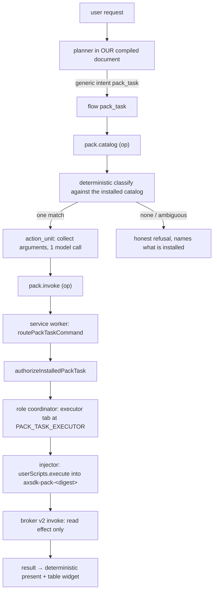

# External Pack Task — Design and Work Plan

**Status:** design measured 2026-08-27. Scenario decided: comparative service quotes (§9). **X0 closed**
(all four measured; two corrected the design) and **X1 done** (`6a74428`, `f2dac2b` in `axsdk-sdk-js`).
Next action is X2 — publish the signed registry, which now also unblocks the first live `pack.catalog`.
**Scope:** load a Pack from a **published external registry** into the shipping CDP extension, and route a
user request to the **new agentic task it carries**, without changing the submitted CWS artifact.

This document is a milestone plan that deliberately **sidesteps Phase 4** of
`USER_SCRIPT_AGENT_PACK_IMPLEMENTATION_PLAN.md`. It does not replace that program; §3 states exactly which
part of it this bridge occupies and what supersedes the bridge.

---

## 1. What already exists (do not rebuild)

Measured state as of 2026-08-27 (full report in the session record; counts from direct reads):

| capability | where | evidence |
|---|---|---|
| signed registry fetch + Ed25519 trust roots + monotonic index/revocation sequences | `packs/registry.ts` (555 lines) | `registry-installer.test.ts` 13 blocks |
| content-addressed IndexedDB, re-hashed on every read | `packs/artifact-store-idb.ts` | 4 blocks |
| two-phase approval install, release lands `enabled:false` | `packs/installer.ts`, `store.ts` | 13 + 6 blocks |
| composition, journaled activation, rollback, revocation, GC | `packs/manager.ts` (583), `composer.ts` | 18 blocks · `test:packs:phase2:live` |
| exact one-document injection into a digest-named `USER_SCRIPT` world | `packs/injector.ts` (476) | 9 blocks · P3-C live |
| authenticated dispatch, read-effect-only, queue cap 8, 15 s deadline | `packs/broker-v2.ts` (523) | 10 blocks · P3-D1 live round trip |
| role tabs, leases, worker-restart recovery | `role-coordinator.ts`, `role-recovery.ts` | 8 + 7 blocks · P3-E live |
| options-page lifecycle UI | `options/packs.ts` (337) | MV-0A / MV-0B manual proof |

`src/packs/**` is **106 test blocks / 13 files, zero TODO markers.** Phases 0–3 (minus P3-D2, deferred by
design) are measured GREEN. **Nothing in this plan reimplements any row above.**

## 2. Measured constraints that shape the design

Each was read or executed on 2026-08-27. They are the reason the design looks the way it does.

**M1 — an agent Pack must carry a task script.** `AgentPackManifestV2Schema` requires `assets.flow`
(`application/vnd.axsdk.flow-fragment+yaml`) **and** `assets.taskScript` (`application/javascript`)
unconditionally (`axsdk-packs/src/schemas.ts:736-737`), pins `execution.role: z.literal('task')` and
`execution.target: z.literal('axsdk_task_executor')` (`:645-648`), and requires
`routeContributions` **min(1)** (`:649`).

**M2 — a provider-only Pack set cannot compose.** *"At least one enabled agent pack is required to compose
an active pack set."* (`axsdk-packs/src/composer.ts:269`), and every provider must target an existing agent
pack (`:1003`). The task binding is therefore always produced (`:366-382`, `assets.taskScript!`).
**Consequence: the hosted task-executor document is mandatory, not an option.** This retires
`CWS_RELEASE_DESIGN.md` D2 option (c) ("provider-only") for any *set*; it remains true only for a single
provider Pack that never composes.

**M3 — the designed routing surface is the composed flow document.**
`RouteContributionV2 = { intent, entry, description, examples[] }` (`schemas.ts:461-466`) is exactly the
shape of a `router.routes[]` entry in `_common/flows.yaml`. So the architecture routes by **merging the
Pack's route into the session flow document**, which requires the platform's `community.task` /
`community.provider` action kinds (plan §11.3) — **not built.**

**M4 — the flow compiler exists in no available checkout.** Swept all 34 sibling directories for
`action_unit|action_contract|stalledNext|invalidNext|flowTools|routableIntents`: hits only in
`axsdk-sdk-js` (core tests, 136) and `axsdk-sites` (our authored documents + tools, 210). `axsdk-backend/src`
has **0** occurrences of `flowDocument|compileFlow|flowCompiler|luaModules|community.task`, and
`src/routes/axsdk/` is `calls · data · index · knowledge · questions · sessions`. `AXSDK_BASE_URL` is
`https://local.axsdk.ai`, a service whose source is not present.
**Consequence: Phase 4 stays blocked outside our repositories. The route must come from our own document.**

**M5 — the unlock: the compiler does not enforce a closed `rpc.allow` vocabulary.** `tools/rpc-allow.mjs`
mirrors the platform's op list from `GET /axsdk/v2/lua/ops` (version `sha256:0bb4bf33418e`), which reads as
a closed vocabulary. Measured otherwise: `pack.invoke` was added to `shopping_rank_store_offers`'s grant in
the authored document, stored through `npm run cdp`, and one turn answered its **ordinary terminal**. A
document that fails to compile answers *"플로우 설정을 불러오지 못했습니다"* on **every** intent
(`AGENTS.md` §9), so an ordinary answer is a compiled document. Reverted: `_common/flows.yaml` is
byte-identical to HEAD (`md5 2e3604ab…`, 261,960 B) and `check:flows` is 235/0.
**Consequence: a client-side op is a legal wire for a flow tool without any platform change.**
Runtime behaviour of an op the client never registered is already recorded: `command_unresolved`
(`AGENTS.md` §13, measured for `memory.*`) — so the op must be registered client-side to answer.

**M6 — the two production valves are data, not code.** `packs/config.ts:17` `PACK_REGISTRIES = []` →
`registry_not_configured` for every install; `:25` `PACK_TASK_EXECUTOR = undefined` →
`background/service-worker.ts:371-377` refuses every task with `no_executor_document`.

## 3. Design decision

**Route from our own compiled document; let the Pack own the task's code.**

The Pack supplies: its declared commands and schemas, the JavaScript that implements them (task +
providers), its site matches, its disclosures, and — as catalog metadata — its own
`routeContributions.description/examples`. Our document supplies: one generic routable intent, the model
turn that collects arguments, and the deterministic dispatch. Dispatch travels a **new client op**, so the
platform needs no new action kind.

**This is a bridge, and it must stay one.** It exists because of M3 + M4. When the platform ships the
`community.task` action kind and a compile route, the Pack's own `routeContributions` become the routing
surface and this generic intent is **deleted** — not kept beside it. Two permanent routing mechanisms for
one capability is the failure this repo has paid for twice (`AGENTS.md` §13: the duplicate storefront stack;
the duplicate shipping parser). §7 pins the deletion condition.

### What we deliberately do not do

- **No pack-mode session.** `packs/session.ts` `buildPackSessionSdkConfig` hard-disables remote sites, Lua,
  widgets and stored flows when a composition is active. That is the Phase 4 world where the Pack *is* the
  product. Here the Pack is an addition, so we stay in normal mode and never call it.
- **No effectful Pack commands.** `broker-v2` refuses any command whose effect is not `read` even when the
  install approval granted more. P3-D2 stays closed; the first external task is read-only.
- **No production registry in the CWS build.** Both defines default closed and a gate refuses their markers
  in the store tree (§6).
- **No change to the shipped artifact, the embedded first-party packs, or `tools/packs/first-party.ts`.**

## 4. The wire: two client ops

Both are **forwarded** ops, not local ones. The Pack broker, injector, role coordinator and
`ensurePackTaskExecutor` all live in `background/service-worker.ts`; the session worker owns only
`LOCAL_OPS`. `AGENTS.md` §6.1 records what happens when that boundary is crossed the wrong way — a local op
forwarded out of the only realm that can answer it — so the reverse is stated explicitly here:
`pack.*` must be forwarded **to** the service worker, and must not be added to `LOCAL_OPS`.

|op|direction|argument|answer|
|---|---|---|---|
|`pack.catalog`|read|none|one record per installed, enabled, non-revoked command: `{ pack_id, version, publisher_id, command, effect, description, examples, sites }` — derived from the active composition, never from the release list|
|`pack.invoke`|dispatch|`{ pack_id, version, command, arguments }`|`{ ok, output }` or a classified refusal (`no_executor_document`, `pack_not_installed`, `command_not_declared`, `effect_not_approved`, `command_busy`, `timeout`, `revoked`)|

Authority does **not** move. `pack.invoke` is a dispatcher: `authorizeInstalledPackTask` still derives
every grant from installed state and recomputes the commands digest, the injector still requires the exact
approved URL and its nonce handshake, and the broker still enforces read-only, the queue cap and the
deadline. An op that widened any of those would be rejected in review.

`arguments` crosses as a **JSON string**, not a table. Two recorded reasons: an empty Lua table encodes as
`{}` and is refused by an array schema, and a Lua table with no positional entries cannot express an empty
list (`AGENTS.md` §13, four boundaries). The op decodes and validates against the Pack's signed input
schema before dispatch.

## 5. Work packages

Order is dependency order. Every package is TDD: write the failing test, report the message, implement,
green, then live-verify. No package is "done" on a green unit test alone.

### X0 — four measurements before code — **CLOSED 2026-08-27**

1. ~~**Context vocabulary**~~ — **HALF answered 2026-08-27, and the unanswered half decides nothing.**
   `community_classify`'s grant was widened to `read: [ community, packs ]`, stored, and driven: the
   document compiled (an ordinary terminal answered, not the document-wide compile failure) **and the tool
   still ran** — the community turn returned its honest *"이 페이지에 설치된 커뮤니티 스크립트가 없습니다"*.
   So an unknown context NAME is accepted in the allowlist and breaks nothing. What is **not** measured is
   whether a value published under a new name reaches the tool, because nothing publishes one yet; that is
   client-side work. Therefore `pack.catalog` stays an **op** (M5 is a proven wire, ~460 ms/turn) and the
   context path is an X1 optimisation to measure once the extension can publish it. Reverted:
   `_common/flows.yaml` byte-identical to HEAD (261,960 B), `check:flows` 235/0.
2. ~~**Registry host**~~ — **ANSWERED 2026-08-27 by publishing the two shapes and fetching them with
   `registry.ts`'s own rules** (`redirect: 'error'`, refuse a differing `response.url`, hash the body):

   |request|result|
   |---|---|
   |`registryBase` predicate on `https://layorixinc.github.io/axsdk-sites/packs/probe/`|**ok**|
   |`index.json` (exact path)|**200**, no redirect, 335 B, `application/json; charset=utf-8`|
   |`assets/<sha256>` (extension-less)|**200**, no redirect, 31 B, `application/octet-stream`, and **its body's SHA-256 equals its filename**|
   |directory URL **with** slash|200 (Pages serves `index.json` as the index), no redirect|
   |directory URL **without** slash|`fetch failed` — a redirect that `redirect: 'error'` refuses|
   |absent path|**404** with a 9,379 B HTML page, so a missing document is a refusal, not silently-served HTML|

   **Conclusion: Pages can host the registry, and `.nojekyll` is not needed** — Jekyll copies both a `.json`
   and an extension-less file byte-exact. One rule follows from the fourth row: never request a directory
   URL without a trailing slash. Our contract satisfies it by construction — `registryBase` requires the
   slash and all four content paths are exact files (`index.json`, `revocations.json`,
   `releases/<hex>.json`, `assets/<hex>`). `revocations.json` must be published even when empty, or the
   fetch takes the 404 branch.
3. ~~**Loopback registry for iteration**~~ — **ANSWERED by reading the predicate, 2026-08-27.**
   `packs/registry.ts:124-136` requires `https:`, an empty port, no user/password/search/hash, canonical
   `href`, and a trailing slash. So `http://127.0.0.1:<port>` is refused on two counts: **there is no
   loopback registry**, and every registry change costs a publish. X2 therefore lands before X4, and the
   pack is authored against a signed fixture served by the same builder until it is published. Two
   supporting facts from the same read: no `content-type` is inspected (an extension-less `assets/<hex>`
   is fine) and index/revocations/release are each bounded at 512 KiB.
4. ~~**Site readability**~~ — **DONE 2026-08-27, results and their two design corrections in §9.2.**
   Thumbtack and 숨고 publish no per-pro rate (request-first by design); a pro's self-stated rate exists in
   prose, the site publishes a service-wide band, and a review quote carries a number that must never be
   read as a price. 크몽 publishes fixed prices per listing. Sites that answer only behind a login or a bot
   wall are dropped, never worked around.

### X1 — SDK: the op wire and two build defines — **DONE 2026-08-27**

Two commits in `axsdk-sdk-js`: `6a74428` (the wire) and `f2dac2b` (the defines).

**The wire.** `src/ops/packs.ts` is new: `pack.catalog` and `pack.invoke`, forwarded to the realm that
owns the broker, merged into the dispatcher's host ops beside `tabs.*`. Authority does not move — the
caller supplies a binding id and a JSON argument string, while the session id, tab group and pinned
composition digest are derived from the same pin the session worker used, and dispatch goes through
`routePackTaskCommand` so composition, binding and executor-lease checks all run before the broker
re-authorizes. `pack.*` is in `needsNoTab`, because a Pack command runs in the executor document rather
than the tab a frame names. A refusal is a field; only a caller mistake is `bad_params`.

**The defines.** `scripts/pack-external-vite.ts` emits `__AXSDK_PACK_EXTERNAL__` /
`__AXSDK_PACK_EXTERNAL_CONFIG__`, both configs spread it, `src/packs/external.ts` re-parses it in the
realm that uses it, and `packs/config.ts` takes `PACK_REGISTRIES` / `PACK_TASK_EXECUTOR` from it — a
manual-QA build still wins. Both gates apply the runtime's own predicates, so a loopback registry and a
directory executor URL are refused at build time with the field named. `assertNoPackExternalSurface`
refuses the origin, executor URL, registry id and both markers anywhere in the dist tree, and `main`
runs it.

**Measured:** 1,359 tests / 2,559 assertions pass, typecheck clean, and a real `bun run build` produces a
dist tree with **zero** external markers. Fifteen mutations across the two commits are each caught,
including a caller-supplied digest being trusted, the production dispatcher losing the wire, the config
ignoring the external registries, and the build path dropping the CWS gate.

**Open, deliberately:** the catalog carries no route `description`/`examples` for a command that has
none of its own — `CommandContractV1` has no description field, so the classifier in X5 matches command
names and the composition's `routes`, exactly as `75_rpc_community.lua` does. And no live turn has
reached `pack.catalog` yet: with no registry published there is nothing to install, which is X2.

### X2 — SITES: publish a signed registry (2 days)

- `tools/pack-registry.mjs` — build + sign + verify-back + `--check`, modelled on
  `tools/community-registry.mjs` (485 lines, already does canonical JSON, Ed25519, determinism and a
  `node:vm` execution check of the artifact's registered command names).
- Output under `docs/packs/registry/`: `index.json`, `revocations.json`, `releases/<sha256>.json`,
  `assets/<sha256>`. Published by the existing GitHub Pages deploy.
- **Key handling:** the private key is never in the repo and never in a log — read from
  `PACK_SIGNING_KEY` (env) or a gitignored local file; the **public** trust root is committed and is what
  X1's define carries. A build without the key can still `--check` an existing registry.
- Gates: `check:pack-registry` verifies every document back with the SDK's own verifier, refuses a stale
  committed registry (the `62_rpc_sites.lua` lesson: a generated file whose tests serialize in memory
  passes while the committed bytes drift), and requires two byte-identical builds.
- **Acceptance:** the extension's real `fetchVerifiedPackRelease` resolves the published release from the
  live URL, and a same-length byte tamper answers `asset_hash_mismatch` (the assertion `tools/packs`
  already makes against a fixture, now against the published bytes).

### X3 — SITES: publish the task executor document (½ day)

- `docs/pack-executor.html`: inert, no scripts of its own, no third-party resources, one sentence stating
  what the page is and that the extension is driving it. Stable exact URL
  `https://layorixinc.github.io/axsdk-sites/pack-executor.html` — no redirect, no query, no trailing-slash
  ambiguity, because the injector requires the landed URL to equal the approved target.
- The role tab is created inactive in the agent tab group and is user-visible; the page must read honestly
  to a reviewer who opens it.
- **Acceptance:** `chrome.userScripts.execute` authenticates a document at that URL and the broker answers
  one signed read command; `chrome.userScripts.getScripts()` stays empty (one-shot execute, never
  `register`).

### X4 — the external Pack itself (3–4 days, scenario-gated — §9)

- `packs/<task>/` in SITES: `flow.yaml` fragment (schema-required, **not** the routing surface in this
  milestone), `src/task.js`, `providers/<site>.js`, manifest inputs beside `tools/packs/first-party.ts`
  but in their own producer so the embedded set stays frozen.
- Offline tests extend `tools/packs`: manifest round-trip, composition, real Ed25519 verify, and the
  sandbox execution harness that asserts **zero forbidden effects** per command call (`loadCommands`
  replaces `fetch`/`XHR`/`WebSocket`/`sendBeacon`/`location` with throwing stubs).
- Every read is selector-first with per-field fallbacks and a missing field stays **absent** — no fabricated
  zero. The repo has paid for the inverse twice (conditional free shipping read as 0; a price written twice
  in one string).
- **Acceptance:** `npm run test:packs` covers the new pack at the same standard as the first-party two;
  `check:pack-registry` signs and verifies it; no store profile or CWS artifact changes.

### X5 — routing in our document (2 days)

- `_common/rpc/76_rpc_pack.lua` (next free number; 72 and 76 are unused): `catalog` → `classify` →
  `propose` validation → `invoke` → `present`. The catalog is the **single writer** of identity, version and
  effect; the model supplies only the command name and `arguments_json`. This mirrors
  `75_rpc_community.lua`, whose live failure (`effect_invalid`) is why the rule exists.
- `_common/flows.yaml`: one routable intent `pack_task` whose route description says the flow reads the
  installed catalog, with a planner follow-up rule; flow `read_catalog → classify → collect → invoke →
  present`, plus `answer` (nothing installed / no match / ambiguous) and `cancelled` terminals.
  Non-negotiable per `check:flows`, all already enforced: a stall guard on the model node, `messagePolicy:
  { currentUserText: active_node_only }` on any self-looping `action_unit`, a **cancel route in all four
  places** (planner rule, tool `next` enum, node branch, prompt text), every published field derivable from
  the script, and every declared module named by the tools that call its globals.
- `tools/rpc-allow.mjs`: add `pack.catalog`/`pack.invoke` with a comment naming the M5 measurement and its
  date — the file's existing convention for an op the platform did not publish.
- `tools/build-store-flows.mjs`: add `pack_task` to `STORE_EXCLUDED_INTENTS`. The exclusion is a closure, so
  the intent, its flow, its four tools and `76_rpc_pack` all leave the store profile together.
- **Known consequence, recorded not hidden:** the backend app document is pushed from the authored document,
  so `pack_task` will appear in `routableIntents` of the **app** document while the store package excludes
  it. That is `TODO.md` item 13 (open, owned by BIZ/platform) getting one item longer, and it must be added
  to that entry in the same commit.
- **Acceptance:** `npm run cdp -- send '<utterance>'` routes to `pack_task`, the trace shows
  `pack.catalog` → classify → one model call → `pack.invoke`, and the reply is the Pack's own result. With
  no Pack installed the same utterance answers honestly and names nothing it cannot do.

### X6 — live gate and documentation (1 day)

- `test:packs:external:live` in the SDK, beside the other phase gates: install the **published** release
  through the production Options handlers, acquire the executor, drive one real turn through the flow,
  assert the answer, `getScripts()` empty, no store-tree change, then disable and remove and assert the
  profile returns to empty. Judge by **branch and field**, never by prose (the playground gate's lesson).
- Record the measurements in `AGENTS.md` §13 (M1–M6 above, especially M5 and the M2 correction to D2 option
  (c)) and close the loop in `USER_SCRIPT_AGENT_PACK_IMPLEMENTATION_PLAN.md` §10.4 if the Phase 3 gate is
  run as part of this work.

## 6. What must not change, and what enforces it

|invariant|enforcement|
|---|---|
|the submitted CWS artifact is byte-unchanged until a release decision|`__AXSDK_PACK_EXTERNAL__` defaults closed; new CWS gate assertion refusing the registry origin, the executor URL and the define markers in the dist tree (mirrors `assertNoPackManualQa`'s 12 markers)|
|the embedded first-party packs are frozen|the new pack has its own producer; `tools/packs/first-party.ts` is untouched and its 10 tests must stay green|
|no order, no payment, no cart mutation|`broker-v2` read-effect-only; `community/release-policy.json` `effects.forbidden`; `check:community-policy`|
|one verification path|the new registry uses the same `fetchVerifiedPackRelease`; no second verifier, no unsigned path, no local-file Pack|
|the store flow profile is unchanged|`STORE_EXCLUDED_INTENTS` + `build-store-flows.test.mjs` (its closure assertions already refuse a leaked intent, flow, tool or module)|

## 7. Deletion condition for the bridge

When the platform publishes (a) a compile-only route and (b) the `community.task` / `community.provider`
action kinds:

1. the Pack's `routeContributions` become the routing surface (plan §11.3);
2. `pack_task`, its four tools, `76_rpc_pack.lua`, and the `pack.catalog`/`pack.invoke` grants are
   **deleted** in one commit;
3. `pack.invoke` may survive only if the Pack-mode session path still needs a client dispatcher — decided by
   reading Phase 4's shipped contract, not by preference.

Until then this document is the record of why the bridge exists.

## 8. Risks

|risk|closing measurement|
|---|---|
|GitHub Pages base URL refused by the registry verifier (canonicalisation, redirect, Jekyll)|X0-2, before any registry is authored|
|iteration requires a push per change (no loopback registry)|X0-3; if refused, X2 and X4 swap order and the pack is authored against a local fixture registry first|
|a generic route competes with the seven specific intents in the planner|the flow refuses honestly on no-match, and X5's acceptance includes a control utterance for each existing intent that must **not** be captured|
|the executor tab confuses a user or a reviewer|X3's page states what it is; the tab is inactive, extension-created, and closed on disable|
|the second marketplace answers only behind a login or a bot wall|X0-4 measures each candidate before authoring; a walled site is reported and dropped, never worked around|
|a rate is stated in a unit the normaliser cannot compare|the row keeps the stated figure and is marked unknown-band; §9.4 mutation-checks that no guess is produced|
|`pack.invoke` becomes a second authority|review rule in §4: authority stays in `authorizeInstalledPackTask`; the op carries no grant of its own|

## 9. Scenario — comparative service quotes (decided 2026-08-27)

### 9.1 Does the built-in already do this? Measured: no.

Two layers must be separated, because they answer differently.

**The embedded first-party Packs are shopping only.** `tools/packs/first-party.ts` declares exactly three
commands — `search_products` (provider, `read`), `prepare_search` and `rank_provider_result` (agent task,
`read`) — one route contribution `intent: 'shopping_search'`, one extension point `storefronts`, and two
providers (`amazon`, `store-x`). **There is no quote task, no service marketplace, and no pricing
normalisation** anywhere in the embedded set.

**The built-in Lua flow has a quote flow, and it stops one step short of a comparison.**
`request_service_quote` is 24 nodes and already: searches pros on Thumbtack, ranks and pages a shortlist
(`AX_browse_service_candidates`), lets the user select **several** pros (`select_pros` → `pick_quote` →
`open_quote`, the `--multi-quote --quote-count=2` path in the performance bar), drives each quote wizard,
and stops at `quote_ready_for_submit`. What it never does is **compare quotes**, for a structural reason
rather than an oversight: the product never submits (`AGENTS.md` §11), so no quote ever arrives.

So a literal "compare the quotes we received" task is **out of scope and untestable**: producing real
quotes means sending real requests to real businesses, which the constraint forbids and which no reserved
test datum can fake. That is stated here so it is not rediscovered as a surprise mid-implementation.

### 9.2 X0-4 measured, 2026-08-27 — and it corrected this section twice

Read live on the dev profile, unauthenticated, one page per row:

|surface|result|
|---|---|
|Thumbtack `/k/house-cleaning/near-me?zip_code=94101`|6 cards · 8,490 B text · card text carries name · badge (`Top Pro`) · rating + count · hires · a review quote and **no price**|
|the same page's HTML|**4** money figures: a pro's own prose *"Our starting rate is **$180 per visit**"*, Thumbtack's published band *"cost of a cleaning service ranges from around **$155 to $290** per visit"* linked to `/p/house-cleaning-prices`, and **`$200` inside a review quote**|
|Thumbtack pro service page|9,726 B text · **0** money in text · 1 in HTML · `[class*=price]`/`[data-test*=price]` = **0** · anchors are section links + `/login?rurl=…`|
|숨고 `soomgo.com/`|renders · **0** money in 676 KiB of HTML · every path is `/requests/preset?…` — request-first by design|
|숨고 `/search/pro/review_count`|renders unauthenticated · 8,301 B · pros with 경력 20년 · 고용 14회 · 리뷰 5.0 (13) · 숨고페이 · **0** money|
|크몽 `/category/1`|**33** money figures in HTML, per listing in text: `99,000원~` with `4.9 (80)` — public fixed prices|

**First correction: the "unread pricing surface" on a pro's page does not exist.** §9.2 originally proposed
reading stated rates from the pro page; measured, that page publishes no rate at all. Thumbtack and 숨고 are
request-first marketplaces — the estimate *is* the product, so it is not on the page.

**Second correction: prices are there, but as three different kinds of claim, one of which is noise.** The
`$180 per visit` is what a pro wrote about itself; the `$155–$290 per visit` is the site's own published
band for the whole service; the `$200` is a customer complaining inside a review. Reading them as one field
would put a review's number in a price comparison — the exact failure class this repo has already paid for
with a conditional free-shipping threshold read as `0` and a price written twice in one string.

### 9.3 What the Pack does, given that

**Compare what each site actually publishes, and say what kind of claim each number is.** One table, two
kinds of row, never mixed silently:

- **amount published** — a pro's self-stated rate parsed out of prose (`$180 per visit`), a fixed-price
  listing (`99,000원~`), or the site's own service band (`$155–$290 per visit`). Every amount carries its
  **unit** and its **provenance**: `pro_stated` · `listing_price` · `site_average`. A site average is not a
  pro's quote and may never be rendered as one.
- **amount not published** — reputation only (경력 · 고용 횟수 · 리뷰 수 · 평점 · 응답성 · badges), amount
  **absent**, plus what that site will ask before it will quote. This is the honest row for Thumbtack and
  숨고 pros, which is most of them.

The agent task's real work is therefore **unit normalisation with graded provenance**, not price scraping:
reconcile `per visit` · `per hour` · `건당` · `부터` · a two-ended band · a starting-at into one comparable
column, keep every missing figure absent, and refuse any figure whose source is a review or an unrelated
sentence. The built-in has no services equivalent of this; its Thumbtack reader takes card fields
(`name`, `url`, `price`, `rating`, `response_time`, `summary`) and lands on a pro page only to click
"Request estimate".

It **composes with** the built-in flow rather than replacing it: compare with the Pack, then request from
one pro with `request_service_quote`. The Pack opens no wizard and declares no non-`read` effect, so the
submit path is unreachable from it by construction.

### 9.4 Shape

|piece|content|
|---|---|
|extension point|`service_marketplaces` (cardinality many, bounded like `storefronts`)|
|providers|`thumbtack` (cards + the service's published band) · `soomgo` (pro search signals) · `kmong` (fixed-price listings) — final set = whatever X0-4 keeps proving readable|
|agent commands|`prepare_service_query` (`read`) · `normalise_service_price` (`read`) · `rank_service_estimates` (`read`)|
|route contribution|`intent: service_quote_compare`, with its own description and examples — the catalog our generic `pack_task` route classifies against|
|output|one `table` widget: 후보 · 사이트 · 공개 금액 + 단위 · 근거 등급 · 평판 지표 · 모르는 것|
|new site claim|숨고 and 크몽 are in neither `index.md` nor the store profile, so the Pack demonstrably adds sites without a store review|

### 9.5 Consequence for X4 — three assertions, each from a measured case

- **no submit path**: only `read` commands, and no provider source may click a quote/estimate/request
  control. Asserted on the source bytes; mutation-checked by adding such a click and requiring red.
- **a review is not a price**: the measured `"she tried to say it was going to be $200 more"` is a fixture.
  It must produce **no** amount. Mutation-checking this means widening the parser to the whole card text and
  requiring the test to fail.
- **a site average is not a pro's quote**: the measured `$155–$290 per visit` band must render with
  `site_average` provenance in its own row or column, never as a candidate's price. A pro with no stated
  rate stays absent — never filled from the band, which is the "fabricate a plausible number" failure in
  its most tempting form.
