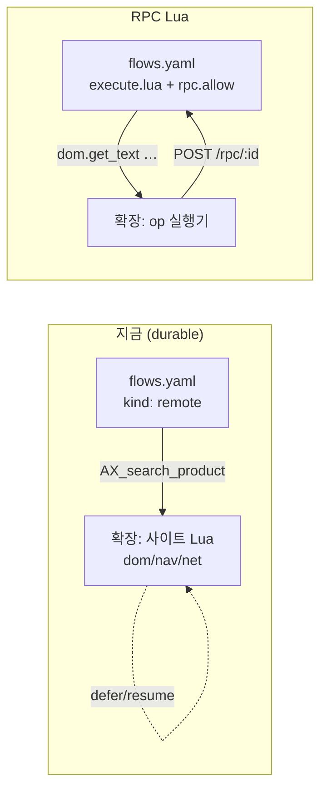

# RPC Lua 이행 설계

`AGENTIC_TASKS_RPC_LUA.md` · `rpc_lua_authoring.md` · `rpc_lua_implementation.md` · `FLOWS.md` §9.1.1/§9.2.1/§9.2.2
를 근거로, 이 저장소의 flow와 Lua를 **런타임 RPC Lua** 방식으로 옮기기 위한 설계와 단계별 계획이다.
구현은 이 문서 승인 이후에 한다.

---

## 1. 무엇이 달라지는가

**Lua의 실행 위치가 브라우저에서 런타임으로 이동한다.** 브라우저는 이제 이름 있는 명령(`AX_search_product`)을
갖지 않고, 범용 op(`dom.get_text`, `nav.navigate` …)만 수행한다. 사이트 의미는 전부 스크립트에 있다.



| | 지금 | RPC Lua |
|---|---|---|
| Lua 실행 위치 | 브라우저(확장) | **런타임** |
| 브라우저가 아는 것 | `AX_*` 명령 34개 | 범용 op 16개 |
| 페이지 이동 | 명령이 `navigating` 반환 → 노드 재진입 홉 | **스크립트가 `nav.wait_for_navigation`으로 넘는다** |
| 다단계 작업 | 노드 N개 + 상태 왕복 | **노드 1개, 스크립트가 제어 흐름 소유** |
| 실패 | journal에 남고 재개 | **값이다.** `pcall` 또는 노드 오류 |
| 배포 | GitHub push → 확장이 fetch | **세션 생성 시 `clientFlows`로 문서 전체 전송** |

### 사라지는 개념
`defer` · `durable replay` · `deferId` · `AX_*` 명령 등록 · `navigating` 브랜치와 `*_after_navigation` 홉 ·
`session_state` · `axsdk:lua` 스토어 · `ax sync`의 Lua 주입 · `AX_open_site` 같은 진입 전용 명령.

**직전 세션에서 발견한 결함 두 개는 이행 전에 이미 해소됐다.**
- 진입 노드 remote 결과 유실 → 우리가 in-engine 홉으로 우회(커밋 `b8e5e8b`).
- defer 재실행 루프 → **SDK가 수정**(스냅샷 리하이드레이트가 in-flight 레코드를 지우던 문제).
  2026-07-28 재측정: 견적 ZIP 단계 28초 timeout → **8.3초 통과**, `checkout` timeout → **결제 페이지 도달**.
  트레이스가 `execution:start` 1회 + `replay:*` 3회로 바뀌었다(재실행 → 재개).

따라서 **RPC 이행은 "죽은 기능을 살리는 작업"이 아니라 "동작하는 것을 대체하는 작업"이다.**
긴급도가 내려가고 품질 기준이 올라간다 — Phase별 수용 기준("이행 전과 같은 행 수")이 더 엄격한 의미를 갖는다.

### 그대로인 것
flow state · `action_unit`(LLM 노드) · `flow.map` · 순수 `implementation: lua` · 승인 게이트 3토큰 ·
윈도우 렌더링 · 결정론/판단 분리 원칙.

---

## 2. 자산 인벤토리와 분류

측정값(2026-07-28). 총 Lua **약 9,900줄**(production) + **2,776줄**(playground), flowTool **70개**.

### 2.1 `_common/scripts/` (production, 4,920줄)

| 파일 | 줄 | 브라우저 API 사용 | 분류 | 이행 |
|---|---:|---|---|---|
| `00_base.lua` | 607 | dom/nav/**net** 22 | 혼합 | **분해**: 텍스트/파싱 유틸 → 순수, `read_field`/`click_verified` → RPC, `resolve_zip` → §5 공백 |
| `00_navigate.lua` | 111 | 3 | RPC | 스크립트 내부 이동으로 흡수, 명령 소멸 |
| `10_form_wizard.lua` | 446 | 0 | **순수** | 무변경 이식 |
| `20_echo.lua` | 14 | 0 | 순수 | 삭제 후보(진단용) |
| `30_resolve_zip.lua` | 18 | 0 | — | §5 공백 |
| `40_read_page.lua` | 18 | 1 | RPC | `dom.get_outerHTML` 한 번 |
| `44_pagination.lua` | 116 | 0 | **순수** | 무변경 이식 |
| `45_offer_view.lua` | 671 | 0 | **순수** | 무변경 이식 |
| `46_candidate_browser.lua` | 159 | 0 | **순수** | 무변경 이식 |
| 커머스 레이어 `50`–`56` | 1,937 | 5 (**net/session_state**) | 혼합 | 대부분 순수. FX(net) → §5, `session_state` → flow state. 2026-07-27 7개 파일로 분할 완료(§3.1) |
| `60_storefront.lua` | 823 | 25 | **RPC** | 핵심 이행 대상 |

**약 4,000줄(81%)이 이미 순수**다. 이 부분은 브라우저에서 런타임으로 자리만 옮기며 로직 변경이 없고,
`tools/lua/*.test.mjs`(183 테스트)가 그대로 회귀 방어를 계속한다.

### 2.2 사이트 레이어

| 사이트 | 줄 | 성격 |
|---|---:|---|
| `amazon` | 2,167 | 전용 어댑터(검색/장바구니/체크아웃) |
| `thumbtack` | 2,007 | 견적 플로우 전용, 다단계 폼 위저드 |
| `ebay` | 440 | 전용 어댑터 |
| 8개 스토어프론트(`walmart` `ssg` `coupang` `gmarket` `11st` `aliexpress` `etsy` `naver-shopping`) | 각 50~68 | **CONFIG 테이블뿐** — `60_storefront`가 실행 |

8개는 사실상 데이터다. 이행 후에도 데이터로 남는다(§4 D2).

### 2.3 분류 요약

| 버킷 | 대상 | 이행 방식 |
|---|---|---|
| **A. 순수 계산** | 44/45/46, 10_form_wizard, 커머스 레이어(50–56) 대부분 | `implementation: lua` (rpc 블록 **없음**) |
| **B. 페이지 조작** | 60_storefront, amazon, ebay, thumbtack, 00_navigate, 40_read_page | `implementation: lua` + `rpc.allow` |
| **C. 네트워크** | `resolve_zip`(geocoding), `fetch_fx_rates`(환율) | **§5 — 결정 필요** |
| **D. durable 전용** | playground `05_durable` `10_durable_operations`, `AX_open_site` | **삭제** |

---

## 3. 목표 구조

### 3.1 저작 구조는 유지, 모듈은 문서 **밖**으로 (runtime 회신 R2 반영)

초안은 빌더가 Lua를 `execute.lua`로 **인라인**하는 안이었다. runtime 회신으로 두 가지가 확정되어 바뀌었다.

1. **이어붙이기는 컴파일이 안 된다.** Lua는 함수당 지역변수 200개가 한계이고 메인 청크도 함수다. 모듈을
   이어붙이면 top-level `local`이 누적되어 터진다(그쪽 실측: 4벌에서 270개 → FAIL).
   → **모듈마다 자기 청크**로 컴파일되고 반환값이 `modules[name]`에 실린다.
2. **인라인하면 문서가 상한을 넘는다.** `clientFlows` 상한은 **256 KiB**이고 우리 Lua는 **373.4 KiB**다.
   → **소스는 문서에 싣지 않는다.** 앱 패키지 `luaModules/` 또는 세션 레지스트리(`POST /axsdk/v2/lua`)에
   올리고 문서는 이름만 참조한다.

```
_common/scripts/*.lua          ← 사람이 쓰고 리뷰하고 유닛테스트하는 원본 (그대로)
<site>/scripts/*.lua
        │
        │  tools/build-rpc-modules.mjs   (신규)
        │    · 파일 → 모듈로 등록 (sha256 핸드셰이크로 변경분만 업로드)
        │    · flows.yaml 의 execute.modules 목록 검증 (없는 모듈 = 빌드 실패)
        ▼
모듈 레지스트리(문서 밖)  +  dist/flows.rpc.yaml (구조만, Lua 0바이트)
```

```yaml
flowTools:
  storefront_search:
    execute:
      kind: runtime
      implementation: lua
      modules: ["00_base", "60_storefront", "sites/storefront_configs"]   # 선언 순서 = 평가 순서
      rpc:
        allow: [nav.navigate, dom.get_location_href, dom.exists, dom.query_all, dom.get_text]
        deadlineMs: 45000
        opTimeoutMs: 8000
        maxCalls: 8            # 폴은 소모하지 않는다(R6 확정) → 실제 op만 센다
      entry: run
      lua: |
        local B = modules["00_base"]
        local S = modules["60_storefront"]
        function run(args) ... end
```

**`_ENV`는 공유로 확정**(2차 회신 R10). 모듈과 툴 스크립트가 하나의 환경을 쓰고, 모듈은 `execute.modules`
선언 순서로 **state당 1회** 평가된다. 따라서 기존 전역 노출(`AX_BASE = {...}`)과 교차 참조
**116건**(40개 파일, 8차 재측정치)이 **그대로 동작한다** — `return M` 추가도 불필요하다. 초안에 있던
선행 작업 2건은 소멸했다. 8차에서 라이브로 재확인했다: REST 레지스트리 invoke는 모듈마다 격리지만
`execute.modules`는 툴 하나의 `_ENV`를 공유한다. 우리가 쓰는 것은 후자다.

주의: 모듈 최상위 부수효과는 **세션당 1회**다. 최상위에서 RPC를 부르거나 호출별 캐시를 초기화하지 않는다.

**대신 생긴 작업 — 모듈 분할. 완료했다(2026-07-27).** 모듈 상한이 파일당 64 KiB이고
`50_commerce.lua`(75.5 KiB)만 넘었다(thumbtack·amazon은 8개 파일로 나뉘어 최대 47.0 / 38.8 KiB).
**7개로 잘랐다** — 6개 계획이었으나 경계를 책임 단위에 맞추니 하나가 더 나왔고, 대신 최대 파일이
17.3 KiB로 규율(48 KiB)의 3분의 1에 들어왔다.

파일 스코프 로컬 46개 중 **19개가 경계를 넘었다.** 이것이 분할의 유일한 실질 위험이었다 — 자르기 전에
세어서, 넘는 것만 `C.*`로 내보내고 소비 측 헤더에서 다시 로컬로 받는다. 호출부는 한 줄도 바뀌지 않는다.
`clean`/`non_empty`는 `B.clean_text`/`B.non_empty`를 한 줄 감싸기만 하던 것이라 래퍼를 지우고 헤더에서
직접 별칭했다. 의존은 전부 파일 순서를 따르는 단방향이라 순환이 없다.

이행 후 총 **모듈 33개 / 366.7 KiB**(공유 14 + amazon 8 + thumbtack 8 + ebay 3, CONFIG 9개는 1개로 묶음).

| 모듈 | 내용 | 크기 | 내보내는 것 |
|---|---|---:|---|
| `50_commerce_core` | 어댑터 등록·FX·공용 헬퍼 | 6.5 KiB | `lower` `copy_table` `array` `free_shipping` `collect_currencies` `convert_to_base` |
| `51_relevance` | 검색어 변형·관련성 앵커·정규화 | 13.1 KiB | `split_list` `matches_query` |
| `52_identity` | prepare/lock/options/resolve | 14.8 KiB | `worker_value` `identity_text` `stable_hash` `infer_model` `candidate_model` |
| `53_verify` | verify_product_offers | 4.5 KiB | — |
| `54_comparison` | 비교 창·스토어 결과 문구·스크리닝 | 17.3 KiB | `compare_offers` `uniform_currency` `persist_comparison` |
| `55_offers` | rank/present/refine/resolve | 12.0 KiB | — |
| `56_store_io` | collect/search/cart | 9.1 KiB | — |

**검증**: `test:lua` 197 · `test:commerce` 24/24 + 17/17 · `build:lua:check` 통과 ·
**라이브 10개 스토어 읽기 전용 스윕 35/35** (86s, walmart 6건 회복). 테스트가 파일명을 나열하던 9곳은
`COMMERCE_LAYER` 상수와 디렉터리 적재로 바꿨다 — 다음 분할이 테스트를 건드리지 않는다.

**모듈당 48 KiB를 규율로 삼는다.** 그보다 크면 상한 이전에 리뷰가 안 된다.

### 3.2 확정된 플랫폼 제약 (4라운드 협의 완료)

| 제약 | 값 | 우리 | 여유 |
|---|---:|---:|---|
| 모듈당 바이트 | 64 KiB | 최대 47.0 KiB | 규율 48 KiB |
| 모듈 개수 | 64 | **32** | 전용 어댑터 4개분 |
| 앱 패키지 `luaModules` 합계 | **2 MiB** | **366.7 KiB** | 약 6개월 |
| 세션 레지스트리 합계 | 512 KiB | 개발 교체분만 | — |
| `clientFlows` 오버레이 | 256 KiB | 개발용 오버레이 | — |
| 앱 패키지 문서(각각) | 512 KiB | 본체 190.5 KiB | — |
| 모듈 이름 | 아래 패턴 · 128자 · 구분자 `.` | `amazon.00_common` | — |

모듈 이름 패턴은 `^[A-Za-z0-9_][A-Za-z0-9_.\-]*` + 종료 앵커다. **`/`는 쓸 수 없다** — 레지스트리 라우트가
`/:name/:fn`이라 슬래시가 든 이름은 오파싱되거나 404다.

**빌더 이름 규칙**: `<dir>/scripts/<file>.lua` → `<dir>.<file>`. 저작은 디렉터리 구조 그대로 두고
평탄화만 빌더가 한다 — 셀렉터 리뷰 지점이 파일 경로에 남는다.

**배포와 세션**: 세션은 생성 시 문서·모듈을 스냅샷한다. 배포는 진행 중 세션에 **영향이 없고**(무중단),
**롤백도 마찬가지로 영향이 없다** — 사고를 되돌려도 그 순간 살아 있는 세션은 끝날 때까지 옛 리비전을 쓴다.
세션은 `storage.session`에 소유권이 있어 브라우저 실행 1회를 넘지 못한다.

**전달 경로 확정**(2차 회신 R9-A): 프로덕션은 **앱 패키지 push**(크기 검사 없음, push 상한 512 KiB),
개발은 `clientFlows` 오버레이(256 KiB)다. 우리 본체 190.5 KiB는 양쪽 모두 통과한다 —
`clientFlows` 단독으로도 지금은 들어가지만 74%라 여유가 없어 프로덕션은 앱 패키지로 간다.
**매 턴 교체는 개발 전용이다** — 턴마다 문서 전체 검증·세션 record 재직렬화·프롬프트 재전송이 돈다.

### 3.3 사이트 어댑터: 명령 10개 → 툴 1개 (D2)

지금은 사이트마다 `AX_search_product`를 등록하고 `AX_COMMERCE`가 도메인으로 디스패치한다. RPC에서는
디스패치할 명령이 없다. **CONFIG 테이블을 데이터로 들고 스크립트가 고른다.**

```lua
-- 빌더가 붙이는 _common/scripts/61_storefront_sites.lua (신규, 생성물)
STOREFRONT_SITES = { walmart = {...}, ssg = {...}, ["11st"] = {...}, ... }

function run(args)
  local config = STOREFRONT_SITES[args.site]
  if not config then return { next = "error", error = "unsupported_site" } end
  return S.search(config, args)          -- 60_storefront 로직 그대로
end
```

사이트 디렉터리의 `00_common.lua`는 **CONFIG만 남기고** 명령 등록(`AX_search_product`, `S.register`)을 뺀다.
셀렉터 리뷰 지점은 지금과 같은 파일에 그대로 유지된다.

### 3.4 노드 그래프가 줄어든다

`shopping_search_one_store` 워커(현재 9노드)는 재진입 홉이 사라져 3노드가 된다.

```
지금:  open → search → search_after_navigation → normalize → collect
         → search_next_page → …_after_navigation → search_other_wording → …_after_navigation
RPC :  search(스크립트가 이동·대기·페이지·다른 표기까지 소유) → normalize(순수) → collect(순수)
```

`AX_collect_store_page`의 `retry_query`/`more` 루프는 **스크립트 내부 루프**로 내려도 되지만, 그러면 중간
실패 시 어디까지 갔는지 상태에 남지 않는다(`AGENTIC_TASKS_RPC_LUA.md` §6.6). **페이지 루프는 스크립트 안,
스토어 루프는 `flow.map`** 으로 나눈다.

---

## 4. 설계 결정

| # | 결정 | 근거 |
|---|---|---|
| **D1** | Lua는 파일로 저작, **모듈 레지스트리로 업로드**, 문서는 이름만 참조 | 인라인은 256 KiB 상한에 걸리고, 이어붙이기는 200-locals에 걸린다 (§3.1) |
| **D2** | 사이트 어댑터 = 범용 스크립트 1개 + CONFIG 데이터 | 디스패치할 명령이 없다. 셀렉터 리뷰 지점은 유지 |
| **D3** | 재진입 홉 제거, 대기는 스크립트 안에서 | `nav.wait_for_navigation` → `dom.wait_for_selector` 순서 (href 먼저) |
| **D4** | 쓰기 op은 `rpc.fanout()`으로 가드 | 쓰기는 **적격 문서 전부** 실행. 장바구니 중복 담기 방지 |
| **D5** | `allow`는 노드별 최소 권한 | 읽기 노드에 `dom.click`이 없으면 실수로도 못 누른다 — 승인 게이트의 일부 |
| **D6** | 목록은 `array()`로 감싼다 | 런타임이 제공. 우리 `array()` 헬퍼(§AGENTS §9 함정)를 대체 |
| **D7** | `maxCalls`는 **실제 op 수**로 건다 | 폴은 소모하지 않기로 확정(R6). 초안의 "대기 스크립트엔 걸지 마라"는 폐기 |
| **D8** | `additionalProperties: false`를 `action_contract` 툴 파라미터에 쓰지 않는다 | 런타임이 자체 필드를 args에 넣는다 |
| **D9** | 되돌릴 수 없는 조작은 노드를 나눈다 | 사용자 동의가 스크립트 안으로 들어가면 안 된다. 현행 3토큰 게이트 유지 |
| **D10** | op 어휘는 문서가 아니라 `GET /axsdk/v2/lua/ops`의 `version` 해시로 CI 고정 | 순서 변경에 깨지지 않는다 (R5 확정) |
| **D11** | 스크립트는 **탭 1개를 몬다**. 대상은 URL이 아니라 **세션 루트 탭**에 고정 | 정적 `urlPattern`이면 첫 op에서 전원 거부 → `no_client`. "첫 응답 탭"은 사용자의 무관한 탭을 이동시킨다 (R8-R/R13) |
| **D14** | 모듈은 파일당 48 KiB 이하 | 상한 64 KiB보다 리뷰 한계가 먼저 온다. 커머스 7분할 **완료**, 최대 17.3 KiB |
| **D15** | 프로덕션 = 앱 패키지 push, 개발 = `clientFlows` 오버레이 | 매 턴 교체는 턴마다 전체 검증·재직렬화를 돌린다 |
| **D12** | 비교 스냅샷은 flow state가 아니라 **`contexts`** | `state: session`은 `(세션, 툴)` 키라 툴 간 공유가 안 된다 (Q4 확정) |
| **D13** | `net.fetch`는 예외가 아니라 **값**을 반환 — 분기 대상 | HTTP 실패는 정상 운영 중 일어난다. RPC 실패(브라우저 소실)와 다르다 (R1 확정) |

### 확인된 호환성
- `dom.query_all(sel, fields, limit)`은 클라이언트 capability와 **같은 `queryLuaElements`** 를 호출한다
  (`rpc-ops.ts`). `60_storefront.result_fields()`가 만드는 `{ text = true, url = {selector, attr} }` 형식이
  그대로 통한다 — 리더 로직 **무변경 이식 가능**.
- 확장 dist(2026-08-02 빌드)에 `axsdk.rpc.request` 처리와 op 테이블이 이미 포함되어 있다. 클라이언트 작업
  없이 라이브 검증이 가능하다.

---

## 5. 차단 항목 현황 (4라운드 협의 완료)

| ID | 항목 | 상태 |
|---|---|---|
| **R1** | 아웃바운드 HTTP | 설계 확정, **인프라 승인 대기**. 우리는 환율을 주입 파라미터로 두고 선행 구현 |
| **R2** | 모듈 레지스트리 | 설계 확정. 1단계(개별 청크 + `execute.modules`)가 Phase 2 착수 조건 |
| **R3** | 문서 상한 | 256 KiB 확인. gzip은 **해제 후 바이트**에 걸려 상한과 무관 — 개발 루프 이득만 |
| **R4·R5·R6** | 관측성·op 버전·폴 예산 | 수용 완료 |
| **R7** | `page.eval` | 철회. 쓰지 않는다 |
| **R8-R** | 스티키 탭 바인딩 | 수용됨. **클라이언트 의무는 `axsdk-sdk-js`** — `bindingId`가 이미 존재하므로 "노출"만 하면 된다 |
| **R9** | 문서 전달 경로 | **해결 — A안(앱 패키지)**. 190.5 KiB는 지금도 통과하나 여유가 없어 본체는 앱으로 |
| **R10** | 모듈 `_ENV` | **해결 — 공유 확정.** 우리 선행 작업 소멸 |
| **R11** | 모듈 상한 64 KiB | **우리 때문에는 불필요.** 초과 파일은 커머스 레이어 하나뿐이었고 7분할로 해소(완료) |
| **R12** | push 엔드포인트 | **수용, 신설 예정.** HTTP 경로가 존재하지 않았다(기존 CLI는 DB 직접 쓰기) |
| **R13** | `bind: session_root` 기본값 | **수용.** 서버 구현이 프레임 필드 하나로 줄었고 SDK 의무도 축소됐다 |
| **R14** | 모듈 합계 상한 | **해결** — 앱 2 MiB / 세션 512 KiB로 분리 |
| **R15** | 모듈 이름 규칙 | **해결** — 구분자 `.`, 128자 (§3.2) |

**설계 논의는 4라운드로 닫혔다.** 남은 것은 구현 대기뿐이다.

- **Phase 2**: R2 1단계 + R11-개수 + R15 (한 묶음)
- **Phase 3**: + R12
- **Phase 4~5**: + R1(일정 미정) · R13
- **Phase 0~1**: 차단 없음 — 진행 중

---
## 6. 단계별 계획

각 단계는 **독립적으로 되돌릴 수 있고**, 끝에 검증 게이트가 있다. Playground를 먼저 하는 이유는 격리된
프로필이고 실패해도 프로덕션 사용자에게 영향이 없기 때문이다.

### Phase 0 전제 검증 — **완료 (2026-07-28)**

이행 설계 전체가 "RPC Lua가 실제로 돈다"를 전제한다. 착수 전에 그것부터 라이브로 확인했다.
Playground에 최소 RPC 툴 하나(`rpc_probe` 인텐트)를 넣고 실제 턴을 돌렸다.

```
RPC OK · heading=복잡한 UI를 없애고,에이전틱 UX · links=3 · href=https://axsdk.ai/ko · documents=1
```

| 확인된 것 | 근거 |
|---|---|
| `clientFlows` 문서의 인라인 RPC Lua가 컴파일·실행된다 | 툴이 `next:"ok"`와 값을 반환 |
| 읽기 op 3종 (`get_location_href` · `get_text` · `query_all`) | 값이 실제 페이지와 일치 |
| 프렐류드 폴 헬퍼 (`wait_for_selector` → `dom.exists`) | `h1` 대기 성공 |
| 우리 `fields` 형식이 그대로 통한다 | `text = true` + `{attr}` 조합으로 3행 |
| **매치 없는 필드는 Lua `nil`** (센티널 아님) | `type(v) == "nil"`, selector·attr 양쪽 |
| `rpc.fanout()` | `executed = 1` |
| `allow` 게이트 | 미선언 op 호출 시 `rpc op 'dom.query_all' is not allowed` |

**전제는 참이다. Phase 1은 이 프로브를 확장하는 것으로 시작한다.**
프로브는 삭제하지 않고 **상시 스모크 테스트로 남긴다** — RPC 채널 회귀가 나면 여기서 먼저 걸린다.

함께 배운 것: `fallback.invalidNext`/`exhaustedNext`는 **노드가 아니라 `next`의 브랜치 키**를 가리킨다
(`stalledNext`와 같은 규칙). 노드 이름을 쓰면 문서 전체가 컴파일 실패한다.

### Phase 0 — 기반 (반나절) — **차단 없음**
1. `GET /axsdk/v2/lua/ops`의 `version`을 `docs/rpc-ops.json`에 고정하는 `npm run check:rpc-ops` (D10).
2. `tools/build-rpc-modules.mjs` 골격: 파일 → 모듈 업로드(sha256), `execute.modules` 참조 검증.
3. `tools/lua/harness.mjs`에 **RPC 스텁**을 추가: `dom`/`nav`/`page`를 가짜 페이지로 구현해 스크립트를
   오프라인 테스트. (기존 순수 테스트 183개는 무변경)

**게이트**: `check:rpc-ops` 통과, 빌더가 기존 `example` 플로우 하나를 왕복 변환.

### Phase 1 — Playground 파일럿 — **완료 (라이브 증명)**

| 산출물 | 검증 |
|---|---|
| `tools/lua/rpc-stub.mjs` — 가짜 브라우저(폴 헬퍼·fire-only·op 기록) | 변이 5건 전부 검출 |
| `playground/_common/scripts/16_rpc_storefront.lua` — 체크포인트 상태기계 → 직선 스크립트 | 유닛 10건 |
| `playground/_common/scripts/17_rpc_sites.lua` — CONFIG 9개 → 데이터 모듈 1개 | 15.9 KiB |
| `tools/build-rpc-flows.mjs` — `modules:` → `execute.lua` 인라인 + 크기 보고 | 유닛 5건 |
| `tools/lua/field-fallback.test.mjs` — `nil` vs `""` 계약 | 두 겹 방어 확인(둘 다 제거해야 깨짐) |
| 빌드 산출물 `dist/playground` | **51.5 KiB = 상한의 20.1%** |

**라이브 — google.com에서 시작해 이동까지 포함**

```
RPC SEARCH OK · found=19 · cards=24        (29.7초)
1. 로지텍코리아 공식 MX Master 4 무선 마우스 그래파이트 · KRW 169000
2. 삼성전자 삼성 무선 마우스 SM-MG100B 멀티페어링 블루투스 · KRW 29900   …
```

**브라우저에 사이트 레이어가 없다.** 런타임 Lua가 범용 op만으로 이동하고 읽었다. 454줄 체크포인트
상태기계가 사라졌고, 이행의 전제가 실제 스토어에서 성립한다.

단계별 비용(전용 프로브로 측정):

```
href=712ms  navigate=362ms  wait=4498ms(moved=true)  body=1976ms  total=7548ms
```

#### 값비싼 교훈 — `opTimeoutMs`는 이동하는 스크립트에서 낮춰야 한다

처음에 `opTimeoutMs: 8000`으로 두었더니 **260초에도 끝나지 않았다.** 원인은 측정으로 특정했다:

```
nav.navigate          → settled ok
dom.get_location_href → received, 응답 없음 (문서가 unload 중)
(다음 폴)              ← +8.5초 = opTimeoutMs 를 꽉 채움
```

**접수하고 죽은 문서는 느린 문서와 구분되지 않는다.** 문서는 "이동 공백엔 연결 문서가 0개라 즉시
`no_client`"라고 하지만, 그건 dispatch 시점에 아무도 없을 때의 이야기다. 이동을 여러 번 넘는
스크립트는 폴마다 이 비용을 낼 수 있다.

`opTimeoutMs: 2000`으로 낮추자 같은 작업이 **29.7초**에 끝났다. 저작 가이드는 "느린 사이트에서
상향"이라고 안내하는데, **이동하는 스크립트에서는 반대로 낮추는 것이 맞다.**

**규율**: 이동하는 스크립트는 `opTimeoutMs ≤ 2000`. 대기의 상한은 헬퍼의 `timeout`이 잡는다.
### Phase 2 — 순수 모듈 이식 (1~2일) — R2 1단계 **해결됨**(8차 검증)
`44_pagination` · `45_offer_view` · `46_candidate_browser` · `10_form_wizard` · 커머스 레이어(50–56)의
순수 부분을 `implementation: lua`(rpc 없음) 툴로 옮긴다. **로직 변경 0.** `array()`는 런타임 것으로 교체(D6).
분할은 선행 작업으로 이미 끝났다.

**게이트**: `npm run test:lua` 197개 그대로 통과(파일 위치만 바뀜), `check:flows` 통과.

### Phase 3 — 스토어프론트 어댑터 (2~3일) — **선행: Playground 패키지 모드**
`60_storefront.lua`(823) + 8개 CONFIG → RPC 툴 1개. 리더 로직은 §4 호환성에 따라 무변경 이식하고,
바꾸는 것은 **탐색과 대기**뿐이다.

**플랫폼 쪽은 열렸다**(10차): 시험용 앱 `axsdk-sites-sandbox`가 사이트 origin에서 열리고, 패키지
푸시가 동작한다(revision 13→14, 모듈 2개 22,064 B, 모듈별 sha256, **문서 51.5 → 26.0 KiB**).

막힌 것은 우리 하니스다. Playground는 저장 오버레이를 전제해서, `clientFlows.stored`를 끄고 패키지를
권위로 삼으면 확장이 `binding:render-failed`(`hasSites:false`)로 세션을 아예 만들지 않고 `ax send`가
타임아웃까지 빈 응답을 준다 — 플로우가 아무것도 못 만든 것과 구별되지 않는다. `playground sync`는 그
구성에서 영영 기다린다. **선행 작업**: 패키지 모드(저장 활성화 대기 대신 앱 패키지 revision/hash로
검증)를 하니스에 넣는다. 그 전까지 패키지 검증은 HTTP 계층까지만이다.

```lua
function run(args)
  local config = STOREFRONT_SITES[args.site]
  local from = dom.get_location_href()
  nav.navigate(S.search_url(config, args.query, args.page))
  if not nav.wait_for_navigation(from, { timeout = 8000, interval = 200 }) then
    return { next = "error", error = "navigation_stuck" }
  end
  if not dom.wait_for_selector(config.result_ready_selector, { timeout = 6000 }) then
    return { next = "no_results", cards_seen = 0 }
  end
  local candidates, cards = S.read_candidates(config)     -- 기존 코드 그대로
  return { next = (#candidates > 0) and "ok" or S.read_outcome(cards, 0), candidates = array(candidates) }
end
```

사이트별 라이브 확인은 기존 스윕을 재사용한다(`tools/scenarios/commerce-all-sites.mjs`를 RPC 경로로 조정).

**게이트**: 10개 사이트 read-only 스윕에서 **현재와 동일한 행 수**(11st 17~18, ssg 6, coupang 6, amazon 6,
ebay 6, aliexpress 6, gmarket 2, etsy 1, walmart `price_unavailable`, naver `access_denied`).

### Phase 4 — 다중 스토어 비교 플로우 (2~3일) — **R1 · R8-R · R13 차단**
1. 워커 서브플로우 9노드 → 3노드(§3.3).
2. FX를 `net.fetch`로 배선(`cacheMs=1h`, 실패 시 비교 거부).
3. `session_state` 사용처(비교 윈도우)를 **`contexts`** 로 이동(D12).
4. 장바구니 담기 노드에 `rpc.fanout()` 가드 추가(D4) — 다중 탭에서 중복 담기 방지.

**게이트**: `check:flows`(그래프 불변식 17개) + 라이브 1회 —
`쿠팡이랑 11번가에서 로지텍 M185 마우스 총액 비교해줘` → 스크리닝·랭킹·윈도우가 현재와 동일.

### Phase 5 — Thumbtack 견적 (2~3일) — **R1 · R8-R · R13 차단**
가장 상태가 많은 플로우다. 폼 위저드(`10_form_wizard`, 순수)는 이미 Phase 2에서 이식되어 있으므로
남는 것은 페이지 조작부다. **다단계 폼이 RPC의 최적 사례** — 노드 5개가 스크립트 1개로 합쳐진다.
`AX_submit_quote`의 `confirm:true` 게이트는 **노드 분리로 유지**한다(D9).

**게이트**: 라이브 E2E — 검색 → 후보 브라우징 → 견적 다이얼로그 → **제출 직전 정지**. 실제 제출 금지.

### Phase 6 — 정리 (1일)
`kind: remote` 툴 38개 제거 확인, `axsdk:lua` 스토어/`ax sync`의 Lua 경로 정리, `SCHEMA.md`(40개 엔트리)를
RPC 툴 계약으로 교체, `AGENTS.md` §3/§4/§6/§8 갱신, `dist/` 산출물 규칙 추가.

---

## 7. 테스트 전략

| 층 | 지금 | 이행 후 |
|---|---|---|
| 순수 Lua | `npm run test:lua` (183, fengari) | **그대로** — 순수 모듈은 위치만 바뀐다 |
| 페이지 조작 Lua | 없음(라이브만) | **신설**: fengari + RPC 스텁으로 가짜 페이지 구동 |
| 플로우 그래프 | `check:flows` (17) | **확장**: `allow` 최소성, 쓰기 op 노드 분리, `array()` 사용 |
| 어댑터 계약 | `test:commerce` (41) | 스텁 기반으로 재작성 |
| 라이브 | `ax send` / 스윕 35/35 | `clientFlows` 전송 경로로 조정 |

**새 불변식(conformance)**: ① 쓰기 op(`dom.click`/`set_value`/`submit_form`/`page.eval`/`nav.*`)은 승인
노드 뒤에서만 `allow`에 등장 ② 대기하는 스크립트에 `maxCalls` 없음 ③ `action_contract` 툴에
`additionalProperties: false` 없음 ④ 목록 반환은 `array()`.

---

## 8. 리스크

| 리스크 | 영향 | 완화 |
|---|---|---|
| **FX/geocoding 공백**(§5) | 총액 비교 불가 | Phase 4 전 결정. 미해결 시 Phase 1~3만 진행 |
| 쓰기 브로드캐스트 | 다중 탭에서 장바구니 중복 | `rpc.fanout()` 가드 + `isEligible`(클라이언트) |
| 왕복 지연 | 셀렉터 1개 = 1 왕복. 카드 24개를 개별로 읽으면 폭증 | `query_all` 강제(D2 리더 그대로), `allow` 리뷰 시 왕복 수 확인 |
| 번들 비대 | `clientFlows` 문서가 수 MB | 툴별 의존 그래프로 절단, 크기 회귀 테스트 |
| op 어휘 드리프트 | 조용한 실패 | `check:rpc-ops`(D10) |
| 폴링이 `maxCalls` 소진 | 대기 실패 | D7 |
| 롤백 | 이행 중 사용자 영향 | 단계별 독립. Phase 1~3은 프로덕션 플로우를 건드리지 않는다 |

---

## 9. 완료 정의

- `kind: remote` 툴 **0개**, `_common`/사이트 Lua가 브라우저에 주입되지 않는다.
- 10개 스토어 read-only 스윕이 이행 전과 **같은 행 수**를 읽는다.
- 다중 스토어 비교 1턴, Thumbtack 견적 1턴이 라이브에서 완주한다(견적은 제출 직전 정지).
- `test:lua` / `check:flows` / `test:playground` / 스텁 어댑터 테스트 전부 통과.
- `AGENTS.md`에 durable 기반 서술이 남아 있지 않다.

## 10. 열린 질문 (협의 종료 후 남은 것)

**설계 논의는 4라운드로 종료됐다.** 남은 것은 구현 대기와 일정 하나뿐이다.

1. **R1 `net.fetch` 일정** — 런타임 아웃바운드 인프라 승인. 우리는 환율을 주입 파라미터로 두고 선행한다.
2. **`axsdk-sdk-js` 조율** — `target.bind`를 읽어 세션 루트 탭인지 판정하는 건. 별도 지시서
   `SDK_RPC_LUA_REQUESTS.md`로 전달했다.
3. **`configRevision` 노출** — 잘못된 배포의 영향 세션을 세기 위한 관측치(5차에서 요청).

**Phase 0~1은 위 셋과 무관하게 착수한다.**
