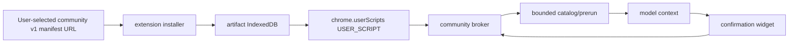
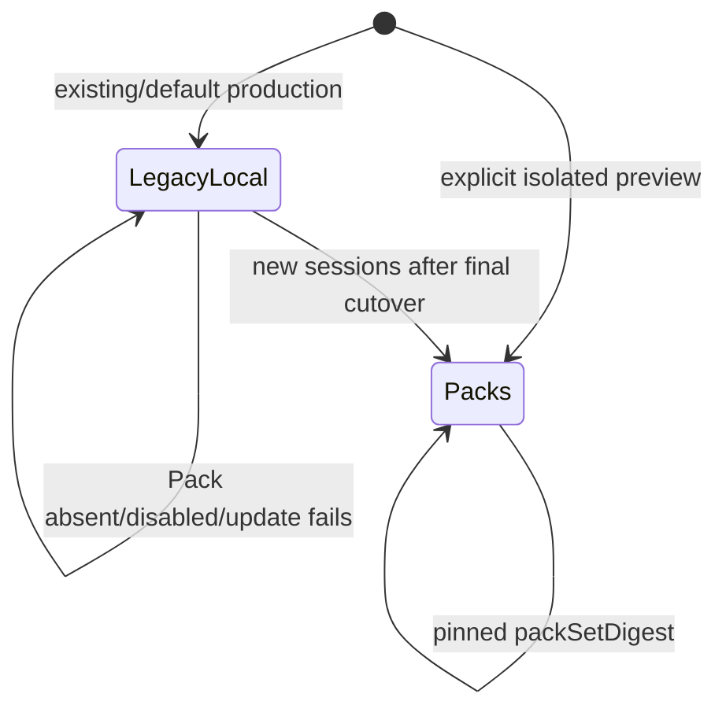
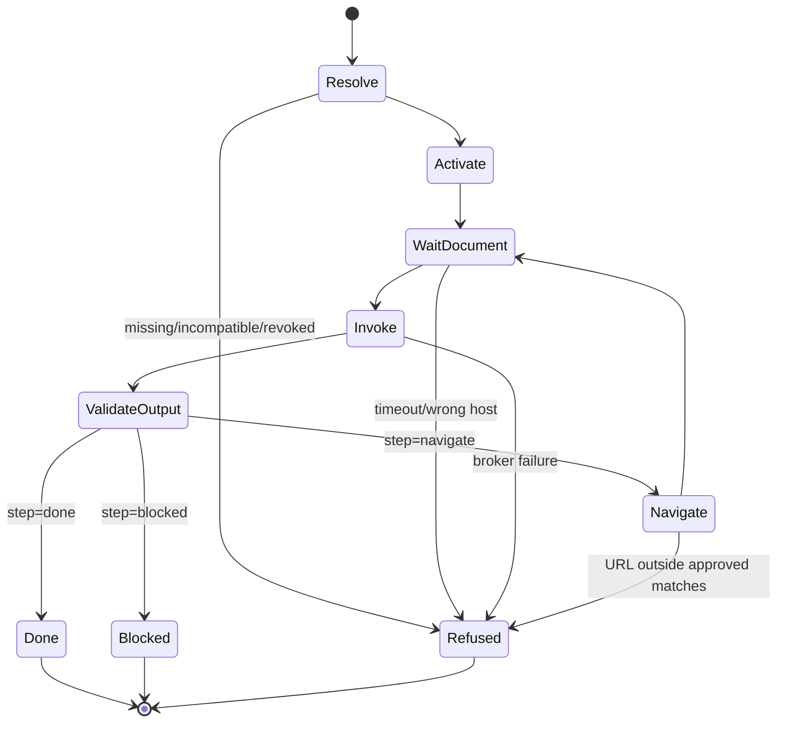
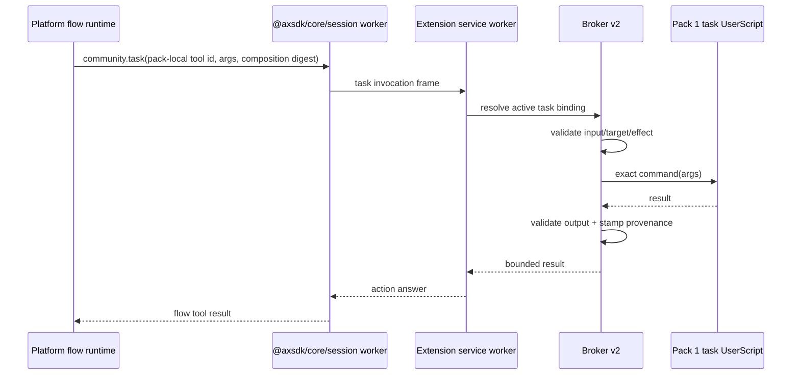
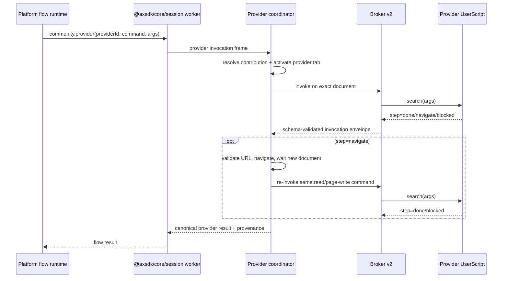
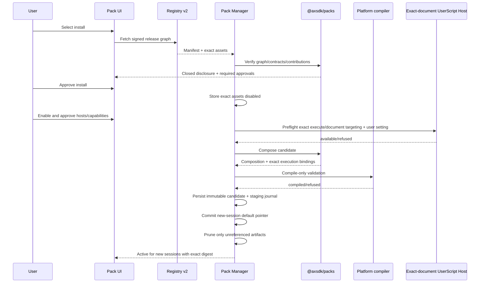
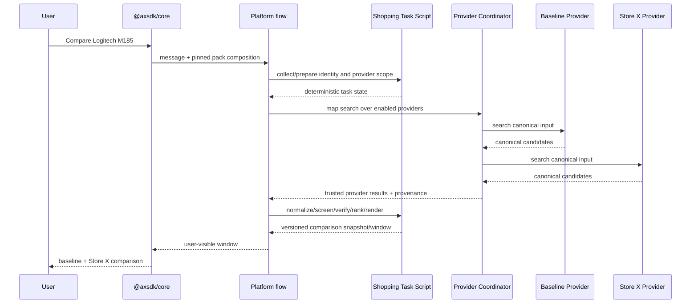

# UserScript Agent Pack System Architecture

**Status:** Proposed architecture · Phase 0 in progress; embedded default Pack path selected · 2026-08-24  
**CWS launch gate:** The default Agent Pack and first-party providers are extension-packaged. REQ-REL-010 remains mandatory only before enabling later remote Pack flow or JavaScript delivery.  
**Requirements:** [`USER_SCRIPT_AGENT_PACK_REQUIREMENTS.md`](USER_SCRIPT_AGENT_PACK_REQUIREMENTS.md)  
**Implementation plan:** [`USER_SCRIPT_AGENT_PACK_IMPLEMENTATION_PLAN.md`](USER_SCRIPT_AGENT_PACK_IMPLEMENTATION_PLAN.md)  
**Background review:** [`COMMUNITY_AGENT_PACK_DESIGN.md`](COMMUNITY_AGENT_PACK_DESIGN.md)
**CWS policy baseline:** [`CWS_LAUNCH_PLAN.md`](CWS_LAUNCH_PLAN.md) P0-1

## 1. Architecture objective

Move AXSDK's current site-specific task delivery from one locally packaged common flow plus Lua/module
workspace to an extension-embedded default Agent Pack plus optional signed, user-installed Provider
Packs while preserving all current behaviour and safety.

The target must support this invariant:

```text
The extension-embedded Shopping Agent Pack owns the shopping graph and common decision logic.
Store X Provider Pack 2 contributes Store X through a typed extension point.
Installing Pack 2 changes provider composition, not the embedded Agent Pack bytes or graph.
```

The full clean-cutover invariant is:

```text
After the extension-embedded first-party parity Pack becomes the default:
  local task/site flow assets = 0 (the minimal product shell and embedded Pack remain)
  local workspace Lua assets = 0
  local runtime Lua modules = 0
  current user-visible routes and safety behaviour remain equivalent
```

## 2. Decisions

### AD-001 — One user installation, multiple execution artifacts

An Agent Pack is one product installation but MAY contain separate artifacts:

- restricted flow fragment;
- task JavaScript for the task-executor document;
- embedded-provider JavaScript for provider documents;
- signed data assets.

Task and provider code do not share a browser world.

### AD-002 — New shared `@axsdk/packs` package

Manifest, contract, composition, and protocol logic belongs in a new browser-independent package.
Copying these validators into the registry compiler, extension, core, and platform would create four
sources of truth.

### AD-003 — Task code runs on a dedicated web executor

Agent Pack task JavaScript runs in a `USER_SCRIPT` world on an exact AXSDK HTTPS task-executor
document. Provider Pack JavaScript runs on approved provider pages. This prevents Store X installation
from granting Store X DOM access to Pack 1 and makes task commands available before provider
navigation.

### AD-004 — Product shell stays fixed

Global app/defaults/contexts/planner/router/hook composition, consent, lifecycle UI, and fixed service
actions remain packaged platform/extension responsibilities. Task and site business logic moves to
packs.

### AD-005 — Provider contribution is data, never graph merge

A Provider Pack contributes a typed provider record and command implementation. It cannot add a model
node, planner rule, flow edge, or prompt to the owning Agent Pack.

### AD-006 — Lua ships as embedded source inside signed JavaScript wrappers (revised 2026-09-03)

Original decision ("no downloaded Lua runtime; execution never reaches Fengari") is REVERSED by
`LUA_PACK_DESIGN.md` after the CWS release carrying the packaged Fengari interpreter passed review.
Pack logic is authored and distributed as Lua, embedded as a string literal inside the signed
JavaScript artifact (`wrap(luaSource)`, a fixed zero-logic template). The packaged Fengari prelude —
never downloaded — executes it in the `USER_SCRIPT` world under a closed environment with no
`load`-family functions, so the only executable Lua is the signed artifact's own bytes.

### AD-007 — Current local path is removed only after full parity

The read-only Store X proof is a prerequisite, not deletion authority. Cart, checkout, single-site,
quote, memory, sitemap/navigation, community control, terminals, and dev-command ownership must close
before clean cutover.

### AD-008 — No Pack means no runtime change

Pack support is dormant unless a session is explicitly created in Pack mode with an active
composition. Merely shipping the implementation or installing a disabled Pack creates no executor
tab, provider tab, UserScript execution/world, model context, payload field, permission change, or
Pack network request.

### AD-009 — One whole runtime mode per session

During migration, production stays on the existing local C3 flow/Lua path. Pack proofs run in an
isolated app/profile/session. A session pins `legacy-local` or `packs`; it never combines the graphs
and never falls through from one to the other. The production default changes once, after the full
parity/deletion gate.

### AD-010 — Agent Packs do not replace community v1

The current single-script community manager, store, broker, registrations, storage, catalog, and
widget path remain v1. Pack lifecycle and Broker v2 use distinct state, IndexedDB, ids, worlds, ports,
messages, validators, and garbage collection. Existing community behaviour remains authoritative on
ordinary approved pages; a matching v1 registration and Pack role document never co-reside. The shared
script-topology lock either refuses new Pack acquisition or retires an affected Pack role before a
user-requested v1 enable/update, without rewriting the v1 record.

### AD-011 — UserScript is a reviewed-code boundary, not a page sandbox

`USER_SCRIPT` isolates downloaded code from extension APIs and other JavaScript worlds, but not from
the DOM of its target document. Provider code can use its page's DOM/browser APIs directly. Agent
Pack task worlds on the shared static executor also share that blank document's DOM; task artifacts
need no page capability and are review/static-test forbidden from touching it. Broker v2 constrains
model/platform dispatch, not arbitrary statements inside a trusted artifact. Pack artifacts are
therefore signed and reviewed, bootstrap is connection-only, direct navigation/network is forbidden,
fixed services own egress, and `chrome.userScripts.execute` targets one verified role document. This
design supports a configured reviewed registry, not mutually malicious Pack publishers or
unreviewed arbitrary-code registries.

### AD-012 — CWS remote-logic policy gate

Exact-target `chrome.userScripts.execute` is the correct technical boundary, but it does not by
itself prove that publisher-supplied first-party product logic fetched after review is a “script
provided by the user” under the Chrome Web Store remote-hosted-code exception. The restricted Pack
flow fragment is also downloaded product logic and executes through the platform flow engine, outside
the User Scripts API exception entirely. Existing policy evidence therefore points against this
signed-registry design as a CWS distribution. Before a public CWS Pack build, One Stop Support or
equivalent written policy review must explicitly approve both the downloaded flow fragment and the
exact signed JavaScript registry/install/execute model. Without that approval, the dynamic Pack goal
cannot ship through CWS: logic must remain extension-packaged or distribution must be non-CWS, and
the local production path cannot be deleted on this design's authority.

## 3. Current architecture

### 3.1 Existing package dependency graph

Measured package dependencies:

```mermaid
flowchart TD
    LUA[@axsdk/lua]
    CORE[@axsdk/core] --> LUA
    REACT[@axsdk/react] --> CORE
    VOICE[@axsdk/voice] -. peer .-> CORE
    BROWSER[@axsdk/browser] --> CORE
    BROWSER --> REACT
    BROWSER --> VOICE
    EXTLEG[@axsdk/extension legacy] --> CORE
    EXTLEG --> REACT
    EXTLEG --> VOICE
    EXTCDP[@axsdk/extension-cdp shipping] --> CORE
    EXTCDP --> REACT
```

| Package | Current responsibility |
|---|---|
| `@axsdk/lua` | Standalone Fengari runtime, Lua loading/execution, command registry, values, default form Lua, DevTools API |
| `@axsdk/core` | Framework-agnostic session/SSE/chat state, API client, contexts, site/flow/Lua stores, client flow/module delivery, browser/Lua operation semantics |
| `@axsdk/react` | React assistant/widget surfaces over core, widget action rendering/state, optional voice bridge |
| `@axsdk/voice` | STT/VAD/TTS plugin over core events |
| `@axsdk/browser` | Single-script browser embed bundling core/react/voice |
| `@axsdk/extension` | Legacy in-page MV3 shell; not the shipping CWS target |
| `@axsdk/extension-cdp` | Shipping MV3 host: Chrome APIs, session groups, debugger/CDP page ops, offscreen/session workers, packaged workspace, community UserScripts |

### 3.2 Current shipping runtime

```mermaid
flowchart LR
    SITES[axsdk-sites local workspace]
    BUILD[build-workspace-assets]
    C3[C3 workspace manifest/assets]
    SW[extension service worker]
    OW[offscreen router]
    W[one session Web Worker]
    CORE[@axsdk/core singleton]
    API[AXSDK platform session/flow runtime]
    DSP[CDP dispatcher]
    PAGE[page bundle on driven tab]

    SITES --> BUILD --> C3 --> SW
    SW --> OW --> W --> CORE
    CORE -->|clientFlows + clientLuaModules| API
    API -->|RPC frame| CORE
    CORE --> W --> SW --> DSP --> PAGE
```

Important current ownership:

- `tools/build-workspace-assets.mjs` reads `_common/flows.yaml`, `_common/scripts`, `_common/rpc`, site
  flows, site scripts, and sitemaps through the extension workspace loader.
- `@axsdk/core` builds common/site `clientFlows` and `clientLuaModules` and sends them on session/message
  API calls.
- The platform compiles/runs the composed flow; runtime Lua actions call client ops.
- In `@axsdk/extension-cdp`, one session worker realm owns one `@axsdk/core` singleton/session.
- The session worker has no `chrome.*`; the service worker owns debugger, tabs, groups, storage,
  consent, packaged workspace, and community lifecycle.
- The dispatcher routes one RPC frame to one session tab; the page bundle delegates DOM/browser
  semantics back to `@axsdk/core` primitives.

### 3.3 Current community UserScript path



Current limitations relevant to Agent Packs:

- one JavaScript artifact per release;
- input schema, but no signed command output schema in the installed command contract;
- broker connection map keyed by script id rather than full session/tab/document target;
- catalog explicitly states that the model cannot call a community command directly;
- no `community.task`, `community.provider`, `packFlows`, extension-point composer, or pack digest;
- prerun is intentionally narrow and cannot implement an agentic task;
- no controlled provider activation/navigation primitive.

The active options-page v1 installer is URL-selected and digest-checked but explicitly does not use a
signed registry. Agent Packs add a separate signed-registry path; they do not silently change the
trust contract of existing community installations.

### 3.4 Current local parity surface

| Surface | Current value |
|---|---:|
| common flow document | 261,319 bytes |
| flows/routes/tools/modules | 11 / 8 / 82 / 26 |
| production Lua | 39 files / 477,839 bytes / 10,759 lines |
| shopping flows/nodes/tools/modules | 4 / 51 / 36 / 18 |

The target architecture must assign an owner to every part before deletion.

### 3.5 Compatibility and side-effect audit

The first architecture draft was not yet safe to implement literally. Four statements were
load-bearing risks: it created an executor for every session, described Chrome permission acquisition
despite the extension already requiring all HTTP(S) hosts, allowed partial local-source removal, and
treated `USER_SCRIPT` as if Broker v2 could sandbox arbitrary JavaScript on its matched page. The
corrected design makes Pack mode opt-in and session-pinned, isolates v1 community state, uses reviewed
invocation-only artifacts plus fixed network/navigation services, and defers every production source
deletion to one final cutover.

Measured current boundaries and required corrections:

| Current boundary | Side effect from a naïve Pack integration | Corrected architecture |
|---|---|---|
| `@axsdk/core` always resolves current client flows/Lua modules during session creation and configures Lua in `AXSDK.init` | replacing that source globally breaks browser, legacy extension, harness, and generic SDK users | optional pre-init Pack composition; absent input preserves the current field set and execution path |
| `@axsdk/core` root depends on `@axsdk/lua`; browser and both extensions consume the root | deleting Lua from core to slim CWS breaks published consumers | keep generic Lua API/dependency; remove it only from an extension-specific CWS entry after its callers are gone |
| React root is consumed by browser and both extensions | exporting Pack UI from the root can add UI, CSS, dependencies, or initialization everywhere | `@axsdk/react/packs` is a separate entry/style surface with no root import |
| community v1 state is `axsdk:community-scripts`; its broker uses protocol/port v1 | widening the same records or allowing its persistent match on a Pack role document changes existing trust/provenance in place | Pack state/protocol is v2 and separate; v1 is neither parsed nor rewritten; a shared topology lock fail-closes role-document collisions while ordinary v1 pages remain unchanged |
| community registration ids use `axsdk-community-`; worlds are artifact-derived; reconciliation removes its own prefix | reusing registrations or a broad orphan sweep can update/unregister community scripts | Pack v2 uses no persistent registration: exact-target `userScripts.execute`, Pack-only world ids, and per-world cleanup leave the community registrar untouched |
| community artifact and private-state databases have independent names; community pruning knows only community references | sharing its artifact store lets Pack garbage collection delete community assets | dedicated Pack artifact/lifecycle state with Pack-only reference closure; no Pack script-private store in V1 |
| the current “Reset shared SDK state” implementation selects all `axsdk:*` keys except config | a new Pack key—and already the community key—can be erased by an unrelated SDK reset | reset by explicit SDK-store allowlist; Pack/community removal remains an explicit lifecycle action |
| `AgentSessions.primaryTabIdOf` is the first membership entry and untargeted CDP frames use it | inserting/promoting an executor/provider tab redirects current page ops and site resolution | role metadata is optional; infrastructure tabs append inactive and are addressed only by explicit Pack targets |
| session restore fingerprints every HTTP(S) group-member URL | the common executor URL or transient provider URL can claim the wrong conversation | fingerprint only user-owned tabs; migrate Pack session keys with existing chat/trace keys |
| an empty group currently ends a session | infrastructure tabs can keep a run alive after the user removes every offered page | Pack-aware liveness counts user-owned tabs and then closes only extension-created infrastructure |
| packaged workspace install and community reconciliation run independently at service-worker module scope | one uncaught Pack startup failure can prevent toolbar/session/community startup | Pack startup is another caught independent branch; `legacy-local` startup never awaits it |
| manifest already has `userScripts`, `scripting`, and required `http://*/*`/`https://*/*`; one fixed DNR rule serves backend origin | Pack “permission acquisition” can remove/narrow required origins or replace backend routing | exact Pack host approval is internal authorization; no manifest-origin, permission, or existing DNR mutation |
| current source manifest declares `minimum_chrome_version: "138"`; exact `userScripts.execute`/`documentId` targeting starts at Chrome 135 | lowering the manifest to 135 expands support beyond the measured baseline, while a persistent-registration fallback weakens exact targeting | feature-detect the exact API and user setting; preserve/disclose the current Chrome 138 minimum (or a separately approved higher value); ship no registration fallback |
| Provider/task artifact runs in `USER_SCRIPT` world with direct access to its target document | calling the broker a capability sandbox hides bootstrap, direct-navigation, and direct-network side effects it cannot technically prevent | reviewed signed registry only; exact-target execution; invocation-only bootstrap; fixed service egress/navigation; broker constrains callers, not trusted artifact internals |

### 3.6 Corrected rollout state

```ts
type SessionRuntimeMode = "legacy-local" | "packs";
```



- `legacy-local` uses the current packaged/stored flow, Lua, module, site, and community paths.
- preview `packs` mode uses product shell plus signed Packs and no legacy task graph in that session.
- installing/enabling Packs may prepare a candidate composition but cannot change a live session's
  mode or digest.
- after the deletion gate, only new sessions default to `packs`; existing sessions finish or are
  explicitly restarted.
- the CWS candidate may carry both implementations during development, but one session executes
  exactly one of them.

## 4. Target system context

```mermaid
flowchart TB
    subgraph Registry[Signed Pack Registry]
      IDX[Signed v2 index]
      MAN[Release manifests]
      ASSET[Content-addressed flow/JS/data assets]
    end

    subgraph Extension[@axsdk/extension-cdp]
      PM[Pack Manager]
      STORE[Verified Pack Store]
      COMP[Pack Composer]
      INJECTOR[Exact-document UserScript Host]
      SESS[Session/Tab Role Manager]
      BROKER[Document-scoped Broker v2]
      COORD[Provider Coordinator]
      CONSENT[Permission/Consent UI]
    end

    subgraph Executor[AXSDK task-executor web document]
      TASK1[Pack 1 task USER_SCRIPT]
      TASKN[Other Agent Pack task USER_SCRIPTs]
    end

    subgraph Provider[Provider work tab]
      PX[Store X Provider USER_SCRIPT]
    end

    subgraph Session[Offscreen Session Worker]
      CORE[@axsdk/core]
      LOCAL[Fixed local service handlers]
    end

    PLATFORM[AXSDK Platform flow runtime]
    UI[@axsdk/react surfaces]

    IDX --> PM
    MAN --> PM
    ASSET --> PM
    PM --> STORE --> COMP
    COMP --> INJECTOR
    INJECTOR --> TASK1
    INJECTOR --> TASKN
    INJECTOR --> PX
    COMP --> CORE
    CORE --> PLATFORM
    PLATFORM -->|community.task/provider/service action| CORE
    CORE --> LOCAL
    CORE --> BROKER
    BROKER --> TASK1
    BROKER --> PX
    COORD --> Provider
    CONSENT --> BROKER
    UI --> PM
    SESS --> Executor
    SESS --> Provider
```

## 5. Target package ownership

## 5.1 New `@axsdk/packs`

### Purpose

Pure, browser-independent package shared by authoring/build tools, the extension, tests, and—through
published JSON schemas or the package itself—the platform compiler. Core consumes only a narrow
serialized Pack-mode host/wire contract and does not load the registry/composer runtime.

### Owns

- Agent/Provider/Script Pack v2 manifest schemas;
- canonical JSON and digest computation;
- release asset graph validation;
- semantic version/contract compatibility;
- command input/output contract types;
- effect vocabulary and consent metadata;
- restricted flow-fragment schema;
- route/resume/hook contribution schemas;
- extension-point and provider contribution contracts;
- packaged-service dependency contracts;
- deterministic dependency resolution and composition;
- namespace rewriting and reference validation;
- provider-registry construction;
- canonical composition digest;
- serializable invocation/provenance/failure protocol types;
- structured diagnostics.

### Does not own

- network fetch;
- registry trust roots/private keys;
- Chrome permissions or storage;
- UserScript execution or world lifecycle;
- UI;
- backend sessions/model calls;
- DOM/navigation;
- code execution.

### Proposed exports

```text
@axsdk/packs
@axsdk/packs/contracts
@axsdk/packs/composer
@axsdk/packs/flow-fragment
@axsdk/packs/canonical
@axsdk/packs/protocol
@axsdk/packs/schemas
```

### Dependency rule

`@axsdk/packs` MUST depend on no AXSDK runtime package. It has no import-time work. The shipping
extension, authoring/build tools, tests, and platform tooling use only the subpaths they need.
`@axsdk/core` declares its narrow optional Pack-mode host/wire shapes locally;
`@axsdk/react/packs` declares local UI view models and callbacks. Neither package takes a runtime
dependency on the composer. Existing `@axsdk/core`, `@axsdk/react`, `@axsdk/browser`,
`@axsdk/voice`, `@axsdk/lua`, and legacy-extension dependency graphs remain unchanged.

Target runtime dependency delta:

```mermaid
flowchart TD
    PACKS[@axsdk/packs]
    EXTCDP[@axsdk/extension-cdp] --> PACKS
    TOOLS[authoring/build/tests] --> PACKS
    PLATFORM[platform compiler tooling] --> PACKS
```

Only `@axsdk/extension-cdp` adds a published/runtime workspace dependency. Pack UI code lives in the
existing React package behind its separate subpath and does not import `@axsdk/packs`; the extension
maps verified lifecycle records into those view models.

## 5.2 `@axsdk/core`

### Current role retained

- session/SSE/chat state and API transport;
- per-session context production;
- client action handling;
- flow submission;
- shared page/DOM semantics;
- generic SDK compatibility.

### Additions

1. `PackCompositionInput` internal/public host contract:

```ts
interface PackCompositionInput {
  packSetDigest: string;
  flowDocument: string;
  releases: readonly PackReleaseRef[];
  providerRegistryDigest: string;
  serviceContracts: readonly string[];
}
```

2. A dedicated `packFlows` layer that accepts only a previously validated complete composition.
3. An explicit host-only session source mode:

```ts
type AXSDKSessionSourceMode = "legacy-local" | "packs";
```

4. Session API provenance fields:

```ts
clientPackComposition?: {
  packSetDigest: string;
  providerRegistryDigest: string;
  releases: readonly PackReleaseRef[];
}
```

5. Client-op frame types for fixed task/provider/service actions.
6. State/session pinning of the active composition.
7. Debug summaries that report ids/digests/bytes, never pack source or secrets.
8. A clean host API for extension install/recovery of the active composition before first init.

### Must not do

- fetch/install/approve packs;
- call Chrome APIs;
- deep-merge independent pack fragments;
- execute pack JavaScript;
- execute pack Lua;
- own registry trust.

### Legacy compatibility

Existing `AXSDK.init`, public exports, `clientFlows`, stored flows, Lua stores/modules, events, and
session/message payloads remain the default. The Pack host installs one optional composition before
first init only in `packs` mode. In that mode session creation sends `packFlows` and omits
`clientFlows`/`clientLuaModules`; local Lua configuration/application is bypassed for that session
without clearing any store. Absence means the existing builders and Lua initialization run and Pack
fields are omitted; an empty Pack value is never used as a clearing signal.

## 5.3 `@axsdk/lua`

### Current role retained outside Pack runtime

Standalone Lua execution, values, command loading, compatibility exports, and non-CWS development.

### Target constraints

- Agent/Provider Pack execution MUST NOT import or call it.
- Pack artifacts MUST NOT contain Lua source interpreted by it.
- `@axsdk/core/lua` MAY remain a compatibility re-export.
- If the CWS candidate removes Fengari entirely, default form commands are ported to packaged
  JavaScript first and extension-cdp's core build is tree-shaken/split so Lua does not enter the CWS
  dependency closure.

Published `@axsdk/core` and `@axsdk/lua` continue to build and expose their current ESM/CommonJS/type
surfaces. Fengari removal, if selected, is an extension-specific bundle concern rather than a generic
package API change.

## 5.4 `@axsdk/extension-cdp`

This is the main implementation owner.

### Existing responsibilities retained

- Chrome service worker/offscreen/session workers;
- session tab groups and restoration;
- debugger/CDP attachment and page operation dispatch;
- packaged workspace verification;
- community script installation and UserScript registration;
- user consent and extension UI.

### New components

```text
src/user-script-topology.ts  shared v1/v2 lock + exact Chrome match/exclude collision check
src/packs/
  manager.ts                 lifecycle orchestration
  store.ts                   installed/active metadata
  installer.ts               v2 release staging
  composer.ts                @axsdk/packs adapter + activation
  executor.ts                task-executor lifecycle
  provider-coordinator.ts    provider tab activation/re-entry
  service-bindings.ts        fixed service action routing
  recovery.ts                restart/update reconciliation
  messages.ts                worker/service/UI wire types

  registry.ts                signed multi-asset fetch/verification
  broker.ts                  target-scoped v2 invocation + output validation
  injector.ts                exact-target userScripts.execute + Pack world lifecycle
```

Exact filenames may follow existing conventions, but ownership boundaries are fixed.

Pack files do not replace or import state through `src/community/store.ts`, `broker.ts`, or the
current community artifact/private-state databases. The service-worker-owned topology coordinator is
the narrow exception: it wraps the existing community registrar transaction, reads only actual
registered ids/match/exclude descriptors plus bounded display labels, and exposes a fail-closed
collision decision to Pack role acquisition. It cannot enable, disable, migrate, or reinterpret a v1
record. Pack worlds start `axsdk-pack-world-`, and Pack ports/messages carry an explicit v2 namespace.
Pack v2 creates no persistent Pack registration.

The injector first uses a packaged `chrome.scripting.executeScript` frame-0 no-op to acquire the
current main-document id, revalidates the approved role URL, then calls
`chrome.userScripts.execute` only with that `documentId`. It authenticates the matching returned
injection result and port sender, and treats a check/execute/navigation race as refusal. It calls
per-`worldId` `resetWorldConfiguration` only after the last Pack-owned document/session reference
ends; it never calls the unscoped reset and never derives a community world id from Pack state.

### Service worker additions

- Pack Manager singleton;
- v2 registry/trust client;
- content-addressed multi-asset store;
- `AgentSessions` tab-role extensions;
- task-executor creation/validation;
- provider work-tab creation/reuse;
- full connection registry;
- provider navigation coordinator;
- input/output validation at dispatch boundary;
- host/effect/fixed-service approval checks;
- composition activation/recovery;
- revocation and exact-document/world recovery;
- pack install/update/enable/remove messages;
- pack lifecycle and consent UI bridge.
- shared v1/v2 script-topology serialization and collision UI;

### Session worker additions

- receive verified `PackCompositionInput` only when the service worker pins `packs` mode;
- install it into `@axsdk/core` before first `AXSDK.init`;
- omit all Pack config/provenance fields in `legacy-local` mode;
- send Pack provenance only after platform protocol negotiation;
- handle fixed local service actions that own hydrated core state;
- forward task/provider actions to the service worker through distinct Pack message types;
- never refresh composition or runtime mode inside a live session.

### Page bundle

The current CDP page bundle remains packaged and extension-authored. Provider UserScripts use their
own page DOM directly; the flow fragment cannot obtain the CDP page bundle or raw page op table.
Pack task/provider actions use a separate namespaced client-action handler rather than changing
`createRpcOpTable`, `LOCAL_OPS`, the CDP dispatcher, `AX_OVER_CDP`, default form tools, or untargeted
page dispatch.

## 5.5 `@axsdk/react`

### Existing role retained

Chat/widget rendering over core.

### Additions

Browser-agnostic components/state models SHOULD be added for:

- Pack catalog and detail;
- install/enable/update/remove confirmation;
- host/effect/fixed-service and egress-host disclosures;
- update diff;
- dependency/incompatibility diagnostics;
- provider enablement/selection;
- mutation consent;
- revocation and rollback status.

These components receive callbacks/data. Chrome permission requests and registry lifecycle remain in
`@axsdk/extension-cdp`.

A separate export avoids adding pack UI to consumers that do not use it:

```text
@axsdk/react/packs
```

The existing root entry, `index.css`, widget action state, and voice bridge do not import this subpath.
Pack UI startup is independently caught so a failed Pack catalog cannot prevent existing settings,
console, recorder, or community controls from initializing.

## 5.6 `@axsdk/browser`

No CWS UserScript host is added in V1. The package remains a generic in-page embed of core/react/voice.
It MAY later support Agent Packs through an explicit host adapter:

```ts
interface PackHost {
  installComposition(input: PackCompositionInput): Promise<void>;
  invokeTask(request: TaskInvokeRequest): Promise<InvokeResult>;
  invokeProvider(request: ProviderInvokeRequest): Promise<InvokeResult>;
}
```

Absence of a `PackHost` means no installable Pack capability.

## 5.7 `@axsdk/voice`

No execution architecture changes. Finalized transcripts continue to enter `@axsdk/core`; the
session's pinned flow composition decides routing. Pack management is never voice/model-driven.

## 5.8 `@axsdk/extension` legacy

No Agent Pack implementation. Legacy scenario runners are ported to the CDP extension or retired.
Maintaining two pack hosts would recreate the duplicate durable/RPC implementation problem.

## 5.9 `axsdk-sites`

### During migration

- source of first-party Agent/Provider Packs;
- registry compiler/publisher;
- restricted flow fixtures;
- task/provider TypeScript sources;
- site/provider data;
- parity and live scenarios;
- existing local workspace retained unchanged until the final whole-system clean-cutover gate.

### After migration

- no CWS runtime `_common/flows.yaml` layer;
- no CWS runtime `_common/scripts` layer;
- no CWS runtime `_common/rpc` modules;
- no site flow/Lua runtime layer;
- content-addressed signed registry releases and non-executable site/sitemap data only;
- pack-derived public schema/docs.

## 5.10 AXSDK platform flow runtime

This is a deployed platform responsibility rather than browser pack lifecycle.

### Additions

- compile-only endpoint for a complete restricted composition;
- `community.task` fixed action implementation;
- `community.provider` fixed action implementation;
- fixed versioned platform-service action implementations;
- pack composition provenance on session/tool traces;
- client op vocabulary for task/provider invocation;
- provider map/fan-out support with deterministic bounds;
- branch/schema enforcement identical to ordinary flow tools;
- clear structured failures for unavailable/incompatible/revoked client packs.

The platform advertises a Pack protocol capability/version. Core sends no Pack fields and calls no
Pack action when that capability is absent. Existing session/message and action contracts continue to
accept old clients unchanged.

The capability is returned by the existing pre-session app-info request as an optional additive
field. A Pack-mode host that cannot negotiate it refuses Pack startup; `legacy-local` continues with
the existing session request. The full Pack flow document is sent only on session creation; later
messages/actions carry at most the negotiated pinned digest, never the source document.

### Must not own

- pack install/update/permissions;
- Chrome UserScript execution/world lifecycle;
- registry private lifecycle state;
- arbitrary URL/script selection;
- user approval substitution.

## 6. Product shell

The Pack-mode product shell replaces the global parts currently owned by `_common/flows.yaml` without
carrying site/task business logic. `legacy-local` sessions continue using the current document
unchanged during migration; the two documents are never deep-merged.

### Owns

```text
app/model defaults
mapping mode
standard contexts
planner/router skeleton
default fallback
route contribution renderer
resume-rule renderer
typed hook slots
fixed service action declarations
consent/widget entry points
community control surface
terminal fallback
```

### Does not own

```text
store selectors
shopping identity/ranking logic
Thumbtack wizard logic
memory parsing/presentation
BlueMoonSoft targets
Provider Pack code
Agent Pack prompts/nodes
```

### Contribution compilation

Pack manifests supply closed structures:

```yaml
routeContributions:
  - intent: shopping_compare
    entry: shopping_compare.entry
    description: Compare one product across enabled providers.
    examples: ["Logitech M185 가격 비교해줘"]

resumeRules:
  - when:
      flow: shopping_compare
      node: present_offers
    mode: continue_current
    copyLatestUserTextTo: requestText

hookContributions:
  - slot: beforeIntent
    flow: record_memory
    requiresPack: layorix.memory
```

`@axsdk/packs` validates and namespaces these. The shell renders deterministic
planner/router/hook content. Agent Pack route descriptions/examples enter only as bounded,
control/template-free, signed-reviewed data in fixed delimiters; they do not provide a prompt body.
Provider Packs contribute no planner text. This is reviewed prompt data, not a claim that arbitrary
natural language can be mechanically proven harmless.

Provider ids are unique within an extension point; duplicates reject composition. Labels/aliases are
not keys. The deterministic resolver returns `ambiguous_provider` with the matching labels when a
normalized user name maps to more than one enabled provider, and the shell asks rather than choosing.

The shopping `storefronts` point accepts at most 32 verified contributions but dispatches at most
three providers per task, matching the current frontier. Default selection is a separate ordered set
of at most three provider ids. Enabling a default contributor beyond that bound pauses activation for
a visible choice; no provider is silently evicted or ignored.

The composer rewrites each Pack node's state selectors to an allowlist containing only that Pack's
namespace and declared typed extension inputs. It rejects foreign prompt/state references. Platform
model context for a Pack node contains neither another Pack's prompt/state nor source/manifests; only
closed contract results cross namespaces.

## 7. Runtime tab topology

### 7.1 Session roles

Extend `AgentSessions` with optional Pack-role metadata while preserving its current record:

```ts
interface SessionTabRoles {
  executorTabId?: number;
  providerWorkTabId?: number;
  userTabIds: readonly number[];
  extensionCreatedTabIds: readonly number[];
}
```

- role metadata is absent in `legacy-local` snapshots and old snapshots parse unchanged;
- `executorTabId`: exact AXSDK task-executor URL; never navigated for provider work;
- `providerWorkTabId`: reused for sequential provider navigation/search;
- `userTabIds`: the existing group members the user offered to the session;
- only `extensionCreatedTabIds` may be closed automatically by Pack cleanup.

Current `primaryTabIdOf()` remains the first user-owned membership entry for ordinary page ops,
location/site resolution, console commands, and untargeted CDP frames. Assigning a Pack role never
reorders membership. Pack invocation always names its role/target explicitly.

### 7.2 Executor creation

1. If runtime mode is not `packs` or no Agent Pack is active, do nothing.
2. Call the existing pre-session app-info endpoint and negotiate the exact Pack protocol version. On
   absence/mismatch, refuse before creating a tab, Pack world/execution, or Pack session payload.
3. Preserve the starting page as the primary user tab. Never adopt a user-owned tab as executor, even
   if it is already at the canonical executor URL.
4. Acquire the service worker's shared script-topology lock and evaluate every enabled community v1
   registration's full match/exclude configuration against `AXSDK_TASK_EXECUTOR_URL`. An uncertain or
   positive match refuses `community_script_conflict` before tab creation. Hold the lock until all
   authenticated task connections in step 11 are ready or refused.
5. Create an inactive executor tab appended to the same group at the fixed packaged
   `AXSDK_TASK_EXECUTOR_URL`.
6. Verify exact HTTPS origin and top frame.
7. Run a packaged `chrome.scripting.executeScript` no-op against `frameIds: [0]`, record its returned
   main-frame `documentId`, and revalidate the tab URL.
8. Configure the digest-qualified Pack `worldId` with the reviewed CSP and messaging.
9. Call `chrome.userScripts.execute` with the task bootstrap plus exact task artifact, targeting the
   executor tab with `documentIds: [expectedDocumentId]`; do not also pass `frameIds`.
10. Match the returned `InjectionResult.documentId` and authenticated port sender to the same
    group/tab/frame/current URL. Any race or mismatch refuses startup.
11. Wait for every exact document-scoped task connection before creating the backend Pack-mode
    session, then release the topology lock. A connection failure also releases the lock, refuses that
    new session, and changes neither the global default nor any existing session.
12. Never promote, activate, or navigate the executor during provider operations.
13. Close/release only the extension-created executor.

`AXSDK_TASK_EXECUTOR_URL` is an extension-packaged fixed configuration value on an AXSDK-owned
dedicated HTTPS origin, separate from account/app origins. The endpoint is a static marker document:
no auth cookie requirement, user/chat/account data, service worker, third-party script, form, or
navigation UI. Its server CSP is deny-by-default; Pack-world messaging is the only task connection.

The tab is visible in the session group; the architecture does not pretend Chrome supports a hidden
extension UserScript worker. A real-Chrome spike must prove it does not steal focus, change the
primary page, prevent group-end semantics, or corrupt restore matching.

### 7.3 Provider work tab

- Before creating a provider tab or navigating/recovering an existing one, acquire the shared
  script-topology lock and evaluate every enabled community v1 registration's complete
  match/exclude configuration against the approved target URL. A positive or uncertain match refuses
  `community_script_conflict` before tab creation/navigation/Pack execution.
- Create the provider work tab lazily on the first eligible invocation, inactive, and append it
  without promotion. Reuse one provider work tab sequentially by default.
- Never reuse, target, or navigate a user-owned tab for provider work. Provider choice does not grant
  the provider that tab.
- Navigate only through the coordinator, then verify the approved URL/top frame. Run the same packaged
  frame-0 no-op to obtain the current `documentId`, revalidate the URL, and target
  `chrome.userScripts.execute` with only `documentIds: [expectedDocumentId]`.
- Match the injection result and authenticated port sender to that exact tab/frame/document before
  releasing the topology lock or dispatching.
- Provider code is never executed merely because any ordinary tab matches its host.
- A provider command may request same-provider navigation; the coordinator validates it and repeats
  the collision preflight while holding the topology lock. Navigation destroys the old connection;
  the injector executes the exact artifact on the newly verified document before re-invoking only
  eligible read/page-write work.
- Cart commit is never replayed.
- When every user-owned tab leaves, end the session, close the extension-created executor/provider
  tabs, and release their Pack world references; infrastructure tabs are not liveness evidence or
  restore fingerprints.

Community v1 install/enable/update reconciliation takes the same topology lock. If its desired
registration may match a live Pack role URL, the lifecycle manager first makes that role
dispatch-ineligible, settles or quarantines in-flight work under the normal effect rules, closes the
extension-created role tab, and only then registers the community script. The community action is not
silently postponed or rewritten; subsequent Pack work reports the conflict until the user disables
it. This prevents AXSDK-owned v1/Pack DOM co-residency. It cannot attest that the provider page is
untouched by its own code or another browser extension, so Pack provenance means reviewed code,
approved URL, and validated schema—not a pristine third-party DOM.

## 8. Broker v2

### 8.1 Connection key

The existing community v1 `Map<scriptId, Connection>` remains unchanged. Pack Broker v2 uses:

```ts
interface ConnectionKey {
  sessionId: string;
  groupId: number;
  packSetDigest: string;
  packId: string;
  scriptId: string;
  version: string;
  artifactDigest: string;
  commandsDigest: string;
  worldId: string;
  tabId: number;
  frameId: number;
  documentId: string;
  role: "task" | "provider";
}
```

Main-frame-only contracts require `frameId === 0`. Navigation invalidates the document-scoped key and
settles only that document's pending reads.

Pack Broker v2 accepts only its versioned Pack port name. Community Broker v1 continues to accept only
`axsdk-community-v1`; both return without disconnecting a foreign port. Their namespaces may coexist
in the extension, but the topology gate forbids them from executing on the same Pack role document;
foreign-port rejection remains defense in depth, not permission for co-residency.

The injector creates a 256-bit CSPRNG nonce before each execute call and stores a short-lived pending
record bound to session/group/tab/frame/document/role/artifact digest/commands digest/world id/current
URL. A packaged bootstrap source receives the nonce separately from the exact signed artifact source
and opens Broker v2. `onUserScriptConnect` does not by itself prove which Pack world connected: a
port arriving before `execute` returns is quarantined. The broker accepts it only after
`InjectionResult.documentId`, `MessageSender.documentId`, tab, frame, URL, declared identity/digests,
and the single-use nonce all match. It remains dispatch-ineligible until the packaged bootstrap has
accepted exactly one frozen command table with the signed command names/schema digest. Success,
navigation, timeout, or failure destroys the nonce. Nothing persists or logs it; reconnect means a
fresh exact execution.

### 8.2 Invocation APIs

```ts
invokeTask(request: {
  sessionId: string;
  groupId: number;
  packId: string;
  command: string;
  arguments: unknown;
  packSetDigest: string;
}): Promise<InvokeResult>

invokeProvider(request: {
  sessionId: string;
  groupId: number;
  taskPackId: string;
  extensionPoint: string;
  providerId: string;
  command: string;
  arguments: unknown;
  packSetDigest: string;
}): Promise<InvokeResult>
```

Callers do not provide script URL, version, tab, host, effect, schema, or artifact. The bridge resolves
those from the active composition.

### 8.3 Validation order

For every invocation:

1. resolve active session/composition;
2. resolve task/provider binding;
3. verify installed/enabled/non-revoked/exact version;
4. verify approved effect/host/fixed-service state;
5. verify target tab/frame/document and current URL;
6. validate arguments against signed input schema;
7. ask per-invocation consent if required;
8. invoke once;
9. validate output against signed output schema;
10. stamp trusted provenance;
11. return bounded result.

No earlier validation substitutes for broker validation.

### 8.4 Failure vocabulary

```text
pack_not_installed
pack_disabled
pack_revoked
composition_stale
provider_not_contributed
community_script_conflict
script_topology_unavailable
contract_incompatible
version_mismatch
command_undeclared
arguments_invalid
output_invalid
effect_not_approved
host_not_approved
service_not_approved
consent_unavailable
consent_denied
no_executor_document
no_provider_document
timeout
document_changed
output_too_large
script_error
queue_full
```

User surfaces translate known codes. Diagnostics retain structured fields.

### 8.5 Trusted artifact runtime contract

Pack JavaScript is reviewed code with direct authority on its executed document, not bytecode run
inside a broker capability sandbox. Its top level may only idempotently install one frozen command
table and maintain one authenticated Broker v2 connection for the
world/document/artifact digest; recovery execution must not duplicate listeners or command state.
Task commands perform no executor DOM/page operation. Provider page reads/writes and declared effects
begin only inside an invocation that passed §8.3. Provider navigation is returned to the coordinator
as `step: "navigate"`; direct `location` changes are forbidden. Direct network APIs and page-origin
storage are forbidden; fixed packaged service actions own egress, and flow/session state owns
cross-call truth.

Each Pack world is configured before execution with:

```text
messaging: true
csp: script-src 'self'; object-src 'none'; connect-src 'none'
```

`unsafe-eval` and `wasm-unsafe-eval` are absent. This blocks direct world-origin evaluation and
connection APIs where Chrome enforces the world CSP; it does not stop reviewed code from manipulating
its approved document, so the signed-review boundary remains load-bearing.

These restrictions are release-review and signed-artifact invariants. Broker v2 prevents a
model/platform caller from selecting undeclared authority, but cannot make malicious JavaScript
already running on an approved page harmless. A violation revokes the release; unreviewed registries
are outside this design.

### 8.6 Concurrency and timeout

Broker v2 assigns an opaque invocation id and permits one in-flight invocation per
connection/document. A bounded queue serializes task commands and the single provider work tab;
different sessions or distinct provider documents may run concurrently. Every response must match
the pending invocation id and document id.

The service worker also owns one bounded `scriptTopologyLock` that serializes community v1
register/update/unregister reconciliation with Pack role creation, navigation, recovery, no-op
document acquisition, exact execution, and connection acceptance. When an operation needs both this
lock and a per-connection lock, it acquires `scriptTopologyLock` first; ordinary Broker dispatch never
upgrades a held connection lock. A provider `step: "navigate"` completes and releases its invocation
lock before the coordinator starts the topology transaction. Every path releases both locks in
`finally`; a bound exceeded refuses the acquisition rather than proceeding on an unchecked document.

On timeout, port loss, or lost acknowledgement, the connection is quarantined. Read/page-write work
may continue only after the command settles or the extension replaces and re-authenticates that role
document. An `external_send` or `cart_mutation` returns `uncertain` after lost acknowledgement, is
never replayed, and the quarantined document cannot accept another effectful invocation during
recovery.

## 9. Provider coordinator

### 9.1 Inputs

Only:

```json
{
  "taskPackId": "layorix.shopping-comparison",
  "extensionPoint": "storefronts",
  "providerId": "store-x",
  "command": "search",
  "arguments": {
    "query": "Logitech M185",
    "page": 1,
    "limit": 6
  },
  "packSetDigest": "sha256:..."
}
```

### 9.2 Resolved authority

From active composition:

```text
Provider Pack/release
script artifact/world/execution result
entry URL and matches
product URL matches
command/effect/input/output schemas
fixed service dependencies
confirmation requirement
contract version
provider label/aliases
```

### 9.3 Search state machine

The navigation protocol envelope is separate from the final commerce result:

```json
{ "step": "done", "result": { "schema_version": 1, "status": "no_results", "query": "..." } }
```

```json
{ "step": "navigate", "url": "https://www.store-x.example/search?q=..." }
```

```json
{ "step": "blocked", "classification": "captcha_required" }
```



Bounds include navigation count, page count, command calls, bytes, and wall time. The shopping flow
continues with classified failure for one provider rather than losing the entire comparison.

## 10. Flow action and client-op path

### 10.1 Task command



### 10.2 Provider command



### 10.3 Fixed service

```text
flow tool
→ fixed platform service action
→ client op frame
→ session worker local handler OR service-worker packaged handler
→ typed service result
→ flow state
```

Placement:

| Service | Client owner |
|---|---|
| `platform.memory.v1` | session worker/core state realm |
| `platform.sitemap.v1` | session worker/core state realm over signed site data |
| `platform.widget-confirm.v1` | service worker + React widget/UI |
| `platform.provider-navigation.v1` | service worker/provider coordinator |
| `platform.fx.v1` | service-worker packaged handler with fixed allowlisted egress |
| `platform.geocode-us-zip.v1` | service-worker packaged handler with fixed allowlisted egress |

Flow fragments never see the underlying op names.

## 11. Pack contracts

## 11.0 Registry and signature envelope

Wire indexes, release manifests, and revocations are strict JSON. The publisher canonicalizes the
signed object with RFC 8785 and signs:

```text
UTF8("AXSDK-PACK-" + KIND + "-V2\n") || canonicalJson(signed)
```

with Ed25519. The transport envelope is:

```json
{
  "schemaVersion": 2,
  "kind": "release",
  "signed": {
    "packId": "layorix.shopping-comparison",
    "version": "1.0.0",
    "publishedAt": "2026-08-24T00:00:00Z",
    "manifest": { "ref": "sha256:<digest>", "bytes": 84000 }
  },
  "signature": {
    "algorithm": "Ed25519",
    "keyId": "layorix-release-2026",
    "value": "<base64url>"
  }
}
```

`KIND` is exactly `INDEX`, `RELEASE`, or `REVOCATION`. Strict parsing happens before semantic
validation and rejects duplicate keys, non-canonical round trips, unknown fields where the schema is
closed, unsafe integer forms, and unsupported algorithms. The extension package pins registry HTTPS
origins and public trust/revocation keys; registry responses cannot add keys or redirect artifact
reads to another origin. Trust-root changes require an extension update. The signed release object
closes over the canonical manifest reference, and that manifest closes over every raw asset digest
and byte count.

Signed indexes and revocation sets carry monotonic per-registry sequence numbers. Pack metadata stores
the accepted high-water marks; a valid signature with a lower sequence is still a rollback and is
refused. An explicit user-selected rollback to an older non-revoked release changes selected version
state but never lowers the registry/revocation high-water marks.

A `(registry, packId, version)` tuple is permanently bound to its first accepted release digest.
Encountering another valid signature for that tuple is equivocation: quarantine the candidate,
retain the previous accepted mapping, and surface a registry diagnostic.

Key expiry is evaluated when a release/index is newly installed or updated. A previously verified
installed release retains its stored verification proof across offline recovery and is disabled only
by explicit lifecycle state, incompatibility, or a verified revocation; wall-clock key expiry alone
does not rewrite a running pinned session. A revocation is checked by exact release digest on every
dispatch. Registry fetch, parse, signature, manifest, and asset limits are bounded independently.

The YAML examples below are review notation; the published manifest is canonical JSON with the same
closed fields.

Every command/service closed JSON Schema has a separate signed `dataFlow` map:

```yaml
dataFlow:
  input:
    /query:
      class: user_content
      destinations: [provider_page]
  output:
    /candidates/*/price:
      class: public_product
      destinations: [task_script, backend_model]
```

`input` and `output` maps cover every leaf schema JSON Pointer pattern in their respective schemas;
`*` denotes each array item. `class` is `public_product`, `user_content`, `personal`, or
`secret_forbidden`. Destinations are closed to
`provider_page`, `task_script`, `extension_state`, `backend_model`, and a manifest-declared fixed
service. Nested properties/items have explicit pointer rules; parent declarations do not silently
authorize children. Keeping the map separate leaves the current platform JSON Schema dialect
byte-compatible. The composer/broker verifies total coverage, builds one destination allowlist, and
rejects an undeclared destination before dispatch.

## 11.1 Agent Pack release

```yaml
schemaVersion: 2
pack:
  id: layorix.shopping-comparison
  type: agent
  version: 1.0.0
  publisherId: layorix
  minimumRuntimeVersion: 2

assets:
  flow:
    ref: sha256:<digest>
    bytes: 84000
    mediaType: application/vnd.axsdk.flow-fragment+yaml
  taskScript:
    ref: sha256:<digest>
    bytes: 190000
    mediaType: application/javascript
  amazonProviderScript:
    ref: sha256:<digest>
    bytes: 32000
    mediaType: application/javascript

execution:
  role: task
  target: axsdk_task_executor

routeContributions:
  - intent: shopping_compare
    entry: shopping_compare.entry
    description: Compare a product across enabled providers.
    examples: ["Logitech M185 가격 비교해줘"]

resumeRules:
  - when: { flow: shopping_compare, node: present_offers }
    mode: continue_current
    copyLatestUserTextTo: requestText

extensionPoints:
  - id: storefronts
    contract: commerce.storefront.v1
    cardinality: many
    maxContributions: 32
    maxProvidersPerInvocation: 3

embeddedProviders:
  - providerId: amazon
    label: Amazon
    artifact: amazonProviderScript
    execution:
      role: provider
      matches: ["https://www.amazon.com/*"]
      entryUrl: "https://www.amazon.com/"
    contribution:
      extensionPoint: storefronts
      contract: commerce.storefront.v1
      command: search_products
      defaultEnabled: true
      productMatches: ["https://www.amazon.com/dp/*"]
    commands:
      - name: search_products
        contract: commerce.storefront.search.v1
        effect: read
        requiresUserConfirmation: false
        inputSchema: <canonical input>
        outputSchema: <canonical output>
        dataFlow: <complete JSON-pointer map>

serviceDependencies:
  - platform.fx.v1
  - platform.widget-confirm.v1

disclosures:
  - id: shopping-provider-pages
    text: Reads product listings on enabled provider pages.

review:
  reviewerId: layorix-security-review
  reviewedAt: "2026-08-24T00:00:00Z"
  artifactRefs:
    - sha256:<flow-digest>
    - sha256:<task-script-digest>
    - sha256:<amazon-provider-script-digest>

commands:
  - name: normalize_candidates
    contract: commerce.task.normalize.v1
    effect: read
    inputSchema: <closed schema>
    outputSchema: <closed schema>
    dataFlow: <complete JSON-pointer map>
```

Each embedded provider is a separate exact JavaScript artifact, provider binding, host approval, and
per-document execution. The user still installs and manages the containing Agent Pack as one release;
provider artifacts are injected only into their coordinator-selected role document and never share
one all-store execution world.

## 11.2 Provider contribution

```yaml
schemaVersion: 2
pack:
  id: example.store-x
  type: provider
  version: 1.0.0
  publisherId: example
  minimumRuntimeVersion: 2

assets:
  providerScript:
    ref: sha256:<digest>
    bytes: 32000
    mediaType: application/javascript

execution:
  role: provider
  matches: ["https://www.store-x.example/*"]
  entryUrl: "https://www.store-x.example/"

contributions:
  - targetPack: layorix.shopping-comparison
    targetVersion: ">=1.0.0 <2.0.0"
    extensionPoint: storefronts
    contract: commerce.storefront.v1
    providerId: store-x
    label: Store X
    aliases: [Store X, 스토어 엑스]
    command: search_products
    defaultEnabled: true
    productMatches: ["https://www.store-x.example/product/*"]

commands:
  - name: search_products
    contract: commerce.storefront.search.v1
    effect: read
    requiresUserConfirmation: false
    inputSchema: <canonical input>
    outputSchema: <canonical output>
    dataFlow: <complete JSON-pointer map>

serviceDependencies: []
disclosures:
  - id: store-x-listings
    text: Reads product listings on Store X pages.
review:
  reviewerId: example-security-review
  reviewedAt: "2026-08-24T00:00:00Z"
  artifactRefs: [sha256:<provider-script-digest>]
```

## 11.3 Active composition

```ts
interface ActivePackComposition {
  schemaVersion: 1;
  packSetDigest: `sha256:${string}`;
  generatedAt: string;
  productShellVersion: string;
  flowDocument: string;
  releases: readonly PackReleaseRef[];
  providerRegistryDigest: `sha256:${string}`;
  taskBindings: Readonly<Record<string, TaskCommandBinding>>;
  providerRegistries: Readonly<Record<string, readonly ProviderBinding[]>>;
  services: readonly ServiceBinding[];
  routes: readonly RouteContribution[];
  resumeRules: readonly ResumeRule[];
  hooks: readonly HookContribution[];
}
```

`packSetDigest` hashes the canonical composition graph, including `providerRegistryDigest`, but not
`generatedAt`. `providerRegistryDigest` hashes every active contribution and provider setting. Each
task separately computes `providerSetDigest` over its ordered at-most-three selected provider ids,
exact release digests, contracts, and task version; that task digest is what provider results,
comparisons, approvals, and cart guards bind.

## 11.4 Trusted provider result

```ts
interface TrustedProviderResult<T> {
  source: {
    providerId: string;
    label: string;
    cartSupported: boolean;
  };
  provenance: {
    packSetDigest: string;
    providerSetDigest: string;
    taskPackId: string;
    taskReleaseVersion: string;
    taskReleaseDigest: string;
    providerPackId: string;
    providerReleaseVersion: string;
    providerReleaseDigest: string;
    providerId: string;
    command: string;
    contract: string;
  };
  value: T;
}
```

`source` and `provenance` are stamped by the bridge after validation. Entry/product URL rules remain
broker-only validation data. Script-returned `source`, `provenance`, or other unknown/reserved fields
are refused by the closed output schema; they never become authority.

## 12. Storefront contracts

### 12.1 `commerce.storefront.v1`

Read-only search capability.

Input:

```json
{
  "query": "Logitech M185",
  "page": 1,
  "limit": 6,
  "quantity": 1,
  "query_variants": ["로지텍 M185", "M185"]
}
```

Output:

```json
{
  "schema_version": 1,
  "status": "candidates",
  "query": "Logitech M185",
  "page": 1,
  "cards_seen": 24,
  "has_more": true,
  "candidates": [
    {
      "product_id": "abc123",
      "name": "Logitech M185 Wireless Mouse",
      "url": "https://www.store-x.example/product/abc123",
      "price": 14.99,
      "currency": "USD",
      "shipping_cost": 3.99,
      "shipping_currency": "USD",
      "brand": "Logitech",
      "manufacturer_model": "M185",
      "rating": 4.6,
      "review_count": 120,
      "condition": "new"
    }
  ]
}
```

The provider does not rank, normalize FX, select identity, create approvals, or decide cart support.

### 12.2 `commerce.cart.v1`

Separate optional contribution.

Input binds:

```text
providerId and exact release
product id/URL
identity id/version/model
comparison id/version/provider-set digest
expected price/currency
quantity
cart approval marker
identity approval marker
comparison approval marker
```

Protocol:

1. `prepare` may request coordinator navigation, then reads product identity, current price, and
   quantity limits. It performs no cart mutation.
2. The user's numbered offer-selection turn creates consent bound to the exact item, quantity,
   comparison, invocation, and approved maximum price/currency. `prepare=ready` re-reads those values.
   The same identity/currency/quantity and a current price at or below that maximum carry consent
   forward without another prompt; any other difference invalidates it and the extension asks again
   with the new exact item/price/quantity.
3. Before `commit`, the coordinator durably records the mutation frontier/invocation id. `commit`
   re-reads the guards, applies quantity once, and clicks one add action once.
4. `commit` returns same-document `confirmed`, `mutation_fired`, `refused`, or `uncertain`. A
   navigation/port loss after dispatch is treated as `mutation_fired`, never as permission to replay.
5. The coordinator may reach a signed cart/confirmation URL and invoke only read-only `confirm` on the
   newly authenticated document. Exact-item site evidence yields `confirmed`; absence yields
   `uncertain`.
6. No command enters order/payment.

### 12.3 `commerce.checkout-review.v1`

Optional read/page-write navigation contribution. It may read checkout review totals/address/payment
labels and whether a place-order control exists. The control is never offered to the script as a click
target.

### 12.4 `service.quote.v1`

The Service Quote Agent Pack owns collection, memory recall, shortlist browsing, selection,
confirmation, cancellation, and presentation. A quote Provider contributes:

```text
search_providers(args)  effect=read
  input: normalized service, ZIP, bounded page/limit
  output: classified status + bounded canonical provider candidates

drive_safe_quote(args)  effect=external_send
  input: exact provider/service/requirements/contact + consent binding + time/step bounds
  output: status + answered trail + last step + stop reason + timing/budget telemetry
```

The task script ranks/renders the shortlist; provider code does not. The selection confirmation is
bound to the exact drive payload. The coordinator persists the external-send frontier before drive.
Port/navigation loss after it never replays the command; absent a signed read-only confirmation
contract, the result is `uncertain` with the last validated telemetry. The command/output vocabulary
includes the current `contact_boundary` and bounded-stop outcomes. No manifest, flow tool, command, or
effect may offer final submit/send. Provider code may read a submit-like label only to classify the
safe stop; it never targets that control for click/form submission.

### 12.5 `platform.memory.v1`

This is a packaged session-worker/core service, not Pack JavaScript:

```text
get(key)                         effect=read
search(boundedQuery, limit)      effect=read
setBulk(entries, consent, opId)  effect=state_write
delete(keys, consent, opId)      effect=state_write
```

The service derives user/session scope itself and owns key normalization, exact storage calls, result
bounds, and idempotency; no caller supplies a database or foreign scope.
`opId` is session-scoped: a bounded receipt ledger in existing core/session state rehydrates across
worker restart, and replay returns the first validated receipt rather than writing/deleting again.
Mutation receipts carry the exact normalized fields changed and feed deterministic presentation;
Pack flow state is not treated as a receipt. Storage values and matches cross only through the signed
data-flow map.

### 12.6 `platform.sitemap.v1` and `platform.provider-navigation.v1`
`platform.sitemap.v1` searches only signed current-site data and returns bounded display metadata plus
a versioned opaque `targetRef` binding site-data digest and entry id. It never returns caller
authority to navigate; a fabricated/stale reference has no matching signed record.
`platform.provider-navigation.v1` resolves either that reference or a manifest-owned provider route,
normalizes and validates HTTPS origin/path/query, performs the move, and reports classified
arrival/redirect/refusal. Same-document fragments are sections: if the document is already open and
the content is readable, it returns `already_open`; it never claims a site-consumed hash remains in
the address. Cross-document re-entry still requires exact document authentication before Pack code.

### 12.7 Community control and terminals

The product shell exposes read-only community catalog/prerun/status view models and user-approved
community lifecycle UI through the existing v1 manager. A Pack/model may explain or propose a
community command but cannot install, enable, approve, or invoke it through Broker v2. Unsupported,
error, cancelled, migrated-runtime, and end-conversation terminals are deterministic product-shell
surfaces with bounded typed inputs; they do not require a downloaded Pack artifact.

## 13. Composition and activation algorithm

```text
INPUT
  verified enabled Agent Packs
  verified enabled Provider Packs
  signed user approvals and current manifest host coverage
  packaged product shell

1. Resolve dependency DAG.
2. Reject missing/revoked/incompatible/duplicate identities.
3. Parse closed Agent flow fragments.
4. Namespace flows/nodes/tools/state/routes.
5. Validate route/resume/hook contributions.
6. Validate extension-point declarations.
7. Validate Provider contributions against exact target versions/contracts.
8. Build task command bindings.
9. Build provider registries.
10. Bind declared packaged services.
11. Render product-shell planner/router/hooks deterministically.
12. Compose one complete client-flow document.
13. Validate all references/branches/schemas/effects.
14. Call platform compile-only endpoint.
15. Canonicalize graph and compute packSetDigest/providerRegistryDigest.
16. Verify stored exact-host/effect/service approvals and existing manifest coverage; mutate no
    Chrome origin permission or existing DNR rule.
17. Persist the immutable candidate composition/artifact-reference record and a staging journal naming
    the previous default; the candidate remains unavailable to new sessions.
18. Commit the candidate digest as the new-session default in one authoritative Pack-state write.
    New sessions may now pin it; existing sessions retain their previous pinned digest.
19. Retain old compositions/artifacts while a live or retained restorable session references them.
    Prune only after the final reference, then clear the journal.

FAILURE BEFORE STEP 18
  discard the candidate/default staging record
  keep the previous pointer and artifacts
  publish structured diagnostic

RECOVERY AFTER STEP 18
  keep the committed pointer
  finish reference-aware artifact cleanup
  never restore the old default merely because cleanup failed
```

No step reads a model answer.

Pack code is not executed during installation or composition activation. Atomic behaviour comes from
immutable composition/artifact records plus one authoritative new-session-default pointer. A new
Pack-mode session later verifies its role documents and injects only its pinned artifacts through
`chrome.userScripts.execute`. A normal install or update never changes a running session's graph.
Explicit disable, removal, and signed revocation are checked on every invocation and refuse the exact
binding without rewriting that pinned graph or substituting another release.

Chrome has no “unexecute this world” operation. Disable/removal/revocation therefore disconnects the
affected Broker v2 connection and recycles the extension-created role document before that role can
dispatch again. A shared task executor is recreated and only still-eligible pinned Agent Pack
artifacts are re-executed; an affected provider work tab is closed and recreated lazily. Flow/session
state remains in core. Revoked artifact bytes remain only as immutable forensic evidence while a
retained composition references them; they are never executed and are pruned after the last pin ends.

Lifecycle operations and Broker v2 dispatch take the same per-connection lock. A transition marks the
binding dispatch-ineligible before waiting. Reads/page-writes get a bounded settlement window. A
`external_send` or `cart_mutation` already beyond its persisted frontier resolves as `uncertain` on
interruption or missing acknowledgement; the effect is never replayed. Document recycle begins only
after settlement or quarantine.

## 14. Storage model

| Store | Content | Authority |
|---|---|---|
| Pack artifact IndexedDB (`axsdk-pack-artifacts-v2`) | exact verified release assets plus immutable canonical composition records/full flow documents keyed by digest | Pack cache and restorable composition source only |
| extension Pack metadata (`axsdk:extension-cdp:pack-state:v1`) | installed releases, enabled/revoked, approvals, selected versions, activation journal/pointer | Pack lifecycle |
| existing community stores/databases | community v1 install/artifacts/private state | community v1 only; never Pack GC |
| `chrome.storage.session` active-session record | group/tab roles, pinned runtime mode/digest, pending invocation ids | service-worker recovery |
| existing session-scoped local/orphan records | retained restore fingerprint, pinned runtime mode/digest, unresolved mutation frontier; no Pack source or full arguments | browser/conversation restore, uncertain-mutation recovery, and artifact GC root |
| core/session state | active composition provenance, flow/chat state, memory service state | session truth |
| legacy flows/Lua stores | selected only by `legacy-local` during migration | forbidden in final CWS Pack path |

The service worker rehydrates installed/default/live-pinned metadata and any activation journal
before handling lifecycle or invocation messages. On service-worker restart, extension update, or
browser restore, a Pack-mode session re-verifies each role document and calls
`chrome.userScripts.execute` only when its exact authenticated connection is absent. Pack v2 has no
persistent UserScript registrations to reconcile.

An unresolved persisted mutation frontier is terminal recovery evidence: restore reports
`uncertain` and never dispatches `commit` again. A declared read-only confirmation may run only in
the still-live invocation recovery path while its exact approved landing document can be
authenticated.

The final empty-local-source update recognizes a persisted `legacy-local` runtime tag but never loads
that graph. It retains the conversation and primary-tab ownership record, appends a translated
`runtime_migrated` terminal, converts any unresolved effect frontier to `uncertain`, and waits for an
explicit restart into the current Pack composition. It never maps old paused state into a Pack graph
or preserves deleted flow/Lua bytes as a migration fallback.

Pack artifact garbage-collection roots are the new-session default, every live pinned composition,
and every retained restorable composition. Pack world references belong only to live executed role
documents/sessions. Retained versions, active worlds, and restore pins are bounded; a live pin is
never evicted. Cleanup can address only Pack databases and Pack-owned world ids. The options page's
shared-SDK reset is changed from prefix matching to an explicit SDK-store allowlist; Pack and
community installations are removed only through their own lifecycle controls. When existing orphan
retention drops a conversation record, it drops that composition pin in the same operation and
reports the eviction.

## 15. Installation flow



Install and enable remain separate explicit acts even when presented in one guided workflow.

“Approve hosts/capabilities” records exact product authorization. It does not call
`chrome.permissions.remove/request` for the manifest's existing required all-host grant and does not
change the backend DNR rule.

If exact-target `userScripts.execute` support or the user-controlled “Allow User Scripts” setting is
unavailable, enable stops before composition activation. The verified release remains installed and
disabled; the UI shows browser/update/enablement instructions and the previous default stays
untouched. Installation/activation itself executes no Pack JavaScript.

## 16. Message and comparison flow



The provider list is composition data. It is not copied into model context as raw manifests and is
not invented by the model.

## 17. Mutation flow

```mermaid
sequenceDiagram
    participant U as User
    participant F as Platform flow
    participant T as Shopping Task Script
    participant S as Extension service worker
    participant UI as Consent UI
    participant P as Cart Provider Script

    U->>F: Select offer number
    F->>T: resolve against current comparison snapshot
    T-->>F: exact provider/product + approval markers
    F->>S: commerce.cart.v1 invocation
    S->>S: validate composition/version/input/effect
    S->>P: prepare(args)
    P-->>S: ready/refused/navigate
    S->>S: coordinate approved pre-mutation navigation if needed
    S->>UI: ask once with current item/price/quantity
    U->>UI: approve/deny
    alt denied
      UI-->>S: denied
      S-->>F: consent_denied; no mutation
    else approved
      S->>S: persist mutation frontier
      S->>P: commit(args) exactly once
      P-->>S: confirmed/mutation_fired/refused/port loss
      opt mutation_fired or port loss
        S->>S: wait/reach approved landing; authenticate new document
        S->>P: confirm(args), read-only
        P-->>S: confirmed/not_confirmed
      end
      S-->>F: validated confirmed/refused/uncertain
    end
```

No retry follows an uncertain mutation. Checkout/order/payment actions are absent.

## 18. Security boundaries

### Boundary A — Registry to stored release

Checks:

- configured registry only;
- signed index and release;
- trusted key;
- canonical manifest;
- reference closure;
- byte count and SHA-256;
- media type and artifact limits;
- static policy scan for bootstrap/direct navigation/network/storage violations;
- signed human review of the exact JavaScript artifact;
- revocation/compatibility checks.

These checks establish publisher trust; they are not described as a JavaScript sandbox.

### Boundary B — Stored release to composition

Checks:

- enabled/non-revoked;
- exact version/dependencies;
- closed fragment schema;
- namespace ownership;
- extension-point compatibility;
- service declarations;
- effect/consent requirements;
- deterministic global contribution rendering.

### Boundary C — Pinned composition to exact UserScript execution

Checks:

- session pins the non-revoked exact composition/artifact/version/commands digest;
- task target is the verified executor origin and role tab;
- provider target is the coordinator-owned role tab on an approved current URL;
- `chrome.userScripts.execute` targets only the main frame/current document;
- named Pack world has the reviewed CSP and messaging configuration;
- returned injection `documentId` matches the authenticated port sender and current document;
- stored host/effect/service approval exists;
- no persistent Pack registration or ordinary matching user tab is involved.

### Boundary D — Flow action to broker request

Checks:

- fixed action kind;
- active composition digest;
- task/provider binding;
- no caller-supplied URL/script/version/tab;
- input schema/effect/consent.

### Boundary E — UserScript result to flow state

Checks:

- exact pending request/document;
- output size;
- signed output schema;
- host/product URL rules;
- trusted provenance stamp;
- classified failure.

### Boundary F — Mutation

Checks:

- current user selection;
- current identity/comparison/provider versions;
- per-invocation consent;
- no replay;
- exact site confirmation;
- forbidden order/payment effects absent.

### Boundary G — Data-class destination

Checks:

- every field has a signed data class and allowed destinations;
- public/product versus user/personal data remains distinct;
- personal data belongs to the active requested contract and required consent;
- secret/forbidden and undeclared personal fields are refused;
- lifecycle/registry/catalog/diagnostic paths receive no user payload.

## 19. Current-flow migration map

| Current owner | Target owner |
|---|---|
| `shopping_multi_store_total_cost` | Shopping Agent Pack |
| `shopping_search_one_store` | Shopping Agent Pack provider-map child |
| `shopping_single_site` | Shopping Agent Pack |
| `checkout` | Shopping Agent Pack + checkout-review providers |
| `request_service_quote` | Service Quote Agent Pack + Thumbtack Provider Pack |
| `memory` | Memory Agent Pack + fixed memory service |
| `record_memory` hook | Memory Agent Pack typed hook contribution |
| `bluemoonsoft` | Site Navigation Agent Pack + BlueMoonSoft Provider/data Pack |
| `community_script` | fixed community control surface, with task flow only if needed |
| `unsupported_request` | product shell fallback |
| `end_conversation` | product shell terminal |

### Lua/module migration groups

| Current Lua group | Target |
|---|---|
| base/pagination/offer/identity/relevance/verify/comparison/offers | shared build-time TS libraries linked into task artifacts |
| storefront reader + generated site configs | Provider Pack JS/data |
| cart | `commerce.cart.v1` provider JS |
| checkout | `commerce.checkout-review.v1` provider JS + task flow |
| Thumbtack/quote/form wizard | Quote task JS + Thumbtack provider JS |
| memory | Memory task JS + fixed memory service |
| ZIP | fixed `platform.geocode-us-zip.v1` service |
| sitemap/navigation | signed data + fixed typed services/provider JS |
| widget/community | packaged control surface and fixed widget service |
| echo/read-page/resolve-zip shims | explicit dev tools or removed callers |
| site config Lua | signed provider manifest/data |

Shared libraries are source-level/build-time dependencies. Runtime cross-pack code loading is not
introduced.

## 20. Workspace and CWS package evolution

### Current C3 graph

```text
index
flows
common Lua
runtime Lua modules
sitemaps
widgets
```

### Transitional package, isolated session sources

```text
CWS candidate may contain:
  current C3 local flow/Lua/modules
  product shell + Pack registry bootstrap

legacy-local session selects:
  current C3 only

explicit preview packs session selects:
  product shell + signed Pack assets only

the two task graphs are never composed together
```

### Final graph

```text
minimal product shell
pack registry bootstrap/trust roots/revocations
static UI/page bundles
default site/sitemap data still required by product shell
NO local task/site flow fragments beyond the minimal product shell
NO workspace Lua assets
NO runtime Lua modules
```

Downloaded signed Pack assets live in the separate verified artifact store, not the CWS workspace
manifest's old flow/Lua stores.

The final builder has an explicit `--no-local-runtime-sources` check and a regression fixture where
all old flow/Lua directories are absent.

## 21. Implementation plan and TDD gates

The file-level PR order, dependency DAG, RED/GREEN/mutation protocol, rollout runbook, and final
deletion checklist are in
[`USER_SCRIPT_AGENT_PACK_IMPLEMENTATION_PLAN.md`](USER_SCRIPT_AGENT_PACK_IMPLEMENTATION_PLAN.md).
The phase gates below are the architecture-level summary and remain normative.

## Phase 0 — Feasibility decisions

RED/probes:

- real Chrome cannot keep an exact-target task UserScript connected on the executor while provider
  documents are independently executed/navigated;
- an execute/check race can inject Pack code into the wrong document;
- session-group recovery loses executor/provider roles;
- platform has no compile-only endpoint for candidate compositions;
- signed multi-asset graph cannot be represented under current registry limits;
- no written CWS policy confirmation covers both remotely supplied Pack flow logic and
  registry-supplied first-party Pack JavaScript under the exact shipped execution model.

GREEN:

- exact `userScripts.execute` targets only the verified task/provider tab/main document and returns
  the authenticated `documentId`;
- exact task-executor URL/world/connection lifecycle is proven;
- two concurrent sessions resolve the same Agent Pack to different executor connections;
- compile-only endpoint returns structured diagnostics without a session/model turn;
- multi-asset signed fixture verifies;
- written CWS policy confirmation covers both the restricted flow path and the exact signed registry,
  explicit install, reviewed artifact, and `userScripts.execute` path;
- a no-Pack session creates no executor/provider tab, Pack execution/world, storage write, Pack
  context, or Pack wire field and retains the current primary tab;
- task/provider tabs are inactive and excluded from liveness/restore fingerprints;
- an ordinary matching Store X user tab receives no Pack code;
- crash-before-pointer-commit restores the previous default; crash-after-commit retains the new
  default and completes only reference-safe artifact cleanup.

No implementation phase depending on the executor or public CWS delivery starts before this gate.

### Phase 0 measurement — 2026-08-24

The executor mechanism is feasible in its complete narrow form. Chrome 151 returned exact top-frame
`documentId` values from `chrome.userScripts.execute`; follow-up execution targeted only those
documents; task/provider sender identity agreed; stale-document and wrong-group attempts were refused;
and one existing community registration did not match. A retained task port answered after two provider
navigations. A service-worker stop/start preserved the task document, replaced the worker instance, and
reconnected the exact task with a fresh nonce. A real unpacked-extension reload invalidated the previous
User Script worlds: the probe therefore recycled both role documents, re-established their exact
executions, and required a new task document, worker instance, nonce, and pong. Two same-release groups
then held distinct inactive task and provider tabs; their task ports retained distinct
session/group/tab/document/nonce/world bindings, neither tab became active, and their pongs did not
cross. Cleanup restored the full measured no-Pack browser structure. The corrected lifecycle sequence
passed three consecutive stress runs. The retained probes are
`packages/axsdk-extension-cdp/scripts/pack-phase0{.test,.ts,-live.ts}`.

This is still not the Phase 0 GREEN state:

- the authenticated pre-session app-info response contains only `app` and `appUser` at top level and
  advertises no Pack protocol/capability or compile-only contract;
- the available backend, SDK, and agent checkouts contain no production flow compiler/compile adapter;
  even the available backend `origin/main` lacks the live package compiler route, so no capability or
  endpoint path was fabricated and no session/model turn was used as a substitute;
- no written Chrome Web Store response covers both remote restricted flow logic and signed first-party
  JavaScript under the exact `userScripts.execute` model.

The independent exact-artifact baseline is now GREEN. The service worker routes the existing immutable
release-info read and verified packaged-workspace read; the session worker installs the returned graph
before `AXSDK.init`. A fresh extracted 8.02 MiB / 54-entry archive reported its release identity, loaded
32 workspace assets and 26 runtime modules as `packaged-lua:` without touching workspace stores, returned
Amazon and eBay candidates, preserved an Amazon-only refinement, cancelled without mutation, confirmed
the guarded cart add from the site, and reviewed checkout without placing an order.

The multi-asset/activation branch is GREEN independently: 23 pure tests / 41 assertions prove that
five Ed25519-signed assets verify and enter the existing content-addressed cache all-or-nothing;
pre-commit and post-commit crash recovery selects the correct pointer; session pins prevent premature
pruning; and same-document worker recovery is distinct from extension-reload role-document recycle.
That positive result does not overrule the independent blockers above. Phase 1 therefore remains
closed.

## Phase 1 — `@axsdk/packs`

RED:

- current registry/compiler accepts only one artifact;
- malicious fragment can define global planner/hook/raw op;
- Provider Pack can collide with Pack 1 node/tool ids;
- composition order changes output;
- contribution with wrong target/contract passes.

GREEN:

- closed schemas and canonical hashes;
- namespace-safe deterministic composer;
- route/resume/hook/service validation;
- typed provider registry;
- mutation checks prove each boundary can fail.
- package imports are side-effect-free and current root package export snapshots are unchanged.

## Phase 2 — Registry/store/installer v2

RED:

- flow/provider asset missing or hash-mismatched;
- output schema lost from installed state;
- update changes host/effect without new approval;
- activation failure overwrites the working default;
- activation crashes before/after the pointer write lose the correct default;
- an update prunes composition/artifact state still pinned by a live or restorable session.

GREEN:

- multi-asset all-or-nothing verification;
- exact installed-state preservation;
- explicit lifecycle approvals;
- reference-aware immutable activation, rollback, update, and revocation;
- Pack metadata/artifact stores are distinct from community and legacy stores;
- Pack pruning/reset mutation tests prove unrelated state and pinned sessions survive.

## Phase 3 — Task executor and broker v2

RED:

- task script runs on Store X;
- provider script runs on executor;
- same script/version in two sessions overwrites a connection;
- navigation settles another document's pending request;
- malformed output passes.
- artifact bootstrap reads/mutates the page, navigates, uses direct network, or writes page storage.

GREEN:

- explicit tab roles;
- full document-scoped connection key;
- `invokeTask`/`invokeProvider` target resolution;
- input/output validation;
- invocation-only bootstrap and fixed-service-only egress;
- exact-target injection/result/port authentication;
- update/restart role-document re-execution with no persistent Pack registration;
- community v1 keeps its current ordinary-page path while a matching registration blocks Pack role acquisition before execution;
- old `AgentSessions` snapshots preserve primary/client ids and optional roles round-trip.

## Phase 4 — Core/platform flow path

RED:

- core generically deep-merges two pack fragments;
- session starts without composition provenance;
- platform cannot compile/invoke task/provider actions;
- stale digest invokes a newer provider.

GREEN:

- dedicated complete `packFlows` layer;
- pinned session provenance;
- compile-only and fixed action implementations;
- structured stale/unavailable failures.
- protocol negotiation omits Pack fields/actions against an old platform;
- no-Pack core request snapshots and current local flow/Lua execution remain unchanged.
- Pack actions never enter or alter the existing page/Lua RPC operation table.

## Phase 5 — Read-only shopping Pack + Store X fixture

RED:

- Pack 2 requires Pack 1 YAML edit;
- Store X not discovered automatically;
- model selects script/version;
- malformed/off-host/negative/oversized Store X output passes;
- Pack 1 has Store X DOM access.

GREEN:

- Pack 1 baseline comparison;
- Pack 2 contribution changes provider set only;
- Store X result enters common normalization/ranking;
- disable/revoke isolation;
- exact-artifact live fixture in an isolated Pack-mode app/profile/session.

No production default, local source, community v1 record, or current C3 build changes in this phase.

## Phase 6 — Baseline storefront search providers

- convert generic storefront reader/configs to Provider Pack JS/data;
- preserve ten-site live outcomes, pagination, shipping honesty, access classification;
- prove source metadata and compact evidence;
- retain the current production search adapter unchanged; Pack providers run only in isolated
  Pack-mode verification until Phase 11.

## Phase 7 — Full shopping parity

- `commerce.cart.v1`;
- `commerce.checkout-review.v1`;
- single-site flow;
- current approval markers and revalidation;
- guarded real cart adds permitted; no order/payment;
- fixed `platform.fx.v1` service;
- current shopping offline/live/exact-artifact gates.

Shopping Pack parity closes its coverage gate, but production source deletion still waits for the
whole-system Phase 11 cutover.

## Phase 8 — Quote parity

- Service Quote Agent Pack;
- Thumbtack Provider Pack;
- ZIP and memory recall dependencies;
- search/shortlist/confirm/cancel;
- safe wizard boundary and no submit;
- exact current quote scenarios.

## Phase 9 — Memory parity

- Memory Agent Pack;
- fixed memory service;
- typed capture hook;
- explicit consent and deterministic consumer presentation;
- current response journey and quote recall.

## Phase 10 — Navigation/community/terminals/dev

- Site Navigation Pack + BlueMoonSoft Provider/data;
- community control surface, without replacing community v1 lifecycle/broker;
- unsupported/end terminals;
- dev shim callers replaced/removed in the Pack-mode artifact;
- retain current production site overlays until Phase 11.

## Phase 11 — Full clean cutover

Gates:

1. all eight current routes/default/resume rules/hooks represented;
2. all 26 flow modules replaced;
3. all 39 Lua source responsibilities mapped or removed;
4. fresh profile uses only product shell + signed pack assets;
5. all current exact-artifact scenarios pass;
6. no packaged/stored Lua or runtime Lua module ownership;
7. empty-local-source package build passes;
8. removal/revocation isolation passes;
9. public schemas/docs generated from pack contracts;
10. old production flow/Lua source path deleted in one reviewed cutover.
11. zero-install/no-Pack API, payload, tab, storage, community, restore, bundle, and old-platform
    compatibility gates pass;
12. the default for new production sessions switches atomically from `legacy-local` to `packs`; a
    surviving persisted legacy session retains its chat/primary-tab record but terminates as
    `runtime_migrated`, marks any unresolved effect frontier `uncertain`, and requires explicit
    restart without loading or persisting old sources.
13. the final manifest preserves Chrome 138 minimum and has no persistent-registration fallback.
14. written CWS policy confirmation covers downloaded Pack flow and JavaScript under the exact
    shipped model.

## 22. Verification matrix

| Requirement family | Primary proof |
|---|---|
| release/signature | registry vector and artifact mutation tests |
| CWS policy | written One Stop Support/equivalent confirmation for both downloaded flow and exact registry/install/execute paths |
| composition | deterministic golden graph + namespace/reference mutations |
| task executor | real Chrome exact-target/two-session/world lifecycle smoke |
| broker | unit/integration + document-navigation/injection-race mutations |
| provider contract | malformed/off-host/size/status mutation matrix |
| Store X extension | Pack 1 before/after exact bytes + provider-set digest/live result |
| cart | site-confirmed real add, denied consent, stale identity/price/quantity mutations |
| checkout | review read with place-order impossible |
| quote | current three-service live suite, no submit |
| memory | current response journey + hook + quote recall |
| navigation | BlueMoonSoft sitemap/fragment/cross-document live path |
| recovery | service-worker restart, extension update, browser restore, exact role-document re-execution |
| clean cutover | fresh exact CWS candidate with old source directories absent |
| no-Pack compatibility | existing core payload/API + local flow/Lua + real Chrome zero-side-effect smoke |
| package compatibility | exports/types/builds/bundle graphs for core, Lua, React root, browser, voice, legacy extension |
| community collision isolation | v1 ordinary-page behaviour + matching-role refusal + disable/retry + live-role retirement + port/world/state/GC/reset matrix |
| tab compatibility | old snapshot, primary routing, no focus theft, user-tab liveness, restore fingerprint |
| platform compatibility | old-client/new-platform and non-Pack-client/old-platform request/action matrix |
| page/RPC compatibility | unchanged op-table/dispatcher/default-tool contracts + namespaced Pack action tests |

## 23. Failure and rollback policy

| Failure stage | Result |
|---|---|
| registry fetch/signature/hash | release not staged; old active unchanged |
| dependency/contract | pack inactive with structured reason |
| composition/reference/schema | candidate discarded; old active unchanged |
| compile-only | candidate discarded; diagnostics shown |
| CWS policy confirmation refused/absent | no public Pack-capable CWS release and no clean deletion; keep logic extension-packaged or use non-CWS distribution |
| User Scripts execute API/setting unavailable | installed disabled; actionable instructions; no pointer change or Pack code execution |
| candidate record write failure | candidate discarded; old default/artifacts untouched |
| active-pointer write failure | staging journal restores old default; candidate remains unavailable |
| post-commit cleanup failure | new default remains active; referenced old artifacts remain usable; unreferenced stale data stays inert until recovery |
| execution/document/port mismatch | new Pack-mode session or provider invocation refused; no broker dispatch |
| executor unavailable | new Pack-mode session refused; existing sessions and legacy-local startup unchanged |
| one provider unavailable | classified provider failure; other providers continue |
| output invalid | provider result refused; no flow-state pollution |
| mutation uncertain | no retry; user sees uncertain/refused status |
| revocation | exact release blocked on every invocation; affected extension-created role document recycled; only eligible pinned artifacts re-executed; new default recomposed; unrelated providers remain |
| Pack subsystem fails in `legacy-local` | current C3/session/community paths continue |
| Pack request reaches unsupported platform | refused before new fields/actions/page work; no local fallback |
| community v1 reconciliation/topology inspection fails | no unchecked Pack role acquisition/re-entry; actual registrations and Pack lifecycle state are not guessed or rewritten |

## 24. Observability

Every lifecycle/invocation diagnostic carries only bounded structural fields:

```text
stage
pack id/version
digest prefix
composition digest prefix
provider id
command
target role
group/tab/document identifiers where safe
elapsed time
structured status/code/detail
consent outcome
```

It does not carry:

```text
API keys/tokens/cookies
whole extension config
source code/manifests
raw user messages
full command arguments/results
candidate payloads
private endpoints
```

User-visible comparison windows retain compact provider outcomes and translated failure text.

## 25. Open proof gates, not open design choices

The architecture decisions above are fixed for implementation planning. These facts still require
measurement before shipping:

1. The platform compile-only endpoint accepts the complete generated product-shell + pack flow and
   returns diagnostics without creating a session.
2. Final composed flow size/compiler limits are compatible with the complete parity pack set.
3. Provider work-tab reuse preserves each site's login/session behaviour and does not create
   unacceptable visible-tab UX.
4. Removing the extension's Fengari dependency is feasible only after default form/dev Lua ownership is
   replaced; local workspace removal does not claim this automatically.
5. A release containing dormant Pack support passes a real-Chrome no-Pack upgrade smoke with zero
   extra tabs, Pack executions/worlds/storage writes, payload fields, permission/DNR changes, and no
   change to current community invocation.
6. Role-aware group end and browser restore preserve existing conversation ownership when executor
   and provider infrastructure tabs are present.
7. Written CWS policy confirmation covers both publisher-supplied restricted Pack flow logic and
   signed, reviewed first-party JavaScript under the exact User Scripts API path; API availability
   alone is not evidence.
8. A real final-candidate update over pre-cutover live/paused legacy sessions preserves chat/tab
   ownership, emits `runtime_migrated`, marks unresolved effects uncertain, and runs no old source.
9. Real-Chrome community reconciliation and Pack role acquisition share the topology lock:
   a matching v1 registration never executes on a Pack role document, disable/retry succeeds, and a
   later v1 enable retires the role before registration without replaying an effect.

A failed proof changes the responsible component or blocks cutover. It does not justify weakening
host isolation, executing downloaded code in an extension worker, or retaining two production paths.

## 26. Requirements-to-components traceability

| Requirement family | Primary architecture owner | Supporting owner |
|---|---|---|
| `PR-*`, `US-*` | product shell and Pack Manager | Agent/Provider Packs |
| `REQ-REL-*` | `@axsdk/packs`, extension registry v2/installer | registry publisher |
| `REQ-FLOW-*` | `@axsdk/packs` composer, product shell | `@axsdk/core`, platform compiler |
| `REQ-EXEC-*` | extension task-executor/session roles | broker v2, exact-document injector |
| `REQ-PROV-*` | provider coordinator and broker v2 | Provider Packs, composer |
| `REQ-SHOP-*` | Shopping Agent Pack | commerce Provider Packs, FX/cart/review services |
| `REQ-QUOTE-*` | Service Quote Agent Pack | Thumbtack Provider Pack |
| `REQ-MEM-*` | Memory Agent Pack | fixed memory service and hook composer |
| `REQ-NAV-*` | Site Navigation Agent Pack | BlueMoonSoft Provider/data Pack |
| `REQ-COMM-*`, `REQ-TERM-*` | fixed product/community control shell | React widget surfaces |
| `REQ-DEV-*` | sites harness/tooling | extension developer tools |
| `REQ-SVC-*` | platform fixed actions | session/service worker bindings |
| `REQ-SEC-*` | registry trust, composer, broker, consent, script-topology gate | platform action validation |
| `REQ-STATE-*` | extension pack store + core session state | artifact IndexedDB |
| `REQ-UX-*` | `@axsdk/react/packs` + extension pages | Pack Manager |
| `REQ-NFR-*` | all pure validators/composer/broker boundaries | observability |
| `REQ-PKG-*` | package ownership in §5 | platform and sites repo |
| `REQ-COMPAT-*` | package entry boundaries, extension namespaces, script-topology coordinator, session-mode/role manager | platform negotiation and regression harnesses |
| `REQ-MIG-*`, `AC-*` | phased plan and exact-artifact gates | all owners |

Every implementation PR MUST name the requirement ids it advances and the phase gate that proves
them. A component without a requirement owner is out of scope; a requirement without a proof owner
blocks cutover.

## 27. Final architecture invariant

```text
Signed registry release
  → verified exact assets
  → deterministic pack composition
  → compiled/pinned flow graph
  → task command on AXSDK executor UserScript
  → provider command on approved site UserScript
  → schema-validated trusted result
  → existing task safety/decision logic
```

And for extension:

```text
Provider Pack adds capability through a typed extension point.
It never edits the Agent Pack graph and never inherits authority the user did not approve.
```
