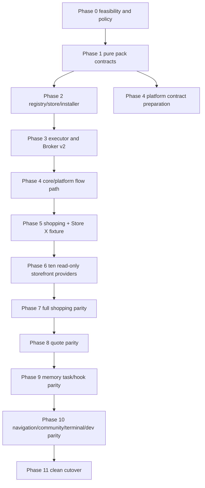

# UserScript Agent Pack Phased Implementation Plan

**Status:** Phase 0 in progress; embedded default Pack path selected; Phase 1 not started · 2026-08-24  
**CWS launch gate:** The default Agent Pack and first-party provider artifacts are extension-packaged. REQ-REL-010 is deferred to any later build that enables remote Pack flow or JavaScript delivery.  
**Requirements:** [`USER_SCRIPT_AGENT_PACK_REQUIREMENTS.md`](USER_SCRIPT_AGENT_PACK_REQUIREMENTS.md)  
**Architecture:** [`USER_SCRIPT_AGENT_PACK_ARCHITECTURE.md`](USER_SCRIPT_AGENT_PACK_ARCHITECTURE.md)

## 1. Purpose

This document turns the approved requirement and architecture boundaries into an ordered implementation
program. It does not reopen those decisions. If this plan conflicts with a `REQ-*` requirement or an
`AD-*` architecture decision, the requirement or architecture decision wins and this plan must be
corrected before code continues.

The target is one clean transition:

```text
current packaged flow + Lua runtime
  → additive, disabled Pack infrastructure
  → isolated Pack-mode parity proofs
  → complete first-party parity Pack set
  → one reviewed deletion/cutover
  → Pack-only task runtime with no hidden local fallback
```

The first end-to-end increment is deliberately narrow:

```text
Shopping Agent Pack 1 + baseline provider
  + Store X Provider Pack 2
  → Pack 1 bytes and graph unchanged
  → Store X discovered through storefronts@1
  → both providers use the same comparison/ranking/window path
```

## 2. Non-negotiable execution rules

1. **Phase 0 is a decision gate.** Executor-dependent production work does not begin until exact
   UserScript execution, platform compilation, multi-asset verification, no-Pack zero-side-effect
   behaviour, crash recovery, and written CWS policy eligibility are all proven.
2. **RED first.** Every permanent behavioural change starts with a test or real-browser probe that
   fails for the exact missing invariant. Record the failure message before implementation.
3. **Mutation-check every new gate.** Temporarily break the protected invariant and confirm that the
   test fails for the intended reason. Revert the mutation before continuing.
4. **One runtime mode per session.** `legacy-local` and `packs` are never composed, deep-merged, or
   used as fallback for one another.
5. **No source deletion before Phase 11.** `_common/flows.yaml`, `_common/scripts`, `_common/rpc`, site
   flow/Lua layers, current C3 packaging, and existing live runners remain production-authoritative
   until every clean-cutover gate is green.
6. **No Pack side effect when no Pack is active.** No executor/provider tab, UserScript execution,
   world configuration, Pack storage write, Pack wire field, Pack UI prompt, or changed primary-tab
   routing.
7. **No privilege substitution.** The model never chooses an artifact, version, provider identity,
   URL, effect, host, or consent. Those are resolved from signed installed state and current user
   approvals.
8. **No arbitrary registry path.** Only configured, reviewed, signed registries are eligible. Local
   file, pasted code, arbitrary URL, unsigned release, or expired/untrusted key paths are refused.
9. **No order or quote submission.** Cart adds may be exercised after explicit consent. Checkout is
   read-only. Thumbtack stops before the existing contact/lead boundary and never submits.
10. **No compatibility cleanup early.** Existing SDK exports, browser/voice/React/Lua roots, legacy
    extension behaviour, community v1 state, current op tables, and old session snapshots remain
    unchanged until their dedicated gates pass.
11. **No speculative platform path.** The flow compiler/runtime repository and owner must be named in
    Phase 0. Do not place platform composition work in `axsdk-backend` merely because it is nearby.
12. **Evidence follows the shipped path.** Direct unit commands prove components; only the Pack-mode
    flow path in the exact CWS candidate proves the product.

## 3. Repository and ownership map

| Repository/component | Owns during this program | Must not absorb |
|---|---|---|
| `axsdk-sdk-js/packages/axsdk-packs` (new) | schemas, canonicalization, digests, compatibility, restricted composer, serializable protocols | Chrome APIs, storage, fetch, UI, sessions, model calls, code execution |
| `axsdk-sdk-js/packages/axsdk-extension-cdp` | registry client, installed state, exact UserScript host, Broker v2, tab roles, recovery, consent/UI bridge | Pack business logic, arbitrary script/URL selection, platform compilation |
| `axsdk-sdk-js/packages/axsdk-core` | optional serialized Pack-mode session contract, transport, pinned composition provenance | registry/composer runtime dependency, Chrome lifecycle, Pack UI |
| `axsdk-sdk-js/packages/axsdk-react/packs` (new subpath) | local lifecycle/permission/update/provider-selection view models and surfaces | registry parsing, composer runtime, Chrome APIs |
| AXSDK platform flow runtime | compile-only validation, fixed `community.task`/`community.provider` actions, versioned fixed services | browser install state, Chrome permissions, arbitrary Pack URL/code selection |
| `axsdk-sites` | first-party Pack sources, registry publisher tooling, parity fixtures and scenarios | final CWS local flow/Lua runtime layers |
| current community v1 subsystem | existing single-script lifecycle, broker, storage, catalog/prerun, widget path | Pack records, Pack Broker v2, Pack garbage collection |
| registry signing environment | private signing keys, release/index/revocation signatures | extension runtime, repository secrets, user data |

Before Phase 4, replace “AXSDK platform flow runtime” in the work tracker with its exact repository,
package, owners, test command, staging endpoint, and deployment order. That code is not present in this
checkout, so this plan intentionally does not invent file paths for it.

## 4. Target source layout

### 4.1 SDK

```text
packages/axsdk-packs/
  package.json
  build.ts
  src/
    contracts.ts
    schemas.ts
    canonical.ts
    release.ts
    flow-fragment.ts
    composer.ts
    compatibility.ts
    protocol.ts
    diagnostics.ts
    index.ts
  testdata/
    canonical/
    releases/
    compositions/

packages/axsdk-extension-cdp/assets/
  pack-product-shell.yaml

packages/axsdk-extension-cdp/src/
  user-script-topology.ts
  packs/
    manager.ts
    store.ts
    artifact-store-idb.ts
    registry.ts
    installer.ts
    composer.ts
    executor.ts
    injector.ts
    broker.ts
    provider-coordinator.ts
    service-bindings.ts
    recovery.ts
    messages.ts

packages/axsdk-react/src/packs/
  types.ts
  lifecycle.tsx
  permissions.tsx
  update-diff.tsx
  provider-selection.tsx
  consent.tsx
  index.ts
```

Exact filenames may follow local naming conventions, but the ownership boundaries above are fixed.
`src/user-script-topology.ts` is intentionally outside `src/packs`: it serializes current community v1
registration reconciliation and Pack role acquisition without making either store own the other.

`pack-product-shell.yaml` is a fixed CWS-packaged asset, not a registry release. It contains only the
global router/policy/management/terminal surface allowed by the architecture; task and provider
business logic stays in signed Pack releases.

### 4.2 First-party Pack sources

```text
packs/
  agents/
    shopping/
      pack.yaml
      flow.yaml
      src/task.ts
    service-quote/
      pack.yaml
      flow.yaml
      src/task.ts
    memory/
      pack.yaml
      flow.yaml
      src/task.ts
    site-navigation/
      pack.yaml
      flow.yaml
      src/task.ts
  providers/
    store-x-fixture/
    amazon/
    ebay/
    walmart/
    aliexpress/
    etsy/
    coupang/
    naver-shopping/
    gmarket/
    11st/
    ssg/
    thumbtack/
    bluemoonsoft/
  testdata/
    registry/
    malformed/
    exact-artifact/

tools/packs/
  build-release.mjs
  verify-release.mjs
  build-registry.mjs
  compose-preview.mjs
  generate-schema.mjs
  check-empty-local-runtime.mjs
```

Generated JavaScript, canonical release manifests, indexes, and revocations are content-addressed
release outputs. Signing keys never enter this repository. CI must expose the exact JavaScript bytes
for review before signing; source review alone is insufficient.

## 5. Phase protocol

Every phase uses the same five checkpoints:

1. **Baseline:** record current public API, payload, storage, build, and live behaviour affected by the
   phase.
2. **RED:** add the smallest test/probe that fails because the required invariant does not exist.
3. **Implement:** change only the owner named by the requirement and architecture map.
4. **GREEN + mutation:** run focused tests, break the invariant deliberately, confirm RED, restore,
   then run the phase gate.
5. **Evidence:** store bounded structural evidence—ids, digests, counts, status, timings, and exact
   artifact hashes; never secrets, raw configuration, source payloads, or user data.

A phase may contain independent PRs, but the next phase starts only after the phase exit gate. A PR
must list the `REQ-*` ids it advances, its architecture phase, its RED evidence, its mutation, and its
rollback boundary.

## 6. Dependency graph



`P4A` may prepare additive platform schemas and compile-only capability after Phase 1, but Pack-mode
session creation and action dispatch remain blocked until Phase 3 exact execution is green.

### 6.1 Primary requirement coverage by phase

| Phase | Primary requirement ids |
|---|---|
| 0 | `REQ-REL-010`, `REQ-EXEC-003/006/008/009`, `REQ-COMPAT-016/019`, feasibility portions of `REQ-NFR-*` |
| 1 | `REQ-REL-001`–`006`, `REQ-FLOW-001`–`010`, `REQ-PROV-001/002/003/011`, `REQ-PKG-001` |
| 2 | `REQ-REL-003`–`009/011`, `REQ-STATE-001/002/005/006`, `REQ-UX-001`–`007`, `REQ-COMPAT-008/009` |
| 3 | `REQ-EXEC-001`–`009`, `REQ-SEC-002`–`008/011/012`, `REQ-COMPAT-009`–`014`, `REQ-NFR-008` |
| 4 | `REQ-SVC-001`–`003`, `REQ-PKG-002`–`007/010`, `REQ-COMPAT-002`–`007/017/018` |
| 5 | `REQ-PROV-001`–`011`, `REQ-SHOP-001/002/003`, `AC-001`–`004` |
| 6 | `REQ-PROV-004`–`010`, `REQ-SHOP-002/003` |
| 7 | `REQ-SHOP-001`–`007` |
| 8 | `REQ-QUOTE-001`–`005` and its declared `REQ-SVC-*` dependencies |
| 9 | `REQ-MEM-001`–`004`, `REQ-FLOW-009` |
| 10 | `REQ-NAV-001/002`, `REQ-COMM-001`, `REQ-TERM-001`, `REQ-DEV-001` |
| 11 | `REQ-MIG-001`–`006`, `REQ-COMPAT-001/015/016/019`, `REQ-PKG-008/009`, all `AC-*` |

`REQ-SEC-*`, `REQ-STATE-*`, `REQ-NFR-*`, and compatibility requirements remain cross-cutting even
when one phase is their primary owner. A phase gate must include every transitive requirement reached
by the files/contracts it changes.

## 7. Phase 0 — Feasibility, policy, and baseline freeze

### 7.1 Objective

Prove that the architecture is legal and implementable before production structure depends on it.
Phase 0 permits disposable probes and test harnesses, not user-visible Pack behaviour.

### 7.2 Work packages

#### P0-A — Embedded default Pack policy boundary

1. Package the default Agent Pack flow, task JavaScript, first-party provider JavaScript, schemas, and
   data inside the reviewed extension artifact.
2. Treat extension installation as installation of that default Pack; do not add a second install
   prompt for executable bytes already reviewed with the extension.
3. Keep remote registry flow and JavaScript delivery disabled in the CWS build.
4. Preserve REQ-REL-010 as a later release gate before any public build enables dynamic Agent or
   Provider Pack executable delivery.

**Exit:** the first implementation requires no post-review executable fetch for its default Pack, and
the remote path remains absent or disabled rather than silently treated as approved.

#### P0-B — Exact UserScript executor spike

Targets:

- `packages/axsdk-extension-cdp/scripts/` for a retained real-Chrome probe;
- `src/background/sessions.ts` test fixtures only if optional role metadata is needed by the probe;
- no production startup wiring.

RED cases:

- frame-only targeting injects after a document replacement;
- port arrival cannot be bound to returned `InjectionResult.documentId`;
- two sessions using the same Pack overwrite one connection;
- provider navigation destroys the task connection;
- the executor steals focus or becomes the primary tab;
- a broad community v1 registration executes on the role document.

Implementation/probe sequence:

1. Use the existing Chrome 138 profile and real `chrome.userScripts` namespace.
2. Create an inactive, extension-owned task tab at the fixed approved HTTPS marker origin.
3. Run a packaged `chrome.scripting.executeScript` no-op against `frameIds: [0]` and capture the
   returned main-frame `documentId`.
4. Revalidate URL/top frame.
5. Call `chrome.userScripts.execute` with only `documentIds: [expectedDocumentId]`.
6. Bind a 256-bit single-use nonce to group/session/tab/frame/document/role/world/release/commands.
7. Match execute result and port sender before accepting the connection.
8. Navigate a separate provider tab repeatedly while keeping the task connection alive.
9. Repeat with two concurrent groups and the same exact Pack release.
10. Restart the service worker and extension; reconnect by fresh exact execution, never registration.
11. Exercise community collision preflight, disable/retry, and later v1 enable/role retirement.

GREEN evidence:

- exact document ids match;
- wrong-document/race attempts execute no Pack code;
- session connections remain distinct;
- no persistent Pack registration exists in `getScripts()`;
- no focus, primary-tab, liveness, or restore-fingerprint change;
- community v1 works on its ordinary page and never co-resides on the Pack role document.

#### P0-C — Platform compile and protocol spike

1. Name the platform repository and owner.
2. Add or prove a compile-only endpoint for one complete Pack composition.
3. It must return structured diagnostics without creating a session, model turn, or action.
4. Add optional pre-session app-info capability/version negotiation.
5. Compile the smallest product shell + Agent Pack + Provider contribution.
6. Probe the full projected parity document size and per-command compiled size.
7. Confirm old clients and non-Pack requests receive the current field/action set unchanged.

RED cases:

- compilation requires session creation;
- duplicate names or dangling references reach runtime;
- old clients receive unknown Pack fields/actions;
- the complete projected composition exceeds a hard compiler bound.

**Exit:** a versioned capability and compile-only contract exist, and size limits are measured rather
than assumed.

#### P0-D — Multi-asset and activation crash spike

1. Build a signed fixture with separate flow, task script, provider script, schema, and data assets.
2. Verify every byte count and SHA-256 before state publication.
3. Simulate crash before activation-pointer commit.
4. Simulate crash after pointer commit but before cleanup.
5. Pin the old composition from a live/restorable session and prove pruning preserves it.

**Exit:** all-or-nothing verification and immutable pointer recovery are proven.

#### P0-E — Zero-install compatibility baseline

Record snapshots before any Pack code lands:

- root package exports/types and dependency graphs;
- no-Pack core session/message payloads;
- extension startup tabs, storage writes, worlds, script registrations, config, permissions, and DNR;
- `AgentSessions` old snapshot parse/round-trip;
- community v1 install/invoke/storage/widget behaviour;
- current local flow/Lua exact-artifact scenarios.

The future regression compares against these snapshots. An empty optional Pack field is not accepted as
“unchanged”; the field must be absent.

### 7.3 Phase 0 exit gate

The intended exit gate is all P0 work packages green. A measured failure changes the architecture or blocks the program. It never
justifies broad persistent matching, extension-worker execution of downloaded code, hidden fallback,
or CWS policy wishful thinking.

### 7.4 Measured Phase 0 result — 2026-08-24

The gate found two independent hard blockers before Pack product code landed. The pre-existing CWS
baseline defect found by the gate was repaired at its source: the service worker now routes both
immutable release diagnostics and the verified packaged workspace to the requesting realm.

| work package | result | measured evidence |
|---|---|---|
| P0-A policy | **BLOCKED** | The user approved proceeding with internal work, but no written Chrome Web Store decision addresses both downloaded restricted flow logic and signed first-party JavaScript executed through `chrome.userScripts.execute`. User approval is not Google policy approval. |
| P0-B executor | **GREEN** | `bun run test:packs:phase0:live` on Chrome 151 proves the complete narrow executor contract. Four disposable role tabs in two same-release groups stayed inactive. Exact frame-0 no-ops supplied each `documentId`; exact execution results and User Script senders agreed; stale-document and wrong-group attempts were refused. The task port survived two provider navigations. A service-worker stop/start retained the task document and reconnected it through a new worker instance and nonce. A real unpacked-extension reload invalidated the old User Script worlds, so both task and provider documents were deliberately recycled before fresh exact execution; the new task port used a new worker, document, and nonce. Two concurrent task ports kept distinct session/group/tab/document/nonce/world bindings and each pong stayed on its own port, including the inactive/background state. One existing community registration matched neither role URL. Cleanup left no persistent registration or structural no-Pack baseline drift. The corrected lifecycle proof passed three consecutive stress runs. |
| P0-C platform | **RED / BLOCKED** | `npm run probe:packs:phase0:platform` authenticated successfully (`200`; app-info top-level keys `app,appUser`) but advertised no Pack protocol/capability and no compile-only contract. The available platform checkout exposes no flow compiler route. No endpoint path was guessed, and no session/model turn was created. |
| P0-D multi-asset/recovery | **GREEN** | `bun run test:packs:phase0` passes 23 tests / 41 assertions. The Ed25519-signed fixture contains flow, task, provider, schema, and data assets (403 source bytes; 772-byte JSON manifest); byte count and SHA-256 are verified before all five assets enter the existing content-addressed cache. Crash-before restores the old pointer, crash-after keeps the new pointer, a pinned old composition survives pruning, and the pure lifecycle/isolation contracts distinguish retained same-document worker recovery from extension-reload document recycle. |
| P0-E zero-Pack baseline | **GREEN** | The real-Chrome probe left manifest, permissions, DNR, tabs/groups, UserScript registrations, static store-key shape, and Pack-store absence structurally unchanged. The repaired exact CWS artifact gate passes from a fresh extracted profile: release `sha256:875d3b62202e0923652afb1b081e6f34f9a7df81e8ed86a85586272003bb325a`, archive `sha256:856551d2329945c440d7fb912ebe84b6fc1e0b15b268e211808be37989fbafe6` (8.02 MiB / 54 entries), 32 verified workspace assets, 26 runtime modules, unchanged workspace stores, and script ownership `axsdk-default-form-tools,packaged-lua:` with no `stored-lua:*`. Amazon and eBay returned candidates; Amazon-only refinement persisted; cancellation caused no mutation; the guarded cart add was site-confirmed; checkout review placed no order. The CDP extension passes 1,123 tests / 1,862 assertions and the core packaged-workspace suite passes 5 tests / 19 assertions. |

Baseline source hashes recorded before Pack production code:

| surface | SHA-256 |
|---|---|
| `packages/axsdk-core/src/axapi.ts` | `db46a7d4fdbf3273d194025240bed2173aaaeadcea46563ad9d790a93544d929` |
| `packages/axsdk-core/src/contextvalues.ts` | `f9a87431544ace0e12e1d8386ca2dfcf024fec0e3f4a0b9d9a676d68b65e8ba6` |
| `packages/axsdk-extension-cdp/src/manifest.json` | `e60129ef7aa4e7f991c12428d2c79b582f1fe108232504fdb89073b839924c62` |
| `packages/axsdk-extension-cdp/src/background/sessions.ts` | `def715c37f937ae817151a7299d565655e2cc9a7a21cc22c36b8176068bb297f` |
| `packages/axsdk-extension-cdp/src/community/user-scripts.ts` | `d58051d3f470b290e0a32b4e16cec562a4c9d06a83db7c9f6b2e72b8488e43ba` |
| `packages/axsdk-extension-cdp/src/community/broker.ts` | `bdbd95ce271df848c360d584036004210e5f71a530c4b5d26767bc76d44fde57` |

**Decision:** stop before Phase 1. P0-B, P0-D, and P0-E are GREEN. Unblock P0-A with the
external written policy answer. Unblock P0-C only in the platform repository that owns the real flow
compiler: publish a versioned app-info capability and a compile-only endpoint, then prove the complete
generated product-shell + Pack flow without creating a session/model turn. The available backend, SDK,
and agent checkouts contain no production flow compiler or compile adapter, so advertising readiness
here would fabricate a contract. P0-E remains the compatibility oracle for those changes.

**2026-08-24 authorization update:** Phase 1 was subsequently approved as an inert, pure package
milestone. This does not change either blocker above: no Pack is installable or executable, and no
platform compile capability is claimed.

## 8. Phase 1 — Pure `@axsdk/packs` contracts and composer

### 8.1 Objective

Create the only shared semantic package before Chrome, UI, registry, storage, or platform
integration. Phase 1 validates and composes inert bytes and data. It does not install, activate,
fetch, trust, execute, register, or persist a Pack.

### 8.2 Fixed design boundary

`@axsdk/packs` is a pure browser-independent package. It owns:

- strict Script Pack v2 base contracts and concrete Agent/Provider Pack manifests;
- canonical JSON, domain-separated signing bytes, SHA-256 digests, and asset-graph verification;
- the closed restricted flow-fragment parser/validator;
- semantic-version and contract compatibility;
- deterministic dependency resolution, namespace rewriting, composition, and provider registries;
- serializable invocation, provenance, failure, and diagnostic types.

It does not own:

- fetch, registry trust roots, Ed25519 key selection, sequence high-water state, or revocation state;
- IndexedDB, `chrome.storage`, options UI, service-worker messages, or activation pointers;
- `chrome.userScripts`, task/provider tabs, Broker v2, session creation, or platform compilation;
- the existing C3 packaged workspace implementation.

The existing Phase 0 exact-document probe remains the execution/topology regression oracle. Phase 1
adds no execution path and does not move the current C3 workspace parser merely because both systems
use content-addressed assets.

### 8.3 Package and public-surface design

Create `packages/axsdk-packs` with these explicit public subpaths:

|export|owns|
|---|---|
|`@axsdk/packs`|canonical JSON/digests, shared values, diagnostics, release-graph validation|
|`@axsdk/packs/schemas`|strict Zod schemas and canonical signed-document parsers|
|`@axsdk/packs/flow`|restricted YAML fragment parser, AST, validation, namespace rewrite|
|`@axsdk/packs/composer`|dependency resolution, contribution matching, provider registries, digests|
|`@axsdk/packs/protocol`|serialized invocation/result/provenance/failure contracts|

All five exports must be safe in a browser, worker, Bun, and Node. Importing any export performs no
I/O, hashing, fetch, timer, storage access, registration, environment read, or logging. No Node-only
subpath is added in Phase 1 because Phase 1 has no producer CLI.

The package has no AXSDK runtime dependency. Its only runtime dependencies are the browser-safe
schema/YAML libraries needed to implement the contract. `@axsdk/extension-cdp` may depend on the new
package, but no production extension module imports it until Phase 2. `@axsdk/core`, `@axsdk/react`,
`@axsdk/browser`, `@axsdk/voice`, `@axsdk/lua`, and the legacy extension retain their exact
dependency/export graphs.

Before changing package metadata, capture a checked-in structural snapshot of:

- every existing root package's `exports`, `dependencies`, and `peerDependencies`;
- the root workspace/build order;
- the extension-cdp dependency graph.

The post-change gate permits only the new package, its root build step, and one
`@axsdk/extension-cdp -> @axsdk/packs` edge.

### 8.4 P1-A — Package shell and dependency isolation

Implementation order:

1. Add `package.json`, `tsconfig.json`, `build.ts`, and empty typed entry modules for the five exports.
2. Add import-side-effect and exact-public-export tests before implementation.
3. Add package/dependency snapshot tests before changing the root/extension package metadata.
4. Build ESM, CJS, and declarations with the repository's existing package conventions.
5. Insert `axsdk-packs` before extension-cdp in the root build.
6. Add focused `test:packs` and `test:packs:phase1:live` commands without changing existing commands.

P1-A is green only when the empty shell builds, each export imports under runtime traps, and the
package graph differs from the frozen baseline only at the approved edges.

### 8.5 P1-B — Canonical release contracts

#### 8.5.1 Manifest family

“Script Pack v2” is the shared base schema family, not a third executable Pack kind. The concrete
manifest discriminator remains closed to `agent | provider`, matching the architecture's two
concrete manifest examples.

The strict schema surface is:

- `AssetRefV2`: `ref`, `bytes`, and exact supported `mediaType`;
- `SignatureV2`: `algorithm: "Ed25519"`, `keyId`, and base64url `value`;
- `SignedEnvelopeV2`: `schemaVersion: 2`, `kind: index | release | revocation`, a closed
  kind-specific `signed` body, and `signature`;
- `ReleaseSignedBodyV2`: exact pack id/version/published time and manifest asset reference;
- `ScriptPackManifestV2`: closed shared identity, assets, commands, service dependencies,
  disclosures, review, and compatibility fields;
- `AgentPackManifestV2`: task execution target, one flow asset, one task artifact, route/resume/hook
  contributions, extension points, and optional embedded providers;
- `ProviderPackManifestV2`: provider execution matches/entry URL and contributions to a named Agent
  Pack extension point;
- `CommandContractV1`: command name/contract/effect/confirmation, exact artifact/export, closed
  input/output schemas, and companion data-flow maps;
- active composition, invocation, provider-step, trusted-result/provenance, and bounded diagnostic
  records.

The effect vocabulary is closed to:

```text
read | page_write | state_write | external_send | cart_mutation
```

The data-flow class vocabulary is closed to:

```text
public_product | user_content | personal | secret_forbidden
```

Destinations are closed to:

```text
provider_page | task_script | extension_state | backend_model
```

plus a service contract id declared by the same manifest. Every leaf JSON Pointer pattern in each
input/output schema must have exactly one companion classification. Parent declarations do not cover
children. `secret_forbidden` has no destination. Unknown schema fields, command fields, or result
fields are rejected rather than dropped.

#### 8.5.2 Canonical bytes

Signed index/release/revocation documents use strict UTF-8 JSON and RFC 8785 canonicalization.
The parser:

- rejects duplicate keys before object construction;
- rejects trailing data, lone Unicode surrogates, unsafe integers, non-finite values, and
  non-canonical textual round trips;
- preserves Unicode exactly—no extra NFC/NFD or locale normalization is invented;
- rejects unknown fields in every closed schema;
- sorts object keys by the RFC 8785 UTF-16 ordering and preserves array order.

Signing bytes are exactly:

```text
UTF8("AXSDK-PACK-" + KIND + "-V2\n") || UTF8(canonicalJson(signed))
```

where `KIND` is exactly `INDEX`, `RELEASE`, or `REVOCATION`.

Asset-graph validation checks the signed closure before returning any asset:

- every declared reference exists;
- no undeclared asset is supplied;
- byte count, SHA-256, and media type match;
- every manifest reference resolves to an asset with the required role/media type.

Trust-root selection, Ed25519 verification, registry sequence state, same-version equivocation state,
and live revocation state remain Phase 2. Phase 1 defines their signed wire shapes and signing bytes,
not their lifecycle authority.

#### 8.5.3 URL, origin, and host rules

- execution `matches` and product matches use validated Chrome match patterns;
- `entryUrl` is an absolute credential-free HTTPS URL covered by execution matches;
- approved network hosts are absolute credential-free HTTPS origins with no path, query, or
  fragment;
- fixed services are referenced only by declared versioned service contract id;
- URLs, origins, patterns, and paths have separate branded types and are never accepted
  interchangeably.

### 8.6 P1-C — Restricted flow validator

The released flow artifact remains YAML with media type
`application/vnd.axsdk.flow-fragment+yaml`. It is a closed subset of the existing v1 flow syntax,
not a second flow language and not a generic overlay.

Only these top-level keys are accepted:

```yaml
flows: {}
flowTools: {}
```

The fragment may define only:

- local flow ids, local state, local nodes, and local flow-tool ids;
- bounded `action_unit`, `action_contract`, and terminal/respond nodes;
- local `next`, fallback, input-selector, output-map, tool, terminal, resume, and hook references;
- one of three closed execute bindings:
  - `community.task` targeting the owning Agent Pack;
  - `community.provider` targeting one declared extension point;
  - `platform.service` targeting one declared fixed service.

It rejects rather than ignores:

- `version`, `extends`, `app`, global `planner`, `router`, `defaults`, `contexts`, arbitrary hooks,
  or top-level actions;
- runtime Lua/module/source, raw op grants, `rpc.allow`, `net`, selector, caller URL, source code, or
  capability grant;
- unowned/foreign namespace, whole-root selector, or cross-Pack state/tool/flow reference;
- undeclared service, effect, host, command, or extension point;
- duplicate or dangling flow/node/tool/terminal/next/resume/hook reference;
- YAML duplicate keys, aliases/anchors, custom tags, non-core schema values, or unbounded structures.

The parser returns a typed `RestrictedFlowFragment`; the composer never deep-merges author input.

### 8.7 P1-D — Deterministic composer

The composer accepts only already parsed, verified, enabled release inputs. A release marked revoked
or missing its exact manifest/flow/schema assets is rejected. This input status is data supplied by
Phase 2 later; Phase 1 does not decide trust.

Composition order is:

1. Require one exact enabled release per pack id.
2. Resolve manifest dependencies with strict semantic-version/contract checks.
3. Reject missing dependencies, incompatible constraints, cycles, duplicate identities, and
   ambiguous enabled releases.
4. Topologically sort Agent Packs; ties use canonical pack id, never install/storage/UI order.
5. Parse and validate every Agent flow fragment.
6. Namespace all Pack-owned flows, nodes, tools, state, routes, resume rules, hooks, extension
   points, and services using a composer-generated prefix authors cannot spoof.
7. Rewrite only validated local references; reject foreign or whole-root references.
8. Match every embedded/external Provider contribution against the exact target Agent release,
   version range, extension-point id, contract, command, and cardinality.
9. Reject duplicate canonical provider ids within one extension point.
10. Build provider registries in canonical provider-id/release order and bounded default sets.
11. Validate the fully rewritten graph again.
12. Canonicalize and hash only the active semantic graph.

Labels and aliases are not authority and are not composition keys. Two enabled providers may share a
normalized label/alias; the deterministic resolver returns `ambiguous_provider` with all matches so
the shell can ask. It never chooses by install order, version, or model guess. A duplicate provider
id still rejects composition. If more than the allowed number of contributors are marked default,
composition returns `default_selection_required` rather than evicting one silently.

Digest rules:

- `providerRegistryDigest` hashes the canonical active provider registry plus provider settings,
  excluding timestamps;
- `providerSetDigest` hashes ordered selected provider ids, exact provider release digests,
  contracts, and task release version/digest;
- `packSetDigest` hashes the complete canonical active composition including
  `providerRegistryDigest`, exact releases, namespaced flow graph, bindings, routes, resume rules,
  hooks, and services, excluding `generatedAt`;
- install order, storage order, object insertion order, UI order, and timestamps never affect a
  digest.

The composer returns either one immutable `ActivePackCompositionV1` or a sorted, structured
diagnostic list—never a partial candidate.

### 8.8 Golden and malformed fixtures

The minimum golden matrix is:

```text
Pack 1 only
Pack 1 + Store X
Pack 1 + Store X supplied in opposite input order
Pack 1 + incompatible Store Y
Pack 1 + duplicate Store X provider id
Pack 1 + two providers sharing one normalized alias
```

Expected results:

- the two compatible input orders produce byte-identical flow documents and all three digests;
- incompatible Store Y and duplicate provider id produce deterministic diagnostics and no candidate;
- the alias collision composes successfully, but resolving that alias deterministically returns
  `ambiguous_provider` and never a selected provider.

The malformed/mutation corpus covers at least:

- duplicate/unknown keys and malformed/non-canonical JSON/YAML;
- non-canonical number and lone-surrogate mutations;
- unsupported algorithm and wrong signing-domain bytes;
- missing/extra/hash-mismatched/size-mismatched/media-mismatched assets;
- uncovered schema leaves and undeclared data-flow destinations;
- path/URL/origin/match-pattern confusion;
- forbidden flow top-level fields, raw ops, source, selectors, URLs, grants, and foreign namespaces;
- duplicate/dangling references;
- missing/incompatible/cyclic dependencies;
- extension-point contract mismatch, duplicate provider id, excess defaults, and alias ambiguity;
- timestamp/input/install-order mutations that must not alter semantic digests.

Each validator has one mutation that removes or reverses its guard and turns its focused test RED.

### 8.9 TDD and verification sequence

Each substage follows RED → implementation → focused GREEN → mutation RED → restored GREEN:

1. **P1-A:** package shell/public exports/import traps/dependency snapshot.
2. **P1-B:** canonical parser, schemas, asset closure, protocol types.
3. **P1-C:** restricted YAML parser and reference validator.
4. **P1-D:** composer, registries, digests, golden matrix.
5. **Package gate:** typecheck, ESM/CJS/declaration build, exact export snapshot, malformed corpus.
6. **Determinism gate:** build the same package and compose the same golden input three times from
   clean directories with changed mtimes and input insertion order; compare bytes and hashes.
7. **Existing regressions:** root typecheck/build plus all existing package/core/extension tests whose
   dependency or build path was touched.
8. **Real Chrome gate:** run the retained Phase 0 no-Pack/exact-document probe, then load a
   browser-bundled `@axsdk/packs` golden composition in a disposable ordinary tab. It must parse,
   compose, and hash identically without Pack storage, user-script registration, session creation,
   task/provider tabs, or backend/model traffic.

The browser smoke proves browser compatibility and zero side effects only. It does not advertise
installation, activation, CWS approval, platform compilation, or execution, which remain later
gates.

### 8.10 Phase 1 exit gate

Phase 1 exits only when:

- all five public exports import with no observable side effect;
- focused package tests and the complete malformed corpus are green;
- every named validator mutation has been observed RED;
- deterministic golden bytes/hashes are stable across three clean builds;
- the final composed graph passes the package's own full reference/schema validation;
- the current public package/dependency snapshots change only at the approved new-package and
  extension-cdp edge;
- the complete existing SDK regression matrix is green;
- the real-Chrome zero-Pack/exact-document and pure-browser package probes are green;
- no Phase 2/3/4 lifecycle, execution, or platform capability has been fabricated.

### 8.11 Measured Phase 1 result — 2026-08-24

**GREEN.** `@axsdk/packs` is a new pure package with exactly five public export paths: root,
`canonical`, `flow-fragment`, `protocol`, and `schemas`. It adds no runtime dependency outside the
package and is referenced by `@axsdk/extension-cdp` only as a build-time dependency for the retained
browser probe.

The implementation includes strict canonical JSON/signing/digest helpers, closed Agent/Provider
manifest and release schemas, verified asset closure, the bounded restricted-flow parser, exact
command/effect/schema/data-flow authority checks, deterministic dependency/namespace/provider
composition, immutable active-composition output, provider alias resolution, and bounded invocation,
provenance, failure, and diagnostic protocol schemas. The composer accepts only verified lifecycle
inputs; it does not fetch, verify publisher trust, install, activate, persist, register User Scripts,
open role tabs, invoke commands, compile on the platform, or create a session.

Measured gates:

- `bun run test:packs`: **72 tests / 280 assertions**, including malformed inputs and focused guard
  mutations;
- `bun run build`: all SDK packages built and `@axsdk/packs` emitted ESM, CJS, and declarations;
- `bun test`: **2,484 pass / 0 fail** across 215 files;
- three clean deterministic package builds produced byte-identical output and the same golden
  composition hashes;
- the retained Phase 0 real-Chrome probe passed with the no-Pack baseline unchanged;
- the Phase 1 ordinary-document Chrome probe imported all five export paths, parsed and composed the
  golden Pack without Pack state or extension-side effects, and reproduced pack-set digest
  `sha256:e408ead954eb5c96823e08843e75a13b6a1bbf7e014acb8d496fa20a2400cc50` and composed-flow digest
  `sha256:7bb9a83f6453a7d97a51e3fd62e5b49badcc21122e5a4eddc6b699b5f6e82682`.

Phase 2 remains unstarted. P0-A policy and P0-C platform compilation remain blocked exactly as stated
in §7.4.

## 9. Phase 2 — Registry, artifact store, installation, and lifecycle UI

### 9.1 Objective

Install and verify exact releases without executing them or changing the active session graph.

### 9.2 Extension implementation order

1. `packs/artifact-store-idb.ts`: content-addressed Pack-only IndexedDB.
2. `packs/store.ts`: installed/enabled/revoked/approval state plus immutable activation records.
3. `packs/registry.ts`: configured registry fetch, strict parse, signature/revocation checks.
4. `packs/installer.ts`: stage all assets, verify closure, publish installed-disabled state atomically.
5. `packs/composer.ts`: call the pure package and persist a candidate record before pointer commit.
6. `packs/manager.ts`: install/enable/disable/update/remove/rollback state machine.
7. `packs/recovery.ts`: pre/post-pointer crash reconciliation and reference-aware cleanup.
8. `packs/messages.ts`: closed service-worker/options/product-shell messages.
9. `@axsdk/react/packs`: local view models and callback-only UI surfaces.
10. options/service-worker integration that is dormant when no Pack metadata exists.

### 9.3 Lifecycle transaction

```text
fetch signed index
→ verify selected release metadata/signature/high-water mark
→ fetch every asset with independent limits
→ verify byte count + SHA-256 + media type + closure
→ store immutable exact assets
→ store release as installed-disabled
→ user reviews label/commands/effects/hosts/services/providers
→ user approves enable
→ compose + compile-only validate candidate
→ persist immutable candidate and activation journal
→ atomically switch active pointer
→ retain old candidate while any live/restorable session pins it
```

### 9.4 RED and mutation cases

- one missing or oversized asset;
- valid manifest with hash-mismatched bytes;
- untrusted, expired, revoked, malformed, or unsupported signature;
- same `(registry, packId, version)` arriving with different signed bytes;
- registry sequence rollback without explicit user-selected release rollback;
- output schema omitted from installed record;
- update expands host/effect/service without approval;
- update compilation failure overwrites working pointer;
- crash before/after pointer commit;
- explicit rollback lowers registry high-water mark;
- revocation leaves exact release dispatchable;
- reset or Pack GC erases community, chat, config, or a live pin;
- install/enable executes Pack JavaScript or creates a role tab;
- no-Pack startup writes an empty Pack store.

### 9.5 Phase 2 gate

- installation is all-or-nothing and execution-free;
- one user-visible Agent Pack installation may carry multiple artifacts/worlds;
- Provider Pack wording says it extends a named Agent Pack extension point;
- unknown/ambiguous Provider alias asks instead of choosing;
- approval diff is exact and update expansion re-prompts;
- removal/revocation preserves unrelated providers and state;
- no-Pack baseline remains byte/behaviour compatible.

### 9.6 Measured Phase 2 result — 2026-08-24

Phase 2 is implemented in the CDP extension and React package:

- `src/packs/registry.ts` verifies packaged registry origins, monotonic signed index/revocation
  sequences, Ed25519 trust windows, exact release identity, and every content-addressed asset before
  returning a candidate. The production registry/trust-root list is deliberately empty, so a release
  cannot currently be installed from the Options page.
- `artifact-store-idb.ts` is a Pack-only content-addressed IndexedDB. `store.ts`, `installer.ts`,
  `composer.ts`, `manager.ts`, and `recovery.ts` implement installed-disabled staging, canonical
  approval receipts, exact approval diffs, immutable composition records, replace/rollback,
  revocation, pre/post-pointer recovery, reset, and reference-aware garbage collection.
- Publisher id, registry id, verified trust-key id, exact release digest, commands, effects, sites,
  fixed services, Provider identities, disclosures, and every added/removed update capability are
  user-visible before approval. An approval for the prior release cannot authorize the replacement.
- `messages.ts` admits only closed options-page lifecycle requests. The service worker rehydrates
  Pack state only when the Pack key exists, refreshes revocations, and exposes no Pack authority to
  pages. Shared reset first disables and garbage-collects Pack state, then removes only the existing
  reset-owned keys.
- `@axsdk/react/packs` is a callback-only local lifecycle surface. Importing it grants no storage,
  registry, installation, or execution authority.

The activation pointer is lifecycle metadata only in this phase. The Options page states that Pack
execution remains inactive. No Pack task/provider JavaScript is imported, no role tab is created, no
`chrome.userScripts` registration is added, and no session graph consumes the pointer until the
Phase 3 executor and Phase 4 negotiated session path exist.

Measured gates:

- focused extension lifecycle: **38 pass / 0 fail**;
- pure `@axsdk/packs` contracts: **73 pass / 0 fail**;
- full SDK regression: **2,523 pass / 0 fail**;
- extension and `@axsdk/react` production builds: pass;
- `test:packs:phase2:live`: two independently signed exact releases ran through
  install-disabled → explicit approval → compose/activate → exact update diff → stale-approval
  refusal → replace → rollback → replace → exact revocation → remove in real Chromium with real
  WebCrypto and IndexedDB. Artifact counts were **3 staged / 5 active / 0 remaining**. A task asset
  containing an observable top-level side effect never executed.
- The same probe observed the shipping extension before/after and found its Pack keys, permissions,
  DNR rules, User Script registrations, and tab set unchanged. `test:packs:phase1:live` remains green.

This closes Phase 2 only. Production registry publication, Pack code execution, Pack role tabs,
Broker v2, and Pack-mode core/platform sessions remain later-phase work.

### 9.7 MV-0A — browser-only lifecycle verification

Phase 2 originally had a real-Chromium automation proof but no release a person could install by
clicking the product UI: the production registry and trust-root list is deliberately empty. MV-0A
adds a separate manual-verification build without widening production installation authority:

- `build:pack-manual` generates a fresh Ed25519 fixture outside the repository, embeds only its
  public key and signed immutable responses, and discards the temporary files after the build. The
  extension contains no signing key and accepts no unsigned/local-file Pack.
- The QA registry has one canonical synthetic HTTPS origin. Its fetch adapter serves only exact
  packaged paths under that origin, returns 404 for an absent path instead of reaching the network,
  and delegates every other origin to the ordinary fetch implementation.
- The actual Options lifecycle surface is used. A build-defined banner names the artifact as a
  manual verification build and pre-fills `layorix.fixture-agent@1.0.0`; verify, install-disabled,
  persistence across reload, enable, disable, and remove remain the Phase 2 production handlers.
- Ordinary builds define no QA registry, fixture, or presentation data. The CWS package gate scans
  the final extension tree and refuses the QA origin, registry id, banner, or an unresolved build
  marker. This is an additional release boundary, not a convention.

TDD began with **4 failures / 0 pass**: the closed QA source, build defines, Options presentation,
and CWS exclusion export did not exist. The focused suite is now **9 pass / 28 assertions**. The
first real `build:cws` then found a genuine leak: the banner literal remained in the production
Options chunk because an exported presentation helper kept it reachable even when its caller was
compiled out. Moving all presentation authority into the QA-only build define made the same CWS
build pass and mutation tests still refuse each marker.

Real browser proof used only the visible Options controls: exact verification rendered publisher,
registry, trust key, release digest, command/effect/hosts/services/providers; install-disabled
survived a page reload; enable reported the inert lifecycle default; disable and remove returned the
list to empty. Unknown Pack id and version were both refused as not indexed. Enabling created no
executor/provider tab and `chrome.userScripts.getScripts()` remained empty. The retained production
Phase 1 Chromium probe remained green.

This is a verification path, not P3-C: no Pack artifact executes and no role, document, nonce,
connection, command dispatcher, core session, or platform action is added.

## 10. Phase 3 — Exact executor, Broker v2, tab roles, and recovery

### 10.1 Objective

Turn verified assets into authenticated, document-scoped command connections without persistent Pack
registrations or ordinary-user-tab execution.

### 10.2 Implementation order

#### P3-A — Additive tab-role state

Update only optional fields around:

- `src/background/sessions.ts`;
- `src/background/restored-sessions.ts`;
- `src/background/service-worker.ts`;
- related snapshot and primary-tab tests.

Add `userTabIds`, `extensionCreatedTabIds`, one executor role, and one provider role while preserving
existing `primaryTabIdOf`, untargeted CDP routing, opaque ids, manual membership, group liveness, and
old snapshot parsing.

##### P3-A measured result — 2026-08-24

P3-A is implemented. `AgentSessions` retains the exact legacy `{tabIds, clientIds}` record when no
Pack role exists and adds one optional, closed `roles` object only after the extension owns
infrastructure:

- `tabIds`, opaque client ids, `primaryTabIdOf()`, promotion, untargeted CDP routing, widgets, and
  manual group membership remain user-tab-only;
- `executorTabId` and `providerWorkTabId` must name distinct tracked
  `extensionCreatedTabIds`; a user-owned tab cannot be relabelled as infrastructure;
- role ownership round-trips through `chrome.storage.session`; unknown, overlapping, divergent, or
  internally inconsistent role metadata drops the session closed instead of inventing authority;
- membership reconciliation excludes tracked role tabs from arrivals and liveness. When the last
  user-owned tab leaves, the service worker ends the run, releases both classes of attachment, and
  closes only extension-created tabs;
- restore fingerprints are derived by tab ownership, not URL shape, so an executor/provider showing
  the same store URL as a user tab cannot claim a conversation;
- reopening an existing group restores UI only to user-owned tabs.

TDD evidence: the initial role suite was **7 failures plus one missing-export error**; the closed-role
schema mutation was separately RED. Final gates are **52 focused tests / 89 assertions**,
**1,170 extension tests / 2,048 assertions**, and **2,532 full SDK tests / 6,642 assertions**, all
green. Typecheck and the production extension build pass. The freshly loaded build started a real
no-Pack CDP session on one user tab, and the retained Phase 1 Chromium probe found Pack storage,
User Script registrations, permissions, and DNR unchanged.

No executor/provider tab is created yet. Shared topology locking remains P3-B; exact document
creation, injection, and authentication remain P3-C.

#### P3-B — Shared script topology

Implement `src/user-script-topology.ts` around one service-worker-owned `scriptTopologyLock`:

1. one bounded lock shared by community registrar transactions and Pack role acquisition/re-entry;
2. exact Chrome match-pattern, include-glob, exclude-match, and exclude-glob evaluation;
3. unknown syntax or inspection failure means possible collision;
4. `community_script_conflict` refusal before role tab creation/navigation/Pack execution;
5. explicit community enable/update retires a colliding Pack role before registration;
6. lock order: topology before per-connection; ordinary dispatch never upgrades;
7. all paths release locks in `finally`.

Do not move or reinterpret `src/community/store.ts`, `broker.ts`, private storage, or v1 records.

##### P3-B measured result — 2026-08-24

P3-B is implemented around one service-worker-owned `ScriptTopologyCoordinator`:

- `runPackTransaction()` holds one bounded lock from actual
  `chrome.userScripts.getScripts()` inspection through the caller's future exact-execute/authenticate
  transaction. A matching or syntactically uncertain owned registration refuses
  `community_script_conflict`; inspection failure or lock timeout refuses
  `script_topology_unavailable`;
- the matcher implements Chrome HTTP(S)/file/`<all_urls>` match patterns, wildcard hosts, optional
  ports, path wildcards and the documented trailing-slash form, then applies `includeGlobs`,
  `excludeMatches`, and `excludeGlobs` in Chrome's order. A definite exclusion remains safe; an
  unparseable rule that could still include the role remains uncertain;
- every service-worker community reconciliation now takes the same lock, inspects both the actual
  owned registrations and the desired set, reads live P3-A role documents, closes each colliding
  extension-created role, clears its role metadata, and only then registers/updates/unregisters;
- the current retirement path releases the existing CDP attachment before closing the tab. There is
  no Pack dispatcher yet; P3-D must add its own dispatch-eligibility frontier before it can use this
  callback;
- `RegisteredCommunityUserScript` gained only the three optional Chrome match/exclude fields. The
  community store, v1 broker/protocol, artifact/private-state stores, registration prefix, and
  no-Pack registration bytes remain unchanged.

The first live collision probe exposed a second race: independent `withSessions()` read/modify/write
calls could both read one `chrome.storage.session` snapshot and let a later stale membership refresh
erase newly written role ownership. `AgentSessionTransactions` now serializes every service-worker
session mutation. The RED fixture preserved both a provider role and a concurrent manually-added user
tab; removing its queue wait fails that test.

TDD evidence: the complete initial topology suite was **14 failures / 1 pass**. The official Chrome
trailing-slash pattern added a separate **1-failure RED**. Mutation checks produced **2 failures** when
exclude precedence was removed, **2** when the lock released before the transaction, **3** when role
retirement was removed, and **1** when session transaction serialization was removed. Final gates are
**313 focused tests / 760 assertions**, **1,187 extension tests / 2,115 assertions**, and **2,549 full
SDK tests / 6,709 assertions**, all green; typecheck and the production build pass.

The real Chromium registrar smoke passes twice consecutively: community v1 is rebuilt from trusted
state and executes on its ordinary fixture page; a matching simulated provider role is then closed,
its user-owned sibling remains open, role metadata is cleared, and only afterward does the
registration reappear; final removal leaves no registration. The retained Phase 1 probe reports Pack
storage/User Script registrations/permissions/DNR unchanged, and the same build starts a normal
no-Pack CDP session.

No production path calls `runPackTransaction()` yet. P3-C is the first caller and must keep the lock
through exact document execution and authenticated connection acceptance.

#### P3-C — Injector and bootstrap

1. Configure a digest-qualified named `USER_SCRIPT` world with reviewed CSP and messaging.
2. Generate a one-use nonce per exact execution.
3. Acquire the current main-frame `documentId` through the packaged scripting no-op.
4. Revalidate exact target URL/top frame.
5. Execute packaged bootstrap + exact signed artifact by `documentIds` only.
6. Quarantine early ports until execute result arrives.
7. Match result/sender/nonce/session/group/tab/frame/document/role/world/digests/URL.
8. Accept one frozen command table matching the signed commands digest.
9. Destroy the nonce on success, failure, timeout, or navigation.

#### P3-D — Broker v2

- one in-flight invocation per connection/document;
- bounded queue;
- closed input and output validation;
- host/effect/service/consent checks immediately before dispatch;
- trusted provenance stamped only after output validation;
- read/page-write settlement and document replacement;
- mutation frontier persistence before commit;
- no replay after uncertain acknowledgement;
- compact failure vocabulary.

#### P3-E — Role recovery

- service-worker restart: rehydrate metadata, inspect actual community registrations, exact re-execute;
- extension update: recycle affected role documents because Chrome cannot “unexecute” a world;
- provider navigation: invalidate old connection, re-authenticate new document;
- group end: count only user-owned tabs, then close extension-created infrastructure;
- restore fingerprint: exclude executor/provider URLs;
- revoked/removed role: dispatch-ineligible before settlement/recycle.

### 10.3 RED cases

- task artifact executes on Store X;
- provider artifact executes on executor or a user-owned matching tab;
- same release/session keys collide across groups;
- frame-only race reaches a replacement document;
- early forged port authenticates;
- output is accepted before schema validation;
- community script co-resides on role document;
- role tab becomes primary or keeps an empty group alive;
- timeout replays `external_send` or `cart_mutation`;
- service-worker restart accepts an old nonce.

### 10.4 Phase 3 gate

Run unit/integration tests, then the retained real-Chrome Phase 0 probe against the production
implementation. Exact result and port document ids must match. No Pack registration may appear in
`chrome.userScripts.getScripts()`. Existing community v1 live scenarios remain green on ordinary
pages, and the collision scenario refuses before Pack execution.

## 11. Phase 4 — Core and platform Pack flow path

### 11.1 Objective

Create one additive, negotiated Pack-mode session path without changing the no-Pack and old-platform
paths.

### 11.2 Core changes

Target seams include:

- `packages/axsdk-core/src/types/axsdk.ts` for narrow optional serialized contracts;
- `axsdk.ts`, `apiclient.ts`, `contextvalues.ts`, `axhandler.ts`, and session tests for negotiated
  source mode/provenance/action frames;
- extension `src/offscreen/session-worker.ts` and `src/shared/runtime-messages.ts` for host wiring.

Rules:

1. Core declares its narrow Pack-mode shapes locally; no runtime `@axsdk/packs` dependency.
2. Missing Pack input preserves the exact current field set and flow/Lua initialization.
3. `packs` mode accepts one already validated complete composition; core does not compose releases.
4. The full flow document is sent only at session creation.
5. Later messages/actions carry the pinned digest and bounded provenance, never source.
6. Old platform capability means no Pack fields/actions and a classified refusal to start Pack mode.
7. Pack actions use a distinct route and never enter `createRpcOpTable`, `LOCAL_OPS`, Lua commands, or
   default form tools.

### 11.3 Platform changes

After the exact repository is named:

1. add optional Pack protocol/version to existing pre-session app-info;
2. add compile-only validation for one complete restricted composition;
3. implement fixed `community.task` and `community.provider` action kinds;
4. add provider map/fan-out with deterministic bounds;
5. implement the versioned fixed-service dispatcher;
6. validate branch/output schemas exactly as ordinary tools;
7. preserve old request/action behaviour when Pack capability is absent;
8. return structured unavailable/incompatible/revoked failures.

Fixed service implementations land when their first consumer needs them, behind the Phase 4 dispatcher:

- `platform.fx.v1` before Phase 7;
- read/write `platform.memory.v1`, `platform.geocode-us-zip.v1`, and
  `platform.widget-confirm.v1` before Phase 8;
- `platform.sitemap.v1` and `platform.provider-navigation.v1` before Phase 10.

### 11.4 RED cases

- core deep-merges two fragments;
- empty Pack value clears current local state;
- session lacks exact composition/provider digests;
- stale provider digest invokes a newer release;
- old platform sees new fields/actions;
- Pack action appears in page/Lua op tables;
- compile-only endpoint creates a session/model turn;
- session worker sends source on later messages.

### 11.5 Phase 4 gate

- old-client/new-platform and non-Pack-client/old-platform matrix green;
- no-Pack payload snapshots unchanged;
- Pack preview session pins one complete composition;
- task/provider actions resolve through the exact extension connection;
- compile/runtime reject the same malformed references and branches;
- platform deployment is additive and backward-compatible before any extension preview depends on it.

## 12. Phase 5 — Read-only Shopping Agent Pack and Store X fixture

### 12.1 Objective

Prove the primary extensibility contract without mutation or a real storefront dependency.

### 12.2 Build order

1. Add the minimal product shell: router, common policy, provider-selection surface, unsupported and
   end terminals—no shopping business logic.
2. Create Shopping Agent Pack 1 with:
   - shopping routes and state;
   - deterministic identity/relevance/ranking/window logic;
   - `storefronts@1` extension point;
   - one baseline fixture provider;
   - exact task JavaScript with `read` effect only.
3. Create Store X Provider Pack 2 with one `commerce.storefront.v1` contribution and exact provider
   artifact/data.
4. Build and sign a local test registry fixture.
5. Install Pack 1, run baseline, capture Pack 1 release and graph hashes.
6. Install/enable Store X, recompose, and verify Pack 1 hashes remain unchanged while
   `providerSetDigest` changes.
7. Search Store X only through the Provider coordinator; feed its validated canonical result through
   Pack 1 normalization/ranking/window logic.
8. Disable/revoke Store X and verify the baseline provider remains functional.

### 12.3 Contract matrix

Reject Store X output when it has:

- missing/empty candidates for `status:candidates`;
- more than six candidates;
- negative/non-finite price;
- off-host, malformed, credential-bearing, or origin-confusable URL;
- missing product id/name/URL/price/currency;
- unsupported status;
- oversized or unknown fields;
- provider identity/provenance mismatch.

Missing shipping stays unknown and never becomes zero.

### 12.4 Phase 5 gate

- AC-001 through AC-004 pass in one persistent session;
- model sees provider labels/results but never script/version/source/manifest;
- Pack task code has no Store X DOM/page authority;
- an ordinary Store X tab receives no Pack code;
- exact CWS candidate in isolated Pack mode runs the fixture;
- current production default, C3 workspace, community v1, and local runtime remain unchanged.

## 13. Phase 6 — Ten read-only storefront Provider Packs

### 13.1 Objective

Port storefront reading/configuration once, as canonical provider artifacts/data, before cart authority
exists.

### 13.2 Provider batches

Each batch is independently reviewable after the common contract is green:

| Batch | Providers | Required emphasis |
|---|---|---|
| A | Amazon, eBay | canonical product URLs/ids, current live card structures, pagination |
| B | Walmart, AliExpress, Etsy | missing/variant prices, bot/access classification, canonical URLs |
| C | Coupang, Naver Shopping, Gmarket | locale/currency, intentional single-page adapters, access walls |
| D | 11st, SSG | attribute-derived ids, shipping honesty, Korean rendering |

### 13.3 Per-provider procedure

1. Move stable selectors/host/search/pagination/product-id data into the signed Provider release.
2. Compile the generic storefront reader to reviewed exact JavaScript; do not duplicate it per store
   unless the signed data cannot express a measured difference.
3. Add a measured fixture matching current live DOM shape.
4. Prove search, pagination, access classification, price parsing, shipping unknown/fee, canonical URL,
   and compact evidence.
5. Run the provider alone, then in a two-provider comparison.
6. Mutation-check one selector/URL/id/price boundary.
7. Run the relevant real storefront path; a degraded session/channel result is not a negative site
   result.

### 13.4 Global gates

- all ten selected providers are materialized; no child silently disappears;
- provider frontier remains at most three per shopping task;
- each provider returns at most six candidates per page;
- current two-page opt-in behaviour is preserved only where live-proven;
- missing shipping/total remains unknown;
- access/login/CAPTCHA states are classified, never bypassed;
- result arrays and compact evidence survive output bounds;
- current all-site and discovery scenarios pass through Pack mode before cart work starts.

## 14. Phase 7 — Full shopping parity

### 14.1 Objective

Port deterministic shopping logic, cart safety, checkout review, and FX while preserving every current
gate.

### 14.2 Work order

#### P7-A — Shopping task logic

Port the current base/pagination/offer-view/candidate-browser/commerce relevance/identity/verify/
comparison/offers logic to capability-free TypeScript linked into the Shopping task artifact.

Required invariants:

- exact model-code and brand anchoring;
- model verdict only for relevance, deterministic application;
- versioned product-option and comparison snapshots;
- bounded windows and stale-number rejection;
- refinement parsing, paging, filter/sort, incomplete-total folding;
- provider outcomes visible in every restored window;
- at most three selected providers per task;
- cancellation at every holding gate.

#### P7-B — FX service

Implement `platform.fx.v1` as a fixed service with declared hosts, bounded calls, response decoding, and
no direct task/provider fetch. A threshold without matching listing currency is refused, not converted
or treated as zero results.

#### P7-C — Cart Provider contributions

Only providers with measured cart behaviour contribute `commerce.cart.v1`.

Each contribution implements:

1. `prepare`: navigate if required, then read exact product identity, current price/currency, quantity
   limits, and invocation-bound approval fields; no mutation.
2. Extension consent: show exact provider/item/price/quantity and ask once per invocation.
3. Persist mutation frontier.
4. `commit`: re-read guards and perform one add exactly once.
5. `confirm`: read-only exact site evidence after navigation/port loss.

Any identity/price/quantity difference invalidates consent. Unknown acknowledgement is `uncertain`; no
commit replay. Naver Shopping remains read-only unless a real unified cart is measured.

#### P7-D — Checkout review

Implement `commerce.checkout-review.v1` separately from cart:

- may navigate to and read order-free checkout review;
- may read total/address/payment labels and whether a place-order control exists;
- never exposes or invokes place-order/payment/order commands;
- unknown panels remain absent, not fabricated.

#### P7-E — Shopping flow integration

Port:

- multi-store exact-model and discovery paths;
- single-site path and its distinct cart approval marker;
- product choice and comparison browsing resumes;
- cancellation before and during comparison;
- checkout confirmation/review;
- deterministic store outcome and terminal presentation.

### 14.3 Phase 7 gate

- existing offline commerce suites pass against the TS contracts;
- Pack-mode all-site and discovery scenarios pass;
- denied and stale consent perform no cart mutation;
- one approved real cart add is confirmed by the site, not only by the tool response;
- checkout review places no order;
- cancellation trace contains no mutation;
- current production local path remains present and selected outside isolated Pack sessions.

## 15. Phase 8 — Service Quote Agent Pack and Thumbtack Provider Pack

### 15.1 Objective

Port the quote journey to task/provider JavaScript without crossing the current safe boundary.

### 15.2 Prerequisites

Before quote integration, implement the fixed services it consumes:

- `platform.geocode-us-zip.v1`;
- read/write/idempotent `platform.memory.v1` service contract;
- `platform.widget-confirm.v1` where a fixed confirmation surface is required.

Phase 9 adds the general Memory Agent Pack and hook; Phase 8 may use the already-fixed memory service
for quote recall so Pack-mode graphs are never mixed with legacy memory actions.

### 15.3 Work order

1. Create Service Quote Agent Pack routes/state/collection/shortlist/confirmation/cancellation.
2. Port the capability-free form-wizard decision logic to task TypeScript.
3. Create Thumbtack Provider Pack for page detection, search, provider cards, quote overlay, and safe
   wizard driving.
4. Preserve canonical `/k/<slug>/near-me` navigation and navigation-ack timeout tolerance.
5. Use bounded candidate windows and deterministic reply classification.
6. Recall saved contact through `platform.memory.v1` before collection.
7. Keep yes/no confirmation deterministic; no model stands between selection and safe driving.
8. Stop at `contact_boundary`, final submit-like label, budget, refusal, or classified unavailability.
9. Never click Submit/Send Request, direct-network, or form-submit across the boundary.

### 15.4 Test data and gates

Use only reserved values: `thumbtack-test@example.com`, `415-555-0123`, `94101`, and `AX Tester`.

GREEN:

- current three-service live suite passes in Pack mode;
- search/shortlist/refine/select/cancel preserve current state across turns;
- memory recall avoids re-asking complete saved contact;
- unavailable providers are classified;
- no submit/send command exists in manifest, flow, task artifact, provider artifact, or Broker
  vocabulary;
- static scan and live trace show no final submit and no contact/lead boundary crossing.

## 16. Phase 9 — Memory Agent Pack and capture hook

### 16.1 Objective

Move the current memory UX and deterministic capture hook onto the fixed memory service with exact
receipts and no raw storage authority in Pack code.

### 16.2 Work order

1. Implement Memory Agent Pack set/update/read/list/search/delete/reset flows.
2. Add the typed `beforeIntent` capture contribution.
3. Port the explicit-clause extractor to capability-free task TypeScript.
4. Keep consent as the first capture predicate.
5. Scope extraction to the explicit clause/sentence; avoid stealing ZIP/contact from another task.
6. Call only `platform.memory.v1`; the service derives user/session scope and owns normalization,
   storage, bounds, receipt ledger, and idempotency.
7. Persist exact mutation receipts keyed by session-scoped `opId` before deterministic presentation.
8. Carry validated receipt fields inside the service result; do not trust top-level flow state as the
   write receipt.
9. Keep raw values/matches inside the signed data-flow map and out of diagnostics/catalog/registry.

### 16.3 RED cases

- trailing explicit clause is lost;
- contact reused by quote is automatically saved without consent;
- Korean mobile format is missed;
- currency amount becomes a ZIP;
- replay repeats a write/delete;
- category deletion branches on a stale envelope shape;
- `confirmed:false` is presented as cancellation before checking no-match;
- terminal model receives raw memory wire fields.

### 16.4 Phase 9 gate

The current memory response journey passes in Pack mode: save, update, delete, list, exact read, search,
reset persistence, category no-match, cancellation, capture hook, quote recall, idempotency, and raw-wire
field refusal.

## 17. Phase 10 — Navigation, BlueMoonSoft, community control, terminals, and dev tools

### 17.1 Navigation and BlueMoonSoft

1. Create Site Navigation Agent Pack with signed sitemap lookup and typed navigation flow.
2. Create BlueMoonSoft Provider/data Pack with its exact sitemap/data and approved routes.
3. Implement `platform.sitemap.v1` and `platform.provider-navigation.v1` as fixed services.
4. Preserve current-site sitemap source distinction and compact evidence.
5. Validate HTTPS origin/path/query and redirects hop by hop.
6. Treat same-document fragments as document sections: `already_open` is honest when content is already
   readable; never claim the hash remains applied if the site consumes it.
7. Re-authenticate the exact provider document after cross-document navigation before Pack code runs.

### 17.2 Community control

Keep existing community v1 install/list/enable/disable, catalog/prerun, storage, network broker, widget,
and result presentation fixed and unchanged. The product shell may expose deterministic community
control routes, but no Provider Pack replaces or migrates the v1 lifecycle.

### 17.3 Terminals and development tools

- put unsupported-request and end-conversation behaviour in the product shell;
- replace or remove callers of `AX_echo`, `AX_resolve_zip`, and `AX_read_page` with explicit developer
  tools;
- port remaining legacy-extension live scenarios to the CDP extension or retire them with replacement
  coverage;
- generate public schemas/docs from Pack contracts;
- remove no source yet.

### 17.4 Phase 10 gate

- BlueMoonSoft sitemap/fragment/cross-document live path passes;
- community v1 lifecycle and ordinary invocation remain unchanged;
- community collision isolation passes;
- unsupported/end terminals and default fallback pass;
- no development command is mistaken for a Pack capability;
- all eight current routes, default fallback, resume rules, and memory hook have named Pack/product
  shell owners;
- all 26 flow-declared modules and 39 Lua source responsibilities have mapped replacements.

## 18. Phase 11 — Full parity, clean deletion, and production cutover

### 18.1 Entry gate

Do not open the deletion PR until all are true:

- Phase 0 written CWS approval and feasibility evidence remain valid for the exact candidate;
- first-party parity Pack set is signed and installable;
- all routes, providers, services, safety gates, resumes, hooks, terminals, and dev callers have owners;
- all offline, live, and exact-artifact Pack-mode scenarios pass;
- no-Pack and old-platform compatibility suites pass in the transitional build;
- a pre-cutover release has shown the one-time migration UI and warned about final legacy-session
  termination;
- final Chrome minimum remains 138 or a separately approved higher value;
- no persistent Pack registration exists.

### 18.2 Release order

1. Deploy additive platform capability, compile-only endpoint, actions, and services. Old clients remain
   unchanged.
2. Publish signed parity releases/index/revocations. They remain user-selected and disabled until
   approval.
3. Ship a transitional extension with dormant Pack support and `legacy-local` as the default.
4. Run isolated Pack-mode exact candidates and opt-in migration journeys.
5. Freeze the parity Pack release digests and full composition digest for the cutover candidate.
6. Build the clean CWS candidate with local runtime sources absent.
7. Run fresh-profile and real pre-cutover-profile update gates against that exact candidate.
8. Switch the default for newly created production sessions atomically to `packs`.
9. Release only if the archive, extension files, Pack release digests, registry high-water state, and
   platform protocol revision are bound in one release evidence record.

### 18.3 Clean deletion PR

In one reviewable cutover:

- remove `_common/flows.yaml` from final CWS runtime input;
- remove `_common/scripts` and `_common/rpc` from final CWS runtime input and package graph;
- remove site flow/Lua runtime layers and old source selectors;
- remove generated module-store chunks and local/stored/remote runtime fallbacks;
- remove obsolete legacy scenario/tool callers after replacements exist;
- retain non-executable site/sitemap data only where still product-shell-owned;
- keep generic `@axsdk/lua` public APIs for other packages unless separately approved;
- tree-shake/split Fengari and default Lua form ownership out of the CWS candidate only after every
  extension caller is gone;
- add `--no-local-runtime-sources` build enforcement and empty-directory fixtures;
- update generated public schema/docs from Pack contracts.

Do not delete a source group in an earlier PR. Partial removal creates two production authorities and
invalid rollback assumptions.

### 18.4 Legacy-session update behaviour

On the final update, a persisted/restorable `legacy-local` record:

1. keeps its conversation and primary-tab ownership record;
2. does not load/fetch/persist deleted source;
3. terminates the old flow with translated `runtime_migrated`;
4. marks any unresolved effect frontier `uncertain`;
5. never replays a deferred/effectful action;
6. requires an explicit user restart into `packs` mode.

A profile without approved parity Packs sees an explicit installation/migration surface. It does not
receive silently installed Packs or a hidden local fallback.

### 18.5 Final candidate gates

Run, against the exact extracted CWS archive:

- fresh profile: no workspace/stored flow/Lua/module source;
- pre-cutover profile: chat/tab retained, legacy runtime terminated safely, no old source loaded;
- all current commerce, discovery, cart, checkout-review, quote, memory, navigation, community,
  cancellation, and no-order/no-submit scenarios;
- zero-install/no-Pack API, payload, tab, world, storage, permission, DNR, restore, and community matrix;
- package export/type/build/bundle compatibility for core, Lua, React root, browser, voice, and legacy
  extension;
- exact role-document/two-session/restart/revocation/community-collision tests;
- registry signature/high-water/revocation/rollback/GC tests;
- empty-local-runtime package regression;
- public policy and privacy disclosure review.

Only then delete the old runtime sources from the production branch and publish the candidate.

## 19. PR and dependency order

| PR group | Scope | Depends on | Merge gate |
|---|---|---|---|
| P0-A | written CWS decision | none | explicit eligible answer |
| P0-B | real Chrome exact-execute spike | none | exact document/two-session/restart evidence |
| P0-C | platform compile/protocol spike | none | named owner + additive contract |
| P0-D | signed graph/crash spike | none | recovery matrix |
| P0-E | compatibility baselines | none | committed snapshots/tests |
| P1-A | package shell/exports | all P0 | dependency isolation |
| P1-B | manifests/canonical/signatures | P1-A | malformed corpus |
| P1-C | restricted flow validator | P1-B | authority mutations |
| P1-D | deterministic composer | P1-B/P1-C | golden compositions |
| P2-A | Pack artifact/store/registry | P1-D | immutable install state |
| P2-B | lifecycle/activation/recovery | P2-A | crash/rollback/revocation |
| P2-C | React/extension lifecycle UI | P2-B | approval and zero-Pack UI gates |
| P3-A | optional tab roles/topology lock | P2-B | old snapshots + collision tests |
| P3-B | injector/bootstrap/Broker v2 | P3-A | exact target/auth/output tests |
| P3-C | lifecycle/restart recovery | P3-B | real Chrome recovery |
| P4-A | core optional Pack contract | P1-D | no-Pack/old-platform snapshots |
| P4-B | platform capability/actions/services | P1-D | compile/action protocol |
| P4-C | extension/core/platform integration | P3-C/P4-A/P4-B | isolated Pack session |
| P5 | Shopping + Store X fixture | P4-C | AC-001–AC-004 |
| P6-A–D | read-only provider batches | P5 | per-provider/live matrix |
| P7-A–E | full shopping/cart/review/FX | all P6 | shopping exact-artifact parity |
| P8 | quote + Thumbtack | P7 | quote live parity/no-submit |
| P9 | memory + hook | P8 | memory journey/quote recall |
| P10 | navigation/community/terminals/dev | P9 | complete ownership map |
| P11 | deletion + final cutover | every prior group | exact final candidate |

No PR combines a new authority boundary with deletion of the old one. The new path is proven first;
source deletion is the final independent change.

## 20. Verification command matrix

Use current commands until a phase adds a narrower Pack command. Do not rename existing gates merely to
make new work appear covered.

### SDK

```text
cd ../axsdk-sdk-js/packages/axsdk-packs && bun test
cd ../axsdk-sdk-js/packages/axsdk-extension-cdp && bun test
cd ../axsdk-sdk-js/packages/axsdk-extension-cdp && bun run typecheck
cd ../axsdk-sdk-js/packages/axsdk-extension-cdp && bun run build
cd ../axsdk-sdk-js/packages/axsdk-extension-cdp && bun run qa:real
```

Current Phase 0 SDK commands:

```text
bun run test:packs:phase0
bun run test:packs:phase0:live
```

Add dedicated scripts as their implementation lands:

```text
test:packs
pack:compose:check
test:packs:executor:live
test:packs:collision:live
test:packs:update:live
```

Those names are planned interfaces, not current commands. Add them only with the tests they run.

### Sites/parity

```text
npm run check:flows
npm run test:lua
npm run test:commerce
npm run test:scenarios
npm run test:playground
npm run test:commerce:live:all
npm run test:commerce:live:discovery
npm run test:thumbtack:live
npm run test:cws:artifact
```

During migration, current gates remain green against `legacy-local`; new Pack-mode variants run in a
separate app/profile/session. Phase 11 replaces rather than silently repoints a gate only after its Pack
variant defends the same observable contract.

### Platform

Current pre-session capability probe:

```text
npm run probe:packs:phase0:platform
```

It exits `2` while the authenticated app-info response advertises neither a Pack protocol nor a
compile-only contract. That is the expected blocking result, not a green test.


Record exact repository commands during P0-C. A platform gate must cover compile-only diagnostics,
old-client negotiation, fixed action schemas, provider fan-out bounds, branch/output validation, and
service implementations. “Endpoint returned 200” is not sufficient.

## 21. Test and mutation inventory

### 21.1 Pure tests

- strict manifest/index/revocation parsing;
- RFC 8785 and domain-separated signing-payload vectors;
- digest/reference closure;
- dependency DAG, namespace, extension-point, provider-alias resolution;
- restricted flow authority and reference validation;
- provider canonical input/output schemas;
- effect/data-flow/consent closure;
- composition and provider-set digests;
- no import-time side effects.

### 21.2 Extension integration tests

- Ed25519 verification, packaged trust roots, revocations, equivocation, and registry high-water state;
- install-disabled and explicit enable;
- approval/update diff;
- pointer crash recovery;
- reference-aware GC/reset;
- old `AgentSessions` snapshots;
- primary/role/liveness/restore routing;
- topology-lock ordering and community collisions;
- exact no-op/document execution and nonce authentication;
- Broker input/output/effect/consent/provenance;
- mutation frontier and no replay;
- restart/update/revocation role recycle;
- no-Pack zero side effects.

### 21.3 Real-browser proofs

- exact task executor and provider documents;
- two concurrent groups with one release;
- provider navigation while task connection survives;
- broad community script collision/disable/re-enable;
- Store X automatic contribution;
- all ten storefront searches;
- discovery/selection/refinement/cancellation;
- one consented site-confirmed cart add;
- checkout review with no order;
- Thumbtack safe boundary with no submit;
- memory write/read/delete/recall;
- BlueMoonSoft fragment/cross-document navigation;
- service-worker restart, extension update, browser restore;
- fresh and pre-cutover final profiles.

### 21.4 Required mutations

At minimum, temporarily introduce and catch:

- unknown manifest key;
- wrong asset byte/hash;
- dependency cycle;
- Provider node collision;
- install-order-dependent composition;
- output-schema omission;
- wrong document id;
- reused nonce;
- foreign port;
- community role collision allowed;
- old platform receiving Pack fields;
- Pack action entering Lua/page op table;
- provider returning off-host URL;
- missing shipping becoming zero;
- stale comparison selection accepted;
- price/quantity difference preserving cart consent;
- cart commit replay;
- quote submit command exposed;
- memory replay repeating a mutation;
- restored legacy session loading old source;
- final package carrying one local Lua/module asset.

## 22. Rollout and rollback

### 22.1 Before final cutover

- Production default remains `legacy-local`.
- Pack work uses an isolated app/profile/session and explicit preview mode.
- Install/enable affects only new Pack-mode sessions unless the current task explicitly cancels/restarts.
- A failed Pack activation leaves the previous immutable composition pointer intact.
- Provider disable/revocation recomposes new defaults and leaves pinned unrelated sessions on exact
  eligible releases.
- No code path falls back from a failed Pack invocation to local Lua/flow execution.

### 22.2 After final cutover

- New sessions use `packs` only.
- Registry rollback is an explicit user-visible release selection and never lowers the stored
  high-water mark.
- A Pack/service failure is classified and visible; it does not wake deleted local code.
- An extension regression is handled by an operational CWS version rollback or forward fix, not by a
  dormant second runtime inside the candidate.
- A revoked release never executes even for a pinned session; unrelated Pack/provider branches may
  continue after recomposition.
- Uncertain mutations are never replayed during rollback, restart, or recovery.

## 23. Definition of done

The program is complete only when all statements below are directly observed:

- one user-visible Agent Pack installation can carry one flow fragment and multiple exact task/provider
  artifacts without one installation per JavaScript file;
- Store X installation extends Pack 1 without changing Pack 1 bytes/graph;
- task/provider execution occurs only in exact authenticated `USER_SCRIPT` role documents;
- no own-community-v1 script co-resides on those role documents;
- every command has closed input/output/effect/data-flow/host/service/consent contracts;
- current shopping, quote, memory, navigation, community, terminal, and cancellation behaviour has a
  Pack/product-shell owner and passing exact-artifact proof;
- cart mutation is consented, guarded, persisted, single-commit, and site-confirmed or uncertain;
- checkout never orders and quote never submits;
- all current package/API/no-Pack/old-platform/community/session/tab/restore behaviours remain green;
- fresh final profile contains no packaged/stored workspace flow, Lua, or Lua module runtime source;
- final update over a real legacy profile preserves conversation/primary-tab ownership and terminates
  old execution as `runtime_migrated` without replay;
- final manifest preserves Chrome 138 minimum and contains no persistent Pack-registration fallback;
- written CWS approval matches the exact shipped remote flow and JavaScript model;
- the exact CWS archive, registry releases, composition digest, and platform protocol revision are
  bound and reverified together.

Anything less is a preview, experiment, or blocked migration—not the finished replacement.

## 24. Explicitly forbidden shortcuts

- executing downloaded Pack code in the extension/service/session worker;
- using `eval`, `Function`, an interpreter, CDP `Runtime.evaluate`, or WebAssembly as a code loader;
- persistent wildcard Pack registration;
- targeting an ordinary user-owned tab for provider work;
- treating `USER_SCRIPT` as isolation from its document or another malicious Pack publisher;
- accepting an own-community-v1 collision on a Pack role document;
- arbitrary registry URL, pasted code, local file, unsigned release, or unreviewed bytes;
- model-selected Pack/provider/version/URL/effect/consent;
- raw DOM/nav/network/storage operations in flow fragments;
- direct provider network/navigation outside fixed services and coordinator steps;
- two runtime graphs in one session or fallback between them;
- partial local-source deletion;
- hidden installation of parity Packs on behalf of the user;
- cart/order/payment or final quote submission without the exact allowed contract—order/payment/final
  quote submission are absent in V1;
- widening timeouts, candidate counts, provider frontier, or output bounds to make a failing proof pass;
- declaring parity from unit output without exercising the exact Pack-mode flow path.
